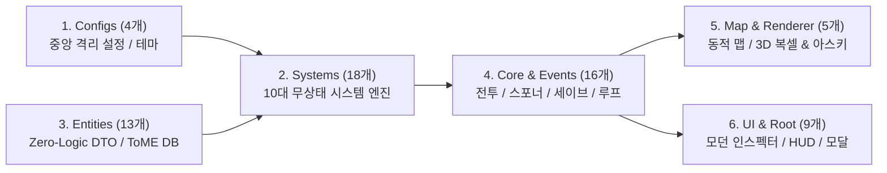

# 📑 Mimicry Voxel Engine Code Meta Index (`v0.18.0`)

> **미미크리 Voxel 로그라이크 엔진 65개 전 모듈(102,800+ 라인)의 아키텍처 역할, 설계 순수성, 책임 및 의존성 관계망 총람**

---

## 📊 1. 카테고리별 모듈 분포 및 아키텍처 개요

미미크리 Voxel 엔진은 역할과 책임이 명확히 분리된 **5대 계층 클린 아키텍처(Configs, Core, Entities, Map/Renderer, Systems, UI)**로 구성되어 있습니다.

| 카테고리 (Category) | 모듈 수 | 총 라인 수 | 핵심 아키텍처 역할 및 책임 |
| :--- | :---: | :---: | :--- |
| **`configs/`** | 4개 | 1,291줄 | 게임 밸런스 공식, BTH 명중률, 3D 복셀 렌더러 지오메트리, ANSI 16색 및 5대 던전 테마 중앙 격리 설정 |
| **`core/`** | 14개 | 6,569줄 | 전투 조율(CombatSystem), 대미지 계산(CombatCalculator), 전리품(LootSystem), 스포너(Spawner), 세이브/로드(SaveSystem), 게임 루프(Game/GameEngine) |
| **`entities/`** | 13개 | 77,294줄 | Zero-Logic 데이터 컨테이너(Player, Monster, Item, MimicBody) 및 ToME 2.3.5 정통 4대 마스터 데이터셋(몬스터 851종, 아이템 560종, 에고 101종, 유물 190종) |
| **`events/`** | 2개 | 139줄 | 싱글톤 EventBus 메시지 브로커 및 GameEvents 표준 이벤트 식별자 열거형 |
| **`map/`** | 2개 | 957줄 | 동적 맵 절차적 생성기(Map.js) 및 2D 타일 ➔ 3D 다층 복셀 높이맵 브릿지(Voxel3DMapBridge.js) |
| **`renderer/`** | 3개 | 1,215줄 | 정석 2.5D 아이소메트릭 복셀 렌더러(Voxel3DRenderer), TomeNET 14x23 아스키 렌더러(Classic2DAsciiRenderer), 마이크로 복셀 파티클 물리(VoxelParticleSystem) |
| **`systems/`** | 18개 | 8,767줄 | ToME 10대 무상태 시스템 엔진(StatusEffect, Spell, ValueBudget, FlagResolver, Trait, Vision, Activation, Consumable, Device, Equipment), 5단계 AI, 3단 보스전, 유니크 생태계 |
| **`ui/`** | 7개 | 4,304줄 | 모던 인벤토리/코어 인스펙터(InventoryView), 실시간 HUD(HUDView), 승천/명예의전당(AscensionModalView), 몬스터 로어 도감(MonsterLoreView), UI 중앙 관리자(UIManager) |
| **`root`** | 2개 | 68줄 | 웹 브라우저 진입점 및 부트스트랩 (main.js, counter.js) |
| **합계 (Total)** | **65개** | **102,804줄** | **ToME 2.3.5 / TomeNET 기반 데이터 지향 100% ESM 클린 아키텍처** |

---

## 📑 2. 전체 65개 모듈 상세 메타 인덱스 명세

### 1) 설정 계층 (`src/configs/`, 4개 모듈)

| 파일 경로 | 모듈명 | 라인 | 책임 (Responsibility) | 순수성 (Purity) | 핵심 공개 심볼 (Exports) |
| :--- | :--- | :---: | :--- | :--- | :--- |
| [`src/configs/DungeonThemeConfig.js`](src/configs/DungeonThemeConfig.js) | **DungeonThemeConfig** | 428 | 1~50층 5대 테마 던전 층계 명세, 테마별 타일 색상/복셀 팔레트, Vault 및 Monster Pit 스폰 확률 및 몬스터 계열 가중치 설정 | Pure Constants | `DUNGEON_THEMES`, `DUNGEON_THEME_KEYS`, `getThemeForFloor`, `getThemeConfig`, `getThemeColors`, `getSpecialRoomChancesForFloor` |
| [`src/configs/GameBalanceConfig.js`](src/configs/GameBalanceConfig.js) | **GameBalanceConfig** | 417 | 게임 밸런스 공식, 레벨업 성장 곡선, 무게/속도 제약, 무기 숙련도, 전투 주사위 공식, 속성 저항 계수 및 드랍 확률 중앙화 설정 | Pure Function | `COMBAT_CONFIG`, `LEVEL_CONFIG`, `WEIGHT_CONFIG`, `WEAPON_MASTERY_CONFIG`, `DUNGEON_CONFIG`, `BASE_RESISTANCES` |
| [`src/configs/RenderConfig.js`](src/configs/RenderConfig.js) | **RenderConfig** | 121 | 3D 복셀 렌더러 지오메트리 규격, 카메라/뷰포트 배율, 조명 및 앰비언트 오클루전, 파티클 물리 및 탄도학 통합 설정 | Pure Constants | `BASE_TILE_WIDTH`, `BASE_TILE_HEIGHT`, `BASE_BLOCK_HEIGHT`, `CAMERA_CONFIG`, `LIGHTING_CONFIG` |
| [`src/configs/ThemeColors.js`](src/configs/ThemeColors.js) | **ThemeColors** | 325 | ToME 2.3.5 정통 16색 ANSI 터미널 팔레트(TERM_COLORS), 7대 원소 팔레트, 4대 아이템 등급 색상, 터미널 폰트 스택 통합 설정 | Pure Constants | `TERM_COLORS`, `ANSI_PALETTE_INDEX`, `TERMINAL_FONT_STACK`, `ELEMENT_PALETTES`, `RARITY_COLORS` |

---

### 2) 코어 계층 (`src/core/`, 14개 모듈)

| 파일 경로 | 모듈명 | 라인 | 책임 (Responsibility) | 순수성 (Purity) | 핵심 공개 심볼 (Exports) |
| :--- | :--- | :---: | :--- | :--- | :--- |
| [`src/core/CombatCalculator.js`](src/core/CombatCalculator.js) | **CombatCalculator** | 1,022 | 전투 주사위 롤링, ToME BTH 명중률 판정, 치명타, 방어력(AC) 물리 감쇄, 속성 시너지 연산 전담 수학 연산 엔진 | Stateless System | `CombatCalculator`, `COMBAT_CONFIG`, `SYNERGY_TRIGGERS`, `SPELL_SYNERGY_TRIGGERS` |
| [`src/core/CombatSystem.js`](src/core/CombatSystem.js) | **CombatSystem** | 524 | 전투 판정 및 오토 스킬/원거리 자동사격 격발 오케스트레이션을 일괄 조율하는 중앙 전투 시스템 | Stateless System / Orchestrator | `CombatSystem` |
| [`src/core/Effects.js`](src/core/Effects.js) | **Effects** | 745 | 2.5D 아이소메트릭 실시간 입자 스트림 브레스, 3D 포물선 투사체, 번개 빔, 아크 슬래시, 플로팅 텍스트 비주얼 이펙트 파이프라인 | Stateless System / Logic | `AoEExplosionEffect`, `ConeBreathEffect`, `SkillProjectileEffect`, `SkillBeamEffect`, `FloatingTextEffect` |
| [`src/core/Game.js`](src/core/Game.js) | **Game** | 1,989 | 미미크리 로그라이크 핵심 게임 루프, 턴 스케줄링, 엔티티 상호작용, 트랜잭션 안전화 및 UI 모달 이벤트 통합 조율 | State Store | `Game` |
| [`src/core/GameEngine.js`](src/core/GameEngine.js) | **GameEngine** | 88 | 순수 턴 스케줄링, 엔티티 라이프사이클 관리 및 EventBus 기반 메시지 디스패치 전담 슬림 엔진 코어 | State Store / Logic Engine | `GameEngine` |
| [`src/core/Input.js`](src/core/Input.js) | **Input** | 90 | 키보드, 마우스 및 가상 컨트롤러 입력을 추상화된 게임 액션으로 매핑하고 발송하는 입력 제어 모듈 | DOM Event Handler | `Input` |
| [`src/core/LootSystem.js`](src/core/LootSystem.js) | **LootSystem** | 146 | 몬스터 처치 시 전리품(코어, 유물, 에고 장비) 드롭 확률 연산, XP 가산, 로어 숙련도 계산 및 처치 보상 라이프사이클 제어 | Stateless Logic / System | `LootSystem` |
| [`src/core/ReactionRegistry.js`](src/core/ReactionRegistry.js) | **ReactionRegistry** | 152 | 원소 간의 결합 반응 및 상태이상 디버프 전파 처리를 전담하는 격리형 레지스트리 모듈 | Stateless System / Logic | `ELEMENTAL_REACTIONS`, `applyMonsterDebuff` |
| [`src/core/Renderer.js`](src/core/Renderer.js) | **Renderer** | 13 | 3D 복셀 렌더러(Voxel3DRenderer) 파이프라인을 바인딩하여 하위 호환성을 제공하는 파사드 모듈 | Stateless Facade | `Renderer` |
| [`src/core/SaveSystem.js`](src/core/SaveSystem.js) | **SaveSystem** | 506 | 로컬스토리지 기반 다중 슬롯 게임 상태(맵, 플레이어, 인벤토리, 10대 슬롯, 유니크 몬스터 생태계) 직렬화 및 역직렬화 엔진 | State Store | `SAVE_SLOTS`, `SaveSystem` |
| [`src/core/Skills.js`](src/core/Skills.js) | **Skills** | 788 | 동적 스킬 트리(CORE_SKILL_TREES) 및 플레이어 의태 액티브 스킬 정의 모듈 | Stateless System / Logic | `ACTIVE_SKILL_CONFIGS`, `BASE_SKILL_TREES`, `CORE_SKILL_TREES` |
| [`src/core/Spawner.js`](src/core/Spawner.js) | **Spawner** | 799 | ToME 2.3.5 던전 깊이(Depth) 기반 동적 몬스터 및 아이템 스포너 엔진. 851종 몬스터 풀, 168종 유니크 스폰 생태계 제어 | Pure Factory / Spawner Logic | `Spawner`, `SPECIAL_MONSTER_PACKS`, `MONSTER_PIT_THEMES` |
| [`src/core/TraceLogger.js`](src/core/TraceLogger.js) | **TraceLogger** | 64 | 스탯 재계산 격발 원인, 더티 플래그 만료 및 전투 대미지 감쇄 경로 역추적(Traceability) 중앙 디버그 로그 엔진 | Stateless System / Logic | `TraceLogger` |
| [`src/core/UIHelper.js`](src/core/UIHelper.js) | **UIHelper** | 34 | UI 컴포넌트 3분할 통합 경량 파사드 모듈 | DOM Facade / Pure Export | `EQUIP_BADGE_STYLES`, `renderInventorySlotHTML`, `renderItemDetailHTML` |

---

### 3) 엔티티 계층 (`src/entities/`, 13개 모듈)

| 파일 경로 | 모듈명 | 라인 | 책임 (Responsibility) | 순수성 (Purity) | 핵심 공개 심볼 (Exports) |
| :--- | :--- | :---: | :--- | :--- | :--- |
| [`src/entities/Item.js`](src/entities/Item.js) | **Item** | 284 | 던전 바닥 및 인벤토리 내 장비, 소모품, 마법 디바이스, 코어 아이템 데이터 컨테이너 모델 | Zero-Logic Data Container | `Item` |
| [`src/entities/ItemRegistry.js`](src/entities/ItemRegistry.js) | **ItemRegistry** | 803 | ToME 2.3.5 기반 560+종 기본 아이템 및 190+종 전설 유물(Artifacts) 중앙 레지스트리 | Pure Registry / Data Store | `TOME_BASE_ITEMS`, `TOME_ARTIFACTS`, `createTomeItem` |
| [`src/entities/MimicBody.js`](src/entities/MimicBody.js) | **MimicBody** | 345 | 무정형 미믹의 영구 본체 컨테이너. 로어 숙련도, 킬 카운트, 돌연변이 태그 영구 보존 및 무게 한도 산출 | State Store / Logic Container | `WEAPON_MASTERY_CONFIG`, `WEAPON_REQUIREMENT_CONFIG`, `MimicBody` |
| [`src/entities/Monster.js`](src/entities/Monster.js) | **Monster** | 543 | 몬스터 엔티티 모델 (Zero-Logic 순수 데이터 컴포넌트). 연산 로직은 시스템 엔진에 전면 위임 | Data Model / State Store | `MONSTER_ATTACK_SKILL_NAMES`, `Monster` |
| [`src/entities/MonsterRegistry.js`](src/entities/MonsterRegistry.js) | **MonsterRegistry** | 216 | 몬스터 종족(Species) 및 ToME 오픈소스 몬스터 마스터 데이터셋(851종) 중앙 제어 레지스트리 | Pure Registry / Data Store | `MONSTER_GROWTH_PATTERNS`, `MONSTER_SPECIES`, `LEGACY_TOME_ALIASES_MAP` |
| [`src/entities/Perks.js`](src/entities/Perks.js) | **Perks** | 281 | ToME 2.3.5 플래그 및 변이(Mutations/Perks) 시스템 정의. 스탯 가중치, 가속도, 상태이상 면역 관리 | Stateless / Pure Registry | `MONSTER_PERKS`, `getPerkDefinition` |
| [`src/entities/Player.js`](src/entities/Player.js) | **Player** | 963 | 플레이어 엔티티 모델 (Zero-Logic 순수 데이터 컴포넌트). 10대 독립 슬롯 및 statuses 프록시 완비 | Data Model / State Store | `Player` |
| [`src/entities/Tags.js`](src/entities/Tags.js) | **Tags** | 572 | 장비 및 몬스터 접두사/접미사 태그, 등급 색상, 크로매틱 애니메이션 연산 및 원소 메타데이터 관리 | Data Model / State Store | `ELEMENT_METADATA`, `PREFIX_TAGS`, `SUFFIX_TAGS` |
| [`src/entities/TomeArtifactsData.js`](src/entities/TomeArtifactsData.js) | **TomeArtifactsData** | 5,944 | ToME 2.3.5 정통 190종 전설 유물(Artifacts) 정적 데이터셋 | Pure Data Module | `TOME_ARTIFACTS_DATA` |
| [`src/entities/TomeEgosData.js`](src/entities/TomeEgosData.js) | **TomeEgosData** | 1,168 | ToME 2.3.5 정통 101종 에고(Egos) 접사 정적 데이터셋 | Pure Data Module | `TOME_EGOS_DATA` |
| [`src/entities/TomeKindsData.js`](src/entities/TomeKindsData.js) | **TomeKindsData** | 9,988 | ToME 2.3.5 정통 560종 베이스 아이템(Kinds) 정적 데이터셋 | Pure Data Module | `TOME_KINDS_DATA` |
| [`src/entities/TomeMonstersData.js`](src/entities/TomeMonstersData.js) | **TomeMonstersData** | 57,880 | ToME 2.3.5 정통 851종 몬스터 마스터 정적 데이터셋 | Pure Data Module | `TOME_MONSTERS_DATA` |
| [`src/entities/VoxelMimicBridge.js`](src/entities/VoxelMimicBridge.js) | **VoxelMimicBridge** | 97 | 미믹의 코어 융합, 변신(위장), 포식, 3D 크로매틱 셰이딩 및 복셀 모핑 이펙트 연동 브릿지 | Data Model / State Store | `VoxelMimicBridge` |

---

### 4) 이벤트 계층 (`src/events/`, 2개 모듈)

| 파일 경로 | 모듈명 | 라인 | 책임 (Responsibility) | 순수성 (Purity) | 핵심 공개 심볼 (Exports) |
| :--- | :--- | :---: | :--- | :--- | :--- |
| [`src/events/EventBus.js`](src/events/EventBus.js) | **EventBus** | 81 | 게임 엔진과 UI 컴포넌트 간 결합도를 완전히 분리하는 싱글톤 Pub/Sub 중앙 메시지 브로커 | State Store / Event Broker | `EventBus`, `eventBus` |
| [`src/events/GameEvents.js`](src/events/GameEvents.js) | **GameEvents** | 58 | 미미크리 게임 엔진과 UI/시스템 간 결합도를 낮추기 위한 중앙 이벤트 식별자 열거형 상수 | Pure Constants | `GameEvents` |

---

### 5) 맵 & 렌더러 계층 (`src/map/`, `src/renderer/`, 5개 모듈)

| 파일 경로 | 모듈명 | 라인 | 책임 (Responsibility) | 순수성 (Purity) | 핵심 공개 심볼 (Exports) |
| :--- | :--- | :---: | :--- | :--- | :--- |
| [`src/map/Map.js`](src/map/Map.js) | **Map** | 757 | 1~50층 5대 테마 던전 절차적 생성기, 동적 맵 규격, 다중 상/하행 계단 최대거리 분산, 4대 Vault 및 10대 Pit 지형 배치 | Data Model / State Store | `RectRoom`, `Map` |
| [`src/map/Voxel3DMapBridge.js`](src/map/Voxel3DMapBridge.js) | **Voxel3DMapBridge** | 200 | 2D 던전 맵 타일 데이터를 차세대 3D 다층 높이맵(Z=0~3) 복셀 블록 스택으로 변환 및 동기화 | Data Model / State Store | `VOXEL_THEMES`, `Voxel3DMapBridge` |
| [`src/renderer/Classic2DAsciiRenderer.js`](src/renderer/Classic2DAsciiRenderer.js) | **Classic2DAsciiRenderer** | 443 | TomeNET 14x23 터미널 비율 정통 2D 아스키 렌더러. Fira Code 폰트 스택 및 가시성 가드 보장 | DOM / Canvas Renderer | `Classic2DAsciiRenderer` |
| [`src/renderer/Voxel3DRenderer.js`](src/renderer/Voxel3DRenderer.js) | **Voxel3DRenderer** | 647 | 정석 2.5D 아이소메트릭 중앙 정렬 좌표계, FOV 시야, 실시간 포인트 라이트 및 3D 복셀 렌더러 | DOM / Canvas Renderer | `Voxel3DRenderer` |
| [`src/renderer/VoxelParticleSystem.js`](src/renderer/VoxelParticleSystem.js) | **VoxelParticleSystem** | 125 | 3D 마이크로 복셀 큐브 물리 파편 및 바닥 튕김(Bounce) 파티클 물리 연산 시스템 | DOM / Canvas Renderer | `VoxelParticleSystem` |

---

### 6) 시스템 계층 (`src/systems/`, 18개 모듈)

| 파일 경로 | 모듈명 | 라인 | 책임 (Responsibility) | 순수성 (Purity) | 핵심 공개 심볼 (Exports) |
| :--- | :--- | :---: | :--- | :--- | :--- |
| [`src/systems/ArtifactActivationEngine.js`](src/systems/ArtifactActivationEngine.js) | **ArtifactActivationEngine** | 346 | 183종 전설 유물의 고유 발동(Activation) 식별, 쿨다운 관리 및 특수 주문 효과 무상태 발동 엔진 | Stateless System | `ArtifactActivationEngine`, `TOME_ARTIFACT_ACTIVATIONS` |
| [`src/systems/BossPhaseEngine.js`](src/systems/BossPhaseEngine.js) | **BossPhaseEngine** | 673 | 50F 모르고스의 옥좌 최종 보스전 3단계 페이즈 전환, 암흑 장막/지진/소환 및 승천 파이프라인 | State Store / Logic System | `BossPhaseEngine`, `bossPhaseEngine`, `BOSS_PHASES` |
| [`src/systems/ConsumableEffectEngine.js`](src/systems/ConsumableEffectEngine.js) | **ConsumableEffectEngine** | 37 | ToME 2.3.5 소비성 아이템 효과 실행기 (TomeConsumableEngine 연동 호환 래퍼) | Stateless Facade | `ConsumableEffectEngine` |
| [`src/systems/DungeonValueBudgetEngine.js`](src/systems/DungeonValueBudgetEngine.js) | **DungeonValueBudgetEngine** | 603 | 1~50F 4단계 티어 게이팅, 가우시안 OOD 10% 캡, 동적 맵 규격/계단 수식 산출, 저층 보호 및 가치 예산 통제 | Pure Budget Engine | `DungeonValueBudgetEngine`, `DUNGEON_TIER_CONFIGS` |
| [`src/systems/MonsterAISystem.js`](src/systems/MonsterAISystem.js) | **MonsterAISystem** | 487 | TomeNET 5단계 AI 의사결정 트리(생존 ➔ 가속 ➔ 원거리포격 ➔ 소환 ➔ 디버프 ➔ 근접추적) 전담 엔진 | Stateless System | `MonsterAISystem` |
| [`src/systems/MonsterSpellFactory.js`](src/systems/MonsterSpellFactory.js) | **MonsterSpellFactory** | 1,023 | 몬스터 코어 장착 시 플레이어 스킬바(1~4 슬롯)에 1:1 정확하게 바인딩하는 순수 의태 스펠 팩토리 | Stateless System / Logic | `ActiveSkill`, `MonsterSpellFactory`, `TOME_ATTACK_DEFINITIONS` |
| [`src/systems/PlayerStatCalculator.js`](src/systems/PlayerStatCalculator.js) | **PlayerStatCalculator** | 344 | 10대 슬롯 장비, 코어, 버프에 따른 플레이어 실시간 스탯, 저항, 대미지 감쇄 및 속도 산출 | Stateless System | `PlayerStatCalculator` |
| [`src/systems/StatusEffectEngine.js`](src/systems/StatusEffectEngine.js) | **StatusEffectEngine** | 840 | ToME 14대 상태이상/버프 카탈로그, O(1) 면역/저항 판정, DoT 틱 처리 및 실시간 스탯 보정치 산출 무상태 엔진 | Stateless System | `STATUS_DEFINITIONS`, `StatusEffectEngine` |
| [`src/systems/TomeConsumableEngine.js`](src/systems/TomeConsumableEngine.js) | **TomeConsumableEngine** | 673 | ToME 포션 45+종, 주문서 42+종, 등불 기름(7,500턴), 음식 및 코어 소비 무상태 엔진 | Stateless Engine | `TomeConsumableEngine` |
| [`src/systems/TomeDeviceEngine.js`](src/systems/TomeDeviceEngine.js) | **TomeDeviceEngine** | 397 | ToME 마법 완드(30종), 스태프(20종), 로드(28종) 발동 및 충전량/쿨다운 제어 엔진 | Stateless Engine | `TomeDeviceEngine` |
| [`src/systems/TomeEgoEngine.js`](src/systems/TomeEgoEngine.js) | **TomeEgoEngine** | 227 | 101종 에고 및 183종 유물의 슬레이(Slay), 속성 브랜드, 저항, Free Action 등 판정 엔진 | Stateless System | `TomeEgoEngine` |
| [`src/systems/TomeEquipmentEngine.js`](src/systems/TomeEquipmentEngine.js) | **TomeEquipmentEngine** | 340 | ToME tval 기반 18대 슬롯 매핑, 아스키 심볼, 무게, 방어력(AC) 무상태 연산 엔진 | Pure Stateless Engine | `TomeEquipmentEngine`, `TVAL` |
| [`src/systems/TomeFlagResolver.js`](src/systems/TomeFlagResolver.js) | **TomeFlagResolver** | 386 | ToME 비트 플래그/속성/저항/슬레이/면역을 O(1) Set으로 일괄 추출 및 병합하는 무상태 엔진 | Stateless System | `TomeFlagResolver` |
| [`src/systems/TomeLootGenerator.js`](src/systems/TomeLootGenerator.js) | **TomeLootGenerator** | 276 | 던전 깊이(Depth)별 아이템 롤링, 에고 접사 합성 및 전설 유물 드랍 파이프라인 엔진 | Pure Loot Factory | `TomeLootGenerator` |
| [`src/systems/TomeSpellEngine.js`](src/systems/TomeSpellEngine.js) | **TomeSpellEngine** | 893 | 91종 주문/브레스/7대 공격 체계 및 20 Methods x 27 Effects On-Hit 총괄 주문/전투 엔진 | Stateless System | `TomeSpellEngine`, `TOME_CANONICAL_SPELLS`, `TOME_ATTACK_METHODS` |
| [`src/systems/UnifiedTraitEngine.js`](src/systems/UnifiedTraitEngine.js) | **UnifiedTraitEngine** | 442 | 플래그 정밀 해석을 통한 6대 스탯, 21종 저항률(%), 광원 반경, 속도, 면역 일괄 산출 엔진 | Stateless System | `UnifiedTraitEngine` |
| [`src/systems/UniqueMonsterManager.js`](src/systems/UniqueMonsterManager.js) | **UniqueMonsterManager** | 561 | 168종 유니크 몬스터 1회성 스폰 생태계 제어, 전설 유물 확정 드랍 파이프라인 엔진 | State Store / Logic System | `UniqueMonsterManager`, `uniqueMonsterManager` |
| [`src/systems/VisionLightingEngine.js`](src/systems/VisionLightingEngine.js) | **VisionLightingEngine** | 246 | ToME 광원 반경, 9종 ESP 텔레파시, 적외선 시야, 투명 감지 종합 연산 시야/조명 엔진 | Stateless System | `VisionLightingEngine` |

---

### 7) UI 및 엔트리 계층 (`src/ui/`, `src/`, 9개 모듈)

| 파일 경로 | 모듈명 | 라인 | 책임 (Responsibility) | 순수성 (Purity) | 핵심 공개 심볼 (Exports) |
| :--- | :--- | :---: | :--- | :--- | :--- |
| [`src/ui/AscensionModalView.js`](src/ui/AscensionModalView.js) | **AscensionModalView** | 1,351 | 50F 승천 엔딩 컷씬, 발리노르의 빛 연출, 영구 명예의 전당/사망 묘비명 3단 탭 상세 인스펙터 | DOM Manager / State Store | `saveAscensionRecord`, `getHallOfFameRecords`, `saveGraveyardRecord` |
| [`src/ui/HUDView.js`](src/ui/HUDView.js) | **HUDView** | 813 | 상단 상태바(SPD, HP, Floor), 플레이어 상세 스테이터스창, 마스터리 도감 뷰 렌더러 | DOM Renderer | `renderPlayerStatusPanelHTML`, `renderPlayerDetailsHTML`, `renderSkillTreeHTML` |
| [`src/ui/InspectModalView.js`](src/ui/InspectModalView.js) | **InspectModalView** | 373 | 몬스터 48px 피킹 팝업 및 스탯 기여도(Breakdown), 시너지, 상태이상 분석 뷰 | DOM Renderer | `renderMonsterInspectHTML` |
| [`src/ui/InventoryView.js`](src/ui/InventoryView.js) | **InventoryView** | 839 | 모던 인벤토리 그리드, 4대 의태 스킬 프리뷰 카드, 장비 인스펙터 및 코어 장착/포식 뷰 | DOM Renderer | `EQUIP_BADGE_STYLES`, `TOME_FLAG_TRANSLATIONS`, `renderInventorySlotHTML` |
| [`src/ui/MonsterLoreView.js`](src/ui/MonsterLoreView.js) | **MonsterLoreView** | 620 | TomeNET 스타일 851종 몬스터 도감, 168종 유니크 처치 체크리스트 및 로어 뷰 렌더러 | DOM Renderer | `renderMonsterLoreModalHTML`, `renderMonsterBestiaryHTML`, `renderUniqueChecklistHTML` |
| [`src/ui/UIManager.js`](src/ui/UIManager.js) | **UIManager** | 257 | 클라이언트 DOM 모달, HUD 상태바, 전투 로그 및 사용자 인터랙션 뷰 라우팅 중앙 관리자 | DOM Manager / State Store | `UIManager` |
| [`src/ui/VirtualController.js`](src/ui/VirtualController.js) | **VirtualController** | 42 | 모바일 터치 환경을 위한 온스크린 가상 D-패드 및 액션 버튼 이벤트 컨트롤러 | DOM Event Handler | `VirtualController` |
| [`src/main.js`](src/main.js) | **main** | 60 | 엔진 부트스트랩 및 모듈 초기화 진입점 | Entrypoint | - |
| [`src/counter.js`](src/counter.js) | **counter** | 9 | 경량 카운터 유틸리티 | Pure Function | `setupCounter` |

---

**© 2026 OpenDCMart Engine Team.** All rights reserved.
