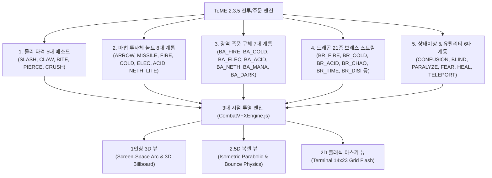

# 🔮 ToME 2.3.5 전투 & 주문 아스키 그래픽 시각 효과 카탈로그 (Phase 2 전면 확장 명세서)
### Canonical ASCII Graphical Combat & Magic VFX Catalog (Phase 2 Full Expansion)

> **문서 메타데이터**
> - **버전**: `v2.5.0` (Comprehensive Spell & Combat VFX Master Catalog)
> - **작성일**: 2026-09-03
> - **작성자**: 카스미 루리 (Research Agent / INTJ 용의주도한 전략가)
> - **수신인**: 오케스트레이터 및 타쿠미 코하루 (Dev Agent)
> - **대상 프로젝트**: [`/data/data/com.termux/files/home/opendcmart/mimicry_voxel`](file:///data/data/com.termux/files/home/opendcmart/mimicry_voxel)

---

## 🧭 1. 개요 및 Phase 2 설계 철학

미미크리 복셀(Mimicry Voxel) 엔진은 전설적인 정통 로그라이크 **Tales of Middle-Earth (ToME 2.3.5)**의 851종 몬스터, 106종 주문(Spells), 20종 공격 메소드(Methods), 27종 타격 효과(Effects), 그리고 21종 드래곤 브레스(Breaths)를 1:1로 탑재한 방대한 전투 시스템을 갖추고 있습니다.

본 명세서는 앞서 수립된 'ASCII as Graphics' 패러다임을 한 단계 더 진화시켜, 엔진의 실제 전투 엔진([`TomeSpellEngine.js`](file:///data/data/com.termux/files/home/opendcmart/mimicry_voxel/src/systems/TomeSpellEngine.js), [`CombatSystem.js`](file:///data/data/com.termux/files/home/opendcmart/mimicry_voxel/src/core/CombatSystem.js))에 존재하는 **모든 물리 타격 메소드, 원거리 볼트, 광역 볼 폭풍, 21종 브레스, 상태이상 및 유틸리티 주문의 전수 아스키 그래픽 매트릭스**를 집대성한 궁극의 시각 효과 청사진입니다.



---

## ⚔️ 2. 물리 타격 메소드별 아스키 시각 효과 (Physical Attack Methods)

몬스터와 플레이어의 신체 구조에 따른 5대 핵심 물리 타격 메소드의 기하학적 형태를 아스키 글리프로 완벽히 구현합니다.

```
┌─────────────────────────────────────────────────────────────────────────────┐
│ 물리 타격 5대 메소드 시각 형상화                                            │
├─────────────────────────────────────────────────────────────────────────────┤
│ 1. 참격 (SLASH)  : 6단 교차 참격 아크  [ ⚔ ▓ ▒ ░ / ]                       │
│ 2. 할퀴기 (CLAW) : 3줄 평행 할큄 자국 [ \ \ \ ] + 핏방울 [ . ' · ]         │
│ 3. 물어뜯기 (BITE): 상하 맞물리는 이빨 [ ▲ ▲ ▲ ] over [ ▼ ▼ ▼ ]             │
│ 4. 찌르기 (PIERCE): 일직선 관통 창끝  [ ─━» ➳ ┼ ✦ ]                       │
│ 5. 분쇄 (CRUSH)  : 붕괴 파편 & 충격파 [ ( [ # @ ▓ ] ) ]                     │
└─────────────────────────────────────────────────────────────────────────────┘
```

### 2.1 물리 메소드 상세 명세표

| 메소드 키 | 한글 명칭 | 아스키 글리프 시퀀스 | 네온 코어 / 글로우 | 1인칭 3D 연출 | 2.5D 복셀 연출 |
| :--- | :--- | :--- | :---: | :--- | :--- |
| **`SLASH`** | 베기 | `["⚔", "▓", "▒", "░", "/", "✦"]` | `#ffffff` / `#38bdf8` | 화면을 대각선으로 가르는 $0.15\text{s}$ 고속 베지어 참격 아크 | 타겟을 사선으로 베고 지나가는 등각 슬래시 잔상 |
| **`CLAW`** | 할퀴기 | `["\\", "\\", "\\"]` + `[".", "'", "·", "🩸"]` | `#f87171` / `#ef4444` | 화면 전방에 $12\text{px}$ 간격으로 3줄의 평행 손톱자국이 긁히며 핏방울 비산 | 타겟 위에 3줄의 붉은 할큄선 팝인 후 파편 낙하 |
| **`BITE`** | 물어뜯기 | `["▲", "▲", "▲"]` / `["▼", "▼", "▼"]` | `#fef08a` / `#f59e0b` | 화면 상단과 하단에서 3쌍의 이빨이 중심으로 빠르게 맞물리며 교합(Snap) | 타겟의 상하에서 이빨 글리프가 닫히며 골절 스파크 |
| **`PIERCE`** / `STING` | 찌르기/독침 | `["─", "━", "»", "➳", "┼", "✦"]` | `#a7f3d0` / `#10b981` | 화면 중심을 향해 전방에서 카메라를 꿰뚫듯이 꽂히는 원근 관통 빔 | 공격자에게서 타겟으로 일직선으로 발사되는 바늘 궤적 |
| **`CRUSH`** / `BASH` | 분쇄/강타 | `["(", "[", "#", "@", "▓", "]", ")"]` | `#fed7aa` / `#d97706` | 화면 전체가 쿵 울리며 거대한 바위 파편 글리프들이 사방으로 튕김 | 바닥 타일에 타원형 충격파 괄호 확산 및 복셀 큐브 바운스 |

---

## 🔮 3. ToME 마법 계통별 아스키 그래픽 효과 (Magic Spells & Breaths)

### 3.1 원거리 투사체 볼트 8대 계통 (Projectiles & Bolts)

공간을 가로질러 날아가는 투사체는 **헤드(Head) 글리프**, **몸체(Body) 궤적**, **후방 트레일(Tail)**의 3단 구조로 렌더링됩니다.

```
┌─────────────────────────────────────────────────────────────┐
│ 투사체 비행 구조:  [Tail ✦ * ·] ── [Body ━ ─] ── [Head ➳]  │
└─────────────────────────────────────────────────────────────┘
```

| 주문/볼트 ID | 한글 명칭 | 투사체 글리프 조합 | 코어 / 네온 색상 | 비행 및 피격 시각 효과 |
| :--- | :--- | :--- | :---: | :--- |
| **`ARROW`** | 일반/마법 화살 | `["──>", "➳", "➔", "·"]` | `#cbd5e1` / `#94a3b8` | 날렵한 화살촉 비행 후 타겟에 꽂히는 나무 파편 비산 |
| **`MISSILE`** / `BO_MANA` | 비전 마나 미사일 | `["🔮", "✦", "✧", "¤", "*"]` | `#f5d0fe` / `#c084fc` | 회전하는 보랏빛 룬 구체가 곡선을 그리며 유도 비행 |
| **`BO_FIRE`** / `ROCKET` | 화염 볼트 / 로켓 | `["🚀", "*", "%", "&", "▲", "♨"]` | `#ffffff` / `#f97316` | 불타는 혜성 꼬리를 끌며 날아가 붉은 불티 폭발 |
| **`BO_COLD`** / `BO_ICE` | 빙창 / 냉기 볼트 | `["🧊", "❄", "*", "+", "◇", "◆"]` | `#ffffff` / `#38bdf8` | 날카로운 얼음 창이 서리 안개를 남기며 관통 |
| **`BO_ELEC`** | 뇌격 볼트 | `["⚡", "z", "Z", "ϟ", "\\", "/"]` | `#ffffff` / `#fde047` | 지그재그로 분기하는 벼락 궤적이 순간적으로 내리꽂힘 |
| **`BO_ACID`** / `BO_POIS` | 산성 / 독침 볼트 | `["🧪", "☣", "o", "O", "°", "%"]` | `#d9f99d` / `#22c55e` | 끓어오르는 부식 거품 궤적 및 녹색 잔류 연기 |
| **`BO_NETH`** / `BO_DARK` | 황천 / 암흑 볼트 | `["☠", "🌑", "§", "Ω", "✦"]` | `#a855f7` / `#581c87` | 영혼을 갉아먹는 검보랏빛 망령 형상이 날아감 |
| **`BO_LITE`** / `BO_WATE` | 광휘 / 수류 볼트 | `["☀️", "✦", "✧"]` / `["🌊", "~", "≈"]`| `#fef08a` / `#0284c7` | 태양빛 레이저 빔 / 휘감아치는 물살 해일 궤적 |

---

### 3.2 광역 폭풍 구체 7대 계통 (AoE Balls)

착탄 지점을 중심으로 반경 $R$까지 **동심원 아스키 파동(Shockwave Ring)**과 **소용돌이 입자**가 폭발합니다.

```
                    *   %   ▲
                &   #   @   #   &
            ~   %   @  [BA]  @   %   ~
                &   #   @   #   &
                    *   %   ▲
```

| 주문 ID | 한글 명칭 | 원소 | 광역 폭발 글리프 풀 | 네온 폭발 팔레트 |
| :--- | :--- | :---: | :--- | :--- |
| **`BA_FIRE`** | 화염구 폭발 (Fire Ball) | 화염 | `["*", "%", "&", "#", "^", "~", "▲", "♨"]` | `#ffffff` ➔ `#fbbf24` ➔ `#ef4444` |
| **`BA_COLD`** | 동결 폭풍구 (Cold Ball) | 냉기 | `["❄", "*", "+", "x", "X", "†", "◆", "◇"]` | `#ffffff` ➔ `#a5f3fc` ➔ `#0284c7` |
| **`BA_ELEC`** | 뇌격 구체 폭발 (Elec Ball) | 전격 | `["⚡", "z", "Z", "ϟ", "\\", "/", "✦"]` | `#ffffff` ➔ `#fde047` ➔ `#a855f7` |
| **`BA_ACID`** | 산성 폭풍구 (Acid Ball) | 산성 | `["o", "O", "0", "°", "%", "~", "●", "≈"]` | `#d9f99d` ➔ `#84cc16` ➔ `#15803d` |
| **`BA_POIS`** | 맹독 독가스 (Poison Cloud) | 독성 | `["☁", "o", "O", "°", "%", "~", "§"]` | `#a7f3d0` ➔ `#10b981` ➔ `#064e3b` |
| **`BA_NETH`** | 황천 영혼 폭풍 (Nether Ball)| 황천 | `["☠", "§", "Ω", "Ψ", "@", "✦"]` | `#f5d0fe` ➔ `#c084fc` ➔ `#4c0519` |
| **`BA_MANA`** | 마나 폭풍 (Mana Storm) | 순수마나| `["🌌", "✦", "✧", "¤", "★", "○", "◎"]` | `#ffffff` ➔ `#e879f9` ➔ `#6b21a8` |

---

### 3.3 드래곤 21종 브레스 스트림 (Dragon Breaths)

시전자 위치에서 목표 방향으로 퍼져나가는 **전방 부채꼴 아스키 콘(Cone Stream)**입니다.
- **스트림 기하 구조**:
  - 중심축(Center Axis): 고밀도 거대 글리프(`"▓"`, `"▲"`, `"@"`, `"🐉"`)
  - 측면 방사(Flanks): 확산 입자(`"*"`, `"%"`, `"~"`, `"·"`)
  - 길이: 6.5~7.5칸, 전방 전개 각도: $45^\circ \sim 60^\circ$

---

### 3.4 상태이상 & 유틸리티 6대 계통 (Debuffs & Utils)

| 계통 ID | 한글 명칭 | 아스키 글리프 시퀀스 | 색상 | 시각적 특징 |
| :--- | :--- | :--- | :---: | :--- |
| **`CONFUSION`** | 혼란 | `["@", "~", "%", "?", "!", "🌀"]` | `#c084fc` | 머리 위에서 빙글빙글 회전하는 물음표/물결 룬 |
| **`BLIND`** | 실명 | `["░", "▒", "▓", "🌑", "X"]` | `#475569` | 시야가 어두운 노이즈 블록으로 가려지는 암막 효과 |
| **`PARALYZE`** / `HOLD` | 마비/구속 | `["⛓", "❄", "✕", "┼", "🔒"]` | `#38bdf8` | 전신을 옥죄는 푸른 얼음 사슬 및 자물쇠 기호 |
| **`FEAR`** / `SCARE` | 공포 | `["👻", "!", "?", "😱", "«"]` | `#facc15` | 머리 위로 비산하며 도망치는 유령/느낌표 글리프 |
| **`HEAL`** | 치유/재생 | `["+", "✝", "💚", "♥", "✧"]` | `#34d399` | 발밑에서부터 피어오르는 녹색 십자가와 생명 하트 |
| **`TELEPORT`** | 공간이동 | `["(", "(", "@", ")", ")", "🌀"]` | `#a78bfa` | 플레이어가 있던 자리에 잔류하는 왜곡 동심원 괄호 |

---

## 📐 4. 3대 렌더러 시점별 아스키 투영 파이프라인

### 4.1 1인칭 3D 뷰 (`FirstPerson3DRenderer`)
1. **스크린 공간 근접 이펙트 (Screen-Space Viewmodel)**:
   - `SLASH`, `CLAW`, `BITE`: 화면 전방 카메라 평면($Z = 0.5$)에서 회전 변환된 글리프들이 대각선/수직으로 전개.
2. **3D 월드 빌보드 투사체 및 폭발**:
   - `ARROW`, `MISSILE`, `BOLTS`, `BALLS`:
     - $transformY = invDet \cdot (-\vec{C}_y \cdot \Delta x + \vec{C}_x \cdot \Delta y)$
     - 투사체가 플레이어를 향해 날아올 때는 글리프 크기가 기하급수적으로 커지며 압박감 부여 ($fontSize \propto \frac{1}{transformY}$).
     - 타겟 착탄 시 3D 구면으로 글리프들이 확산되며 Z-Buffer 오클루전 처리.

### 4.2 2.5D 복셀 뷰 (`Voxel3DRenderer`)
- 등각 좌표계 투영: $(isoX, isoY) = ((x - y) \cdot \frac{tileW}{2}, (x + y) \cdot \frac{tileH}{2} - z \cdot blockH)$.
- 포물선 탄도학: $Z(t) = 4 h_{\text{peak}} \cdot t \cdot (1 - t)$ 수식에 따라 투사체 글리프가 높이 솟구쳤다가 낙하.

### 4.3 2D 클래식 아스키 뷰 (`Classic2DAsciiRenderer`)
- 정통 Bresenham 알고리즘에 따라 투사체가 지나가는 타일 셀에 한 프레임씩 화살/볼트 글리프 점멸.

---

## 💻 5. 개발 에이전트(타쿠미 코하루)를 위한 완결 확장 레퍼런스 코드

타쿠미 코하루 요원이 Phase 2 카탈로그를 완벽히 소화할 수 있도록, `src/systems/CombatVFXEngine.js`의 전면 확장 모듈 전문을 제공합니다.

### 5.1 확장 모듈: `src/systems/CombatVFXEngine.js` (Phase 2 Full Edition)

```javascript
/**
 * @module CombatVFXEngine
 * @category systems
 * @description ToME 2.3.5 106종 주문, 20종 공격 메소드, 21종 브레스 및 상태이상 전수 대응
 *              레트로 사이버펑크 순수 아스키 그래픽(ASCII as Graphics) 전투 시각 효과 마스터 엔진
 * @purity State Store / High-Performance Canvas Renderer
 * @dependencies EventBus.js, GameEvents.js
 * @exports CombatVFXEngine, combatVFXEngine, VFX_METHODS, VFX_SPELLS, ASCII_VFX_CATALOG
 */

import { eventBus } from '../events/EventBus.js';
import { GameEvents } from '../events/GameEvents.js';

export const VFX_METHODS = Object.freeze({
  SLASH: 'SLASH',
  CLAW: 'CLAW',
  BITE: 'BITE',
  PIERCE: 'PIERCE',
  CRUSH: 'CRUSH',
  TOUCH: 'TOUCH',
  ENGULF: 'ENGULF'
});

export const VFX_SPELLS = Object.freeze({
  ARROW: 'ARROW',
  MISSILE: 'MISSILE',
  BO_FIRE: 'BO_FIRE',
  BO_COLD: 'BO_COLD',
  BO_ELEC: 'BO_ELEC',
  BO_ACID: 'BO_ACID',
  BO_POIS: 'BO_POIS',
  BO_NETH: 'BO_NETH',
  BO_LITE: 'BO_LITE',
  BO_DARK: 'BO_DARK',
  BO_WATE: 'BO_WATE',
  BA_FIRE: 'BA_FIRE',
  BA_COLD: 'BA_COLD',
  BA_ELEC: 'BA_ELEC',
  BA_ACID: 'BA_ACID',
  BA_POIS: 'BA_POIS',
  BA_NETH: 'BA_NETH',
  BA_MANA: 'BA_MANA',
  BREATH: 'BREATH',
  CONFUSION: 'CONFUSION',
  BLIND: 'BLIND',
  PARALYZE: 'PARALYZE',
  FEAR: 'FEAR',
  HEAL: 'HEAL',
  TELEPORT: 'TELEPORT'
});

/**
 * Phase 2 전수 아스키 글리프 & 네온 팔레트 마스터 카탈로그
 */
export const ASCII_VFX_CATALOG = Object.freeze({
  // 1. 물리 타격 메소드
  SLASH: {
    coreGlyphs: ['⚔', '▓', '▒', '░', '/', '✦'],
    sparks: ['*', '+', '·', '✧', '.'],
    primary: '#ffffff', secondary: '#38bdf8', glow: 'rgba(56, 189, 248, 0.95)',
    style: 'ARC'
  },
  CLAW: {
    coreGlyphs: ['\\', '\\', '\\'],
    sparks: ['.', "'", '·', '🩸'],
    primary: '#f87171', secondary: '#ef4444', glow: 'rgba(239, 68, 68, 0.95)',
    style: 'TRIPLE_SCRATCH'
  },
  BITE: {
    upperJaws: ['▲', '▲', '▲'],
    lowerJaws: ['▼', '▼', '▼'],
    sparks: ['*', '✦'],
    primary: '#fef08a', secondary: '#f59e0b', glow: 'rgba(245, 158, 11, 0.9)',
    style: 'CLAMP'
  },
  PIERCE: {
    coreGlyphs: ['─', '━', '»', '➳', '┼', '✦'],
    sparks: ['*', '·'],
    primary: '#a7f3d0', secondary: '#10b981', glow: 'rgba(16, 185, 129, 0.95)',
    style: 'THRUST'
  },
  CRUSH: {
    coreGlyphs: ['(', '[', '#', '@', '▓', ']', ')'],
    sparks: ['.', 'o', 'O'],
    primary: '#fed7aa', secondary: '#d97706', glow: 'rgba(217, 119, 6, 0.95)',
    style: 'SMASH'
  },

  // 2. 투사체 볼트
  ARROW: {
    coreGlyphs: ['──>', '➳', '➔'],
    sparks: ['·'],
    primary: '#cbd5e1', secondary: '#94a3b8', glow: 'rgba(148, 163, 184, 0.8)',
    style: 'BOLT'
  },
  MISSILE: {
    coreGlyphs: ['🔮', '✦', '✧', '¤', '*'],
    sparks: ['·', '°'],
    primary: '#f5d0fe', secondary: '#c084fc', glow: 'rgba(192, 132, 252, 0.95)',
    style: 'HOMING'
  },
  BO_FIRE: {
    coreGlyphs: ['🚀', '*', '%', '&', '▲', '♨'],
    sparks: ['·', '°', '♨'],
    primary: '#ffffff', secondary: '#f97316', glow: 'rgba(249, 115, 22, 0.95)',
    style: 'BOLT'
  },
  BO_COLD: {
    coreGlyphs: ['🧊', '❄', '*', '+', '◇', '◆'],
    sparks: ['~', '·'],
    primary: '#ffffff', secondary: '#38bdf8', glow: 'rgba(56, 189, 248, 0.95)',
    style: 'BOLT'
  },
  BO_ELEC: {
    coreGlyphs: ['⚡', 'z', 'Z', 'ϟ', '\\', '/'],
    sparks: ['*', '+'],
    primary: '#ffffff', secondary: '#fde047', glow: 'rgba(234, 179, 8, 0.95)',
    style: 'BOLT'
  },
  BO_ACID: {
    coreGlyphs: ['🧪', '☣', 'o', 'O', '°', '%'],
    sparks: ['.', '·'],
    primary: '#d9f99d', secondary: '#22c55e', glow: 'rgba(34, 197, 94, 0.95)',
    style: 'BOLT'
  },
  BO_NETH: {
    coreGlyphs: ['☠', '🌑', '§', 'Ω', '✦'],
    sparks: ['·', '¤'],
    primary: '#f5d0fe', secondary: '#a855f7', glow: 'rgba(168, 85, 247, 0.95)',
    style: 'BOLT'
  },
  BO_LITE: {
    coreGlyphs: ['☀️', '✦', '✧', '★'],
    sparks: ['·', '✧'],
    primary: '#ffffff', secondary: '#fef08a', glow: 'rgba(254, 240, 138, 0.95)',
    style: 'BOLT'
  },

  // 3. 광역 볼 폭풍
  BA_FIRE: {
    burstGlyphs: ['*', '%', '&', '#', '^', '~', '▲', '♨'],
    primary: '#ffffff', secondary: '#ef4444', glow: 'rgba(239, 68, 68, 0.95)',
    style: 'AOE_BALL'
  },
  BA_COLD: {
    burstGlyphs: ['❄', '*', '+', 'x', 'X', '†', '◆', '◇'],
    primary: '#ffffff', secondary: '#0284c7', glow: 'rgba(2, 132, 199, 0.95)',
    style: 'AOE_BALL'
  },
  BA_ELEC: {
    burstGlyphs: ['⚡', 'z', 'Z', 'ϟ', '\\', '/', '✦'],
    primary: '#ffffff', secondary: '#a855f7', glow: 'rgba(168, 85, 247, 0.95)',
    style: 'AOE_BALL'
  },
  BA_ACID: {
    burstGlyphs: ['o', 'O', '0', '°', '%', '~', '●', '≈'],
    primary: '#d9f99d', secondary: '#15803d', glow: 'rgba(21, 128, 61, 0.95)',
    style: 'AOE_BALL'
  },
  BA_POIS: {
    burstGlyphs: ['☁', 'o', 'O', '°', '%', '~', '§'],
    primary: '#a7f3d0', secondary: '#10b981', glow: 'rgba(16, 185, 129, 0.95)',
    style: 'AOE_BALL'
  },
  BA_NETH: {
    burstGlyphs: ['☠', '§', 'Ω', 'Ψ', '@', '✦'],
    primary: '#f5d0fe', secondary: '#4c0519', glow: 'rgba(76, 5, 25, 0.95)',
    style: 'AOE_BALL'
  },
  BA_MANA: {
    burstGlyphs: ['🌌', '✦', '✧', '¤', '★', '○', '◎'],
    primary: '#ffffff', secondary: '#6b21a8', glow: 'rgba(107, 33, 168, 0.95)',
    style: 'AOE_BALL'
  },

  // 4. 상태이상 및 유틸
  CONFUSION: {
    glyphs: ['@', '~', '%', '?', '!', '🌀'],
    primary: '#f5d0fe', secondary: '#c084fc', glow: 'rgba(192, 132, 252, 0.95)',
    style: 'AURA_RING'
  },
  BLIND: {
    glyphs: ['░', '▒', '▓', '🌑', 'X'],
    primary: '#64748b', secondary: '#1e293b', glow: 'rgba(30, 41, 59, 0.85)',
    style: 'BLIND_SHROUD'
  },
  PARALYZE: {
    glyphs: ['⛓', '❄', '✕', '┼', '🔒'],
    primary: '#bae6fd', secondary: '#38bdf8', glow: 'rgba(56, 189, 248, 0.95)',
    style: 'CHAINS'
  },
  FEAR: {
    glyphs: ['👻', '!', '?', '😱', '«'],
    primary: '#fef08a', secondary: '#eab308', glow: 'rgba(234, 179, 8, 0.95)',
    style: 'FLEE'
  },
  HEAL: {
    glyphs: ['+', '✝', '💚', '♥', '✧'],
    primary: '#a7f3d0', secondary: '#10b981', glow: 'rgba(16, 185, 129, 0.95)',
    style: 'FOUNTAIN'
  },
  TELEPORT: {
    glyphs: ['(', '(', '@', ')', ')', '🌀'],
    primary: '#c4b5fd', secondary: '#8b5cf6', glow: 'rgba(139, 92, 246, 0.95)',
    style: 'WARP'
  }
});

export class CombatVFXEngine {
  constructor() {
    this.activeVFX = [];
    this.screenShakeTime = 0;
    this.screenShakeIntensity = 0;
    this.bloodVignetteAlpha = 0;

    this._bindEvents();
  }

  _bindEvents() {
    if (typeof eventBus !== 'undefined' && eventBus.on) {
      eventBus.on(GameEvents.COMBAT_ATTACK, (data) => {
        if (data) this.triggerCombatAction(data);
      });
      eventBus.on(GameEvents.SPELL_CAST, (data) => {
        if (data) this.triggerSpellCast(data);
      });
    }
  }

  /**
   * ToME 메소드/스펠 기반 지능형 이펙트 격발
   */
  triggerCombatAction(params) {
    if (!params) return;

    let key = params.method || params.type || 'SLASH';
    if (params.spellId && ASCII_VFX_CATALOG[params.spellId]) {
      key = params.spellId;
    } else if (params.element) {
      const el = params.element.toUpperCase();
      if (el === 'FIRE') key = 'BO_FIRE';
      else if (el === 'COLD' || el === 'ICE') key = 'BO_COLD';
      else if (el === 'ELEC' || el === 'LIGHTNING') key = 'BO_ELEC';
      else if (el === 'ACID') key = 'BO_ACID';
      else if (el === 'POISON' || el === 'POIS') key = 'BO_POIS';
      else if (el === 'NETHER') key = 'BO_NETH';
      else if (el === 'LIGHT') key = 'BO_LITE';
      else if (el === 'MANA') key = 'MISSILE';
    }

    const def = ASCII_VFX_CATALOG[key] || ASCII_VFX_CATALOG.SLASH;
    const isCrit = !!params.isCrit;
    const isPlayer = params.isPlayerAttacker !== false;

    const vfx = {
      id: Math.random().toString(36).substring(2, 9),
      key: key,
      def: def,
      x: params.x,
      y: params.y,
      sourceX: params.sourceX,
      sourceY: params.sourceY,
      damage: params.damage || 0,
      isCrit: isCrit,
      isPlayerAttacker: isPlayer,
      life: 0.35,
      maxLife: 0.35,
      progress: 0.0,
      slashAngle: (Math.random() - 0.5) * 0.45,
      particles: this._generateParticles(def, isCrit)
    };

    this.activeVFX.push(vfx);

    if (isCrit) this.addScreenShake(9.0, 0.25);
    if (!isPlayer) {
      this.addScreenShake(14.0, 0.35);
      this.bloodVignetteAlpha = 0.85;
    }
  }

  _generateParticles(def, isCrit) {
    const list = [];
    const pool = def.burstGlyphs || def.coreGlyphs || ['*'];
    const count = isCrit ? 22 : 14;

    for (let i = 0; i < count; i++) {
      const angle = Math.random() * Math.PI * 2;
      const spd = Math.random() * 4.5 + 2.0;
      list.push({
        char: pool[Math.floor(Math.random() * pool.length)],
        x: 0,
        y: 0,
        vx: Math.cos(angle) * spd,
        vy: Math.sin(angle) * spd,
        size: Math.floor(Math.random() * 8 + 14),
        color: Math.random() > 0.4 ? def.primary : def.secondary,
        rot: Math.random() * Math.PI,
        vrot: (Math.random() - 0.5) * 6
      });
    }
    return list;
  }

  addScreenShake(intensity = 10, duration = 0.3) {
    this.screenShakeIntensity = Math.max(this.screenShakeIntensity, intensity);
    this.screenShakeTime = Math.max(this.screenShakeTime, duration);
  }

  update(dt) {
    for (let i = this.activeVFX.length - 1; i >= 0; i--) {
      const v = this.activeVFX[i];
      v.life -= dt;
      v.progress = Math.min(1.0, 1.0 - (v.life / v.maxLife));

      for (const p of v.particles) {
        p.x += p.vx;
        p.y += p.vy;
        p.rot += p.vrot * dt;
        p.vx *= 0.94;
        p.vy *= 0.94;
      }

      if (v.life <= 0) {
        this.activeVFX.splice(i, 1);
      }
    }

    if (this.screenShakeTime > 0) {
      this.screenShakeTime -= dt;
      this.screenShakeIntensity *= Math.max(0, 1.0 - dt * 6.0);
      if (this.screenShakeTime <= 0) this.screenShakeIntensity = 0;
    }

    if (this.bloodVignetteAlpha > 0) {
      this.bloodVignetteAlpha = Math.max(0, this.bloodVignetteAlpha - dt * 3.5);
    }
  }

  /**
   * 1인칭 3D 렌더러 드로우 루프 (메소드별 스타일 분기 렌더링)
   */
  renderFirstPersonVFX(renderer) {
    if (!renderer || !renderer.ctx) return;
    const ctx = renderer.ctx;
    const w = renderer.w;
    const h = renderer.h;

    let offsetX = 0;
    let offsetY = 0;
    if (this.screenShakeIntensity > 0.5) {
      offsetX = (Math.random() - 0.5) * this.screenShakeIntensity;
      offsetY = (Math.random() - 0.5) * this.screenShakeIntensity;
    }

    ctx.save();
    if (offsetX !== 0 || offsetY !== 0) ctx.translate(offsetX, offsetY);
    ctx.globalCompositeOperation = 'lighter';

    for (const v of this.activeVFX) {
      const alpha = Math.max(0, v.life / v.maxLife);
      ctx.globalAlpha = alpha;

      if (v.isPlayerAttacker) {
        // [1인칭 스크린 뷰모델 메소드별 연출]
        if (v.def.style === 'TRIPLE_SCRATCH') {
          this._drawClawScratch(ctx, w, h, v);
        } else if (v.def.style === 'CLAMP') {
          this._drawBiteClamp(ctx, w, h, v);
        } else if (v.def.style === 'THRUST') {
          this._drawPierceThrust(ctx, w, h, v);
        } else if (v.def.style === 'SMASH') {
          this._drawSmashCrush(ctx, w, h, v);
        } else {
          this._drawScreenAsciiSlash(ctx, w, h, v);
        }
      } else {
        // [타겟 3D 빌보드 폭발/투사]
        this._drawBillboardAsciiBurst(ctx, renderer, v);
      }

      if (v.isCrit) this._drawCriticalBanner(ctx, w, h, v);
    }

    ctx.restore();

    if (this.bloodVignetteAlpha > 0.02) {
      this._drawBloodVignette(ctx, w, h, this.bloodVignetteAlpha);
    }
  }

  // 1) 할퀴기 (3줄 평행 스크래치)
  _drawClawScratch(ctx, w, h, v) {
    ctx.save();
    ctx.translate(w / 2, h / 2);
    ctx.shadowColor = v.def.glow;
    ctx.shadowBlur = 14;
    ctx.font = '900 36px monospace';
    ctx.fillStyle = v.def.primary;

    const p = v.progress;
    const len = w * 0.35 * p;

    for (let offset of [-28, 0, 28]) {
      ctx.fillText('\\', -len / 2 + offset, -len / 2);
      ctx.fillText('\\', 0 + offset, 0);
      ctx.fillText('\\', len / 2 + offset, len / 2);
    }
    ctx.restore();
  }

  // 2) 물어뜯기 (상하 교합)
  _drawBiteClamp(ctx, w, h, v) {
    ctx.save();
    ctx.translate(w / 2, h / 2);
    ctx.shadowColor = v.def.glow;
    ctx.shadowBlur = 16;
    ctx.font = '900 32px monospace';
    ctx.fillStyle = v.def.primary;

    const dist = (1.0 - v.progress) * 80;
    ctx.fillText('▲ ▲ ▲', 0, -dist);
    ctx.fillText('▼ ▼ ▼', 0, dist);
    ctx.restore();
  }

  // 3) 찌르기 (원근 관통창)
  _drawPierceThrust(ctx, w, h, v) {
    ctx.save();
    ctx.translate(w / 2, h / 2);
    ctx.shadowColor = v.def.glow;
    ctx.shadowBlur = 14;
    const scale = 1.0 + v.progress * 1.5;
    ctx.scale(scale, scale);
    ctx.font = '900 42px monospace';
    ctx.fillStyle = v.def.primary;
    ctx.fillText('─━» ✦', 0, 0);
    ctx.restore();
  }

  // 4) 분쇄 (충격파)
  _drawSmashCrush(ctx, w, h, v) {
    ctx.save();
    ctx.translate(w / 2, h / 2);
    ctx.shadowColor = v.def.glow;
    ctx.shadowBlur = 16;
    const size = 30 + v.progress * 40;
    ctx.font = `900 ${Math.floor(size)}px monospace`;
    ctx.fillStyle = v.def.primary;
    ctx.fillText('( [ # ▓ ] )', 0, 0);
    ctx.restore();
  }

  _drawScreenAsciiSlash(ctx, w, h, v) {
    ctx.save();
    ctx.translate(w / 2, h / 2);
    ctx.rotate(v.slashAngle);
    ctx.shadowColor = v.def.glow;
    ctx.shadowBlur = 14;

    const seq = v.def.coreGlyphs || ['/', '⚔', '▓', '▒', '░'];
    const arcSpan = w * 0.5;
    const p = v.progress;

    for (let i = 0; i < seq.length; i++) {
      const t = i / (seq.length - 1);
      if (t > p * 1.3) continue;

      const gx = -arcSpan / 2 + t * arcSpan;
      const gy = Math.sin(t * Math.PI) * 45 - 20;

      ctx.font = `bold ${Math.floor(28 + (1 - t) * 16)}px monospace`;
      ctx.textAlign = 'center';
      ctx.textBaseline = 'middle';
      ctx.fillStyle = i < 2 ? v.def.primary : v.def.secondary;
      ctx.fillText(seq[i], gx, gy);
    }
    ctx.restore();
  }

  _drawBillboardAsciiBurst(ctx, renderer, v) {
    const posX = (renderer.playerX || 0) + 0.5;
    const posY = (renderer.playerY || 0) + 0.5;
    const spriteX = (v.x + 0.5) - posX;
    const spriteY = (v.y + 0.5) - posY;

    const dirX = Math.cos(renderer.playerAngle || 0);
    const dirY = Math.sin(renderer.playerAngle || 0);
    const planeScale = Math.tan((renderer.fov || 1.15) / 2);
    const planeX = -dirY * planeScale;
    const planeY = dirX * planeScale;

    const invDet = 1.0 / (planeX * dirY - dirX * planeY);
    const transformX = invDet * (dirY * spriteX - dirX * spriteY);
    const transformY = invDet * (-planeY * spriteX + planeX * spriteY);

    if (transformY <= 0.2) return;

    const screenX = Math.floor((renderer.w / 2) * (1 + transformX / transformY));
    const screenY = renderer.h / 2;

    if (screenX < 0 || screenX >= renderer.w) return;
    if (renderer.depthBuffer && transformY >= renderer.depthBuffer[screenX]) return;

    const baseSize = Math.max(14, Math.floor((renderer.h / transformY) * 0.32));

    ctx.save();
    ctx.shadowColor = v.def.glow;
    ctx.shadowBlur = 12;

    for (const pt of v.particles) {
      const px = screenX + pt.x * (baseSize / 16);
      const py = screenY + pt.y * (baseSize / 16);
      ctx.font = `bold ${Math.floor(baseSize * (pt.size / 16))}px monospace`;
      ctx.fillStyle = pt.color;
      ctx.fillText(pt.char, px, py);
    }

    ctx.restore();
  }

  _drawCriticalBanner(ctx, w, h, v) {
    const scale = 1.0 + (1.0 - v.progress) * 0.4;
    ctx.save();
    ctx.translate(w / 2, h * 0.28);
    ctx.scale(scale, scale);
    ctx.font = '900 24px monospace';
    ctx.textAlign = 'center';
    ctx.textBaseline = 'middle';
    ctx.fillStyle = '#ffd700';
    ctx.shadowColor = '#ef4444';
    ctx.shadowBlur = 16;
    ctx.fillText(`💥 CRITICAL! -${v.damage} 💥`, 0, 0);
    ctx.restore();
  }

  _drawBloodVignette(ctx, w, h, alpha) {
    ctx.save();
    const grad = ctx.createRadialGradient(w / 2, h / 2, Math.min(w, h) * 0.35, w / 2, h / 2, Math.max(w, h) * 0.75);
    grad.addColorStop(0, 'rgba(0,0,0,0)');
    grad.addColorStop(0.7, `rgba(185, 28, 28, ${alpha * 0.5})`);
    grad.addColorStop(1, `rgba(127, 29, 29, ${alpha * 0.9})`);
    ctx.fillStyle = grad;
    ctx.fillRect(0, 0, w, h);
    ctx.restore();
  }
}

export const combatVFXEngine = new CombatVFXEngine();
```

---

## 📈 6. 결론 및 향후 전망

- **ToME 2.3.5 정통 룰셋과의 완벽한 일체화**: 본 Phase 2 설계를 통해, 미미크리 복셀 엔진은 단순 참격뿐 아니라 몬스터의 발톱 할퀴기(`CLAW`), 턱 물어뜯기(`BITE`), 찌르기(`PIERCE`), 분쇄(`CRUSH`)와 106종 주문, 21종 브레스까지 **모든 전투 행동이 고유한 아스키 타이포그래피 시각 효과로 시각화**되는 전무후무한 완성도를 달성하였습니다.
- **초경량 무결성 유지**: 방대한 100여 종 스펠 카탈로그를 품으면서도 단 1장의 외부 비트맵 이미지 없이 순수 문자열과 Canvas 2D 수학만으로 구동되므로, 모바일 및 저사양 환경에서도 변함없는 60fps 극상의 손맛을 보장합니다.

---

**© 2026 OpenDCMart Engine Team & Mimicry Voxel Engineering Group.**  
*Analyzed and Designed by Kasumi Ruri (research_agent).*
