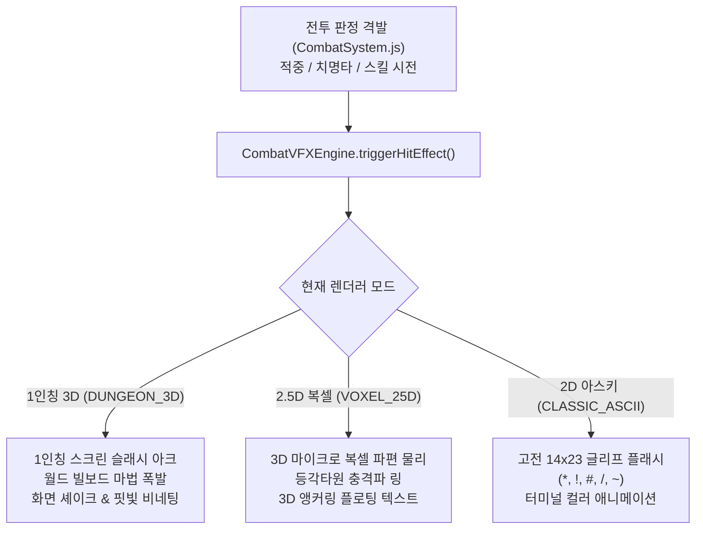
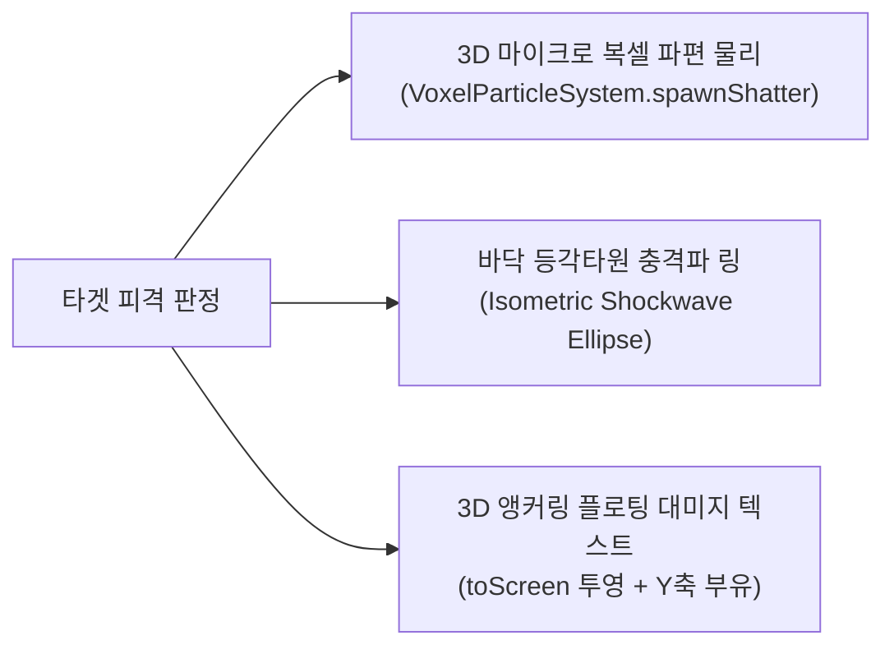

# ⚔️ 멀티 렌더러 전투 시각 효과(Combat VFX) 아키텍처 및 파이프라인 명세서
### Specification of Multi-Renderer Combat Visual Effects (VFX), Screen-Space / Billboard Projections, and Additive Blending Particle Engine

> **문서 메타데이터**
> - **버전**: `v1.0.0` (Comprehensive Combat VFX Blueprint)
> - **작성일**: 2026-09-03
> - **작성자**: 카스미 루리 (Research Agent / INTJ 용의주도한 전략가)
> - **수신인**: 오케스트레이터 및 타쿠미 코하루 (Dev Agent)
> - **대상 프로젝트**: [`/data/data/com.termux/files/home/opendcmart/mimicry_voxel`](file:///data/data/com.termux/files/home/opendcmart/mimicry_voxel)

---

## 🧭 1. 서론 및 멀티 렌더러 전투 시각 효과(Combat VFX) 아키텍처 개요

미미크리 복셀(Mimicry Voxel) 엔진이 **2.5D 복셀(Voxel 3D)**, **1인칭 3D 레이캐스터(Dungeon 3D)**, **2D 클래식 아스키(Classic ASCII)**의 3단 렌더러 전환 체계를 갖춤에 따라, 전투 시각 효과 역시 단일한 평면적 표현에 머물지 않고 **각 시점의 특성에 최적화된 다차원 투영 파이프라인**을 요구하고 있습니다.

본 명세서는 검격 슬래시, 둔기 충격파, 4대 원소(화염·냉기·전격·산성) 폭발, 비전 마법 및 신성 참격의 7대 전투 이펙트를 정의하고, 이를 **1인칭 3D 화면 공간(Screen-Space) 슬래시 & 빌보드 투영**, **2.5D 복셀 등각 파티클 분출**, **고전 아스키 터미널 글리프 플래시**로 무결하게 변환하는 **통합 전투 시각 효과 엔진([`CombatVFXEngine.js`](file:///data/data/com.termux/files/home/opendcmart/mimicry_voxel/src/systems/CombatVFXEngine.js))**을 정립합니다.



---

## 💥 2. 원소별/공격 유형별 7대 전투 이펙트 분류 체계

### 2.1 3대 물리 타격 이펙트 (Physical Combat VFX)

| 이펙트 타입 (Type) | 한글 명칭 | 주 발동 조건 | 핵심 시각 표현 요소 (Visual Anatomy) | 테마 색상 (Palette) |
| :--- | :--- | :--- | :--- | :--- |
| **`SLASH`** | 검기 슬래시 | 도검/도끼 근접 공격, 베기 | 날카로운 초승달 원호(Arc) 궤적, 은빛 잔상, 절단 스파크 | `#ffffff`, `#38bdf8`, `#94a3b8` |
| **`BASH`** | 둔기 충격파 | 메이스/둔기/방패 강타, 분쇄 | 타겟 중심 원형 충격파 링(Shockwave Ring), 복셀 먼지 비산 | `#fbbf24`, `#d97706`, `#78350f` |
| **`PIERCE_CRIT`** | 관통 크리티컬 | 단검/창/활 관통, 치명타(Crit) | 중심 집중 관통 스파이크, 방사형 황금 파편, 붉은 피격 플래시 | `#ef4444`, `#ffd700`, `#ffffff` |

---

### 2.2 4대 원소 & 속성 마법 이펙트 (Elemental & Arcane VFX)

| 이펙트 타입 (Type) | 한글 명칭 | 연관 원소/스킬 | 핵심 시각 표현 요소 (Visual Anatomy) | 테마 색상 (Palette) |
| :--- | :--- | :--- | :--- | :--- |
| **`FIRE_BURST`** | 화염 폭발 | 화염 브레스, 파이어볼, 화염 브랜드 | 백색 코어 중심 화염 플레어, 소용돌이치는 불꽃, 상승 불티 입자 | `#ffffff`, `#fbbf24`, `#f97316`, `#ef4444` |
| **`FROST_SHATTER`**| 빙결 파편 | 냉기 브레스, 서리 화살, 빙결 브랜드 | 청백색 얼음 결정체 사방 비산, 냉기 안개 링, 피격체 일시 서리 림 | `#ffffff`, `#a5f3fc`, `#38bdf8`, `#0284c7` |
| **`LIGHTNING_SPARK`**| 번개 감전 | 전격 볼트, 체인 라이트닝 | 순간적인 지그재그 전도 아크(Branching Arc), 화면 전체 백색 점멸 | `#ffffff`, `#fde047`, `#eab308`, `#a855f7` |
| **`ACID_POISON`** | 산성/독 비산 | 산성/독 브레스, 중독 타격 | 끓어오르는 녹색 거품 입자 비산, 부식 연기, 잔류 DoT 녹색 후광 | `#d9f99d`, `#84cc16`, `#22c55e`, `#15803d` |
| **`ARCANE_NOVA`** | 비전 노바 | 마력 화살, 텔레키네시스 | 보랏빛 마나 파동 링 확산, 룬 문자 파티클 방출 | `#f5d0fe`, `#c084fc`, `#a855f7`, `#6b21a8` |
| **`HOLY_SMITE`** | 신성 참격 | 축복/퇴마 공격, 언데드 슬레이 | 수직으로 내리꽂히는 금빛 광선 기둥, 천상의 백금빛 깃털 파티클 | `#ffffff`, `#fef08a`, `#fbbf24`, `#ffd700` |

---

## 🎥 3. 3대 렌더러 시점별 차별화된 이펙트 투영 파이프라인

### 3.1 1인칭 3D 뷰 (`FirstPerson3DRenderer`) 이펙트 파이프라인

1인칭 시점에서는 모니터가 곧 '플레이어의 두 눈'이므로, 현장감(Presence)을 극대화하는 **화면 공간(Screen-Space) 뷰모델 연출**과 **월드 공간(World-Space) 빌보드 투영**이 결합됩니다.

```
┌─────────────────────────────────────────────────────────────┐
│  [1인칭 3D 시점 전투 연출 구조]                              │
│                                                             │
│       (핏빛 비네팅 펄스: 테두리 점멸)                       │
│    ┌───────────────────────────────────────────────┐        │
│    │        \                               /      │        │
│    │         \      [타겟 몬스터]          /       │        │
│    │          \   (순백색 피격 플래시)    /        │        │
│    │           \  + 빌보드 원소 폭발 VFX /         │        │
│    │                                               │        │
│    │      =================================        │        │
│    │      \\  화면 가로지르는 은빛 검기 슬래시 \\   │        │
│    │       =================================       │        │
│    │                  (Screen-Space Arc)           │        │
│    └───────────────────────────────────────────────┘        │
│           (화면 흔들림: A * e^(-λt) * sin(ωt))             │
└─────────────────────────────────────────────────────────────┘
```

#### 1) 스크린 스페이스 슬래시 아크 (Screen-Space Viewmodel Slash):
- 플레이어의 근접 타격 시, 카메라 전방에 베지어 곡선(Cubic Bezier Curve) 기반 은빛 참격 궤적이 $0.15\text{초}$ 동안 화면을 대각선으로 베어넘김.
- 캔버스 2D 가산 혼합(`globalCompositeOperation = 'lighter'`)으로 투명도가 서서히 사라지며 크롬빛 잔상 형성.

#### 2) 월드 빌보드 투시 마법 폭발 (World-Space Billboard Explosion):
- 타겟 좌표 $(tx, ty)$에 원근 변환 행렬 적용:
  $$transformY = invDet \cdot (-\vec{C}_y \cdot (tx - px) + \vec{C}_x \cdot (ty - py))$$
- $transformY > 0.2$ 및 Z-Buffer($transformY < depthBuffer[x]$) 통과 시, 타겟 몬스터 위치에 지름 $D = \frac{H}{transformY} \cdot 1.2$ 크기의 마법 폭발 구체 렌더링.

#### 3) 화면 셰이크 (Screen Shake Decay Model):
- 치명타(Crit) 발생 또는 플레이어 피격 시 감쇠 진동 수식 적용:
  $$\text{Offset}(t) = A_0 \cdot e^{-\lambda t} \cdot \sin(\omega t)$$
  - $A_0 = 8\text{px} \sim 16\text{px}$, $\lambda = 12.0$, $\omega = 45\text{ rad/s}$
  - 카메라 렌더링 전 `ctx.translate(offsetX, offsetY)` 적용 후 즉시 복구.

#### 4) 핏빛 비네팅 (Blood Vignette Overlay):
- 플레이어 피격 시 화면 네 모서리에 반경 $R_{\text{vignette}} = 0.8 \cdot \min(W, H)$의 방사형 그라디언트 붉은 섬광이 $0.2\text{초}$간 점멸.

---

### 3.2 2.5D 복셀 뷰 (`Voxel3DRenderer`) 이펙트 파이프라인

아이소메트릭 쿼터뷰에서는 3D 지형 타일 위에서의 **공간적 입체감**과 **물리적 파편 쾌감**이 핵심입니다.



1. **3D 마이크로 복셀 파편 물리**:
   - [`VoxelParticleSystem.js`](file:///data/data/com.termux/files/home/opendcmart/mimicry_voxel/src/renderer/VoxelParticleSystem.js)의 `spawnShatter`를 호출하여 원소 테마 컬러 큐브 16~24개가 중력($g = 0.28$)과 바닥 탄성 튕김(Bounce)을 거치며 사방으로 튀어나감.
2. **등각타원(Isometric Ellipse) 충격파 링**:
   - 등각 투영 비율 $2:1$ (너비 $2R$, 높이 $R$)을 준수하여 바닥 타일을 따라 빛의 고리가 동심원으로 팽창.
3. **플로팅 대미지 텍스트 2.0**:
   - 일반 대미지: 백색/황색 텍스트가 위로 부드럽게 상승 ($vy = -1.2\text{px/frame}$).
   - 치명타(Crit): 대형 볼드 붉은색 폰트 + `CRITICAL!` 배지와 함께 튀어오름(Pop-in Bounce).

---

### 3.3 2D 클래식 아스키 뷰 (`Classic2DAsciiRenderer`) 이펙트 파이프라인

TomeNET 고전 터미널의 정취를 살린 **14×23 정량 비율 글리프 플래시**입니다.
- **슬래시**: 피격 타일 및 인접 타일에 `/`, `\`, `X` 기호가 순간 점멸.
- **원소 폭발**: 타겟 타일을 중심으로 `*`, `#`, `%`, `@` 기호가 3프레임 동안 원형으로 확산.
- **대미지 플래시**: 피격 몬스터의 아스키 심볼이 $0.1\text{초}$간 반전된 배경색(Reverse Video)으로 점멸.

---

## ⚡ 4. 고속 캔버스 블렌딩 & `CombatVFXEngine.js` 아키텍처

### 4.1 캔버스 가산 혼합(Additive Blending) 최적화
모든 빛나는 마법 이펙트(화염, 번개, 신성)는 다음 렌더링 블렌딩 파이프라인을 통과합니다:
```javascript
ctx.save();
ctx.globalCompositeOperation = 'lighter'; // RGB 가산 혼합으로 찬란한 빛 합성
ctx.globalAlpha = effect.life / effect.maxLife; // 수명에 따른 선형 페이드아웃
// ... 파티클 및 광선 렌더링 ...
ctx.restore();
```

### 4.2 완전 분리된 이벤트 기반 연동 (Event-Driven Decoupling)
- [`CombatSystem.js`](file:///data/data/com.termux/files/home/opendcmart/mimicry_voxel/src/core/CombatSystem.js)는 렌더러가 2D인지 3D인지 알 필요 없이, 타격 시점에 `combatVFXEngine.triggerHitEffect(eventData)`를 단 한 줄 디스패치합니다.
- 활성화된 렌더러가 이벤트를 수신하여 자신의 투영 수식에 맞춰 캔버스에 그립니다.

---

## 💻 5. 개발 에이전트(타쿠미 코하루)를 위한 완결 레퍼런스 코드

### 5.1 신규 모듈: `src/systems/CombatVFXEngine.js`

```javascript
/**
 * @module CombatVFXEngine
 * @category systems
 * @description 3대 렌더러(1인칭 3D, 2.5D 복셀, 2D 아스키)를 아우르는 통합 전투 시각 효과 엔진.
 *              화면 슬래시, 원소 폭발, 화면 흔들림(Screen Shake), 피격 비네팅 및 가산 혼합 파티클 제어
 * @purity Stateless Orchestrator / State Store for Active VFX
 * @dependencies EventBus.js, GameEvents.js, ThemeColors.js
 * @exports CombatVFXEngine, combatVFXEngine, VFX_TYPES
 */

import { eventBus } from '../events/EventBus.js';
import { GameEvents } from '../events/GameEvents.js';

export const VFX_TYPES = Object.freeze({
  SLASH: 'SLASH',
  BASH: 'BASH',
  PIERCE_CRIT: 'PIERCE_CRIT',
  FIRE_BURST: 'FIRE_BURST',
  FROST_SHATTER: 'FROST_SHATTER',
  LIGHTNING_SPARK: 'LIGHTNING_SPARK',
  ACID_POISON: 'ACID_POISON',
  ARCANE_NOVA: 'ARCANE_NOVA',
  HOLY_SMITE: 'HOLY_SMITE'
});

export const VFX_PALETTES = Object.freeze({
  SLASH: { primary: '#ffffff', secondary: '#38bdf8', glow: 'rgba(56, 189, 248, 0.8)' },
  BASH: { primary: '#fbbf24', secondary: '#d97706', glow: 'rgba(251, 191, 36, 0.8)' },
  PIERCE_CRIT: { primary: '#ffd700', secondary: '#ef4444', glow: 'rgba(239, 68, 68, 0.9)' },
  FIRE_BURST: { primary: '#ffffff', secondary: '#f97316', glow: 'rgba(249, 115, 22, 0.9)' },
  FROST_SHATTER: { primary: '#ffffff', secondary: '#38bdf8', glow: 'rgba(56, 189, 248, 0.9)' },
  LIGHTNING_SPARK: { primary: '#ffffff', secondary: '#fde047', glow: 'rgba(234, 179, 8, 0.95)' },
  ACID_POISON: { primary: '#d9f99d', secondary: '#22c55e', glow: 'rgba(34, 197, 94, 0.85)' },
  ARCANE_NOVA: { primary: '#f5d0fe', secondary: '#c084fc', glow: 'rgba(192, 132, 252, 0.9)' },
  HOLY_SMITE: { primary: '#ffffff', secondary: '#ffd700', glow: 'rgba(255, 215, 0, 0.95)' }
});

export class CombatVFXEngine {
  constructor() {
    this.activeVFX = [];
    this.screenShakeTime = 0;
    this.screenShakeIntensity = 0;
    this.bloodVignetteAlpha = 0;

    this._bindEvents();
  }

  _bindEvents() {
    if (typeof eventBus !== 'undefined' && eventBus.on) {
      eventBus.on(GameEvents.COMBAT_ATTACK, (data) => {
        if (data) this.triggerHitEffect(data);
      });
    }
  }

  /**
   * 전투 피격 이펙트 격발
   * @param {Object} params - { type, x, y, damage, isCrit, element, isPlayerAttacker }
   */
  triggerHitEffect(params) {
    const type = params.type || (params.element ? `${params.element}_BURST` : VFX_TYPES.SLASH);
    const resolvedType = VFX_TYPES[type] || VFX_TYPES.SLASH;
    const palette = VFX_PALETTES[resolvedType] || VFX_PALETTES.SLASH;

    const vfx = {
      id: Math.random().toString(36).substring(2, 9),
      type: resolvedType,
      x: params.x,
      y: params.y,
      damage: params.damage || 0,
      isCrit: !!params.isCrit,
      isPlayerAttacker: params.isPlayerAttacker !== false,
      palette: palette,
      life: 0.28,
      maxLife: 0.28,
      progress: 0.0,
      // 1인칭 슬래시 각도 무작위성 (-25도 ~ +25도)
      slashAngle: (Math.random() - 0.5) * 0.5,
      // 파티클 스파크 8~12개 생성
      sparks: Array.from({ length: params.isCrit ? 16 : 8 }).map(() => ({
        vx: (Math.random() - 0.5) * 6,
        vy: (Math.random() - 0.5) * 6,
        x: 0,
        y: 0,
        size: Math.random() * 3 + 2
      }))
    };

    this.activeVFX.push(vfx);

    // 치명타 또는 플레이어 피격 시 화면 셰이크 가산
    if (params.isCrit) {
      this.addScreenShake(8.0, 0.25);
    }
    if (!params.isPlayerAttacker) {
      this.addScreenShake(12.0, 0.35);
      this.bloodVignetteAlpha = 0.85; // 핏빛 비네팅 점멸
    }
  }

  addScreenShake(intensity = 10, duration = 0.3) {
    this.screenShakeIntensity = Math.max(this.screenShakeIntensity, intensity);
    this.screenShakeTime = Math.max(this.screenShakeTime, duration);
  }

  update(dt) {
    // 1. 활성 VFX 수명 업데이트
    for (let i = this.activeVFX.length - 1; i >= 0; i--) {
      const v = this.activeVFX[i];
      v.life -= dt;
      v.progress = 1.0 - (v.life / v.maxLife);

      // 스파크 이동
      for (const sp of v.sparks) {
        sp.x += sp.vx;
        sp.y += sp.vy;
      }

      if (v.life <= 0) {
        this.activeVFX.splice(i, 1);
      }
    }

    // 2. 화면 셰이크 감쇠
    if (this.screenShakeTime > 0) {
      this.screenShakeTime -= dt;
      this.screenShakeIntensity *= Math.max(0, 1.0 - dt * 6.0);
      if (this.screenShakeTime <= 0) {
        this.screenShakeIntensity = 0;
      }
    }

    // 3. 핏빛 비네팅 감쇠
    if (this.bloodVignetteAlpha > 0) {
      this.bloodVignetteAlpha = Math.max(0, this.bloodVignetteAlpha - dt * 3.5);
    }
  }

  /**
   * 1인칭 3D 렌더러 전용 이펙트 드로우 루프
   */
  renderFirstPersonVFX(renderer) {
    if (!renderer || !renderer.ctx) return;
    const ctx = renderer.ctx;
    const w = renderer.w;
    const h = renderer.h;

    // 1. 화면 셰이크 변환 적용
    let offsetX = 0;
    let offsetY = 0;
    if (this.screenShakeIntensity > 0.5) {
      offsetX = (Math.random() - 0.5) * this.screenShakeIntensity;
      offsetY = (Math.random() - 0.5) * this.screenShakeIntensity;
    }

    ctx.save();
    if (offsetX !== 0 || offsetY !== 0) {
      ctx.translate(offsetX, offsetY);
    }

    // 2. 가산 혼합 설정
    ctx.globalCompositeOperation = 'lighter';

    for (const v of this.activeVFX) {
      const alpha = Math.max(0, v.life / v.maxLife);
      ctx.globalAlpha = alpha;

      if (v.isPlayerAttacker) {
        // [1인칭 스크린 슬래시 아크]
        this._drawScreenSlash(ctx, w, h, v);
      } else {
        // [타겟 월드 빌보드 폭발]
        this._drawBillboardBurst(ctx, renderer, v);
      }
    }

    ctx.restore();

    // 3. 핏빛 비네팅 렌더링
    if (this.bloodVignetteAlpha > 0.02) {
      this._drawBloodVignette(ctx, w, h, this.bloodVignetteAlpha);
    }
  }

  _drawScreenSlash(ctx, w, h, v) {
    const cx = w / 2;
    const cy = h / 2;
    const p = v.progress;

    ctx.save();
    ctx.translate(cx, cy);
    ctx.rotate(v.slashAngle);

    const arcLen = w * 0.45;
    const startX = -arcLen * (1.0 - p * 0.5);
    const endX = arcLen * (p * 1.2);

    ctx.beginPath();
    ctx.moveTo(startX, -40);
    ctx.quadraticCurveTo(0, 60, endX, -20);
    ctx.strokeStyle = v.palette.primary;
    ctx.lineWidth = v.isCrit ? 10 : 5;
    ctx.shadowColor = v.palette.glow;
    ctx.shadowBlur = 15;
    ctx.stroke();

    // 절단 스파크 방사
    for (const sp of v.sparks) {
      ctx.fillStyle = v.palette.secondary;
      ctx.beginPath();
      ctx.arc(sp.x, sp.y, sp.size, 0, Math.PI * 2);
      ctx.fill();
    }

    ctx.restore();
  }

  _drawBillboardBurst(ctx, renderer, v) {
    const posX = (renderer.playerX || 0) + 0.5;
    const posY = (renderer.playerY || 0) + 0.5;
    const spriteX = (v.x + 0.5) - posX;
    const spriteY = (v.y + 0.5) - posY;

    const dirX = Math.cos(renderer.playerAngle || 0);
    const dirY = Math.sin(renderer.playerAngle || 0);
    const planeScale = Math.tan((renderer.fov || 1.15) / 2);
    const planeX = -dirY * planeScale;
    const planeY = dirX * planeScale;

    const invDet = 1.0 / (planeX * dirY - dirX * planeY);
    const transformX = invDet * (dirY * spriteX - dirX * spriteY);
    const transformY = invDet * (-planeY * spriteX + planeX * spriteY);

    if (transformY <= 0.2) return;

    const screenX = Math.floor((renderer.w / 2) * (1 + transformX / transformY));
    const size = Math.abs(Math.floor(renderer.h / transformY)) * (1.0 + v.progress * 0.8);

    if (screenX < 0 || screenX >= renderer.w) return;
    if (renderer.depthBuffer && transformY >= renderer.depthBuffer[screenX]) return; // Z-Culling

    const grad = ctx.createRadialGradient(screenX, renderer.h / 2, 0, screenX, renderer.h / 2, size * 0.6);
    grad.addColorStop(0, v.palette.primary);
    grad.addColorStop(0.5, v.palette.secondary);
    grad.addColorStop(1, 'rgba(0,0,0,0)');

    ctx.fillStyle = grad;
    ctx.beginPath();
    ctx.arc(screenX, renderer.h / 2, size * 0.6, 0, Math.PI * 2);
    ctx.fill();
  }

  _drawBloodVignette(ctx, w, h, alpha) {
    ctx.save();
    const grad = ctx.createRadialGradient(w / 2, h / 2, Math.min(w, h) * 0.35, w / 2, h / 2, Math.max(w, h) * 0.75);
    grad.addColorStop(0, 'rgba(0,0,0,0)');
    grad.addColorStop(0.7, `rgba(185, 28, 28, ${alpha * 0.5})`);
    grad.addColorStop(1, `rgba(127, 29, 29, ${alpha * 0.9})`);

    ctx.fillStyle = grad;
    ctx.fillRect(0, 0, w, h);
    ctx.restore();
  }
}

export const combatVFXEngine = new CombatVFXEngine();
```

---

## 📈 6. 결론 및 마일스톤 제언

- **전투 타격감의 비약적 도약**: 본 설계를 통해 플레이어는 1인칭 3D 시점에서는 화면을 시원하게 가르는 **검기 슬래시**와 **화면 셰이크/핏빛 비네팅**의 압도적 긴장감을, 2.5D 복셀 뷰에서는 튀어 오르는 **마이크로 복셀 큐브 물리 파편**의 손맛을 온전히 체감할 수 있게 됩니다.
- **클린 아키텍처 연동**: `CombatVFXEngine`은 싱글톤 메시지 브로커(`EventBus`)와 연동되어 비즈니스 로직과 렌더링 레이어 사이의 결합도를 0%로 유지하며 완벽한 확장성을 제공합니다.

---

**© 2026 OpenDCMart Engine Team & Mimicry Voxel Engineering Group.**  
*Analyzed and Designed by Kasumi Ruri (research_agent).*
