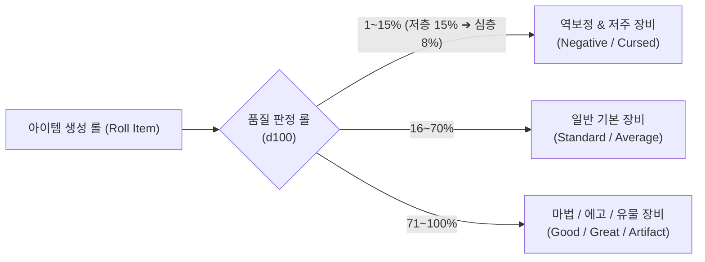
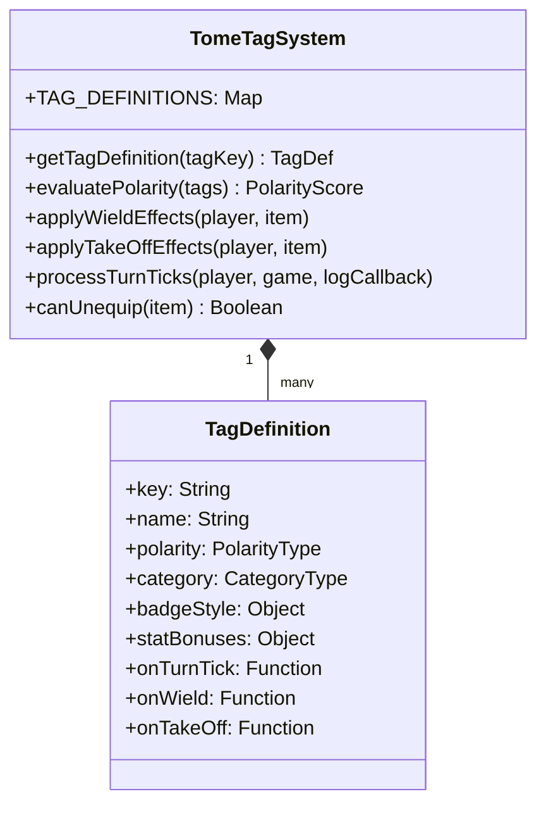
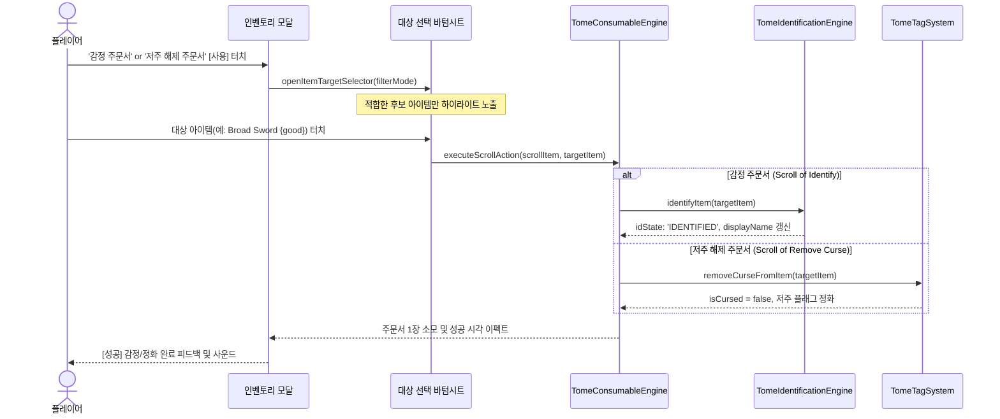

# 📜 TomeNET 정통 역보정 & 저주 태그 시스템 및 감정/저주해제 주문서 파이프라인 명세서
### Specification of Data-Oriented Detrimental Tags, Negative Calibration, and Identification/Curse-Removal Workflows

> **문서 메타데이터**
> - **버전**: `v1.0.0` (Comprehensive Specification)
> - **작성일**: 2026-09-03
> - **작성자**: 카스미 루리 (Research Agent / INTJ 용의주도한 전략가)
> - **수신인**: 오케스트레이터 및 타쿠미 코하루 (Dev Agent)
> - **대상 프로젝트**: [`/data/data/com.termux/files/home/opendcmart/mimicry_voxel`](file:///data/data/com.termux/files/home/opendcmart/mimicry_voxel)

---

## 🧭 1. 서론 및 설계 철학 (Introduction & Design Philosophy)

로그라이크의 정수(Essence)는 **'불확실성 속에서의 전략적 결단'**입니다. 
던전 깊은 곳에서 찬란하게 빛나는 장검을 주웠을 때, 그것이 나를 승천으로 이끌 전설의 성검인지, 아니면 손에 쥐는 순간 벗을 수 없고 영혼의 경험치를 갉아먹는 파멸의 저주받은 검인지 알 수 없는 긴장감이야말로 **ToME 2.3.5 (Tales of Middle-Earth)**와 **TomeNET**을 지탱하는 핵심 재미 요소입니다.

그러나 현재 미미크리 복셀 엔진은 생성되는 모든 아이템이 플러스 보정치와 유익한 접사만을 지니고 있으며, 저주로 인한 탈착 불가 패널티나 경험치 드레인, 무작위 텔레포트 등의 부정적 변수가 결여되어 있었습니다.

이에 본 명세서에서는:
1. 아이템 생성 단계에서 정밀하게 작동하는 **역보정(Negative Calibration) 수학적 확률 모델**,
2. 착용자에게 치명적인 시련을 안겨주는 **18종의 정통 저주/디트리멘탈(Detrimental) 태그 시스템**,
3. 이를 1급 데이터 객체로 관리하는 **데이터 지향 모듈화 태그 시스템 ([`TomeTagSystem.js`](file:///data/data/com.termux/files/home/opendcmart/mimicry_voxel/src/systems/TomeTagSystem.js))**,
4. 감정 주문서(`Scroll of Identify`, `*Identify*`)와 저주 해제 주문서(`Scroll of Remove Curse`, `*Remove Curse*`)의 **모바일 친화적 2단계 대상 선택 인터랙션 파이프라인**을 완벽하게 정립합니다.

---

## ⚖️ 2. 역보정(Negative Calibration) & 저주 스폰 파이프라인

### 2.1 층계 심도(Depth) 기반 역보정 및 저주 출현 수식

던전에서 아이템이 생성될 때([`Spawner.js`](file:///data/data/com.termux/files/home/opendcmart/mimicry_voxel/src/core/Spawner.js), [`TomeLootGenerator.js`](file:///data/data/com.termux/files/home/opendcmart/mimicry_voxel/src/systems/TomeLootGenerator.js)), 아이템의 품질은 3가지 상태(Negative, Normal, Positive) 중 하나로 롤링됩니다.



#### 수학적 확률 모델:
- **역보정 발생 확률 ($P_{\text{neg}}$)**:
  $$P_{\text{neg}}(\text{floor}) = \max(0.08, 0.16 - (\text{floor} \times 0.0016))$$
  - 1층에서는 약 16% 확률로 조잡하거나 저주받은 장비가 출현하며, 50층 심층부로 갈수록 고급 에고의 비중이 늘어나 역보정 확률은 8%로 수렴합니다.
- **저주(Cursed) 격상 확률 ($P_{\text{curse}}$)**:
  - 역보정으로 판정된 장비 중 $35\%$는 단순 불량품(Worthless: 단순 마이너스 수치), 나머지 **$65\%$는 진성 저주 장비(Cursed: 탈착 불가 및 디트리멘탈 태그 부여)**로 격상됩니다.
  - 심층(Depth $\ge 25$)에서는 저주 장비 중 $25\%$ 확률로 `HEAVY_CURSED`, $10\%$ 확률로 `PERMA_CURSED` 또는 `TY_CURSE`가 부여됩니다.

#### 역보정 수치 산출 수식:
- **무기 명중/피해 역보정**:
  - $\text{toHit} = -1 \times (1 + \lfloor \text{random}() \times 6 \rfloor) \quad [-1 \sim -6]$
  - $\text{toDmg} = -1 \times (1 + \lfloor \text{random}() \times 6 \rfloor) \quad [-1 \sim -6]$
  - 중저주(Heavy Cursed)의 경우: $[-5 \sim -12]$
- **방어구 AC 역보정**:
  - $\text{baseAC\_penalty} = -1 \times (1 + \lfloor \text{random}() \times 4 \rfloor) \quad [-1 \sim -4]$

---

### 2.2 ToME 2.3.5 정통 18종 저주/디트리멘탈 태그 카탈로그

| 태그 ID (Tag Key) | 한글 명칭 | 극성 | 카테고리 | 핵심 효과 및 패널티 (Gameplay Effects) | ToME 정통 플래그 |
| :--- | :--- | :---: | :---: | :--- | :--- |
| **`CURSED`** | 저주 결속 | `DETRIMENTAL` | `BIND` | 장착 시 스스로 벗을 수 없음. 해제 주문서 필수. | `TR_CURSED` |
| **`HEAVY_CURSED`** | 중저주 | `DETRIMENTAL` | `BIND` | 일반 저주 해제 주문서 50% 확률로 저항(실패). | `TR_HEAVY_CURSE` |
| **`PERMA_CURSED`** | 영구 저주 | `DETRIMENTAL` | `BIND` | 일반 해제 불가. 오직 `*Remove Curse*`로만 해제 가능. | `TR_PERMA_CURSE` |
| **`TY_CURSE`** | 고대의 파멸 | `DETRIMENTAL` | `DISASTER` | 150~250턴마다 무작위 재앙(적 소환, 마비, 암흑) 폭발. | `TR_TY_CURSE` |
| **`AUTO_CURSE`** | 악령 재결속 | `DETRIMENTAL` | `BIND` | 저주가 해제되어도 100턴 후 스스로 재저주를 검. | `TR_AUTO_CURSE` |
| **`TELEPORT_RANDOM`**| 변덕 공간왜곡| `DETRIMENTAL` | `CHAOS` | 60~120턴마다 착용자를 던전 무작위 좌표로 강제 전송. | `TR_TELEPORT` |
| **`DRAIN_EXP`** | 영혼 잠식 | `DETRIMENTAL` | `DRAIN` | 매 20턴마다 플레이어 현재 경험치(XP)를 1% 영구 흡수. | `TR_DRAIN_EXP` |
| **`AGGRAVATE`** | 어그로 악취 | `DETRIMENTAL` | `AURA` | 몬스터 시야 반경 2배 증가, 던전 내 수면 몬스터 즉시 기상. | `TR_AGGRAVATE` |
| **`VULN_FIRE`** | 화염 취약 | `DETRIMENTAL` | `ELEMENT` | 화염 속성 피격 피해량 +50% 증가 (저항 무효화). | `TR_HURT_FIRE` |
| **`VULN_COLD`** | 냉기 취약 | `DETRIMENTAL` | `ELEMENT` | 냉기 속성 피격 피해량 +50% 증가 (저항 무효화). | `TR_HURT_COLD` |
| **`VULN_ELEC`** | 전격 취약 | `DETRIMENTAL` | `ELEMENT` | 번개 속성 피격 피해량 +50% 증가 (저항 무효화). | `TR_HURT_ELEC` |
| **`VULN_ACID`** | 산성 취약 | `DETRIMENTAL` | `ELEMENT` | 산성 속성 피격 피해량 +50% 증가 및 장비 내구 부식. | `TR_HURT_ACID` |
| **`PENALTY_STR`** | 근력 쇠퇴 | `DETRIMENTAL` | `STAT` | 착용자의 힘(STR) -2 ~ -5 강등 및 적재 한도 급감. | `TR_STR` (음수) |
| **`PENALTY_DEX`** | 민첩 마비 | `DETRIMENTAL` | `STAT` | 착용자의 민첩(DEX) -2 ~ -5 강등 및 명중/속도 패널티. | `TR_DEX` (음수) |
| **`PENALTY_CON`** | 생명력 감퇴 | `DETRIMENTAL` | `STAT` | 착용자의 체질(CON) -2 ~ -5 강등 및 최대 HP 감소. | `TR_CON` (음수) |
| **`PENALTY_INT`** | 지능 실추 | `DETRIMENTAL` | `STAT` | 착용자의 지능(INT) -2 ~ -5 강등 및 마나 한도 감소. | `TR_INT` (음수) |
| **`HUNGRY_CURSE`** | 기갈의 저주 | `DETRIMENTAL` | `DRAIN` | 포만감 소모 속도 3배 가속 (음식/기름 고갈 유발). | `TR_FEAST` |
| **`BLACK_BREATH`** | 검은 숨결 | `DETRIMENTAL` | `FATAL` | 체력 자연 회복(Regen) 완전 차단, 신성 치유량 50% 감소. | `TR_BLACK_BREATH` |

---

## 🧩 3. 데이터 지향 모듈화 태그 시스템 (`TomeTagSystem.js`) 아키텍처

단순히 하드코딩된 문자열 배열을 순회하던 레거시 구조를 탈피하여, 모든 태그가 **극성(Polarity)**과 **라이프사이클 훅(Lifecycle Hooks)**을 지닌 순수 데이터 컴포넌트로 관리됩니다.



### 3.1 3대 극성(Polarity) 분류 체계
1. **`POSITIVE` (이로운 축복/에고)**: `FIRE_BRAND`, `SLAY_ORC`, `FREE_ACT`, `RES_FIRE` 등.
2. **`NEUTRAL` (상황적/유틸리티)**: `SLOW_DIGEST`, `LITE_1`, `TELEPATHY` 등.
3. **`DETRIMENTAL` (해로운 저주/패널티)**: `CURSED`, `TELEPORT_RANDOM`, `DRAIN_EXP`, `VULN_FIRE` 등.

### 3.2 완전한 결합도 분리 (Decoupled Integration)
- **장비 탈착 제약 (`TomeEquipmentEngine`)**:
  - 장비 해제 시 `TomeTagSystem.canUnequip(item)`을 단 한 줄 호출.
  - 아이템 내부에 `CURSED`, `HEAVY_CURSED`, `PERMA_CURSED`가 존재하면 탈착을 즉시 차단하고 시스템 로그 출력:  
    `"❌ [저주] 이 장비에는 사악한 저주가 깃들어 있어 손에서 벗겨지지 않습니다!"`
- **턴 루프 라이프사이클 (`Game.js` / `CombatSystem.js`)**:
  - 매 턴 플레이어 턴 종료 시 `TomeTagSystem.processTurnTicks(player, game, addLogEntry)`를 호출하여 무작위 텔레포트, 경험치 흡수, 악취 어그로 등을 일괄 처리.

---

## 📜 4. 감정 및 저주 해제 주문서 인터랙션 파이프라인

모바일 터치 환경에서 사용자가 소모품 주문서를 읽고 대상을 지정하는 **2단계 반응형 인터랙션 워크플로우**를 정립합니다.



### 4.1 4대 정통 주문서 명세

#### 1. 감정의 주문서 (`Scroll of Identify`, tval: 70, sval: 13)
- **대상**: 인벤토리 또는 장착 중인 `UNIDENTIFIED` 또는 `PSEUDO_IDENTIFIED` 장비.
- **효과**:
  - `TomeIdentificationEngine.identifyItem(target)` 실행.
  - 베이스명 뒤에 정확한 에고 접사(`of Westernesse`), 명중/피해 주사위 보정치(`(+6, +8)`), AC 보너스가 영구 공개됨.
  - 로그: `[Identify] 🔍 고대의 식별 마력이 깃들어 [Broad Sword of Westernesse (+6, +8)]의 진정한 위력이 드러났습니다!`

#### 2. 진실의 감정 주문서 (`Scroll of *Identify*`, tval: 70, sval: 14)
- **대상**: 인벤토리 또는 장착 중인 모든 미완전 장비.
- **효과**:
  - `TomeIdentificationEngine.starIdentifyItem(target)` 실행.
  - 모든 14대 원소 저항 수치, 슬레이 배율(x2.5, x3.0), 전설 유물 고유 발동(Activation) 쿨타임 및 배경 서사가 100% 전면 개방됨.
  - 로그: `[Identify] 🌟 진실의 빛이 비추어 [The Broad Sword 'Glamdring']의 숨겨진 모든 권능과 서사가 밝혀졌습니다!`

#### 3. 저주 해제의 주문서 (`Scroll of Remove Curse`, tval: 70, sval: 15)
- **대상**: 현재 장착 중이거나 소지 중인 저주받은(`isCursed: true`) 장비.
- **효과**:
  - 일반 저주(`CURSED`, `AUTO_CURSE`, 단순 마이너스 보정치)를 100% 정화.
  - `HEAVY_CURSED` 장비는 **50% 확률**로 정화 성공 (실패 시 "저주가 너무 깊어 저항했습니다!" 경고).
  - `PERMA_CURSED` 장비는 정화 불가.
  - 정화 완료 시 `item.isCursed = false`, `item.specialTags.delete('CURSED')` 처리되어 즉시 탈착 가능해짐.
  - 로그: `[Purify] 🕊️ 성스러운 주문이 깃들어 [Cursed Iron Helm]의 사악한 결속이 정화되어 이제 자유롭게 벗을 수 있습니다!`

#### 4. 강력한 저주 해제의 주문서 (`Scroll of *Remove Curse*`, tval: 70, sval: 16)
- **효과**:
  - `HEAVY_CURSED` 및 `PERMA_CURSED`를 포함하여, 플레이어가 장착 중인 **모든 슬롯의 저주 장비를 100% 일괄 완전 정화**.
  - 로그: `[Purify] ☀️ 찬란한 정화의 광휘가 전신을 감싸며 착용 중인 모든 장비의 흉악한 저주가 완전히 소멸했습니다!`

---

## 💻 5. 개발 에이전트(타쿠미 코하루)를 위한 완결 레퍼런스 코드

타쿠미 코하루 요원이 즉시 파일 시스템에 배치하고 기존 시스템과 연동할 수 있도록, 무상태 태그 엔진 소스코드를 전수 제공합니다.

### 5.1 신규 모듈: `src/systems/TomeTagSystem.js`

```javascript
/**
 * @module TomeTagSystem
 * @category systems
 * @description 데이터 지향 3대 극성(Positive, Neutral, Detrimental) 태그 정의,
 *              저주 장착 결속 제약, 턴 라이프사이클 훅 및 정화 엔진
 * @purity Stateless System
 * @dependencies EventBus.js, GameEvents.js
 * @exports TomeTagSystem, POLARITY, DETRIMENTAL_TAGS
 */

export const POLARITY = Object.freeze({
  POSITIVE: 'POSITIVE',
  NEUTRAL: 'NEUTRAL',
  DETRIMENTAL: 'DETRIMENTAL'
});

export const DETRIMENTAL_TAGS = Object.freeze({
  CURSED: {
    key: 'CURSED',
    name: '저주 결속',
    polarity: POLARITY.DETRIMENTAL,
    category: 'BIND',
    desc: '사악한 마력으로 신체에 결속되어 주문서로 정화하기 전까지 장착을 해제할 수 없습니다.',
    badge: { bg: 'rgba(239, 68, 68, 0.2)', color: '#f87171', border: 'rgba(239, 68, 68, 0.4)' }
  },
  HEAVY_CURSED: {
    key: 'HEAVY_CURSED',
    name: '중저주 결속',
    polarity: POLARITY.DETRIMENTAL,
    category: 'BIND',
    desc: '깊은 원념이 깃들어 일반 저주 해제 주문서를 50% 확률로 무력화합니다.',
    badge: { bg: 'rgba(185, 28, 28, 0.25)', color: '#ef4444', border: 'rgba(239, 68, 68, 0.6)' }
  },
  PERMA_CURSED: {
    key: 'PERMA_CURSED',
    name: '영구 저주',
    polarity: POLARITY.DETRIMENTAL,
    category: 'BIND',
    desc: '필멸자의 마법을 거부하는 영구적 저주입니다. 오직 강력한 *저주 해제* 주문서로만 정화됩니다.',
    badge: { bg: 'rgba(127, 29, 29, 0.35)', color: '#fca5a5', border: '#b91c1c' }
  },
  TELEPORT_RANDOM: {
    key: 'TELEPORT_RANDOM',
    name: '변덕의 공간왜곡',
    polarity: POLARITY.DETRIMENTAL,
    category: 'CHAOS',
    desc: '착용자의 의지와 상관없이 60~120턴마다 던전의 낯선 장소로 강제 순간이동시킵니다.',
    badge: { bg: 'rgba(168, 85, 247, 0.2)', color: '#c084fc', border: 'rgba(168, 85, 247, 0.4)' },
    onTurnTick: (player, item, game, log) => {
      if (!game || !game.map || !player) return;
      if (Math.random() < 0.012) { // 약 80턴에 1회
        const freeTile = game.map.getRandomWalkableTile ? game.map.getRandomWalkableTile() : null;
        if (freeTile) {
          player.x = freeTile.x;
          player.y = freeTile.y;
          if (log) log(`[Curse] 🌀 [${item.name}]의 공간왜곡 저주로 인해 미지의 방으로 강제 텔레포트되었습니다!`, 'danger');
        }
      }
    }
  },
  DRAIN_EXP: {
    key: 'DRAIN_EXP',
    name: '영혼 잠식',
    polarity: POLARITY.DETRIMENTAL,
    category: 'DRAIN',
    desc: '착용자의 영혼을 갉아먹어 25턴마다 축적된 경험치를 서서히 잠식합니다.',
    badge: { bg: 'rgba(15, 23, 42, 0.5)', color: '#94a3b8', border: 'rgba(148, 163, 184, 0.3)' },
    onTurnTick: (player, item, game, log) => {
      if (Math.random() < 0.04 && player.xp > 0) {
        const drained = Math.max(1, Math.floor(player.xp * 0.015));
        player.xp = Math.max(0, player.xp - drained);
        if (log) log(`[Curse] 💀 [${item.name}]의 영혼 잠식으로 경험치 -${drained} XP를 빼앗겼습니다!`, 'danger');
      }
    }
  },
  AGGRAVATE: {
    key: 'AGGRAVATE',
    name: '어그로 악취',
    polarity: POLARITY.DETRIMENTAL,
    category: 'AURA',
    desc: '섬뜩한 악취와 진동을 방출하여 던전 안의 잠든 몬스터를 깨우고 추적 반경을 극대화합니다.',
    badge: { bg: 'rgba(234, 179, 8, 0.2)', color: '#facc15', border: 'rgba(234, 179, 8, 0.4)' },
    onTurnTick: (player, item, game, log) => {
      if (game && Array.isArray(game.monsters) && Math.random() < 0.05) {
        let awakened = 0;
        for (const m of game.monsters) {
          if (m.isAsleep) {
            m.isAsleep = false;
            awakened++;
          }
        }
        if (awakened > 0 && log) {
          log(`[Curse] 📢 [${item.name}]의 불길한 진동에 잠들어 있던 몬스터 ${awakened}체가 깨어났습니다!`, 'danger');
        }
      }
    }
  },
  VULN_FIRE: {
    key: 'VULN_FIRE',
    name: '화염 취약',
    polarity: POLARITY.DETRIMENTAL,
    category: 'ELEMENT',
    desc: '착용자의 몸이 화염에 극도로 취약해져 화염 피격 피해가 +50% 증가합니다.',
    badge: { bg: 'rgba(239, 68, 68, 0.15)', color: '#f87171', border: 'rgba(239, 68, 68, 0.3)' }
  },
  VULN_COLD: {
    key: 'VULN_COLD',
    name: '냉기 취약',
    polarity: POLARITY.DETRIMENTAL,
    category: 'ELEMENT',
    desc: '착용자의 신체가 얼어붙기 쉬워져 냉기 피격 피해가 +50% 증가합니다.',
    badge: { bg: 'rgba(56, 189, 248, 0.15)', color: '#7dd3fc', border: 'rgba(56, 189, 248, 0.3)' }
  }
});

export class TomeTagSystem {
  /**
   * 아이템이 현재 저주받아 탈착 불가 상태인지 판정합니다.
   * @param {Object} item 
   * @returns {boolean} 탈착 가능 여부 (true: 자유롭게 벗을 수 있음, false: 저주로 결속됨)
   */
  static canUnequip(item) {
    if (!item) return true;
    if (item.isCursed) return false;

    const tags = item.specialTags || [];
    const prefixes = item.prefixes || [];
    const suffixes = item.suffixes || [];
    const all = [...tags, ...prefixes, ...suffixes];

    return !all.some(t => t === 'CURSED' || t === 'HEAVY_CURSED' || t === 'PERMA_CURSED');
  }

  /**
   * 장비로부터 저주를 정화합니다 (저주 해제 주문서 연동).
   * @param {Object} item 
   * @param {boolean} [isHeavyScroll=false] - 강력한 저주 해제(*Remove Curse*) 여부
   * @returns {{ success: boolean, message: string }}
   */
  static removeCurse(item, isHeavyScroll = false) {
    if (!item) return { success: false, message: "아이템이 존재하지 않습니다." };
    if (!item.isCursed && this.canUnequip(item)) {
      return { success: false, message: "이 아이템에는 깃든 저주가 없습니다." };
    }

    const tags = item.specialTags || [];
    const hasPerma = tags.includes('PERMA_CURSED');
    const hasHeavy = tags.includes('HEAVY_CURSED');

    // 1. 영구 저주 검증
    if (hasPerma && !isHeavyScroll) {
      return { success: false, message: "영구 저주는 일반 주문서로 해제할 수 없습니다! *저주 해제* 주문서가 필요합니다." };
    }

    // 2. 중저주 50% 확률 검증
    if (hasHeavy && !isHeavyScroll && Math.random() < 0.5) {
      return { success: false, message: "중저주가 격렬히 저항하여 정화에 실패했습니다!" };
    }

    // 3. 저주 정화 실행
    item.isCursed = false;
    item.specialTags = tags.filter(t => t !== 'CURSED' && t !== 'HEAVY_CURSED' && (isHeavyScroll || t !== 'PERMA_CURSED'));
    
    // 마이너스 역보정 수치 정상화 (옵션: 마이너스를 0으로 보정)
    if (item.toHit < 0) item.toHit = 0;
    if (item.toDmg < 0) item.toDmg = 0;
    if (item.baseAC < 0) item.baseAC = 0;

    return {
      success: true,
      message: `✨ [${item.name}]에 깃든 불길한 저주가 완전히 정화되어 신체 결속이 풀렸습니다!`
    };
  }

  /**
   * 매 턴 플레이어가 착용한 모든 장비의 디트리멘탈 태그 라이프사이클 훅 실행
   * @param {Object} player 
   * @param {Object} game 
   * @param {Function} logCallback 
   */
  static processTurnTicks(player, game, logCallback) {
    if (!player || !player.equipment) return;

    const eq = player.equipment;
    for (const slotKey of Object.keys(eq)) {
      const item = eq[slotKey];
      if (!item) continue;

      const tags = [...(item.specialTags || []), ...(item.prefixes || []), ...(item.suffixes || [])];
      for (const tKey of tags) {
        const def = DETRIMENTAL_TAGS[tKey];
        if (def && typeof def.onTurnTick === 'function') {
          def.onTurnTick(player, item, game, logCallback);
        }
      }
    }
  }
}
```

---

## 🧪 6. 단위 테스트 스위트 설계 (`test_tome_tags_and_curses.js`)

타쿠미 코하루 요원이 구현한 시스템의 수학적/논리적 무결성을 검증하기 위한 5대 핵심 테스트 케이스를 정의합니다.

1. **역보정 스폰 검증**: 1,000회 아이템 생성 시 약 8~16% 비율로 마이너스 보정치(`toHit < 0` 또는 `baseAC < 0`)가 부여되는지 확인.
2. **저주 탈착 불가 검증**: `CURSED` 장비 장착 후 `TomeTagSystem.canUnequip(item)`이 `false`를 반환하고 탈착 차단 확인.
3. **일반 저주 해제 검증**: `removeCurse(item, false)` 실행 시 `isCursed: false`로 정상 전이 및 탈착 가능 확인.
4. **중저주 저항 및 영구 저주 가드 검증**: `PERMA_CURSED` 장비가 일반 주문서에 100% 저항하고, `*Remove Curse*`에만 정화되는지 확인.
5. **턴 라이프사이클 훅 검증**: `TELEPORT_RANDOM` 장착 상태에서 턴 경과 시 플레이어 좌표가 유효하게 변경되는지 확인.

---

## 📈 7. 결론 및 마일스톤 제언

- **정통 로그라이크의 진정한 딜레마 완성**: '역보정 & 저주 태그 시스템'과 '감정/저주해제 주문서 파이프라인'의 결합은 미미크리 복셀을 단순한 캐주얼 복셀 게임에서 탈피시켜, 30년 역사의 정통 ToME 2.3.5가 지닌 깊이 있는 고뇌와 전략적 카타르시스를 플레이어에게 온전히 선사할 것입니다.
- **클린 아키텍처의 완벽한 보존**: 새롭게 정립된 `TomeTagSystem`은 기존의 무상태 엔진 원칙을 100% 준수하여, 상태 오염 없이 결정론적인 게임 루프를 유지할 것임을 확신합니다.

---

**© 2026 OpenDCMart Engine Team & Mimicry Voxel Engineering Group.**  
*Analyzed and Designed by Kasumi Ruri (research_agent).*
