# 📜 Mimicry Voxel Engine Comprehensive Development Log (v0.1.0 ~ v0.33.0)

> **ToME 2.3.5 / TomeNET 정통 규칙 기반 데이터 지향 복셀 로그라이크 누적 개발 연혁 및 아키텍처 변천사 (Phase 1 ~ Phase 19 집대성)**

[](package.json)
[](scripts/run_all_tests.js)
[-indigo.svg)](CODE_META_INDEX.md)
[-blue.svg)](src/systems/)
[](src/renderer/)
[](src/entities/)
[](src/meta/code_meta_index.json)

---

## 🧭 프로젝트 개요 및 엔진 진화 여정

**미미크리 복셀(Mimicry Voxel)**은 플레이어가 쓰러뜨린 몬스터의 정수 코어(Core)를 흡수하여 그 신체 능력과 고유 마법을 의태(Mimicry)하는 전술적 복셀 로그라이크 엔진입니다. 
초기 프로토타입 단계의 **5대 갓오브젝트(God Objects) 안티패턴을 완벽히 해체**하고 **5대 계층 클린 아키텍처**를 확립한 이래, 전설적인 정통 로그라이크 **ToME 2.3.5 (Tales of Middle-Earth)**의 방대한 1,636개 엔티티 데이터셋과 **TomeNET 5단계 AI 의사결정 트리**, **1~50F 4단계 티어 게이팅 & 가치 예산 엔진**, **실시간 의태 액티브 스킬 자동 격발(Auto-Cast) 엔진**, **절차적(Procedural) BFS 안전 드랍 엔진**, **동적 밸런스 프리셋 엔진 & ToME 정통 4단계 의사 감정(Pseudo-ID) & 18종 저주 태그 시스템**, **1인칭 3D 어드벤처 레이캐스터 렌더러와 3단 순환 전환 파이프라인(2.5D 복셀 ➔ 1인칭 3D ➔ 2D 아스키)**, **소지 광원량 비례 동적 조명 & 탐험 지도(isExplored) 동기화**, **1인칭 3D 수직 시선(Pitch / Freelook)**, **순차적 다단 히트 콤보(Sequential Multi-Hit Combo) 시스템**, **물리 5대 메소드 및 ToME 마법 4대 범주 전수 아스키 그래픽 VFX 엔진**, **5대 던전 테마 맞춤형 바닥 & 천장 실사 텍스처 10종 탑재 및 플로어캐스팅 렌더러**, **1인칭 3D 공간 일체화**, **바닥-천장 관통형 3D 복셀 계단 구조체 및 3D 복셀 사다리 시스템**, **전사 SHIELD_BASH(방패 강타) 및 오토캐스트 On/Off 토글**, **ToME/TomeNET 정통 드랍 플래그 엔진**, **차세대 UI/UX 포크의 공식 메인(index.html) 승격 및 레거시 메인 백업 이전**, 그리고 **감정/저주해제 주문서 연동, 조크 몬스터 원천 박멸, 저주 장비 버리기 차단 및 인벤토리 슬롯 고스트 먹통 결함 완치**까지 탑재된 완성형 엔터프라이즈 하이브리드 엔진으로 진화했습니다.

```mermaid
timeline
    title 미미크리 Voxel 로그라이크 엔진 전체 진화 타임라인 (Phase 1 ~ Phase 19)
    Phase 1 : 3대 원소 상호작용 프로토타입 (v0.1.0 ~ v0.6.0)
            : 의태 코어 흡수 및 기초 복셀 렌더러 구축
    Phase 2 : 5대 갓오브젝트 해체 및 5대 계층 클린 아키텍처 확립 (v0.7.0 ~ v0.12.0)
            : EventBus 도입 및 상태-로직 무상태(Stateless) 분리
    Phase 3 : ToME 2.3.5 1,636종 엔티티 & 12대 마일스톤 구축 (v0.13.0 ~ v0.18.0)
            : 10대 무상태 엔진, 50F 모르고스 보스전, 10대 장비 슬롯, 순수 쿨타임
    Phase 4 : 실전 핫픽스, 로어 숙련도 단일화, 실시간 자동화 엔진 (v0.18.1 ~ v0.18.11)
            : 로어 3408 XP 역방향 동기화, Auto-Cast 엔진, 절차적 BFS 안전 드랍
    Phase 5 : 동적 밸런스 프리셋 & 의사 감정 & 저주 시스템 & 차세대 UI (v0.19.0)
            : 4대 난이도 프리셋, 4단계 Pseudo-ID, 18종 저주 태그, 특성 매트릭스/핫바
    Phase 6 : 나노바나나 텍스처 1인칭 3D 렌더러 & 3단 전환 파이프라인 (v0.20.0)
            : DDA 레이캐스터, 5대 테마 텍스처, Z-버퍼 빌보딩, 복셀-3D-아스키 3단 토글
    Phase 7 : 동적 광원 조명 & 탐험 지도 동기화 & 전투 VFX 엔진 (v0.21.0)
            : 광원 비례 가시거리, isExplored 동기화, 7대 전투 VFX, 스크린 슬래시/셰이크
    Phase 8 : 순수 절차적 아스키 그래픽(ASCII as Graphics) 전투 VFX 개편 (v0.22.0)
            : 외부 비트맵 0%, 8대 공격 아스키 글리프 매트릭스, 네온 블룸 글로우
    Phase 9 : 1인칭 3D 수직 시점(Pitch) 및 전면 관통 비콘 & 계단 포탈 (v0.23.0)
            : R/F/휠 수직 시선 제어, 천장-바닥 전면 관통 빔, 펄스 거리 홀로그램
    Phase 10: 순차적 다단 히트 콤보 & 3대 렌더러 아스키 블룸 연동 (v0.24.0)
            : 80ms 시차 큐잉, 타격별 각도/글리프 변이, 2.5D/3D/아스키 전역 블룸
    Phase 11: 물리 5대 메소드 & ToME 마법 4대 범주 전수 아스키 VFX 완비 (v0.25.0)
            : 참격/할퀴기/물어뜯기/찌르기/분쇄, 볼트 8종, 볼 7종, 21종 브레스, 유틸 6종
    Phase 12: 1인칭 3D 벽면 텍스처 자동 프리로드 & DDA 슬라이스 완치 (v0.26.0)
            : 상대경로 리졸버, naturalWidth/Height 정밀 슬라이스, 절차적 벽돌 폴백
    Phase 13: 5대 테마 바닥/천장 실사 텍스처 10종 & 플로어캐스팅 완비 (v0.27.0)
            : 10종 실사 텍스처, 128x128 픽셀 버퍼, 90s 레트로 플로어/실링캐스팅
    Phase 14: 1인칭 3D 공간 일체화 & 정통 3D 석조 계단 완비 (v0.28.0)
            : 2x2 멀티타일/AO/보행밥, 3단 석조 계단(함몰구/고딕아치), 네온 철거
    Phase 15: 바닥-천장 관통형 3D 계단 구조체 & 10종 테마 텍스처 완비 (v0.29.0)
            : z=0~1.0 관통 기둥/보, 천장 스카이라이트 개구부, 5대 테마 10종 실사 계단
    Phase 16: 3D 복셀 사다리 & 전사 방패 강타 & 오토캐스트 토글 완비 (v0.30.0)
            : 3종 사다리 텍스처, SHIELD_BASH(스턴), Shift+1~8 오토캐스트 토글
    Phase 17: ToME 정통 드랍 플래그 엔진 & 유니크 절차적 전리품 연동 (v0.31.0)
            : 하드코딩 드랍 전면 제거, DROP_1D2~4D2/GREAT/GOOD/ONLY 플래그
    Phase 18: 차세대 UI/UX 공식 메인 승격 & 레거시 백업 이전 완비 (v0.32.0)
            : fork_experimental 공식 승격, legacy_main/ 및 classic.html 보존
    Phase 19: 감정/저주해제 주문서 & 저주 버리기 차단 & 슬롯 완치 (v0.33.0)
            : 주문서 2종, 조크 박멸, canDrop 모듈화, 인벤토리 고스트 슬롯 완치
```



---

## 🏛️ 아키텍처 계층 구조 (5-Layer Clean DOD)

```
┌─────────────────────────────────────────────────────────────┐
│                    1. Presentation / UI                     │
│   (HUDView, InventoryView, MonsterLoreView, AscensionModal)  │
└──────────────────────────────┬──────────────────────────────┘
                               │ Dispatches Actions / Subscribes
┌──────────────────────────────▼──────────────────────────────┐
│                    2. Core Game Loop                        │
│     (Game, CombatSystem, LootSystem, SaveSystem, Spawner)    │
└──────────────────────────────┬──────────────────────────────┘
                               │ Invokes Pure Operations
┌──────────────────────────────▼──────────────────────────────┐
│                 3. Stateless Domain Systems                 │
│ (DungeonValueBudgetEngine, StatusEffectEngine, MonsterAISystem, │
│  TomeSpellEngine, TomeLootGenerator, BossPhaseEngine, etc.)  │
└──────────────────────────────┬──────────────────────────────┘
                               │ Operates On Lightweight DTOs
┌──────────────────────────────▼──────────────────────────────┐
│                    4. Entity Data Models                    │
│          (Player, Monster, Item, MimicBody, Tags)           │
└──────────────────────────────┬──────────────────────────────┘
                               │ Parameterized By
┌──────────────────────────────▼──────────────────────────────┐
│                 5. Canonical Config Datasets                │
│    (TomeMonstersData, TomeArtifactsData, GameBalanceConfig) │
└─────────────────────────────────────────────────────────────┘
```

---

## 🏛️ Phase 19: 감정/저주해제 주문서 드롭 연동, 조크 몬스터 원천 박멸, 저주 장비 버리기 차단 및 슬롯 영구 먹통 완치 (v0.33.0)

### 🏛️ v0.33.0 — 감정/저주해제 주문서 드롭 연동, 조크 몬스터 원천 박멸, 저주 장비 버리기 차단 및 슬롯 영구 먹통 완치
- **배포일**: 2026-09-03 | **버전**: `v0.33.0` | **모듈 현황**: 75개 모듈 (109,527 LOC) | **테스트 통과**: 63/63 Suites (100% ALL PASS)
- **개요 및 설계 배경**:
  - 미미크리 복셀 엔진의 ToME/TomeNET 정통 아이템 감정 및 저주 라이프사이클을 완성하기 위해, 정통 **감정의 주문서(Scroll of Identify)** 및 **저주 해제의 주문서(Scroll of Remove Curse)**를 정식 아이템 카탈로그에 등록하고 절차적 전리품 생성 및 층별 바닥 드롭 풀에 전면 연동하였습니다.
  - 게임의 몰입도와 정통 다크 판타지 톤앤매너를 저해하던 ToME 계열의 패러디/조크 몬스터들을 스폰 및 밸런스 설정에서 원천적으로 필터링하여 스폰 풀의 순도를 확보하였습니다.
  - 저주받은 장비를 인벤토리 창에서 땅에 버리는 방식(`Drop`)으로 우회 탈착하던 취약점을 전면 차단하고, 장비 착용/해제/버리기 과정에서 인벤토리 배열 내 `null` 고스트 슬롯이 잔류하여 슬롯이 영구적으로 먹통되는 결함을 완벽히 완치하였습니다.

- **주요 변경 사항**:
  1. **감정(Identify) 및 저주 해제(Remove Curse) 주문서 공식 등록 및 드롭 연동 ([`src/entities/TomeKindsData.js`](file:///data/data/com.termux/files/home/opendcmart/mimicry_voxel/src/entities/TomeKindsData.js), [`src/core/Game.js`](file:///data/data/com.termux/files/home/opendcmart/mimicry_voxel/src/core/Game.js), [`src/systems/TomeLootGenerator.js`](file:///data/data/com.termux/files/home/opendcmart/mimicry_voxel/src/systems/TomeLootGenerator.js))**:
     - `scroll_identify`: 미감정 장비의 의사 감정 상태 및 에고/아티팩트 옵션을 즉시 식별.
     - `scroll_remove_curse`: 착용 장비 및 인벤토리 아이템에 부여된 저주 태그(`CURSED`, `HEAVY_CURSE` 등)를 정화하여 안전하게 탈착 가능 상태로 전환.
     - `TomeLootGenerator`와 `Spawner`의 소모품 생성 풀에 주문서 2종을 정규 배정하여 던전 전 층에서 합리적인 확률로 획득 가능하도록 구성.
  2. **조크 몬스터 원천 박멸 ([`src/core/Spawner.js`](file:///data/data/com.termux/files/home/opendcmart/mimicry_voxel/src/core/Spawner.js), [`src/configs/GameBalanceConfig.js`](file:///data/data/com.termux/files/home/opendcmart/mimicry_voxel/src/configs/GameBalanceConfig.js))**:
     - 원작 ToME 2.3.5 데이터베이스에 혼재된 패러디/조크 몬스터들을 탐지하는 정밀 필터링 로직을 `Spawner` 및 `GameBalanceConfig`에 탑재.
     - 던전 생성 시 조크 몬스터가 절대 스폰되지 않도록 원천 차단하여 정통 톨킨 세계관의 무거운 분위기 확립.
  3. **저주 장비 버리기 차단 및 `canDrop` 모듈화 ([`src/systems/TomeTagSystem.js`](file:///data/data/com.termux/files/home/opendcmart/mimicry_voxel/src/systems/TomeTagSystem.js), [`src/ui/InventoryView.js`](file:///data/data/com.termux/files/home/opendcmart/mimicry_voxel/src/ui/InventoryView.js))**:
     - 저주받은 아이템을 땅에 버려서 강제로 벗어던지려는 꼼수를 차단하기 위해 `TomeTagSystem.canDrop(item)` 메서드 신설.
     - 장착된 저주 아이템에 대해 탈착(`Unequip`) 및 버리기(`Drop`)를 시도할 경우 명확한 저주 속박 경고 메시지를 출력하며 작업 차단.
  4. **인벤토리 고스트 슬롯 결함 완치 ([`src/entities/Player.js`](file:///data/data/com.termux/files/home/opendcmart/mimicry_voxel/src/entities/Player.js), [`src/core/Game.js`](file:///data/data/com.termux/files/home/opendcmart/mimicry_voxel/src/core/Game.js))**:
     - 아이템 탈착 및 인벤토리 이동 시 비정상적으로 슬롯이 `null`로 남아 장비 슬롯이 영구적으로 비활성화되던 버그를 정밀 색인 압축(`cleanInventory`) 및 인덱스 리파인먼트를 통해 근본 완치.
  5. **신규 단위/통합 테스트 스위트 2종 추가 및 무결성 검증**:
     - [`scripts/test_scrolls_curse_and_jokes.js`](file:///data/data/com.termux/files/home/opendcmart/mimicry_voxel/scripts/test_scrolls_curse_and_jokes.js) 신설 (176 라인): 주문서 사용, 조크 박멸, 장착 경고 검증.
     - [`scripts/test_curse_drop_prevention.js`](file:///data/data/com.termux/files/home/opendcmart/mimicry_voxel/scripts/test_curse_drop_prevention.js) 신설 (123 라인): 저주 버리기 차단 및 고스트 슬롯 완치 검증.
     - **63개 전체 테스트 스위트 100% ALL PASS 달성 (63/63 PASSED, 0 FAILED)**.
     - **메타 인덱서 갱신**: `meta_indexer.py --update-wiki` 실행으로 75개 모듈(109,527 LOC) 메타 인덱스 및 위키 문서 최신화 완료.

---

## 🏛️ Phase 18: 차세대 UI/UX 포크의 공식 메인(index.html) 승격 및 레거시 메인(legacy_main/, classic.html) 백업 이전 (v0.32.0)

### 🏛️ v0.32.0 — 차세대 UI/UX 포크의 공식 메인(index.html) 승격 및 레거시 메인(legacy_main/, classic.html) 백업 이전
- **배포일**: 2026-09-03 | **버전**: `v0.32.0` | **모듈 현황**: 75개 모듈 (109,316 LOC) | **테스트 통과**: 61/61 Suites (100% ALL PASS)
- **개요 및 설계 배경**:
  - Phase 5부터 실험적으로 격리 개발되어 오던 **차세대 글래스모피즘(Glassmorphism) 반응형 UI/UX 포크(`fork_experimental/`)**의 모든 뷰 컴포넌트, 모바일 터치 액션 바, 저체력 위기 비네팅, 반응형 대형 캔버스 및 동적 레이아웃 엔진을 **프로젝트 공식 메인 진입점(`index.html`, `main.js`, `style.css`)으로 정식 승격(Promote)**시켰습니다.
  - 기존 클래식 버전의 고유한 사용자 경험과 레거시 인터페이스를 선호하는 사용자를 위해, 구형 메인 진입점을 **[`legacy_main/`](file:///data/data/com.termux/files/home/opendcmart/mimicry_voxel/legacy_main) 디렉토리 및 루트 [`classic.html`](file:///data/data/com.termux/files/home/opendcmart/mimicry_voxel/classic.html)**로 완벽히 백업 분리하여 레거시 호환성과 아카이빙 무결성을 동시에 달성하였습니다.

- **주요 변경 사항**:
  1. **차세대 UI/UX 포크의 공식 메인 승격 ([`index.html`](file:///data/data/com.termux/files/home/opendcmart/mimicry_voxel/index.html), [`main.js`](file:///data/data/com.termux/files/home/opendcmart/mimicry_voxel/main.js), [`style.css`](file:///data/data/com.termux/files/home/opendcmart/mimicry_voxel/style.css))**:
     - `index.html`: 차세대 글래스모피즘 상단 HUD(OFFICIAL 뱃지, 실시간 HP/SP/Floor 게이지 바), 저체력 위기 비네팅 레이어, 모바일 최적화 하단 조작 패널을 기본 메인 화면으로 전격 배치.
     - `main.js`: 밸런스 프리셋 모달 연동, 3단 렌더러 토글 파이프라인, 모바일 롱프레스 토글 및 터치 제스처를 공식 진입점에 완벽 통합.
     - `style.css`: 1,021라인 분량의 현대적 반응형 디자인 시스템 전면 도입(세련된 그라디언트, 네온 인디케이터, 유동적 뷰포트 스케일링).
  2. **레거시 메인 진입점 백업 및 이전 ([`legacy_main/`](file:///data/data/com.termux/files/home/opendcmart/mimicry_voxel/legacy_main), [`classic.html`](file:///data/data/com.termux/files/home/opendcmart/mimicry_voxel/classic.html))**:
     - 기존의 구형 `index.html` 및 `main.js`를 `legacy_main/index.html` 및 `legacy_main/main.js`로 안전 이전.
     - 루트 디렉토리에 `classic.html`을 신설하여 레거시 인터페이스로 즉시 접속 가능한 백업 진입점 제공.
  3. **전체 테스트 스위트 및 메타 인덱스 무결성 검증**:
     - 61개 전체 단위/통합 테스트 스위트 100% ALL PASS 달성 (61/61 PASSED, 0 FAILED).
     - 메타 인덱서 동기화: 75개 모듈 (109,316 LOC) 무결성 검증 완료.

---

## 🏛️ Phase 17: ToME/TomeNET 정통 드랍 플래그 엔진, 유니크 하드코딩 드랍 제거 및 절차적 전리품 생성 연동 (v0.31.0)

### 🏛️ v0.31.0 — ToME/TomeNET 정통 드랍 플래그 엔진, 유니크 하드코딩 드랍 제거 및 절차적 전리품 생성 연동
- **배포일**: 2026-09-03 | **버전**: `v0.31.0` | **모듈 현황**: 75개 모듈 (109,316 LOC) | **테스트 통과**: 61/61 Suites (100% ALL PASS)
- **개요 및 설계 배경**:
  - 기존 유니크 몬스터 처치 시 사전에 하드코딩된 특정 아티팩트/장비 목록만을 확정 지급하던 정적 전리품 방식에서 벗어나, 정통 로그라이크 **ToME 2.3.5 / TomeNET C-소프트웨어의 원작 전리품 공식(r_info.txt Monster Drop Flags)**을 완벽히 복원한 **절차적 드랍 플래그 엔진(Procedural Drop Flags Engine)**을 탑재하였습니다.
  - 몬스터 고유의 `DROP_1D2`, `DROP_2D2`, `DROP_3D2`, `DROP_4D2`, `DROP_60`, `DROP_90`, `ONLY_ITEM`, `ONLY_GOLD`, `DROP_GOOD`, `DROP_GREAT` 플래그를 정밀하게 파싱하여 던전 심도(Dungeon Level) 및 몬스터 기본 레벨에 동적으로 스케일링되는 절차적 전리품 생성 파이프라인을 구축하였습니다.
  - 심층 보스 모르고스(Morgoth)를 비롯한 주요 유니크 몬스터들은 자신의 심도와 위상에 걸맞은 다수의 고가치/GREAT 아티팩트 및 아이템을 절차적 예산 내에서 풍성하고 공정하게 드랍하도록 개편되었습니다.

- **주요 변경 사항**:
  1. **유니크 몬스터 하드코딩 드랍 전면 제거 및 ToME 드랍 플래그 연동 ([`src/systems/UniqueMonsterManager.js`](file:///data/data/com.termux/files/home/opendcmart/mimicry_voxel/src/systems/UniqueMonsterManager.js))**:
     - `UniqueMonsterManager` 내에 존재하던 각 유니크별 고정 드랍 맵(Fixed Drop Maps) 및 정적 아이템 객체 생성 코드를 전면 철거.
     - `TomeMonstersData`에 명시된 원작 ToME 드랍 플래그(`flags.DROP_*`, `flags.ONLY_*`)를 기반으로 정밀 주사위 굴림(Dice Rolling) 및 수량 산출 파이프라인 확립.
  2. **TomeLootGenerator 드랍 엔진 고도화 ([`src/systems/TomeLootGenerator.js`](file:///data/data/com.termux/files/home/opendcmart/mimicry_voxel/src/systems/TomeLootGenerator.js))**:
     - `generateMonsterDrops(monster, dungeonLevel)`: 몬스터의 플래그에 따라 `DROP_GOOD`(고품질 보정) 및 `DROP_GREAT`(최상급 에고/아티팩트 확률 대폭 상승)을 엄격하게 적용하여 아이템/골드를 절차적으로 생성.
     - `ONLY_ITEM` 설정 시 순수 장비/소모품만, `ONLY_GOLD` 설정 시 보석/화폐만 선택적으로 생성되도록 필터링 무결성 보장.
  3. **Spawner 및 유니크 사망 이벤트 파이프라인 동기화 ([`src/core/Spawner.js`](file:///data/data/com.termux/files/home/opendcmart/mimicry_voxel/src/core/Spawner.js))**:
     - 유니크 몬스터 스폰 시 드랍 플래그 메타데이터를 유지하고, 사망 이벤트(`MONSTER_DIED`) 발생 시 `ProceduralSafeDropEngine`과 완벽히 연계하여 드랍 아이템이 벽면에 끼이지 않고 몬스터 주변 3x3 안전 반경에 절차적으로 안착되도록 보장.
  4. **신규 단위/통합 테스트 스위트 추가 및 무결성 검증**:
     - [`scripts/test_tomenet_monster_drops.js`](file:///data/data/com.termux/files/home/opendcmart/mimicry_voxel/scripts/test_tomenet_monster_drops.js) 신설 (총 164 라인): 원작 드랍 플래그 파싱, 하드코딩 부재 검증, 주사위 기반 수량 산출, GREAT/GOOD 보정 전리품 생성 무결성 검증.
     - **61개 전체 테스트 스위트 100% ALL PASS 달성 (61/61 PASSED, 0 FAILED)**.
     - **메타 인덱서 갱신**: `meta_indexer.py --update-wiki` 실행으로 75개 모듈(109,316 LOC) 메타 인덱스 및 위키 문서 최신화 완료.

---

## 🏛️ Phase 16: 3D 복셀 사다리(Ladder) 시스템, 전사 SHIELD_BASH(방패 강타) 완비 및 액티브 스킬 오토캐스트 On/Off 토글 시스템 (v0.30.0)

### 🏛️ v0.30.0 — 3D 복셀 사다리(Ladder) 시스템, 전사 SHIELD_BASH(방패 강타) 완비 및 액티브 스킬 오토캐스트 On/Off 토글 시스템
- **배포일**: 2026-09-03 | **버전**: `v0.30.0` | **모듈 현황**: 75개 모듈 (109,240 LOC) | **테스트 통과**: 60/60 Suites (100% ALL PASS)
- **개요 및 설계 배경**:
  - 미미크리 복셀 엔진의 수직 던전 이동 구조물 확장의 일환으로, 석조 계단과 차별화되는 고유한 **3D 복셀 사다리(Ladder) 시스템**을 구축하고 전용 실사 텍스처 3종(나무 사다리, 철제 사다리, 함정문 개구부) 및 절차적 3D 복셀 기둥/가로대 렌더러를 탑재하였습니다.
  - 전사/근접 몬스터 코어 흡수 시 의도치 않게 배정되던 비전 마법 BLINK(순간이동)를 전면 배제하고, 정통 전사 클래스의 대표 물리 공격 기술인 **SHIELD_BASH(방패 강타: 방패 무게 및 AC 비례 물리 타격 및 100% 기절/스턴 상태이상 유발)** 엔진을 완비하여 전사형 빌드의 근접 전술 가치를 획기적으로 격상시켰습니다.
  - 플레이어가 원하는 스킬만 선택적으로 자동 발동할 수 있도록 **액티브 스킬 오토캐스트(Auto-Cast) On/Off 토글 시스템**을 개발하여, 키보드 단축키(`Shift+1~8`), 모바일 롱프레스 및 핫바 토글 UI, 세이브/로드 무결성 동기화를 전면 완비하였습니다.

- **주요 변경 사항**:
  1. **3D 복셀 사다리(Ladder) 시스템 및 실사 텍스처 3종 탑재 ([`src/renderer/FirstPerson3DRenderer.js`](file:///data/data/com.termux/files/home/opendcmart/mimicry_voxel/src/renderer/FirstPerson3DRenderer.js), [`src/renderer/TextureManager.js`](file:///data/data/com.termux/files/home/opendcmart/mimicry_voxel/src/renderer/TextureManager.js))**:
     - **사다리 렌더러 구축**: 바닥에서 천장까지 이어지는 좌우 수직 빔(Pillars)과 다단 수평 가로대(Rungs)를 정밀 복셀 기하학으로 렌더링하고, 바닥에 하향 함정문(Trapdoor Pit) 개구부를 플로어캐스팅.
     - **사다리 전용 실사 텍스처 3종 탑재 ([`public/textures/`](file:///data/data/com.termux/files/home/opendcmart/mimicry_voxel/public/textures))**:
       * `tex_ladder_wood.jpg`: 고전 던전의 낡은 참나무 사다리 질감.
       * `tex_ladder_iron.jpg`: 카타콤 및 앙그반드의 차가운 철제 앵글 사다리 질감.
       * `tex_ladder_pit.jpg`: 바닥을 뚫고 내려가는 직하 함정문 개구부 질감.
     - `TextureManager.js`에 `tex_ladder_wood`, `tex_ladder_iron`, `tex_ladder_pit` 등록 및 $128 \times 128$ 픽셀 버퍼 캐시 연동.
  2. **전사 SHIELD_BASH(방패 강타) 완비 및 근접 몬스터 BLINK 배제 ([`src/systems/MonsterSpellFactory.js`](file:///data/data/com.termux/files/home/opendcmart/mimicry_voxel/src/systems/MonsterSpellFactory.js))**:
     - 전사/물리 근접 몬스터 코어(`warrior`, `soldier`, `knight`, `orc`, `troll` 등)에서 플레이어의 전술을 교란하던 BLINK 스킬을 전면 제거.
     - `SHIELD_BASH` 고유 물리 기술 탑재: 착용 중인 방패의 기본 방어력(AC) 및 무게(Weight)에 비례하는 순수 물리 피해 산출, 피격 대상에게 100% 확률로 1~3턴간 STUN(기절) 부여.
  3. **액티브 스킬 오토캐스트(AutoCast) On/Off 개별 토글 시스템 ([`src/entities/Player.js`](file:///data/data/com.termux/files/home/opendcmart/mimicry_voxel/src/entities/Player.js), [`src/ui/HUDView.js`](file:///data/data/com.termux/files/home/opendcmart/mimicry_voxel/src/ui/HUDView.js), [`src/ui/SkillHotbarView.js`](file:///data/data/com.termux/files/home/opendcmart/mimicry_voxel/src/ui/SkillHotbarView.js), [`src/core/SaveSystem.js`](file:///data/data/com.termux/files/home/opendcmart/mimicry_voxel/src/core/SaveSystem.js))**:
     - `Player.js`: `skillAutoCastEnabled` 불리언 배열(기본 `true`) 관리 및 `toggleSkillAutoCast(index)`, `isSkillAutoCastEnabled(index)` 메서드 제공.
     - `SaveSystem.js`: 플레이어 세이브/로드 시 `skillAutoCastEnabled` 상태 완벽 보존 및 마이그레이션 호환.
     - `HUDView.js` / `SkillHotbarView.js`: 단축키 `Shift+1 ~ Shift+8` 입력 처리, 핫바 슬롯 상단 초록색 점등/비점등 Auto 인디케이터 뱃지 표시, 모바일 터치 토글 연동.
  4. **신규 단위/통합 테스트 스위트 추가 및 무결성 검증**:
     - [`scripts/test_autocast_toggle.js`](file:///data/data/com.termux/files/home/opendcmart/mimicry_voxel/scripts/test_autocast_toggle.js) 신설 (총 177 라인): 개별 스킬 AutoCast 토글, 세이브/로드 보존, 비활성 스킬 격발 차단 무결성 검증.
     - **60개 전체 테스트 스위트 100% ALL PASS 달성 (60/60 PASSED, 0 FAILED)**.
     - **메타 인덱서 갱신**: `meta_indexer.py --update-wiki` 실행으로 75개 모듈(109,240 LOC) 메타 인덱스 및 위키 문서 최신화 완료.

---

## 🏛️ Phase 15: 바닥-천장 관통형 3D 복셀 계단 구조체, 천장 개구부(Ceiling Skylight Well), 바닥 함몰 개구부 및 5대 던전 테마 10종 실사 계단 텍스처 전면 완비 (v0.29.0)

### 🏛️ v0.29.0 — 바닥-천장($z=0.0 \sim 1.0$) 관통형 3D 복셀 계단 구조체, 천장 개구부, 바닥 함몰 개구부 및 5대 던전 테마 10종 실사 계단 텍스처 전면 완비
- **배포일**: 2026-09-03 | **버전**: `v0.29.0` | **모듈 현황**: 75개 모듈 (108,907 LOC) | **테스트 통과**: 59/59 Suites (100% ALL PASS)
- **개요 및 설계 배경**:
  - 기존의 계단 렌더링이 바닥 평면 상에만 국한되거나 단순 빌보드 형태로 떠 있어 천장과의 공간적 연결성이 단절되었던 한계를 극복하고, **바닥부터 천장 전역($z=0.0 \sim 1.0$)을 입체적으로 관통하는 건축학적 3D 복셀 계단 구조체**를 구현하였습니다.
  - 상향 계단(`<`)은 천장을 뚫고 상층으로 이어지는 **천장 개구부(Ceiling Skylight Well)**, 바닥과 천장을 단단히 잇는 4개의 전장 수직 석조 기둥(Full-Height Stone Pillars), 상부 서까래/아치 보(Lintel Beam), 상층부 유입 광휘(Skylight Beam), 그리고 3단으로 솟아오르는 계단 디딤돌을 완비하였습니다.
  - 하향 계단(`>`)은 바닥 면을 뚫고 지하 깊은 심연으로 내려가는 **바닥 함몰 개구부(Floor Pit Void)**, 양측 안전 석조 난간(Stone Balustrades), 심연의 어둠 그라디언트 및 천장 천공 프레임을 유기적으로 결합하였습니다.
  - 던전의 5대 핵심 테마(Catacombs, Cave Ruins, Dark Abyss, Deep Angband, Volcanic Inferno)에 맞춤화된 **상/하향 실사 계단 텍스처 총 10종(`tex_stairs_up/down_*.jpg`)**을 전면 탑재하고, `TextureManager.js`를 통해 테마별 동적 프리로드 및 $128 \times 128$ 픽셀 버퍼 캐시를 완비하였습니다.

- **주요 변경 사항**:
  1. **바닥-천장 관통형($z=0.0 \sim 1.0$) 3D 복셀 계단 구조체 ([`src/renderer/FirstPerson3DRenderer.js`](file:///data/data/com.termux/files/home/opendcmart/mimicry_voxel/src/renderer/FirstPerson3DRenderer.js))**:
     - **상향 계단(`<`) 수직 관통 아키텍처**:
       * 천장 개구부(Ceiling Skylight Well): 천장 평면에 정방형 개구부를 렌더링하여 상층부 천공감 연출.
       * 4대 전장 수직 석조 기둥(Full-Height Pillars): 바닥($z=0$)에서 천장($z=1$)까지 완벽히 이어지는 지지 기둥 4본 투영.
       * 상부 서까래 및 고딕 아치 보(Lintel Beam): 천장 개구부 하단을 가로지르는 석조 수평 보 프레임.
       * 상층부 유입 광휘 빔(Skylight Beam): 천장 개구부로부터 쏟아져 내리는 역광 그라디언트.
       * 3단 점진적 융기 디딤돌: 바닥에서 상층 천장으로 올라가는 연속 단차 디딤돌 블록.
     - **하향 계단(`>`) 바닥 함몰 개구부 아키텍처**:
       * 바닥 함몰 개구부(Floor Pit Void): 바닥면을 절개하여 심연으로 통하는 통로 개방.
       * 안전 석조 난간(Stone Balustrades): 개구부 좌우를 둘러싸는 입체 석조 난간 블록.
       * 3단 지하 하강 디딤돌: 지하 심연으로 사라지는 발판과 심도 비례 암전 그라디언트.
  2. **5대 던전 테마 맞춤형 상/하향 실사 계단 텍스처 10종 탑재 ([`public/textures/`](file:///data/data/com.termux/files/home/opendcmart/mimicry_voxel/public/textures))**:
     - 카타콤(Catacombs): `tex_stairs_down_catacombs.jpg`, `tex_stairs_up_catacombs.jpg`
     - 동굴 유적(Cave Ruins): `tex_stairs_down_cave.jpg`, `tex_stairs_up_cave.jpg`
     - 흑암 심연(Dark Abyss): `tex_stairs_down_dark_abyss.jpg`, `tex_stairs_up_dark_abyss.jpg`
     - 심층 앙그반드(Deep Angband): `tex_stairs_down_deep_angband.jpg`, `tex_stairs_up_deep_angband.jpg`
     - 화산 지옥(Volcanic Inferno): `tex_stairs_down_volcanic.jpg`, `tex_stairs_up_volcanic.jpg`
  3. **테마별 계단 텍스처 매니저 및 픽셀 캐시 확장 ([`src/renderer/TextureManager.js`](file:///data/data/com.termux/files/home/opendcmart/mimicry_voxel/src/renderer/TextureManager.js))**:
     - `getStairsTextureKey(theme, isUp)`: 현재 활성 던전 테마에 대응하는 맞춤형 계단 텍스처 키 매핑.
     - `preloadTextures()`에 10종 테마별 계단 텍스처를 등록하여 기동 시 전수 병렬 프리로드 및 오프스크린 픽셀 버퍼 캐시 유지.
  4. **단위/통합 테스트 확장 및 무결성 검증**:
     - [`scripts/test_first_person_3d_renderer.js`](file:///data/data/com.termux/files/home/opendcmart/mimicry_voxel/scripts/test_first_person_3d_renderer.js)에 5대 테마 10종 계단 텍스처 키 매핑, 바닥-천장 관통 기둥/천장 개구부 렌더링 무결성 테스트 추가.
     - **59개 전체 테스트 스위트 100% ALL PASS 달성 (59/59 PASSED, 0 FAILED)**.
     - **메타 인덱서 갱신**: `meta_indexer.py --update-wiki` 실행으로 75개 모듈(108,907 LOC) 메타 인덱스 및 위키 문서 최신화 완료.

---

## 🏛️ Phase 14: 1인칭 3D 공간 일체화 및 정통 3D 복셀 석조 계단(하행 지하 개구부 & 상행 고딕 아치 포털) 리얼리스틱 렌더러 완비 (v0.28.0)

### 🏛️ v0.28.0 — 1인칭 3D 공간 일체화 및 정통 3D 복셀 석조 계단(하행 지하 개구부 & 상행 고딕 아치 포털) 리얼리스틱 렌더러 완비
- **배포일**: 2026-09-03 | **버전**: `v0.28.0` | **모듈 현황**: 75개 모듈 (108,513 LOC) | **테스트 통과**: 59/59 Suites (100% ALL PASS)
- **개요 및 설계 배경**:
  - 미미크리 복셀 1인칭 3D 던전 뷰(`FirstPerson3DRenderer.js`)에서 바닥과 천장이 타일마다 동일 패턴으로 끊겨 보이던 1타일 주기성 착시를 제거하고, 벽면-바닥-천장이 완벽한 일체감을 갖도록 **2x2 멀티타일 매핑, 타일 줄눈(Grout Lines) 셰이딩, 접촉면 Ambient Occlusion(AO) 그림자, 60fps 부드러운 카메라 보간(Lerp) 및 보행 밥(Head Bobbing)**을 구축하였습니다.
  - 아울러, 던전의 몰입감을 저해하던 아케이드풍 수직 네온 빔/기둥을 완전히 철거하고, 고전 다크 판타지 로그라이크 본연의 건축학적 **정통 3D 복셀 석조 계단(하행 지하 개구부 & 상행 고딕 아치 포털)**으로 전면 리빌딩하였습니다.
  - 하향 계단(`>`)은 3단계로 점진적으로 함몰되는 지하 개구부(Pit Hole), 석조 난간, 지하 심연으로 이어지는 발판과 어둠 그라디언트를 렌더링하며, 상향 계단(`<`)은 3단계로 솟아오르는 석재 블록과 고딕 석조 아치 포털, 상층부 광휘 역광(Backlit Glow)을 정밀 투영합니다.
  - 계단 전용 실사 텍스처 2종(`tex_stairs_down.jpg`, `tex_stairs_up.jpg`)을 탑재하고 `TextureManager.js`에 프리로드 파이프라인을 연동하여 시각적 완성도를 극대화하였습니다.

- **주요 변경 사항**:
  1. **1인칭 3D 던전 공간 일체화 엔진 ([`src/renderer/FirstPerson3DRenderer.js`](file:///data/data/com.termux/files/home/opendcmart/mimicry_voxel/src/renderer/FirstPerson3DRenderer.js))**:
     - **2x2 멀티타일 매핑**: 바닥과 천장의 텍스처 좌표를 2x2 월드 타일 단위로 확장($u = (x \pmod 2) \cdot 0.5$, $v = (y \pmod 2) \cdot 0.5$)하여 1타일 반복 착시를 원천 차단하고 광활한 공간감 형성.
     - **타일 줄눈(Grout Line) 셰이딩**: 타일 경계선 부근 픽셀에 자연스러운 줄눈 음영을 절차적으로 부가하여 정교한 석조 바닥 질감 연출.
     - **접촉면 Ambient Occlusion 그림자**: 벽면과 바닥/천장이 맞닿는 수직 경계선에 거리 및 높이 비례 접촉 음영(Contact Shadow)을 베이킹하여 입체감 극대화.
     - **60fps 카메라 보간 & 보행 밥 (Camera Lerp & Head Bobbing)**: 플레이어 턴 이동 시 좌표 선형 보간($\alpha = 0.15$) 및 이동 시 보행 밥 주기($\sin(t \cdot 8) \cdot 3\text{px}$)를 적용하여 부드러운 1인칭 보행감 구현.
  2. **정통 3D 복셀 석조 계단 리얼리스틱 렌더러 ([`src/renderer/FirstPerson3DRenderer.js`](file:///data/data/com.termux/files/home/opendcmart/mimicry_voxel/src/renderer/FirstPerson3DRenderer.js))**:
     - 이질적인 아케이드풍 원색 네온 빔/기둥 완전 철거.
     - **하향 계단(`>`)**: 바닥 면을 뚫고 지하로 내려가는 3단계 함몰 석조 발판(Pit Hole), 양측 석조 난간, 어두운 심연으로 사라지는 깊이감 렌더링.
     - **상향 계단(`<`)**: 3단계로 솟아오르는 석재 디딤돌 블록, 상부를 감싸는 고딕 아치 석조 기둥, 상층부로부터 쏟아지는 부드러운 광휘 역광 투영.
     - **계단 전용 실사 텍스처 에셋 2종 탑재**: `public/textures/tex_stairs_down.jpg` (하향 지하 석조 계단), `public/textures/tex_stairs_up.jpg` (상향 고딕 아치 계단).
  3. **텍스처 매니저 및 픽셀 버퍼 캐시 확장 ([`src/renderer/TextureManager.js`](file:///data/data/com.termux/files/home/opendcmart/mimicry_voxel/src/renderer/TextureManager.js))**:
     - `tex_stairs_down`, `tex_stairs_up` 텍스처를 기동 즉시 자동 프리로드 및 메모리 캐시 등록.
     - $128 \times 128$ 오프스크린 픽셀 버퍼 캐싱을 통한 실시간 계단 텍스처 고속 룩업 지원.
  4. **단위/통합 테스트 확장 및 무결성 검증**:
     - [`scripts/test_first_person_3d_renderer.js`](file:///data/data/com.termux/files/home/opendcmart/mimicry_voxel/scripts/test_first_person_3d_renderer.js)에 계단 텍스처 프리로드, 2x2 멀티타일 좌표 연산, 하향/상향 석조 계단 기하학적 렌더링 및 카메라 보간 무결성 테스트 추가.
     - **59개 전체 테스트 스위트 100% ALL PASS 달성 (59/59 PASSED, 0 FAILED)**.
     - **메타 인덱서 갱신**: `meta_indexer.py --update-wiki` 실행으로 75개 모듈(108,513 LOC) 메타 인덱스 및 위키 문서 최신화 완료.

---

## 🏛️ Phase 13: 5대 던전 테마 맞춤형 바닥 & 천장 실사 텍스처 10종 탑재, 128x128 픽셀 버퍼 캐시 및 90s 레트로 플로어캐스팅/실링캐스팅 렌더러 완비 (v0.27.0)

### 🏛️ v0.27.0 — 5대 던전 테마 맞춤형 바닥 & 천장 실사 텍스처 10종 탑재, 128x128 픽셀 버퍼 캐시 및 90s 레트로 플로어캐스팅/실링캐스팅 렌더러 완비
- **배포일**: 2026-09-03 | **버전**: `v0.27.0` | **모듈 현황**: 75개 모듈 (108,229 LOC) | **테스트 통과**: 59/59 Suites (100% ALL PASS)
- **개요 및 설계 배경**:
  - 미미크리 복셀 1인칭 3D 던전 어드벤처 렌더러(`FirstPerson3DRenderer.js`)에서, 기존의 단순 단색/수직 그라디언트로 칠해지던 바닥과 천장을 90년대 정통 고전 3D 레이캐스터(Wolfenstein 3D, Blake Stone, Corridor 7) 스타일의 **정통 수학적 플로어캐스팅 & 실링캐스팅(Floorcasting & Ceilingcasting)** 렌더러로 전면 진화시켰습니다.
  - 던전의 5대 핵심 테마(Catacombs, Cave Ruins, Dark Abyss, Deep Angband, Volcanic Inferno)에 맞춤화된 **바닥 5종(`tex_floor_*.jpg`) 및 천장 5종(`tex_ceil_*.jpg`) 총 10종의 정밀 실사 텍스처 에셋**을 정식 탑재하였습니다.
  - 웹 브라우저 캔버스 환경에서 매 프레임 수만 번의 `getImageData()` 호출에 따른 심각한 성능 저하를 방지하기 위해, 오프스크린 캔버스 기반 $128 \times 128$ 32비트 정수 픽셀 버퍼(`Uint32Array`) 즉시 캐싱 시스템을 구축하여 모바일 및 브라우저 환경에서 60fps 무감속 렌더링을 실현하였습니다.

- **주요 변경 사항**:
  1. **5대 테마 바닥 & 천장 실사 텍스처 10종 탑재 (`public/textures/`)**:
     - 카타콤(Catacombs): 석관 바닥돌(`tex_floor_catacombs.jpg`) & 습기 찬 지하 석조 천장(`tex_ceil_catacombs.jpg`).
     - 동굴 유적(Cave Ruins): 자갈 섞인 흙바닥(`tex_floor_cave_ruins.jpg`) & 종유석 동굴 천장(`tex_ceil_cave_ruins.jpg`).
     - 흑암 심연(Dark Abyss): 룬 각인 암흑 바닥(`tex_floor_dark_abyss.jpg`) & 공허의 검은 격자 천장(`tex_ceil_dark_abyss.jpg`).
     - 심층 앙그반드(Deep Angband): 정교한 고대 석판 바닥(`tex_floor_deep_angband.jpg`) & 철제 보강 석조 아치 천장(`tex_ceil_deep_angband.jpg`).
     - 화산 지옥(Volcanic Inferno): 갈라진 흑요석 용암 바닥(`tex_floor_volcanic.jpg`) & 그을린 화산암 천장(`tex_ceil_volcanic.jpg`).
  2. **128x128 픽셀 버퍼 캐시 및 텍스처 매니저 확장 ([`src/renderer/TextureManager.js`](file:///data/data/com.termux/files/home/opendcmart/mimicry_voxel/src/renderer/TextureManager.js))**:
     - `getTexturePixelBuffer(theme, type)`: 이미지 로드 완료 즉시 $128 \times 128$ 규격의 오프스크린 캔버스에 블리팅 후 `Uint32Array` 버퍼로 캐싱하여 초고속 픽셀 룩업 보장.
     - `preloadTextures()`에 테마별 `floor`, `ceil` 텍스처를 등록하여 기동 시 전수 병렬 프리로드.
  3. **90s 레트로 정통 플로어캐스팅/실링캐스팅 렌더러 ([`src/renderer/FirstPerson3DRenderer.js`](file:///data/data/com.termux/files/home/opendcmart/mimicry_voxel/src/renderer/FirstPerson3DRenderer.js))**:
     - 카메라 수평선 오프셋 $y_{\text{offset}} = \text{pitch}$를 완벽히 반영한 수직 스캔라인 역투영 레이캐스팅.
     - 바닥/천장 평면 상의 월드 좌표 $(x, y)$ 정밀 계산 및 텍스처 타일 반복 래핑($u = \lfloor(x - \lfloor x\rfloor) \cdot 128\rfloor$, $v = \lfloor(y - \lfloor y\rfloor) \cdot 128\rfloor$).
     - 거리 감쇄($\frac{1}{1 + 0.08 \cdot d}$) 및 소지 광원량 비례 동적 셰이딩, 오프스크린 ImageData 버퍼 직접 기입을 통한 초고속 렌더링.
  4. **단위/통합 테스트 확장 및 무결성 검증**:
     - [`scripts/test_first_person_3d_renderer.js`](file:///data/data/com.termux/files/home/opendcmart/mimicry_voxel/scripts/test_first_person_3d_renderer.js)에 바닥/천장 10종 텍스처 키 매핑, 픽셀 버퍼 캐싱 및 플로어캐스팅/실링캐스팅 무결성 테스트 추가.
     - **59개 전체 테스트 스위트 100% ALL PASS 달성 (59/59 PASSED, 0 FAILED)**.
     - **메타 인덱서 갱신**: `meta_indexer.py --update-wiki` 실행으로 75개 모듈(108,229 LOC) 메타 인덱스 및 위키 문서 최신화 완료.

---

## 🧱 Phase 12: 1인칭 3D 던전 벽면 텍스처 자동 프리로드, 범용 URL 리졸버, naturalWidth/Height 정밀 슬라이스 및 로딩 보호 절차적 벽돌 폴백 엔진 결함 완치 (v0.26.0)

### 🧱 v0.26.0 — 1인칭 3D 던전 벽면 텍스처 자동 프리로드, 범용 URL 리졸버, naturalWidth/Height 정밀 슬라이스 및 로딩 보호 절차적 벽돌 폴백 엔진 결함 완치
- **배포일**: 2026-09-03 | **버전**: `v0.26.0` | **모듈 현황**: 75개 모듈 (107,951 LOC) | **테스트 통과**: 59/59 Suites (100% ALL PASS)
- **개요 및 설계 배경**:
  - 미미크리 복셀 1인칭 3D 던전 어드벤처 렌더러(`FirstPerson3DRenderer.js`) 구동 시, 5대 테마 벽면 텍스처 비트맵이 비동기 다운로드되기 전 DDA 레이캐스터가 프레임을 드로우할 때 발생하던 검은 화면(Black Screen) 깜빡임 및 텍스처 슬라이스 왜곡 결함을 근본적으로 완치하였습니다.
  - [`TextureManager.js`](file:///data/data/com.termux/files/home/opendcmart/mimicry_voxel/src/renderer/TextureManager.js)에 테마별 텍스처 자동 비동기 프리로드(`preloadTextures()`) 파이프라인과 브라우저/루트 상대 경로 범용 URL 리졸버, HTMLImageElement의 실제 로드 완료 여부 및 가로/세로 해상도(`naturalWidth`, `naturalHeight`) 정밀 검증 로직을 구축하였습니다.
  - 아울러, 텍스처 로딩 지연 또는 네트워크 단절 환경에서도 DDA 벽면이 중단 없이 즉시 표시되도록 **절차적 벽돌/석재 패턴 캔버스 폴백 엔진(Procedural Brick/Stone Fallback Engine)**을 완비하였습니다.

- **주요 변경 사항**:
  1. **텍스처 매니저 비동기 프리로드 및 범용 경로 리졸버 ([`src/renderer/TextureManager.js`](file:///data/data/com.termux/files/home/opendcmart/mimicry_voxel/src/renderer/TextureManager.js))**:
     - `preloadTextures()`: 테마별 벽면 텍스처를 게임 기동 즉시 병렬 프리로드하여 메모리 캐시에 등록.
     - 범용 URL 리졸버: 루트 상대 경로(`/mimicry_voxel/textures/`) 및 상대 경로(`assets/textures/`, `./textures/`)를 실행 컨텍스트에 맞추어 유연하게 리졸브.
     - `getTexture(theme)`: 단순 이미지 객체 반환뿐 아니라 `complete` 및 `naturalWidth > 0` 상태를 엄격히 검증.
  2. **DDA 레이캐스터 정밀 슬라이스 렌더러 결함 완치 ([`src/renderer/FirstPerson3DRenderer.js`](file:///data/data/com.termux/files/home/opendcmart/mimicry_voxel/src/renderer/FirstPerson3DRenderer.js))**:
     - 기존 고정 크기($64\text{px} \times 64\text{px}$) 가정으로 인한 텍스처 왜곡 문제를 제거하고, 이미지 실제 해상도(`naturalWidth`, `naturalHeight`)에 기반하여 텍스처 수평 오프셋 $u = \lfloor\text{wallX} \cdot \text{img.naturalWidth}\rfloor$ 및 1픽셀 슬라이스 샘플링을 정밀 계산.
     - 텍스처 미완료 시에도 렌더링 파이프라인이 중단되지 않도록 절차적 음영 벽돌 렌더링으로 매끄러운 핫스왑 보장.
  3. **로딩 보호 절차적 벽돌/석재 폴백 엔진**:
     - 텍스처 로드 실패 또는 지연 시 테마별 고유 색상 팔레트(던전 그레이, 동굴 브라운, 미궁 시안, 신전 골드, 심연 퍼플) 기반 가로/세로 몰탈 라인 및 하이라이트/셰도우가 적용된 캔버스 절차적 벽돌 패턴을 즉각 렌더링.
  4. **단위/통합 테스트 확장 및 무결성 검증**:
     - [`scripts/test_first_person_3d_renderer.js`](file:///data/data/com.termux/files/home/opendcmart/mimicry_voxel/scripts/test_first_person_3d_renderer.js)에 텍스처 매니저 프리로드, 상대경로 리졸브, naturalWidth/Height 슬라이스 및 절차적 벽돌 폴백 테스트 추가.
     - **59개 전체 테스트 스위트 100% ALL PASS 달성 (59/59 PASSED, 0 FAILED)**.
     - **메타 인덱서 갱신**: `meta_indexer.py --update-wiki` 실행으로 75개 모듈(107,951 LOC) 메타 인덱스 및 위키 문서 최신화 완료.

---

## 🔮 Phase 11: 물리 5대 메소드 및 ToME 마법 4대 범주 전수 아스키 그래픽 전투 & 주문 VFX 엔진 완비 (v0.25.0)

### 🔮 v0.25.0 — 물리 5대 메소드 및 ToME 마법 4대 범주 전수 아스키 그래픽 전투 & 주문 VFX 엔진 완비
- **배포일**: 2026-09-03 | **버전**: `v0.25.0` | **모듈 현황**: 75개 모듈 (107,801 LOC) | **테스트 통과**: 59/59 Suites (100% ALL PASS)
- **개요 및 설계 배경**:
  - 미미크리 복셀 엔진이 지닌 ToME 2.3.5 정통 데이터셋(851종 몬스터, 106종 주문, 20종 공격 메소드, 27종 타격 효과, 21종 드래곤 브레스)의 방대한 전투 역학에 완벽히 대응하기 위해, **물리 5대 메소드 및 ToME 마법 4대 범주 전수 아스키 그래픽 시각 효과 엔진([`CombatVFXEngine.js`](file:///data/data/com.termux/files/home/opendcmart/mimicry_voxel/src/systems/CombatVFXEngine.js))**을 완비하였습니다.
  - 리서치 에이전트(카스미 루리)의 [`COMBAT_AND_MAGIC_VFX_CATALOG_PHASE2.md`](file:///data/data/com.termux/files/home/opendcmart/mimicry_voxel/COMBAT_AND_MAGIC_VFX_CATALOG_PHASE2.md) 전면 확장 명세서에 의거하여, 외부 비트맵 자원 0% 순수 절차적 아스키 캔버스 엔진 상에 물리 5대 타격 메소드, 마법 볼트 8종, 광역 볼 7종, 드래곤 브레스 21종, 상태이상/유틸리티 6종의 고유 글리프 시퀀스 및 네온 블룸 셰이딩을 1:1로 결합하였습니다.

- **주요 변경 사항**:
  1. **물리 5대 타격 메소드 전수 형상화 (`src/systems/CombatVFXEngine.js`)**:
     - `SLASH` (베기): 6단 교차 참격 아크 (`⚔`, `▓`, `▒`, `░`, `/`), 시안 네온 글로우 (`#38bdf8`).
     - `CLAW` (할퀴기): 3줄 평행 할큄선 (`\ \ \`) 및 방사형 핏방울 (`. ' · 🩸`), 핏빛 레드 글로우 (`#ef4444`).
     - `BITE` (물어뜯기): 화면 상하에서 중심으로 3쌍의 이빨이 맞물려 닫히는 교합 스냅 (`▲ ▲ ▲` over `▼ ▼ ▼`), 앰버 골드 글로우 (`#f59e0b`).
     - `PIERCE` / `STING` (찌르기/독침): 화면 중심을 향해 원근으로 꿰뚫는 일직선 관통 바늘 궤적 (`─ ━ » ➳ ┼ ✦`), 에메랄드 그린 글로우 (`#10b981`).
     - `CRUSH` / `BASH` (분쇄/강타): 화면 전체 진동 및 거대 바위 붕괴 파편 사방 비산 (`( [ # @ ▓ ] )`), 웜 오렌지 글로우 (`#d97706`).
  2. **ToME 마법 4대 범주 42종 주문 계통 전수 렌더링 파이프라인**:
     - **원거리 투사체 볼트 8대 계통**: `ARROW`, `MISSILE`, `BO_FIRE`, `BO_COLD`, `BO_ELEC`, `BO_ACID`, `BO_NETH`, `BO_LITE` (헤드/몸체/테일 3단 구조 및 탄도 궤적 비행).
     - **광역 폭풍 볼 7대 계통**: `BA_FIRE`, `BA_COLD`, `BA_ELEC`, `BA_ACID`, `BA_NETH`, `BA_MANA`, `BA_DARK` (동심원 아스키 파동 링 팽창 및 소용돌이 입자).
     - **드래곤 브레스 21종 스트림**: 5대 원소(화염, 냉기, 번개, 산성, 독) 및 상위 특수 원소(빛, 어둠, 혼돈, 파멸, 시공간, 해체, 굉음, 중력, 관성 등) 3단계(노즐 분사 ➔ 원뿔형 확장 ➔ 잔류 안개) 스트림 시뮬레이션.
     - **상태이상 & 유틸리티 6대 계통**: `CONFUSION` (회전 물음표 링), `BLIND` (시야 암전 비네팅), `PARALYZE` (황색 구속 번개 감전), `FEAR` (비명 글리프 확산), `HEAL` (상승 녹색 십자가 입자), `TELEPORT` (차원 왜곡 소용돌이 포탈).
  3. **전투 및 주문 엔진 전면 연동 (`src/systems/TomeSpellEngine.js`, `src/core/CombatSystem.js`)**:
     - 플레이어 및 몬스터의 물리 공격 시 메소드(`SLASH`, `CLAW`, `BITE`, `PIERCE`, `CRUSH`)에 따라 고유 VFX 자동 분기.
     - 볼트/볼/브레스/유틸리티 마법 시전 시 `TomeSpellEngine`에서 원소 타입 및 투사 좌표를 `CombatVFXEngine` 파이프라인에 100% 무결 바인딩.
  4. **3대 렌더러 시점 투영 일관성 완비**:
     - 1인칭 3D(화면 공간 뷰모델 아크 & 월드 Z-버퍼 소팅 빌보드), 2.5D 복셀(등각 포물선 탄도학 & 충격파 링), 2D 아스키(터미널 14x23 글리프 플래시) 전역 완벽 호환.
  5. **단위/통합 테스트 확장 및 무결성 검증**:
     - [`scripts/test_first_person_3d_renderer.js`](file:///data/data/com.termux/files/home/opendcmart/mimicry_voxel/scripts/test_first_person_3d_renderer.js)에 물리 5대 메소드 및 마법 4대 범주 전수 아스키 그래픽 렌더링 무결성 테스트 추가.
     - **59개 전체 테스트 스위트 100% ALL PASS 달성 (59/59 PASSED, 0 FAILED)**.
     - **메타 인덱서 갱신**: `meta_indexer.py --update-wiki` 실행으로 75개 모듈(107,801 LOC) 메타 인덱스 및 위키 문서 최신화 완료.

---

## ⚡ Phase 10: 순차적 다단 히트 콤보(Sequential Multi-Hit Combo) 시스템, 시차 발동 VFX 및 3대 렌더러 전역 아스키 블룸 연동 (v0.24.0)

### ⚡ v0.24.0 — 순차적 다단 히트 콤보(Sequential Multi-Hit Combo) 시스템, 시차 발동 VFX 및 3대 렌더러 전역 아스키 블룸 연동
- **배포일**: 2026-09-03 | **버전**: `v0.24.0` | **모듈 현황**: 75개 모듈 (107,351 LOC) | **테스트 통과**: 59/59 Suites (100% ALL PASS)
- **개요 및 설계 배경**:
  - 기존 단일 타격 판정 방식에서 벗어나, ToME 2.3.5의 정통 다단 공격 메커니즘(고속 연속 검격, 쌍수 무기 연타, 질풍의 연격 스킬)을 시각적/청각적으로 극대화하기 위해 **순차적 다단 히트 콤보(Sequential Multi-Hit Combo) 큐잉 파이프라인**을 정립하였습니다.
  - 다단 타격 시 모든 이펙트가 동일 프레임에 겹쳐서 폭발하던 부자연스러움을 해소하고, $70\text{ms} \sim 90\text{ms}$ (기본 $80\text{ms}$) 시차(Staggered Delay)를 두고 연속 격발되도록 시간차 큐(`comboQueue`)를 탑재하였으며, 타격마다 참격 궤적의 각도($\pm 25^\circ$)와 회전 방향(좌상단 ➔ 우하단, 우상단 ➔ 좌하단 교차), 중심 글리프(`⚔`, `†`, `‡`, `▓`) 및 사운드를 다이나믹하게 변이시켰습니다.
  - 아울러, 1인칭 3D 시점뿐만 아니라 2.5D 복셀 뷰(`VOXEL_25D`) 및 2D 클래식 아스키 뷰(`CLASSIC_ASCII`) 전반에 걸쳐 캔버스 2D 가산 혼합(`globalCompositeOperation = 'lighter'`) 기반 아스키 네온 블룸 글로우를 전역 연동하였습니다.

- **주요 변경 사항**:
  1. **순차적 다단 히트 콤보 큐잉 엔진 (`src/systems/CombatVFXEngine.js`)**:
     - `triggerHitEffect({ comboCount, hitIndex, intervalMs, ... })` 및 내부 `comboQueue` 시간차 스케줄러 구축.
     - 1타 ➔ 2타 ➔ 3타로 이어지는 연속 타격 시 $80\text{ms}$ 간격으로 이펙트 순차 방출.
     - 콤보 카운트 증가에 따라 타격 각도 교차($\theta_{\text{slash}} = \text{baseAngle} + (-1)^i \cdot 25^\circ$), 스케일 가산($1.0 \times \rightarrow 1.15 \times \rightarrow 1.3 \times$), 감쇄 진동 화면 셰이크 누적 및 콤보 텍스트(`"2x COMBO!"`, `"3x FINISHER!"`) 네온 팝인 배너 연동.
  2. **전투 시스템 및 게임 루프 오케스트레이션 연동 (`src/core/CombatSystem.js`, `src/core/Game.js`)**:
     - 플레이어의 연속 공격 및 스킬 시전 시 다단 판정 결과를 `CombatVFXEngine`의 콤보 파이프라인에 1:1 바인딩.
     - 사운드 이펙트([`src/core/Effects.js`](file:///data/data/com.termux/files/home/opendcmart/mimicry_voxel/src/core/Effects.js)) 역시 타격 시차에 맞추어 피치(Pitch) 상승 효과와 함께 연속 격발되도록 연동.
  3. **3대 렌더러 전역 아스키 네온 블룸 글로우 동기화**:
     - 1인칭 3D: 교차 베지어 검기 아크 및 Z-버퍼 소팅 아스키 빌보드 폭발.
     - 2.5D 복셀: 타겟 중심 아스키 충격파 링 확산 및 3D 마이크로 복셀 파편 물리 가산 혼합.
     - 2D 아스키: 터미널 14x23 글리프 플래시 동시 트리거로 시점 전환 간 시각적 피드백 완벽 일치.
  4. **단위/통합 테스트 확장 및 무결성 검증**:
     - [`scripts/test_first_person_3d_renderer.js`](file:///data/data/com.termux/files/home/opendcmart/mimicry_voxel/scripts/test_first_person_3d_renderer.js)에 순차적 콤보 큐잉, 시차 타이밍, 각도 변이 및 3대 렌더러 블룸 무결성 테스트 추가.
     - **59개 전체 테스트 스위트 100% ALL PASS 달성 (59/59 PASSED, 0 FAILED)**.
     - **메타 인덱서 갱신**: `meta_indexer.py --update-wiki` 실행으로 75개 모듈(107,351 LOC) 메타 인덱스 및 위키 문서 최신화 완료.

---

## 🗼 Phase 9: 1인칭 3D 수직 시점(Pitch / Freelook) 시스템 및 초고시인성 전면 관통 비콘 & 거리 홀로그램 계단 포탈 완비 (v0.23.0)

### 🗼 v0.23.0 — 1인칭 3D 수직 시점(Pitch / Freelook) 시스템 및 초고시인성 전면 관통 비콘 & 거리 홀로그램 계단 포탈 완비
- **배포일**: 2026-09-03 | **버전**: `v0.23.0` | **모듈 현황**: 75개 모듈 (107,201 LOC) | **테스트 통과**: 59/59 Suites (100% ALL PASS)
- **개요 및 설계 배경**:
  - 미미크리 복셀 1인칭 3D 어드벤처 레이캐스터 뷰(`DUNGEON_3D`) 환경에서, 기존 수평 회전만 가능하던 고전 울펜슈타인 3D 스타일의 카메라 한계를 극복하고, 상/하 수직 시선(Vertical Freelook / Pitch) 제어를 도입하여 완벽한 3차원 공간 탐험감을 구현하였습니다.
  - 아울러, 복잡한 미로형 던전 심층에서 플레이어가 다음 층으로 통하는 하향 계단(Downstairs) 및 상향 계단(Upstairs)을 직관적으로 발견할 수 있도록, **천장부터 바닥까지 화면 전체를 수직으로 관통하는 네온 비콘 빔(Full-Height Neon Beacon Pillar)**과 **실시간 거리(거리값 및 방향 화살표) 펄스 홀로그램 계단 배너**, 그리고 계단 타일 도착 시 즉각적인 층 이동 진입 안내 팝업을 완성하였습니다.

- **주요 변경 사항**:
  1. **1인칭 3D 수직 시선 제어 시스템 (Vertical Pitch / Freelook Engine, `FirstPerson3DRenderer.js`, `Game.js`)**:
     - 카메라 수직 피치 각도 $pitch \in [-180\text{px}, +180\text{px}]$ (상하 $\pm 45^\circ$) 동적 변위 지원.
     - 키보드 제어: `R` / `PageUp` (올려다보기), `F` / `PageDown` (내려다보기), `Home` / `V` (시선 수평 즉시 리셋).
     - 마우스 제어: 1인칭 모드에서 마우스 휠 스크롤(`wheel`)을 통한 부드러운 수직 피치 각도 미세 조절.
     - 렌더러 수평선(Horizon) 변위 오프셋 연동: 벽면 슬라이스, 바닥/천장 래스터라이징, 몬스터/아이템 스프라이트 빌보드 모두에 $y_{\text{offset}} = \text{pitch}$를 완벽히 동기화.
  2. **천장-바닥 전면 관통형 초고시인성 네온 비콘 빔 (Full-Height Penetrating Beacon Pillar)**:
     - 기존 계단 블록 높이에 머물던 비콘 광선을 천장($y = 0$)부터 바닥($y = H$)까지 화면 전체를 수직으로 전면 관통하는 다층 발광 네온 기둥으로 업그레이드.
     - 네온 청록(`rgba(6, 182, 212, 0.75)`) 및 에메랄드 골드 광채 그라디언트와 $\sin(\omega t)$ 펄스 발광 결합으로 원거리 어둠 속에서도 계단 위치가 즉시 시야에 포착되도록 시인성 극대화.
  3. **실시간 거리 홀로그램 계단 배너 & 나침반 방위 화살표 (Holographic Stair HUD)**:
     - 계단 3D 빌보드 상단에 실시간 잔여 거리(예: `[▼ DOWNSTAIRS 4.2m]`)가 펄스 애니메이션과 함께 공중에 부유하는 사이버펑크 네온 홀로그램 HUD 탑재.
     - 거리 감쇄와 Z-버퍼 소팅을 준수하여 벽면 뒤의 계단은 차폐되되, 열린 통로에서는 즉각적인 길안내 이정표 역할 수행.
  4. **계단 타일 도착 즉시 층 이동 진입 안내 팝업 (Stair Arrival Prompt Modal)**:
     - 플레이어가 계단 타일 $(x, y)$에 진입하는 순간, 상단/중앙 HUD에 `[▼ 하향 계단 도착: '>' 키를 누르면 다음 층으로 이동합니다]` 안내 배너 즉각 점멸.
  5. **단위/통합 테스트 및 메타 인덱스 무결성 검증**:
     - [`scripts/test_first_person_3d_renderer.js`](file:///data/data/com.termux/files/home/opendcmart/mimicry_voxel/scripts/test_first_person_3d_renderer.js)에 수직 피치 각도 클램핑/리셋 및 계단 비콘 렌더링 무결성 테스트 추가 (총 28개 검증 항목 완비).
     - **59개 전체 테스트 스위트 100% ALL PASS 달성 (59/59 PASSED, 0 FAILED)**.
     - **메타 인덱서 갱신**: `meta_indexer.py --update-wiki` 실행으로 75개 모듈(107,201 LOC) 메타 인덱스 및 위키 문서 최신화 완료.

---

## 🔮 Phase 8: 순수 절차적 아스키 그래픽(ASCII as Graphics) 전투 VFX 엔진 전면 개편 (v0.22.0)

### 🔮 v0.22.0 — 순수 절차적 아스키 그래픽(ASCII as Graphics) 전투 VFX 엔진 전면 개편
- **배포일**: 2026-09-03 | **버전**: `v0.22.0` | **모듈 현황**: 75개 모듈 (107,053 LOC) | **테스트 통과**: 59/59 Suites (100% ALL PASS)
- **개요 및 설계 배경**:
  - 기존의 외부 정적 이미지(비트맵 스프라이트) 방식이 유발하던 네트워크 다운로드 지연, 해상도 저하, 메모리 부하를 근본적으로 해소하기 위해, **"ASCII as Graphics (글리프가 곧 그래픽이다)"**라는 고전 사이버펑크 터미널 미학을 수립하였습니다.
  - 외부 비트맵 이미지 자원 의존도를 0%로 완전히 배제하고, 아스키 글리프 자체가 2D 캔버스 엔진에서 고속 회전·스케일링·물리 시뮬레이션되는 **순수 절차적 아스키 그래픽 전투 VFX 엔진([`CombatVFXEngine.js`](file:///data/data/com.termux/files/home/opendcmart/mimicry_voxel/src/systems/CombatVFXEngine.js))**으로 전면 재설계하였습니다.
  - 리서치 에이전트(카스미 루리)의 [`ASCII_GRAPHICAL_COMBAT_VFX_SPEC.md`](file:///data/data/com.termux/files/home/opendcmart/mimicry_voxel/ASCII_GRAPHICAL_COMBAT_VFX_SPEC.md) 명세서에 의거하여, 8대 공격 유형별 기호학적(Semiotics) 글리프 매트릭스와 네온 블룸 글로우 셰이딩을 완성하였습니다.

- **주요 변경 사항**:
  1. **외부 자원 의존도 0% 순수 절차적 아스키 파티클 엔진 (`src/systems/CombatVFXEngine.js`)**:
     - 정적 비트맵 이미지 없이 60fps 무상태 래스터라이징 및 무한 해상도 벡터 스케일링 보장.
     - 캔버스 `shadowBlur`와 가산 혼합(`globalCompositeOperation = 'lighter'`)을 결합한 네온 블룸 CRT 발광 연출 탑재.
  2. **8대 공격 유형별 아스키 글리프 매트릭스 & 물리 수식 완비**:
     - 참격 (`SLASH`): `["/", "\\", "|", "-", "⚔", "†", "‡", "░", "▒", "▓"]` (베지어 궤적 회전 잔상, 시안 글로우 `#38bdf8`).
     - 둔기 (`BASH`): `["(", ")", "[", "]", "{", "}", "#", "@", "%", "O"]` (동심원 괄호 충격파 팽창 및 파편 비산, 앰버 글로우 `#d97706`).
     - 치명타 (`CRITICAL`): `["💥 CRITICAL 💥", "⚡", "★", "✦", "▲", "!"]` (볼드 팝인 배너 + 화면 감쇄 진동, 황금 글로우 `#ffd700`).
     - 화염 (`FIRE_BURST`): `["*", "%", "&", "#", "^", "~", "!", "@", "▲", "♨"]` (소용돌이 화염 룬, 주황 글로우 `#f97316`).
     - 빙결 (`FROST_SHATTER`): `["*", "+", "x", "X", "†", "◆", "◇", "❄"]` (사방 비산 예리한 서리 결정체, 빙하 청색 글로우 `#a5f3fc`).
     - 전격 (`LIGHTNING_SPARK`): `["z", "Z", "\\", "/", "⚡", "~", "|", "ϟ", "✦"]` (지그재그 전도 궤적 및 전자기 플래시, 고전압 황색 `#fde047`).
     - 산성/독 (`ACID_POISON`): `["o", "O", "0", "°", "%", "~", "●", "≈", "§"]` (부식 거품 및 비산 연기, 라임 글로우 `#22c55e`).
     - 비전/신성 (`ARCANE_NOVA`): `["@", "§", "¤", "Ω", "Ψ", "★", "✧", "✦", "○"]` (팽창하는 고대 마법진 룬 링, 오컬트 보라 `#c084fc`).
  3. **1인칭 3D 화면 공간 아스키 검기 궤적 (Screen-Space ASCII Arc)**:
     - 검기 진행률($p$)에 따라 베지어 곡선 상의 8~10개 분할점 접선 각도($\theta = \text{atan2}(dy, dx)$)를 실시간 산출하여 글리프를 캔버스 축에서 정밀 회전(`ctx.rotate`).
     - 중심부 고밀도 글리프(`⚔`, `▓`, `▒`), 외곽 잔상(`░`, `/`), 후방 스파크(`*`, `+`)의 다층 계층화 및 $36\text{px} \sim 52\text{px}$ 시원한 타격감 연출.
  4. **월드 빌보드 아스키 텍스트 투영 및 3단 렌더러 시점 통합**:
     - 1인칭 3D 시점: Z-버퍼 소팅 기반 아스키 글리프 구체 팽창 렌더링.
     - 2.5D 복셀 시점: 3D 마이크로 복셀 파편 물리 및 등각타원 아스키 충격파 링 연동.
     - 2D 아스키 시점: 터미널 14x23 글리프 플래시 동기화로 게임 전체의 일관된 예술적 정체성 확립.
  5. **단위/통합 테스트 및 메타 인덱스 무결성 검증**:
     - **59개 전체 테스트 스위트 100% ALL PASS 달성 (59/59 PASSED, 0 FAILED)**.
     - **메타 인덱서 갱신**: `meta_indexer.py --update-wiki` 실행으로 75개 모듈(107,053 LOC) 메타 인덱스 및 위키 문서 최신화 완료.

---

## ⚔️ Phase 7: 소지 광원량 비례 동적 조명, 3D-아스키 탐험 지도(isExplored) 동기화 및 나노바나나 전투 VFX 엔진 (v0.21.0)

### ⚔️ v0.21.0 — 소지 광원량 비례 동적 조명, 3D-아스키 탐험 지도(isExplored) 동기화 및 나노바나나 전투 VFX 엔진
- **배포일**: 2026-09-03 | **버전**: `v0.21.0` | **모듈 현황**: 75개 모듈 (106,699 LOC) | **테스트 통과**: 59/59 Suites (100% ALL PASS)
- **개요 및 설계 배경**:
  - 미미크리 복셀 엔진의 3단 렌더러 전환 체계(2.5D 복셀, 1인칭 3D, 2D 아스키) 상에서 각 시점별 상호작용과 시각적 피드백의 일관성을 확립하기 위한 심층 고도화 릴리스입니다.
  - 플레이어가 소지한 광원(토치, 램프, 조명 마법, 유물 등)에 비례하여 1인칭 3D의 가시거리와 토치 조명이 동적으로 변동하는 물리 기반 감쇄 조명 엔진을 구현하고,
  - 1인칭 3D 이동/시야에서도 던전 타일의 탐험 상태(`tile.isExplored`)를 실시간 마킹하여 2D 아스키 및 2.5D 복셀 간 전환 시 전장의 안개(Fog of War) 탐험 기록이 100% 온전히 유지되도록 양방향 동기화 파이프라인을 확립하였습니다.
  - 아울러, 근접 베기/둔기 강타/원소 폭발/스펠 시전 시 화면 공간 슬래시 아크, 월드 빌보드 폭발, 감쇄 진동 화면 셰이크, 핏빛 비네팅을 일괄 조율하는 통합 전투 시각 효과 엔진([`CombatVFXEngine.js`](file:///data/data/com.termux/files/home/opendcmart/mimicry_voxel/src/systems/CombatVFXEngine.js))을 신설하였습니다.

- **주요 변경 사항**:
  1. **플레이어 소지 광원량 비례 1인칭 3D 동적 조명 시스템 (`FirstPerson3DRenderer.js`)**:
     - `player.lightRadius` 및 장비 슬롯(토치, 램프, 조명 마법)의 실시간 광원 강도를 쿼리하여 최대 가시거리(`maxVisibilityRange = baseVisibility + lightRadius * factor`) 및 토치 거리 감쇄 계수($I = \frac{1}{1 + \alpha d + \beta d^2}$)를 동적 산출.
     - 암흑 속에서도 플레이어 주변 반경은 은은한 횃불 펄스로 밝히고, 원거리 심연은 짙은 안개(Depth Fog)로 페이드아웃되는 대기 셰이딩 연출 탑재.
  2. **1인칭 3D-아스키 전장의 안개(isExplored) 실시간 탐험 동기화 (`FirstPerson3DRenderer.js`, `Game.js`)**:
     - 1인칭 3D 시점에서도 플레이어가 이동하거나 시야 내에 포착된 던전 타일을 `tile.isExplored = true`로 즉시 마킹.
     - 시점 전환(`3D 복셀` ➔ `1인칭 3D` ➔ `2D 아스키`) 시 어떤 렌더러에서 탐험하더라도 미니맵 및 아스키 맵 상의 탐험 지도가 100% 일치하도록 무결성 보장.
  3. **나노바나나 전투 시각 효과 엔진 탑재 (`CombatVFXEngine.js`, `COMBAT_VFX_SPEC.md`)**:
     - **7대 타격/원소 전투 이펙트 분류 체계**:
       * 물리: `SLASH`(검기 슬래시), `BASH`(둔기 충격파 링), `PIERCE_CRIT`(관통 크리티컬 황금 파편).
       * 원소: `FIRE_BURST`(화염 폭발), `FROST_SHATTER`(빙결 결정체 비산), `LIGHTNING_SPARK`(전격 분기 아크), `ACID_POISON`(부식 거품/독 연기).
     - **1인칭 3D 화면 공간(Screen-Space) 슬래시 뷰모델 & 월드 빌보드 투영**:
       * 베지어 곡선(Cubic Bezier Curve) 기반 은빛 참격 궤적을 캔버스 2D 가산 혼합(`lighter`)으로 렌더링.
       * 피격 타겟 위치에 Z-버퍼 소팅 기반 월드 빌보드 원소 폭발 구체 렌더링.
     - **감쇄 진동 화면 셰이크(Screen Shake Decay Model)**:
       * 치명타 및 피격 시 $\text{Offset}(t) = A_0 e^{-\lambda t} \sin(\omega t)$ 수식에 따른 사실적인 카메라 흔들림 연출.
     - **핏빛 비네팅(Blood Vignette Overlay)**:
       * 플레이어 피격 시 화면 네 모서리에 방사형 붉은 펄스 점멸 연동.
     - **멀티 렌더러 연동**:
       * 2.5D 복셀 시점에서는 3D 마이크로 복셀 파편 물리 및 등각타원 충격파로 변환, 2D 아스키 시점에서는 터미널 글리프 플래시(`*`, `!`, `/`)로 자동 폴백.
  4. **전투 시스템 및 게임 루프 오케스트레이션 연동 (`CombatSystem.js`, `Game.js`)**:
     - 근접 공격 적중(`attackMonster`), 화살/스펠 격발 시 `CombatVFXEngine.triggerHitEffect()` 파이프라인 무결 결합.
  5. **단위/통합 테스트 및 메타 인덱스 무결성 검증**:
     - **59개 전체 테스트 스위트 100% ALL PASS 달성 (59/59 PASSED, 0 FAILED)**.
     - **메타 인덱서 갱신**: `meta_indexer.py --update-wiki` 실행으로 75개 모듈(106,699 LOC) 메타 인덱스 및 위키 문서 최신화 완료.

---

## 🏰 Phase 6: 나노바나나(Imagen) 텍스처 1인칭 3D 어드벤처 렌더러 및 3단 순환 전환 파이프라인 (v0.20.0)

### 🏰 v0.20.0 — 나노바나나(Imagen) 텍스처 매핑 1인칭 3D 어드벤처 렌더러 & 3단 순환 전환 파이프라인
- **배포일**: 2026-09-03 | **버전**: `v0.20.0` | **모듈 현황**: 74개 모듈 (106,224 LOC) | **테스트 통과**: 59/59 Suites (100% ALL PASS)
- **개요 및 설계 배경**:
  - 미미크리 복셀 엔진의 데이터 지향 아키텍처(DOD) 위에 구글 Imagen(나노바나나) 모델 기반 5대 던전 테마의 초고해상도 텍스처를 융합하여, 고전 3D 던전 크롤러(Wolfenstein 3D, Doom, Wizardry, Might & Magic) 감성의 1인칭 3D DDA 레이캐스팅 렌더러를 신설하였습니다.
  - 기존의 2.5D 아이소메트릭 복셀 뷰, 2D 고전 아스키 뷰에 더해 플레이어가 원클릭으로 즉시 시점을 순환 전환할 수 있는 **3단 렌더러 순환 전환 체계(`2.5D 복셀` ➔ `1인칭 3D` ➔ `2D 아스키`)**와 1인칭 조작 어댑터를 완성하였습니다.

- **주요 변경 사항**:
  1. **나노바나나(Imagen) 텍스처 매니저 및 테마별 매핑 파이프라인 (`src/renderer/TextureManager.js`)**:
     - **5대 던전 테마별 6종 고해상도 텍스처 1:1 매핑**:
       * 1~10F `CAVE_RUINS`: `tex_cave_ruins.jpg` (석회암 바위, 덩굴, 이끼, 부서진 돌기둥).
       * 11~20F `MINES_CATACOMBS`: `tex_catacombs.jpg` (해골과 유골이 박힌 석벽, 거친 광산 갱도).
       * 21~30F `VOLCANIC_FORTRESS`: `tex_volcanic.jpg` (용암 크랙이 붉게 빛나는 현무암 블록 요새).
       * 31~40F `DARK_ABYSS`: `tex_dark_abyss.jpg` (공허의 보랏빛 룬이 새겨진 흑요석 심연 벽).
       * 41~50F `DEEP_ANGBAND`: `tex_deep_angband.jpg` (피와 지옥불이 끓어오르는 앙그반드 심층 석벽).
       * 전 층 공통 바닥재: `tex_dungeon_floor.jpg` (울퉁불퉁한 고대 판석 바닥).
     - **비동기 프리로드 및 절차적 폴백(Procedural Fallback) 가드**:
       * 이미지 로드 실패 또는 오프라인 환경에서도 Canvas 2D 기반 절차적 벽돌 패턴을 동적 생성하여 렌더러 무결성을 100% 보장.

  2. **1인칭 3D DDA 레이캐스팅 렌더러 (`src/renderer/FirstPerson3DRenderer.js`)**:
     - **DDA(Digital Differential Analysis) 광선 투사 및 어안(Fish-eye) 왜곡 완벽 보정**:
       * 표준 시야각 $\text{FOV} = 66^\circ$, 시선 벡터 $\vec{D} = (\cos\theta, \sin\theta)$, 카메라 평면 직교 벡터 $\vec{C}$를 기반으로 화면 수직 컬럼별 정규화 수직 거리($perpWallDist$) 계산.
     - **텍스처 벽면 슬라이스 매핑 & 토치 광원 거리 감쇄(Depth Fog)**:
       * 텍스처 X 좌표 산출 및 벽면 수직 슬라이스 렌더링, 거리에 비례한 다크니스 셰이딩 처리.
     - **1D Z-버퍼 기반 몬스터/아이템 스프라이트 빌보딩(Billboard Projection)**:
       * 던전 바닥 아이템 및 몬스터 엔티티의 상대 좌표/거리를 역행렬 투영하여 항상 플레이어를 정면으로 바라보도록 렌더링.
     - **레이더 미니맵(Mini-map Overlay) & 방위각 인디케이터**:
       * 좌측 상단 반투명 미니맵 오버레이 및 플레이어 시선 화살표, 나침반 방위각 렌더링 지원.

  3. **3단 렌더러 순환 전환 체계 (Tri-Mode Renderer Switching Pipeline)**:
     - `Game.js` 내 `renderMode` 상태 확장:
       * `VOXEL_25D` ➔ `DUNGEON_3D` ➔ `CLASSIC_ASCII` ➔ `VOXEL_25D` 3단 순환 토글.
     - 상단 HUD 버튼 `#btn-toggle-render-mode` 배지 텍스트 및 액센트 색상 실시간 연동:
       * `🧊 3D 복셀` / `🏰 1인칭 3D` / `📜 2D 아스키`
     - 로컬 스토리지(`mimicry_render_mode`) 영구 저장 및 뷰포트 크기 변경 시 자동 재조정 지원.

  4. **1인칭 전용 4방향 이동 & 회전 입력 어댑터 (`src/core/Input.js`)**:
     - 1인칭 시점 진입 시 플레이어 시선 방향($\theta$)을 기준으로 전진(`W`), 후진(`S`), 좌측 평행이동(`A`), 우측 평행이동(`D`), 좌/우 90도 시선 회전(`Q`/`E` 또는 좌우 화살표)을 추상화된 게임 이동 액션으로 자동 변환.

  5. **단위/통합 테스트 스위트 및 아키텍처 무결성 검증**:
     - 신규 테스트 스위트 [`scripts/test_first_person_3d_renderer.js`](file:///data/data/com.termux/files/home/opendcmart/mimicry_voxel/scripts/test_first_person_3d_renderer.js) (24/24 PASS) 신설:
       * 텍스처 매니저 프리로드 및 캔버스 폴백 검증.
       * 3단 모드 순환 전환 및 로컬스토리지 영구 보존 검증.
       * DDA 광선 투사, 어안 왜곡 보정 거리, Z-버퍼 빌보딩 소팅 무결성 검증.
     - 대규모 배치 테스트 부하 환경에서의 타임아웃 방지를 위해 `test_encumbrance_ammo_and_archer_loot.js` 시행 횟수 최적화 및 `run_all_tests.js` 제한시간 15초 상향.
     - **전체 59개 테스트 스위트 100% ALL PASS 달성 (59/59 PASSED, 0 FAILED)**.
     - **메타 인덱서 갱신**: `meta_indexer.py --update-wiki` 실행으로 74개 모듈(106,224 LOC) 100% 최신화 완료.

---

## 🚀 Phase 5: 동적 밸런스 프리셋, 4단계 의사 감정(Pseudo-ID), 저주/역보정 태그 시스템 및 차세대 실험적 UI/UX 포크 (v0.19.0)

### 💎 v0.19.0 — 동적 밸런스 프리셋 엔진, 4단계 의사 감정(Pseudo-ID), 저주/역보정 태그 시스템 & 모바일 아이덴티티 매트릭스
- **배포일**: 2026-09-03 | **버전**: `v0.19.0` | **모듈 현황**: 72개 모듈 (105,607 LOC) | **테스트 통과**: 58/58 Suites (100% ALL PASS)
- **개요 및 설계 배경**:
  - 기존 엔진이 이룩한 ToME 2.3.5 / TomeNET 정통 규칙 기반 10대 무상태 시스템 엔진 및 1,636종 엔티티 데이터베이스의 수학적 정합성에 발맞추어, 플레이어 경험의 핵심 축인 **'불확실성의 긴장감(Risk & Reward)'**, **'다각적 난이도 제어(Dynamic Balance)'**, 그리고 **'모바일 인체공학적 고밀도 인터페이스(Player Identity & Hotbar)'**를 완성형으로 도약시킨 대규모 확장 릴리스입니다.
  - 리서치 에이전트(카스미 루리)의 3대 정밀 분석/설계서(`MIMICRY_VOXEL_ANALYSIS_AND_UIUX_PROPOSAL.md`, `PSEUDO_ID_AND_IDENTITY_UI_SPEC.md`, `DATA_ORIENTED_TAG_AND_CURSE_SPEC.md`)를 바탕으로 4대 신규 서브시스템을 완벽히 구축하였습니다.

- **주요 변경 사항**:
  1. **동적 밸런스 프리셋 엔진 (`BalancePresets.js`, `BalanceModifierManager.js`, `GameStartPresetModalView.js`)**:
     - **4대 난이도 프리셋 구축**:
       * `CLASSIC`: ToME 정통 표준 밸런스 (플레이어 피해 100%, 몬스터 피해 100%, 드랍율 100%, XP 100%).
       * `CASUAL`: 신규 플레이어 및 캐주얼 탐험 모드 (받는 피해 70%, 주는 피해 130%, 드랍율 150%, XP 130%, 보스 체력 80%).
       * `NIGHTMARE`: 극한의 전술적 도전을 요구하는 하드코어 모드 (받는 피해 140%, 주는 피해 90%, OOD 스폰 가속 150%, 적 이동속도 보정 +10%).
       * `CUSTOM`: 16대 세부 파라미터(피해량, 드랍율, 경험치, 스폰 밀도 등)를 사용자가 정밀 튜닝할 수 있는 모드.
     - **중앙 밸런스 관리자 (`BalanceModifierManager.js`)**:
       * 순수 무상태/싱글톤 매니저 패턴으로 구현되어 `CombatCalculator.js`, `LootSystem.js`, `Spawner.js`, `PlayerStatCalculator.js`에 동적 계수를 실시간 주입.
     - **인터랙티브 프리셋 선택 모달 (`GameStartPresetModalView.js`)**:
       * 타이틀 화면 시작 모달 및 인게임 퀵 메뉴에서 언제든 프리셋 전환 및 커스텀 슬라이더 조작 지원.
     - **영구 보존 세이브 연동 (`SaveSystem.js`)**:
       * 세이브 슬롯 직렬화 시 `balancePreset` 및 커스텀 모디파이어를 무손실 보존하며, 기존 세이브 로드 시 자동 기본값(`CLASSIC`) 마이그레이션 지원.

  2. **ToME 2.3.5 정통 4단계 점진적 의사 감정(Pseudo-ID) 엔진 (`TomeIdentificationEngine.js`)**:
     - **4단계 정보 공개 파이프라인 (Progressive Information Reveal)**:
       * `Tier 0: 미감정 (UNIDENTIFIED)`: 장비의 기본 외형명만 노출(예: 'Broad Sword'), 에고 접사/수치/다이스 완전 은닉.
       * `Tier 1: 의사 감정 (PSEUDO_IDENTIFIED)`: 인벤토리 소지 턴 경과 또는 장착 시 플레이어의 육감으로 품질 태그 부여(예: 'Broad Sword {good}').
       * `Tier 2: 정밀 감정 (IDENTIFIED)`: `Scroll of Identify` 감정으로 접사, 다이스, 명중/피해/AC 보정치 공개(예: 'Broad Sword of Westernesse (+6, +8)').
       * `Tier 3: 진실 감정 (*IDENTIFIED*)`: `Scroll of *Identify*`를 통한 완전 공개. 전설명, 14대 원소 저항, 슬레이 배율(x3.0), 발동 효과 및 고유 서사 전문 노출.
     - **7대 품질 육감 판정 알고리즘 (`evaluatePseudoSense`)**:
       * `{special}`(전설 유물), `{great}`(상급 에고/슬레이/저항), `{good}`(우수 보정치), `{average}`(일반 평범), `{worthless}`(마이너스 보정치), `{cursed}`(저주 결속), `{terrible}`(치명적 중저주/영구저주)을 결정론적으로 도출.
     - **엔티티 및 소비품 연동 (`Item.js`, `TomeConsumableEngine.js`)**:
       * `Item.js`에 `idState`, `pseudoSense` 상태 캡슐화 및 감정 단계별 표시명(`getDisplayName()`) 자동 생성.
       * 감정 주문서 사용 시 인벤토리 내 미감정 장비를 선택할 수 있는 2단계 타겟팅 파이프라인 구축.

  3. **데이터 지향 역보정(Negative Calibration) & 18종 저주 태그 시스템 (`TomeTagSystem.js`, `TomeLootGenerator.js`)**:
     - **심도(Depth 1~50F) 기반 역보정 수학 모델**:
       * $P_{\text{neg}}(\text{floor}) = \max(0.08, 0.16 - (\text{floor} \times 0.0016))$ 확률로 불량품 또는 저주 장비 생성.
       * 역보정 발생 시 65% 확률로 탈착 불가 및 패널티를 지닌 진성 저주 장비로 격상.
     - **ToME 정통 18종 디트리멘탈 태그 카탈로그**:
       * `CURSED`(저주 결속: 탈착 불가), `HEAVY_CURSED`(중저주: 일반 해제 50% 실패), `PERMA_CURSED`(영구 저주: 오직 *Remove Curse*로만 해제 가능).
       * `TY_CURSE`(고대의 파멸: 주기적 무작위 재앙), `AUTO_CURSE`(악령 재결속: 100턴 후 재저주), `TELEPORT_RANDOM`(변덕 공간왜곡: 무작위 텔레포트).
       * `DRAIN_EXP`(영혼 잠식: 경험치 흡수), `AGGRAVATE`(어그로 악취: 몬스터 시야 2배), `VULN_FIRE/COLD/ELEC/ACID`(원소 취약 피해 +50%).
       * `PENALTY_STR/DEX/CON/INT`(스탯 감퇴), `HUNGRY_CURSE`(기갈: 포만감 급감), `BLACK_BREATH`(검은 숨결: 자연 체력 회복 차단).
     - **태그 시스템 아키텍처 (`TomeTagSystem.js`)**:
       * 착용(`applyWieldEffects`), 탈착(`applyTakeOffEffects`), 턴 틱(`processTurnTicks`), 탈착 허용 검증(`canUnequip`)의 라이프사이클 훅 완비.
       * 저주 해제 주문서(`Scroll of Remove Curse`, `Scroll of *Remove Curse*`)를 통한 저주 정화 및 태그 제거 파이프라인 연동.

  4. **모바일 최적화 플레이어 아이덴티티 매트릭스 & 스킬 핫바 UI (`PlayerIdentityModalView.js`, `SkillHotbarView.js`)**:
     - **플레이어 아이덴티티 모달 (`PlayerIdentityModalView.js`)**:
       * 모바일 한 손 조작(Thumb Zone)에 최적화된 3단 탭 인터페이스:
         1. **기본 능력치 탭**: 6대 기본 스탯, 공격/방어 다이스, 이동 속도, 밸런스 프리셋 모디파이어 요약.
         2. **저항 & 면역 매트릭스 탭**: 14대 원소 저항률(%) 및 상태이상 면역(Free Action, See Invis 등) 그리드 시각화.
         3. **의태 코어 DNA 탭**: 메인/보조 코어 유산 보너스 및 영구 획득 스탯/패시브 서사 카드.
       * 단축키 `C` 및 상단 HUD `[🧬 특성]` 버튼 즉각 연동.
     - **스마트 스킬 핫바 (`SkillHotbarView.js`)**:
       * 화면 하단 고정 4슬롯 터치 액션 바.
       * 실시간 스킬 쿨다운 게이지 애니메이션, 잔여 턴 카운터 뱃지, 즉각 터치 발동 인터랙션 탑재.

  5. **차세대 실험적 UI/UX 포크 (`experimental.html`, `experimental_main.js`, `experimental_style.css`)**:
     - 모던 글래스모피즘(Glassmorphism), 네온 글로우 비주얼 팔레트, 인터랙티브 밸런스 프리셋 뱃지, 실시간 상태이상 칩 바, 저체력 위기 비네팅 펄스 레이어 등 차세대 프론트엔드 기능을 격리 시험할 수 있는 독립 실행 환경 제공.

  6. **단위/통합 테스트 스위트 및 아키텍처 무결성 검증**:
     - 신규 테스트 스위트 2종 신설:
       * `scripts/test_balance_presets_and_hotbar.js` (14/14 PASS): 프리셋 전환, 모디파이어 연산, 세이브 직렬화, 핫바 렌더링 무결성 검증.
       * `scripts/test_tome_pseudo_id_and_tags.js` (21/21 PASS): 4단계 Pseudo-ID 전이, 7대 육감 판정, 18종 저주 태그 탈착 방어 및 해제 주문서 검증.
     - **전체 58개 테스트 스위트 100% ALL PASS 달성 (58/58 PASSED, 0 FAILED)**.
     - **메타 인덱서 갱신**: `meta_indexer.py --update-wiki` 실행으로 72개 모듈(105,607 LOC) 100% 최신화 완료.

---

## 🌟 Phase 4: 실전 핫픽스, 로어 숙련도 단일화 & 실시간 자동 엔진 스프린트 (v0.18.1 ~ v0.18.11)

### 🧱 v0.18.11 — 절차적(Procedural) BFS 방사형 안전 드랍 엔진 구현
- **배포일**: 2026-08-26 | **커밋**: `5b2770c`
- **주요 변경 사항**:
  1. **절차적 BFS 안전 드랍 탐색 엔진 (`LootSystem.findSafeDropLocation` / `getSafeDropPosition`)**:
     - 하드코딩 0%의 순수 방사형 거리순 BFS 큐 탐색 알고리즘 탑재.
     - 시작점이 벽이거나 통행 불가할 경우 반경 1부터 `maxRadius`까지 8방향 거리순 BFS를 수행하여 가장 가깝고 100% 이동 가능한(`isWalkable && !isWall`) 바닥 타일 좌표를 동적으로 산출.
  2. **모든 전리품 드랍 파이프라인 안전 배치 보장 (`spawnSafeDropItem`)**:
     - 정수 코어, ToME 장비, 유니크 전설 유물, 모르고스 유물(그론드/철왕관), 화살 다발 등 모든 드랍 아이템이 100% 안전 바닥 타일에만 떨어지도록 보정. 벽 타일 위 아이템 스폰 0건 완벽 달성.
  3. **유니크 보너스 드랍 및 몬스터 전리품 산개 안전 좌표 연동**:
     - `UniqueMonsterManager.js` 및 `TomeLootGenerator.js`에서 좌표 산개 시 맵 타일 이동 가능 여부를 검증하여 벽으로 튀는 현상 원천 차단.
  4. **검증**: `scripts/test_procedural_safe_drop_engine.js` (10/10 PASS) 신설 및 56개 전체 테스트 스위트 100% 통과.

---

### ⚡ v0.18.10 — 의태 액티브 스킬 실시간 자동 격발(Auto-Cast) 엔진 & SELF 스펠 타겟 버그 수정
- **배포일**: 2026-08-26 | **커밋**: `7be0d56`
- **주요 변경 사항**:
  1. **실시간 자동 격발 엔진 (`Player.prototype.tryAutoCastInnateSkills`)**:
     - 매 턴 플레이어 행동 완료 시 5대 우선순위에 따라 스킬 자동 시전:
       1. **자가 치유 (HEAL / S_HEAL)**: 체력 85% 이하(`hp <= maxHp * 0.85`) 시 우선 자동 발동 및 실효 쿨다운 적용.
       2. **위기 탈출 (PHASE_DOOR / 점멸)**: 체력 35% 미만 및 인접 적(거리 $\le 1.8$) 존재 시 자동 점멸 탈출.
       3. **자가 가속/버프 (HASTE / 가속 / SELF)**: 사거리 8칸 내 적 포착 시 자동 시전.
       4. **광역 브레스 (BREATH / AOE)**: 사거리 내 가시 적 포착 시 자동 브레스 격발.
       5. **원거리 볼트 / 물리 강타 (PROJECTILE / MELEE_STRIKE)**: 사거리 내 적 자동 조준 격발.
  2. **`MonsterSpellFactory.js` SELF 계열 스펠 타겟 탐색 버그 완벽 수정**:
     - `HASTE` 및 `HEAL` 스펠이 `_findTarget(maxRange: 0)`으로 넘어가 "조준할 적이 없습니다" 오류로 실패하던 결함 수정.
     - `_executeHaste` 및 `_executeSelfBuff` 전용 핸들러 신설로 타겟 없이 즉시 자가 시전 및 버프 적용.
  3. **CombatSystem 턴 루프 연동**:
     - `CombatSystem.triggerActiveSkills(game)`에서 매 턴 쿨다운 감소 후 `game.player.tryAutoCastInnateSkills(game)` 무결 호출.
  4. **검증**: `scripts/test_realtime_innate_skills_autocast.js` (9/9 PASS) 신설 및 55개 전체 테스트 스위트 100% 통과.

---

### 🧬 v0.18.9 — 실제 세이브 기반 역방향 별칭(Reverse Alias) 3,408 XP 동기화 & 코어 정규화
- **배포일**: 2026-08-26 | **커밋**: `cb20bc6`
- **주요 변경 사항**:
  1. **역방향 별칭(Reverse Alias) 양방향 동기화 (`MimicBody.js`)**:
     - `LEGACY_TOME_ALIASES_MAP` 역참조를 통해 레거시 키(`"TITAN": 3408`)와 정규 키(`"MON_LESSER_TITAN": 25`)가 세이브에 공존할 때 항상 최고치(3,408 XP ➔ Lv.50 마스터)를 반환하고 상호 동기화.
  2. **SaveSystem 역직렬화 마이그레이션**:
     - `SaveSystem.deserialize` 시 `loreRegistry` 전체 순회 자동 마이그레이션, `mimicCore.coreType` 정규화, `player.activeSkills` 재바인딩.
  3. **검증**: `scripts/test_user_real_save_titan_lore_migration.js` 신설 및 54개 전체 테스트 스위트 100% 통과.

---

### 📖 v0.18.8 — 몬스터 로어 숙련도 단일화 및 도감 4대 스킬 카드 통합
- **배포일**: 2026-08-26 | **커밋**: `23f0a01`
- **주요 변경 사항**:
  1. **UI 명칭 단일화**:
     - 모든 UI 명칭을 `🧬 몬스터 로어 숙련도 (Lore Mastery Lv.1~50)`로 단일화.
  2. **도감 상세 카드 4대 스킬 및 해금 배지 연동 (`MonsterLoreView.js`)**:
     - 선택된 몬스터의 4대 고유 의태 스킬 및 실시간 해금 배지(`🟢 해금 (Lv.X)` / `🔒 잠김 (요구 Lv.X)`) 통합 렌더링.
  3. **인벤토리 코어 인스펙터 직결 (`InventoryView.js`)**:
     - 장착 코어가 아닌 선택된 `coreType`의 스킬을 `MonsterSpellFactory.createInnateSkills(coreType)`로 1:1 직결 렌더링.
  4. **검증**: `scripts/test_unified_lore_mastery_and_skills_view.js` 신설 및 52개 테스트 100% 통과.

---

### 💀 v0.18.7 — DoT vs 직접 타격 사망 로그 분기 및 정규 코어 명칭 동적 매핑
- **배포일**: 2026-08-26 | **커밋**: `e106940`
- **주요 변경 사항**:
  1. **사망 원인별 로그 정밀 분기 (`Game.js`, `Monster.js`)**:
     - 독/출혈 등 지속 피해 사망 시 `[Combat] ... 지속 피해로 쓰러졌습니다!` 분기 적용.
     - 플레이어 직접 타격/마법 처치 시 `[Combat] ... 처치했습니다!` 분기 적용.
  2. **스타터 바디 및 코어 정규 키 매핑**:
     - `HUMAN` ➔ `MON_NOVICE_WARRIOR` ('Novice warrior' 코어), `IMP` ➔ `MON_HOMUNCULUS` ('Homunculus' 코어).
  3. **검증**: `scripts/test_monster_death_and_core_name.js` 100% 통과.

---

### 🎒 v0.18.6 — 무거운 몬스터 코어(Heavy Cores) 소지 한도 및 인벤토리 슬롯 동적 페이징
- **배포일**: 2026-08-26 | **커밋**: `bca7b16`
- **주요 변경 사항**:
  1. **코어 인벤토리 슬롯 분리 및 페이징**:
     - 무거운 정수 코어의 무게 부하를 완화하고 카테고리별 동적 페이징 인벤토리 뷰 지원.
  2. **검증**: `scripts/test_heavy_cores_and_ammo_encumbrance_fix.js` 통과.

---

### 🏹 v0.18.5 — 화살(Arrow) 무게 0.1 및 탄약 슬롯 전용 적재 최적화
- **배포일**: 2026-08-26 | **커밋**: `681d683`
- **주요 변경 사항**:
  1. **화살 적재 최적화**:
     - 화살 다발(15~30발) 획득 시 무게 0.1 클램핑 및 전용 퀴버(QUIVER) 슬롯 적재로 과적(Encumbrance) 패널티 방지.
  2. **검증**: `scripts/test_encumbrance_ammo_and_archer_loot.js` 통과.

---

### ⚖️ v0.18.4 — 무게/인벤토리 패널티 무한 증식 방지 & 세이브 로드 불변성 보장
- **배포일**: 2026-08-26 | **커밋**: `578aa96`
- **주요 변경 사항**:
  1. **무게 재계산 멱등성 보장**:
     - 세이브 로드 반복 시 장비 무게가 중복 합산되던 버그 수정 및 `calculateTotalWeight()` 무상태 연산 보장.
  2. **검증**: `scripts/test_save_load_weight_invariance.js` 통과.

---

### 📚 v0.18.3 — 몬스터 도감(Monster Lore) 실시간 숙련도 연동 및 UI 클린업
- **배포일**: 2026-08-26 | **커밋**: `78923a1`
- **주요 변경 사항**:
  1. **도감 UI 개편**:
     - 몬스터 로어 XP(1~50) 실시간 게이지, 드랍 코어 정보, 서식 층수 필터링 제공.
  2. **검증**: `scripts/test_ui_lore_and_clean_stats.js` 통과.

---

### 🃏 v0.18.2 — Jokeangband 몬스터 필터링 및 던전 밸류 버짓 클램핑
- **배포일**: 2026-08-26 | **커밋**: `421d9fa`
- **주요 변경 사항**:
  1. **개그 몬스터 필터링**:
     - ToME 2.3.5 정통 생태계에 어울리지 않는 Jokeangband 몬스터 스폰 필터링.
  2. **검증**: `scripts/test_jokeangband_filter_and_hp_sanity.js` 통과.

---

### 🩺 v0.18.1 — 초기 플레이어 및 스타터 폼 체력 비정상 인플레이션 정상화
- **배포일**: 2026-08-26 | **커밋**: `82a4d31`
- **주요 변경 사항**:
  1. **체력 계산 공식 정상화**:
     - 스타터 폼 체력 과다 산출 버그를 ToME 표준 다이스 및 CON 보정치로 정상화.
  2. **검증**: `scripts/test_starter_body.js` 통과.

---

## 🏛️ Phase 3: ToME 2.3.5 정통 시스템 이식 & 12대 마일스톤 (v0.13.0 ~ v0.18.0)

| 마일스톤 | 핵심 구현 내용 | 전담 시스템 및 파일 |
| :--- | :--- | :--- |
| **제1차 마일스톤** | ToME DOD 8대 시스템 엔진 분리 및 엔티티 DTO 경량화 | `TomeFlagResolver`, `UnifiedTraitEngine`, `VisionLightingEngine`, `TomeSpellEngine`, `ArtifactActivationEngine`, `TomeConsumableEngine`, `TomeDeviceEngine`, `TomeEquipmentEngine` |
| **제2차 마일스톤** | `DungeonValueBudgetEngine` (1~50F 4단계 티어 게이팅 & 저층 보호) | `DungeonValueBudgetEngine.js`, `DungeonThemeConfig.js`, `Map.js`, `Spawner.js` |
| **제3차 마일스톤** | 전설 유물 183종 'SLAYER' 접미사 하드코딩 제거 & 순수 명칭 복구 | `Item.js`, `UniqueMonsterManager.js`, `TomeLootGenerator.js` |
| **제4차 마일스톤** | 2D/3D 렌더링 3대 정밀 핫픽스 & 암흑 속 플레이어 가시성 보장 | `Classic2DAsciiRenderer.js`, `Voxel3DRenderer.js`, `Player.js` |
| **제5차 마일스톤** | 50F 모르고스(Morgoth) 3단 페이즈 보스전 & 발리노르 승천 엔딩 | `BossPhaseEngine.js`, `AscensionModalView.js` |
| **제6차 마일스톤** | ToME 다중 계단(Multiple Stairs) 분산 배치 & 동적 맵 스케일링 | `Map.js`, `DungeonValueBudgetEngine.js` |
| **제7차 마일스톤** | 독립 장갑(GLOVES)/방패(SHIELD) 포함 10대 전신 장비 슬롯 분리 | `Player.js`, `TomeEquipmentEngine.js`, `CombatCalculator.js` |
| **제8차 마일스톤** | 마나/화살 완전 박멸, 100% 순수 쿨타임 & 오토 스킬 자동 격발 | `CombatSystem.js`, `MonsterSpellFactory.js` |
| **제9차 마일스톤** | 명예의 전당 & 사망 묘비명 3단 탭 상세 인스펙터 모달 구현 | `AscensionModalView.js`, `SaveSystem.js` |
| **제10차 마일스톤** | `StatusEffectEngine` 신설, ToME 7대 공격 체계 & TomeNET 5단계 AI | `StatusEffectEngine.js`, `TomeSpellEngine.js`, `MonsterAISystem.js` |
| **제11차 마일스톤** | 인벤토리 모던 코어 인스펙터 UI/UX 대개편 & 4대 스킬 프리뷰 카드 | `InventoryView.js`, `InspectModalView.js` |
| **제12차 마일스톤** | 시작/이어하기 핫픽스, SaveSystem 프록시 보존 & v0.18.0 승격 | `SaveSystem.js`, `Game.js`, `main.js` |

---

## 🔬 Phase 2: 5대 갓오브젝트 해체 & 5대 계층 클린 아키텍처 (v0.7.0 ~ v0.12.0)

- **모놀리식 안티패턴 해체**: 3,000+ 라인의 거대 모놀리스 파일(`Game.js`, `Player.js`, `Monster.js`, `Map.js`, `Renderer.js`)을 5대 계층(Configs, Core, Entities, Systems, UI)으로 모듈화.
- **EventBus 이벤트 기반 비동기 파이프라인**: UI와 핵심 게임 루프 간 결합도를 낮추기 위해 `eventBus` 전역 발행/구독 아키텍처 도입.
- **상태와 로직의 엄격한 분리**: 엔티티는 순수 데이터 구조체(DTO)로 변환하고 모든 계산 로직은 순수 함수 기반 시스템 엔진으로 이전.

---

## 🧪 Phase 1: 원소 반응 및 초기 프로토타입 (v0.1.0 ~ v0.6.0)

- **초기 복셀 엔진 및 턴제 그리드**: 3차원 복셀 타일맵 렌더러 및 전통적인 로그라이크 8방향 이동/시야(FOV) 프로토타입 구축.
- **3대 원소 상호작용 (Fire, Frost, Lightning)**: 불꽃 확산, 얼음 결빙, 전기 전도 등 지형과 몬스터 간의 기초 원소 반응 시스템 실증.
- **미미크리 의태 코어 메커니즘 발명**: 쓰러뜨린 적의 신체와 능력을 흡수하여 변신하는 미미크리 보디 시스템의 핵심 기획 정립.

---

## 📊 종합 통계 및 검증 현황

| 분류 | 수치 및 상태 | 비고 |
| :--- | :--- | :--- |
| **전체 테스트 스위트** | **60 / 60 ALL PASSED (100%)** | 1,916개 이상 단언문 회귀 결함 0건 완벽 방어 |
| **스캔된 아키텍처 모듈** | **75개 모듈 (109,240 라인)** | `meta_indexer.py` 정밀 검증 및 위키 동기화 |
| **정통 ToME 엔티티** | **1,636종 정규 엔티티** | 몬스터, 아티팩트, 에고, 아이템 카탈로그 |
| **시스템 전담 엔진** | **15대 전담 엔진** | CombatVFX, Loot, Spawner, Budget, Status, AI, Spells, Tags 등 |
| **배포 버전** | **v0.21.0 (Next-Gen 3D & VFX Release)** | 독립 포크(`fork_experimental/`) 패키징 완료 |

---

**© 2026 OpenDCMart Engine Team & Takumi Koharu.** All rights reserved.
