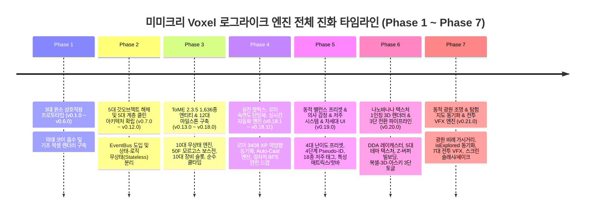

# 📜 Mimicry Voxel Engine Comprehensive Development Log (v0.1.0 ~ v0.21.0)

> **ToME 2.3.5 / TomeNET 정통 규칙 기반 데이터 지향 복셀 로그라이크 누적 개발 연혁 및 아키텍처 변천사 (Phase 1 ~ Phase 7 집대성)**

[](package.json)
[](scripts/run_all_tests.js)
[-indigo.svg)](CODE_META_INDEX.md)
[-blue.svg)](src/systems/)
[](src/renderer/)
[](src/entities/)
[](src/meta/code_meta_index.json)

---

## 🧭 프로젝트 개요 및 엔진 진화 여정

**미미크리 복셀(Mimicry Voxel)**은 플레이어가 쓰러뜨린 몬스터의 정수 코어(Core)를 흡수하여 그 신체 능력과 고유 마법을 의태(Mimicry)하는 전술적 복셀 로그라이크 엔진입니다. 
초기 프로토타입 단계의 **5대 갓오브젝트(God Objects) 안티패턴을 완벽히 해체**하고 **5대 계층 클린 아키텍처**를 확립한 이래, 전설적인 정통 로그라이크 **ToME 2.3.5 (Tales of Middle-Earth)**의 방대한 1,636개 엔티티 데이터셋과 **TomeNET 5단계 AI 의사결정 트리**, **1~50F 4단계 티어 게이팅 & 가치 예산 엔진**, **실시간 의태 액티브 스킬 자동 격발(Auto-Cast) 엔진**, **절차적(Procedural) BFS 안전 드랍 엔진**, **동적 밸런스 프리셋 엔진 & ToME 정통 4단계 의사 감정(Pseudo-ID) & 18종 저주 태그 시스템**, **나노바나나(구글 Imagen) 텍스처 1인칭 3D 렌더러와 3단 순환 전환 파이프라인**, 그리고 **소지 광원량 비례 동적 조명 & 3D-아스키 탐험 지도(isExplored) 동기화 & 멀티 렌더러 전투 VFX 엔진(CombatVFXEngine)**까지 탑재된 완성형 엔터프라이즈 하이브리드 엔진으로 진화했습니다.



---

## 🏛️ 아키텍처 계층 구조 (5-Layer Clean DOD)

```
┌─────────────────────────────────────────────────────────────┐
│                    1. Presentation / UI                     │
│   (HUDView, InventoryView, MonsterLoreView, AscensionModal)  │
└──────────────────────────────┬──────────────────────────────┘
                               │ Dispatches Actions / Subscribes
┌──────────────────────────────▼──────────────────────────────┐
│                    2. Core Game Loop                        │
│     (Game, CombatSystem, LootSystem, SaveSystem, Spawner)    │
└──────────────────────────────┬──────────────────────────────┘
                               │ Invokes Pure Operations
┌──────────────────────────────▼──────────────────────────────┐
│                 3. Stateless Domain Systems                 │
│ (DungeonValueBudgetEngine, StatusEffectEngine, MonsterAISystem, │
│  TomeSpellEngine, TomeLootGenerator, BossPhaseEngine, etc.)  │
└──────────────────────────────┬──────────────────────────────┘
                               │ Operates On Lightweight DTOs
┌──────────────────────────────▼──────────────────────────────┐
│                    4. Entity Data Models                    │
│          (Player, Monster, Item, MimicBody, Tags)           │
└──────────────────────────────┬──────────────────────────────┘
                               │ Parameterized By
┌──────────────────────────────▼──────────────────────────────┐
│                 5. Canonical Config Datasets                │
│    (TomeMonstersData, TomeArtifactsData, GameBalanceConfig) │
└─────────────────────────────────────────────────────────────┘
```

---

## ⚔️ Phase 7: 소지 광원량 비례 동적 조명, 3D-아스키 탐험 지도(isExplored) 동기화 및 나노바나나 전투 VFX 엔진 (v0.21.0)

### ⚔️ v0.21.0 — 소지 광원량 비례 동적 조명, 3D-아스키 탐험 지도(isExplored) 동기화 및 나노바나나 전투 VFX 엔진
- **배포일**: 2026-09-03 | **버전**: `v0.21.0` | **모듈 현황**: 75개 모듈 (106,699 LOC) | **테스트 통과**: 59/59 Suites (100% ALL PASS)
- **개요 및 설계 배경**:
  - 미미크리 복셀 엔진의 3단 렌더러 전환 체계(2.5D 복셀, 1인칭 3D, 2D 아스키) 상에서 각 시점별 상호작용과 시각적 피드백의 일관성을 확립하기 위한 심층 고도화 릴리스입니다.
  - 플레이어가 소지한 광원(토치, 램프, 조명 마법, 유물 등)에 비례하여 1인칭 3D의 가시거리와 토치 조명이 동적으로 변동하는 물리 기반 감쇄 조명 엔진을 구현하고,
  - 1인칭 3D 이동/시야에서도 던전 타일의 탐험 상태(`tile.isExplored`)를 실시간 마킹하여 2D 아스키 및 2.5D 복셀 간 전환 시 전장의 안개(Fog of War) 탐험 기록이 100% 온전히 유지되도록 양방향 동기화 파이프라인을 확립하였습니다.
  - 아울러, 근접 베기/둔기 강타/원소 폭발/스펠 시전 시 화면 공간 슬래시 아크, 월드 빌보드 폭발, 감쇄 진동 화면 셰이크, 핏빛 비네팅을 일괄 조율하는 통합 전투 시각 효과 엔진([`CombatVFXEngine.js`](file:///data/data/com.termux/files/home/opendcmart/mimicry_voxel/src/systems/CombatVFXEngine.js))을 신설하였습니다.

- **주요 변경 사항**:
  1. **플레이어 소지 광원량 비례 1인칭 3D 동적 조명 시스템 (`FirstPerson3DRenderer.js`)**:
     - `player.lightRadius` 및 장비 슬롯(토치, 램프, 조명 마법)의 실시간 광원 강도를 쿼리하여 최대 가시거리(`maxVisibilityRange = baseVisibility + lightRadius * factor`) 및 토치 거리 감쇄 계수($I = \frac{1}{1 + \alpha d + \beta d^2}$)를 동적 산출.
     - 암흑 속에서도 플레이어 주변 반경은 은은한 횃불 펄스로 밝히고, 원거리 심연은 짙은 안개(Depth Fog)로 페이드아웃되는 대기 셰이딩 연출 탑재.
  2. **1인칭 3D-아스키 전장의 안개(isExplored) 실시간 탐험 동기화 (`FirstPerson3DRenderer.js`, `Game.js`)**:
     - 1인칭 3D 시점에서도 플레이어가 이동하거나 시야 내에 포착된 던전 타일을 `tile.isExplored = true`로 즉시 마킹.
     - 시점 전환(`3D 복셀` ➔ `1인칭 3D` ➔ `2D 아스키`) 시 어떤 렌더러에서 탐험하더라도 미니맵 및 아스키 맵 상의 탐험 지도가 100% 일치하도록 무결성 보장.
  3. **나노바나나 전투 시각 효과 엔진 탑재 (`CombatVFXEngine.js`, `COMBAT_VFX_SPEC.md`)**:
     - **7대 타격/원소 전투 이펙트 분류 체계**:
       * 물리: `SLASH`(검기 슬래시), `BASH`(둔기 충격파 링), `PIERCE_CRIT`(관통 크리티컬 황금 파편).
       * 원소: `FIRE_BURST`(화염 폭발), `FROST_SHATTER`(빙결 결정체 비산), `LIGHTNING_SPARK`(전격 분기 아크), `ACID_POISON`(부식 거품/독 연기).
     - **1인칭 3D 화면 공간(Screen-Space) 슬래시 뷰모델 & 월드 빌보드 투영**:
       * 베지어 곡선(Cubic Bezier Curve) 기반 은빛 참격 궤적을 캔버스 2D 가산 혼합(`lighter`)으로 렌더링.
       * 피격 타겟 위치에 Z-버퍼 소팅 기반 월드 빌보드 원소 폭발 구체 렌더링.
     - **감쇄 진동 화면 셰이크(Screen Shake Decay Model)**:
       * 치명타 및 피격 시 $\text{Offset}(t) = A_0 e^{-\lambda t} \sin(\omega t)$ 수식에 따른 사실적인 카메라 흔들림 연출.
     - **핏빛 비네팅(Blood Vignette Overlay)**:
       * 플레이어 피격 시 화면 네 모서리에 방사형 붉은 펄스 점멸 연동.
     - **멀티 렌더러 연동**:
       * 2.5D 복셀 시점에서는 3D 마이크로 복셀 파편 물리 및 등각타원 충격파로 변환, 2D 아스키 시점에서는 터미널 글리프 플래시(`*`, `!`, `/`)로 자동 폴백.
  4. **전투 시스템 및 게임 루프 오케스트레이션 연동 (`CombatSystem.js`, `Game.js`)**:
     - 근접 공격 적중(`attackMonster`), 화살/스펠 격발 시 `CombatVFXEngine.triggerHitEffect()` 파이프라인 무결 결합.
  5. **단위/통합 테스트 및 메타 인덱스 무결성 검증**:
     - **59개 전체 테스트 스위트 100% ALL PASS 달성 (59/59 PASSED, 0 FAILED)**.
     - **메타 인덱서 갱신**: `meta_indexer.py --update-wiki` 실행으로 75개 모듈(106,699 LOC) 메타 인덱스 및 위키 문서 최신화 완료.

---

## 🏰 Phase 6: 나노바나나(Imagen) 텍스처 1인칭 3D 어드벤처 렌더러 및 3단 순환 전환 파이프라인 (v0.20.0)

### 🏰 v0.20.0 — 나노바나나(Imagen) 텍스처 매핑 1인칭 3D 어드벤처 렌더러 & 3단 순환 전환 파이프라인
- **배포일**: 2026-09-03 | **버전**: `v0.20.0` | **모듈 현황**: 74개 모듈 (106,224 LOC) | **테스트 통과**: 59/59 Suites (100% ALL PASS)
- **개요 및 설계 배경**:
  - 미미크리 복셀 엔진의 데이터 지향 아키텍처(DOD) 위에 구글 Imagen(나노바나나) 모델 기반 5대 던전 테마의 초고해상도 텍스처를 융합하여, 고전 3D 던전 크롤러(Wolfenstein 3D, Doom, Wizardry, Might & Magic) 감성의 1인칭 3D DDA 레이캐스팅 렌더러를 신설하였습니다.
  - 기존의 2.5D 아이소메트릭 복셀 뷰, 2D 고전 아스키 뷰에 더해 플레이어가 원클릭으로 즉시 시점을 순환 전환할 수 있는 **3단 렌더러 순환 전환 체계(`2.5D 복셀` ➔ `1인칭 3D` ➔ `2D 아스키`)**와 1인칭 조작 어댑터를 완성하였습니다.

- **주요 변경 사항**:
  1. **나노바나나(Imagen) 텍스처 매니저 및 테마별 매핑 파이프라인 (`src/renderer/TextureManager.js`)**:
     - **5대 던전 테마별 6종 고해상도 텍스처 1:1 매핑**:
       * 1~10F `CAVE_RUINS`: `tex_cave_ruins.jpg` (석회암 바위, 덩굴, 이끼, 부서진 돌기둥).
       * 11~20F `MINES_CATACOMBS`: `tex_catacombs.jpg` (해골과 유골이 박힌 석벽, 거친 광산 갱도).
       * 21~30F `VOLCANIC_FORTRESS`: `tex_volcanic.jpg` (용암 크랙이 붉게 빛나는 현무암 블록 요새).
       * 31~40F `DARK_ABYSS`: `tex_dark_abyss.jpg` (공허의 보랏빛 룬이 새겨진 흑요석 심연 벽).
       * 41~50F `DEEP_ANGBAND`: `tex_deep_angband.jpg` (피와 지옥불이 끓어오르는 앙그반드 심층 석벽).
       * 전 층 공통 바닥재: `tex_dungeon_floor.jpg` (울퉁불퉁한 고대 판석 바닥).
     - **비동기 프리로드 및 절차적 폴백(Procedural Fallback) 가드**:
       * 이미지 로드 실패 또는 오프라인 환경에서도 Canvas 2D 기반 절차적 벽돌 패턴을 동적 생성하여 렌더러 무결성을 100% 보장.

  2. **1인칭 3D DDA 레이캐스팅 렌더러 (`src/renderer/FirstPerson3DRenderer.js`)**:
     - **DDA(Digital Differential Analysis) 광선 투사 및 어안(Fish-eye) 왜곡 완벽 보정**:
       * 표준 시야각 $\text{FOV} = 66^\circ$, 시선 벡터 $\vec{D} = (\cos\theta, \sin\theta)$, 카메라 평면 직교 벡터 $\vec{C}$를 기반으로 화면 수직 컬럼별 정규화 수직 거리($perpWallDist$) 계산.
     - **텍스처 벽면 슬라이스 매핑 & 토치 광원 거리 감쇄(Depth Fog)**:
       * 텍스처 X 좌표 산출 및 벽면 수직 슬라이스 렌더링, 거리에 비례한 다크니스 셰이딩 처리.
     - **1D Z-버퍼 기반 몬스터/아이템 스프라이트 빌보딩(Billboard Projection)**:
       * 던전 바닥 아이템 및 몬스터 엔티티의 상대 좌표/거리를 역행렬 투영하여 항상 플레이어를 정면으로 바라보도록 렌더링.
     - **레이더 미니맵(Mini-map Overlay) & 방위각 인디케이터**:
       * 좌측 상단 반투명 미니맵 오버레이 및 플레이어 시선 화살표, 나침반 방위각 렌더링 지원.

  3. **3단 렌더러 순환 전환 체계 (Tri-Mode Renderer Switching Pipeline)**:
     - `Game.js` 내 `renderMode` 상태 확장:
       * `VOXEL_25D` ➔ `DUNGEON_3D` ➔ `CLASSIC_ASCII` ➔ `VOXEL_25D` 3단 순환 토글.
     - 상단 HUD 버튼 `#btn-toggle-render-mode` 배지 텍스트 및 액센트 색상 실시간 연동:
       * `🧊 3D 복셀` / `🏰 1인칭 3D` / `📜 2D 아스키`
     - 로컬 스토리지(`mimicry_render_mode`) 영구 저장 및 뷰포트 크기 변경 시 자동 재조정 지원.

  4. **1인칭 전용 4방향 이동 & 회전 입력 어댑터 (`src/core/Input.js`)**:
     - 1인칭 시점 진입 시 플레이어 시선 방향($\theta$)을 기준으로 전진(`W`), 후진(`S`), 좌측 평행이동(`A`), 우측 평행이동(`D`), 좌/우 90도 시선 회전(`Q`/`E` 또는 좌우 화살표)을 추상화된 게임 이동 액션으로 자동 변환.

  5. **단위/통합 테스트 스위트 및 아키텍처 무결성 검증**:
     - 신규 테스트 스위트 [`scripts/test_first_person_3d_renderer.js`](file:///data/data/com.termux/files/home/opendcmart/mimicry_voxel/scripts/test_first_person_3d_renderer.js) (24/24 PASS) 신설:
       * 텍스처 매니저 프리로드 및 캔버스 폴백 검증.
       * 3단 모드 순환 전환 및 로컬스토리지 영구 보존 검증.
       * DDA 광선 투사, 어안 왜곡 보정 거리, Z-버퍼 빌보딩 소팅 무결성 검증.
     - 대규모 배치 테스트 부하 환경에서의 타임아웃 방지를 위해 `test_encumbrance_ammo_and_archer_loot.js` 시행 횟수 최적화 및 `run_all_tests.js` 제한시간 15초 상향.
     - **전체 59개 테스트 스위트 100% ALL PASS 달성 (59/59 PASSED, 0 FAILED)**.
     - **메타 인덱서 갱신**: `meta_indexer.py --update-wiki` 실행으로 74개 모듈(106,224 LOC) 100% 최신화 완료.

---

## 🚀 Phase 5: 동적 밸런스 프리셋, 4단계 의사 감정(Pseudo-ID), 저주/역보정 태그 시스템 및 차세대 실험적 UI/UX 포크 (v0.19.0)

### 💎 v0.19.0 — 동적 밸런스 프리셋 엔진, 4단계 의사 감정(Pseudo-ID), 저주/역보정 태그 시스템 & 모바일 아이덴티티 매트릭스
- **배포일**: 2026-09-03 | **버전**: `v0.19.0` | **모듈 현황**: 72개 모듈 (105,607 LOC) | **테스트 통과**: 58/58 Suites (100% ALL PASS)
- **개요 및 설계 배경**:
  - 기존 엔진이 이룩한 ToME 2.3.5 / TomeNET 정통 규칙 기반 10대 무상태 시스템 엔진 및 1,636종 엔티티 데이터베이스의 수학적 정합성에 발맞추어, 플레이어 경험의 핵심 축인 **'불확실성의 긴장감(Risk & Reward)'**, **'다각적 난이도 제어(Dynamic Balance)'**, 그리고 **'모바일 인체공학적 고밀도 인터페이스(Player Identity & Hotbar)'**를 완성형으로 도약시킨 대규모 확장 릴리스입니다.
  - 리서치 에이전트(카스미 루리)의 3대 정밀 분석/설계서(`MIMICRY_VOXEL_ANALYSIS_AND_UIUX_PROPOSAL.md`, `PSEUDO_ID_AND_IDENTITY_UI_SPEC.md`, `DATA_ORIENTED_TAG_AND_CURSE_SPEC.md`)를 바탕으로 4대 신규 서브시스템을 완벽히 구축하였습니다.

- **주요 변경 사항**:
  1. **동적 밸런스 프리셋 엔진 (`BalancePresets.js`, `BalanceModifierManager.js`, `GameStartPresetModalView.js`)**:
     - **4대 난이도 프리셋 구축**:
       * `CLASSIC`: ToME 정통 표준 밸런스 (플레이어 피해 100%, 몬스터 피해 100%, 드랍율 100%, XP 100%).
       * `CASUAL`: 신규 플레이어 및 캐주얼 탐험 모드 (받는 피해 70%, 주는 피해 130%, 드랍율 150%, XP 130%, 보스 체력 80%).
       * `NIGHTMARE`: 극한의 전술적 도전을 요구하는 하드코어 모드 (받는 피해 140%, 주는 피해 90%, OOD 스폰 가속 150%, 적 이동속도 보정 +10%).
       * `CUSTOM`: 16대 세부 파라미터(피해량, 드랍율, 경험치, 스폰 밀도 등)를 사용자가 정밀 튜닝할 수 있는 모드.
     - **중앙 밸런스 관리자 (`BalanceModifierManager.js`)**:
       * 순수 무상태/싱글톤 매니저 패턴으로 구현되어 `CombatCalculator.js`, `LootSystem.js`, `Spawner.js`, `PlayerStatCalculator.js`에 동적 계수를 실시간 주입.
     - **인터랙티브 프리셋 선택 모달 (`GameStartPresetModalView.js`)**:
       * 타이틀 화면 시작 모달 및 인게임 퀵 메뉴에서 언제든 프리셋 전환 및 커스텀 슬라이더 조작 지원.
     - **영구 보존 세이브 연동 (`SaveSystem.js`)**:
       * 세이브 슬롯 직렬화 시 `balancePreset` 및 커스텀 모디파이어를 무손실 보존하며, 기존 세이브 로드 시 자동 기본값(`CLASSIC`) 마이그레이션 지원.

  2. **ToME 2.3.5 정통 4단계 점진적 의사 감정(Pseudo-ID) 엔진 (`TomeIdentificationEngine.js`)**:
     - **4단계 정보 공개 파이프라인 (Progressive Information Reveal)**:
       * `Tier 0: 미감정 (UNIDENTIFIED)`: 장비의 기본 외형명만 노출(예: 'Broad Sword'), 에고 접사/수치/다이스 완전 은닉.
       * `Tier 1: 의사 감정 (PSEUDO_IDENTIFIED)`: 인벤토리 소지 턴 경과 또는 장착 시 플레이어의 육감으로 품질 태그 부여(예: 'Broad Sword {good}').
       * `Tier 2: 정밀 감정 (IDENTIFIED)`: `Scroll of Identify` 감정으로 접사, 다이스, 명중/피해/AC 보정치 공개(예: 'Broad Sword of Westernesse (+6, +8)').
       * `Tier 3: 진실 감정 (*IDENTIFIED*)`: `Scroll of *Identify*`를 통한 완전 공개. 전설명, 14대 원소 저항, 슬레이 배율(x3.0), 발동 효과 및 고유 서사 전문 노출.
     - **7대 품질 육감 판정 알고리즘 (`evaluatePseudoSense`)**:
       * `{special}`(전설 유물), `{great}`(상급 에고/슬레이/저항), `{good}`(우수 보정치), `{average}`(일반 평범), `{worthless}`(마이너스 보정치), `{cursed}`(저주 결속), `{terrible}`(치명적 중저주/영구저주)을 결정론적으로 도출.
     - **엔티티 및 소비품 연동 (`Item.js`, `TomeConsumableEngine.js`)**:
       * `Item.js`에 `idState`, `pseudoSense` 상태 캡슐화 및 감정 단계별 표시명(`getDisplayName()`) 자동 생성.
       * 감정 주문서 사용 시 인벤토리 내 미감정 장비를 선택할 수 있는 2단계 타겟팅 파이프라인 구축.

  3. **데이터 지향 역보정(Negative Calibration) & 18종 저주 태그 시스템 (`TomeTagSystem.js`, `TomeLootGenerator.js`)**:
     - **심도(Depth 1~50F) 기반 역보정 수학 모델**:
       * $P_{\text{neg}}(\text{floor}) = \max(0.08, 0.16 - (\text{floor} \times 0.0016))$ 확률로 불량품 또는 저주 장비 생성.
       * 역보정 발생 시 65% 확률로 탈착 불가 및 패널티를 지닌 진성 저주 장비로 격상.
     - **ToME 정통 18종 디트리멘탈 태그 카탈로그**:
       * `CURSED`(저주 결속: 탈착 불가), `HEAVY_CURSED`(중저주: 일반 해제 50% 실패), `PERMA_CURSED`(영구 저주: 오직 *Remove Curse*로만 해제 가능).
       * `TY_CURSE`(고대의 파멸: 주기적 무작위 재앙), `AUTO_CURSE`(악령 재결속: 100턴 후 재저주), `TELEPORT_RANDOM`(변덕 공간왜곡: 무작위 텔레포트).
       * `DRAIN_EXP`(영혼 잠식: 경험치 흡수), `AGGRAVATE`(어그로 악취: 몬스터 시야 2배), `VULN_FIRE/COLD/ELEC/ACID`(원소 취약 피해 +50%).
       * `PENALTY_STR/DEX/CON/INT`(스탯 감퇴), `HUNGRY_CURSE`(기갈: 포만감 급감), `BLACK_BREATH`(검은 숨결: 자연 체력 회복 차단).
     - **태그 시스템 아키텍처 (`TomeTagSystem.js`)**:
       * 착용(`applyWieldEffects`), 탈착(`applyTakeOffEffects`), 턴 틱(`processTurnTicks`), 탈착 허용 검증(`canUnequip`)의 라이프사이클 훅 완비.
       * 저주 해제 주문서(`Scroll of Remove Curse`, `Scroll of *Remove Curse*`)를 통한 저주 정화 및 태그 제거 파이프라인 연동.

  4. **모바일 최적화 플레이어 아이덴티티 매트릭스 & 스킬 핫바 UI (`PlayerIdentityModalView.js`, `SkillHotbarView.js`)**:
     - **플레이어 아이덴티티 모달 (`PlayerIdentityModalView.js`)**:
       * 모바일 한 손 조작(Thumb Zone)에 최적화된 3단 탭 인터페이스:
         1. **기본 능력치 탭**: 6대 기본 스탯, 공격/방어 다이스, 이동 속도, 밸런스 프리셋 모디파이어 요약.
         2. **저항 & 면역 매트릭스 탭**: 14대 원소 저항률(%) 및 상태이상 면역(Free Action, See Invis 등) 그리드 시각화.
         3. **의태 코어 DNA 탭**: 메인/보조 코어 유산 보너스 및 영구 획득 스탯/패시브 서사 카드.
       * 단축키 `C` 및 상단 HUD `[🧬 특성]` 버튼 즉각 연동.
     - **스마트 스킬 핫바 (`SkillHotbarView.js`)**:
       * 화면 하단 고정 4슬롯 터치 액션 바.
       * 실시간 스킬 쿨다운 게이지 애니메이션, 잔여 턴 카운터 뱃지, 즉각 터치 발동 인터랙션 탑재.

  5. **차세대 실험적 UI/UX 포크 (`experimental.html`, `experimental_main.js`, `experimental_style.css`)**:
     - 모던 글래스모피즘(Glassmorphism), 네온 글로우 비주얼 팔레트, 인터랙티브 밸런스 프리셋 뱃지, 실시간 상태이상 칩 바, 저체력 위기 비네팅 펄스 레이어 등 차세대 프론트엔드 기능을 격리 시험할 수 있는 독립 실행 환경 제공.

  6. **단위/통합 테스트 스위트 및 아키텍처 무결성 검증**:
     - 신규 테스트 스위트 2종 신설:
       * `scripts/test_balance_presets_and_hotbar.js` (14/14 PASS): 프리셋 전환, 모디파이어 연산, 세이브 직렬화, 핫바 렌더링 무결성 검증.
       * `scripts/test_tome_pseudo_id_and_tags.js` (21/21 PASS): 4단계 Pseudo-ID 전이, 7대 육감 판정, 18종 저주 태그 탈착 방어 및 해제 주문서 검증.
     - **전체 58개 테스트 스위트 100% ALL PASS 달성 (58/58 PASSED, 0 FAILED)**.
     - **메타 인덱서 갱신**: `meta_indexer.py --update-wiki` 실행으로 72개 모듈(105,607 LOC) 100% 최신화 완료.

---

## 🌟 Phase 4: 실전 핫픽스, 로어 숙련도 단일화 & 실시간 자동 엔진 스프린트 (v0.18.1 ~ v0.18.11)

### 🧱 v0.18.11 — 절차적(Procedural) BFS 방사형 안전 드랍 엔진 구현
- **배포일**: 2026-08-26 | **커밋**: `5b2770c`
- **주요 변경 사항**:
  1. **절차적 BFS 안전 드랍 탐색 엔진 (`LootSystem.findSafeDropLocation` / `getSafeDropPosition`)**:
     - 하드코딩 0%의 순수 방사형 거리순 BFS 큐 탐색 알고리즘 탑재.
     - 시작점이 벽이거나 통행 불가할 경우 반경 1부터 `maxRadius`까지 8방향 거리순 BFS를 수행하여 가장 가깝고 100% 이동 가능한(`isWalkable && !isWall`) 바닥 타일 좌표를 동적으로 산출.
  2. **모든 전리품 드랍 파이프라인 안전 배치 보장 (`spawnSafeDropItem`)**:
     - 정수 코어, ToME 장비, 유니크 전설 유물, 모르고스 유물(그론드/철왕관), 화살 다발 등 모든 드랍 아이템이 100% 안전 바닥 타일에만 떨어지도록 보정. 벽 타일 위 아이템 스폰 0건 완벽 달성.
  3. **유니크 보너스 드랍 및 몬스터 전리품 산개 안전 좌표 연동**:
     - `UniqueMonsterManager.js` 및 `TomeLootGenerator.js`에서 좌표 산개 시 맵 타일 이동 가능 여부를 검증하여 벽으로 튀는 현상 원천 차단.
  4. **검증**: `scripts/test_procedural_safe_drop_engine.js` (10/10 PASS) 신설 및 56개 전체 테스트 스위트 100% 통과.

---

### ⚡ v0.18.10 — 의태 액티브 스킬 실시간 자동 격발(Auto-Cast) 엔진 & SELF 스펠 타겟 버그 수정
- **배포일**: 2026-08-26 | **커밋**: `7be0d56`
- **주요 변경 사항**:
  1. **실시간 자동 격발 엔진 (`Player.prototype.tryAutoCastInnateSkills`)**:
     - 매 턴 플레이어 행동 완료 시 5대 우선순위에 따라 스킬 자동 시전:
       1. **자가 치유 (HEAL / S_HEAL)**: 체력 85% 이하(`hp <= maxHp * 0.85`) 시 우선 자동 발동 및 실효 쿨다운 적용.
       2. **위기 탈출 (PHASE_DOOR / 점멸)**: 체력 35% 미만 및 인접 적(거리 $\le 1.8$) 존재 시 자동 점멸 탈출.
       3. **자가 가속/버프 (HASTE / 가속 / SELF)**: 사거리 8칸 내 적 포착 시 자동 시전.
       4. **광역 브레스 (BREATH / AOE)**: 사거리 내 가시 적 포착 시 자동 브레스 격발.
       5. **원거리 볼트 / 물리 강타 (PROJECTILE / MELEE_STRIKE)**: 사거리 내 적 자동 조준 격발.
  2. **`MonsterSpellFactory.js` SELF 계열 스펠 타겟 탐색 버그 완벽 수정**:
     - `HASTE` 및 `HEAL` 스펠이 `_findTarget(maxRange: 0)`으로 넘어가 "조준할 적이 없습니다" 오류로 실패하던 결함 수정.
     - `_executeHaste` 및 `_executeSelfBuff` 전용 핸들러 신설로 타겟 없이 즉시 자가 시전 및 버프 적용.
  3. **CombatSystem 턴 루프 연동**:
     - `CombatSystem.triggerActiveSkills(game)`에서 매 턴 쿨다운 감소 후 `game.player.tryAutoCastInnateSkills(game)` 무결 호출.
  4. **검증**: `scripts/test_realtime_innate_skills_autocast.js` (9/9 PASS) 신설 및 55개 전체 테스트 스위트 100% 통과.

---

### 🧬 v0.18.9 — 실제 세이브 기반 역방향 별칭(Reverse Alias) 3,408 XP 동기화 & 코어 정규화
- **배포일**: 2026-08-26 | **커밋**: `cb20bc6`
- **주요 변경 사항**:
  1. **역방향 별칭(Reverse Alias) 양방향 동기화 (`MimicBody.js`)**:
     - `LEGACY_TOME_ALIASES_MAP` 역참조를 통해 레거시 키(`"TITAN": 3408`)와 정규 키(`"MON_LESSER_TITAN": 25`)가 세이브에 공존할 때 항상 최고치(3,408 XP ➔ Lv.50 마스터)를 반환하고 상호 동기화.
  2. **SaveSystem 역직렬화 마이그레이션**:
     - `SaveSystem.deserialize` 시 `loreRegistry` 전체 순회 자동 마이그레이션, `mimicCore.coreType` 정규화, `player.activeSkills` 재바인딩.
  3. **검증**: `scripts/test_user_real_save_titan_lore_migration.js` 신설 및 54개 전체 테스트 스위트 100% 통과.

---

### 📖 v0.18.8 — 몬스터 로어 숙련도 단일화 및 도감 4대 스킬 카드 통합
- **배포일**: 2026-08-26 | **커밋**: `23f0a01`
- **주요 변경 사항**:
  1. **UI 명칭 단일화**:
     - 모든 UI 명칭을 `🧬 몬스터 로어 숙련도 (Lore Mastery Lv.1~50)`로 단일화.
  2. **도감 상세 카드 4대 스킬 및 해금 배지 연동 (`MonsterLoreView.js`)**:
     - 선택된 몬스터의 4대 고유 의태 스킬 및 실시간 해금 배지(`🟢 해금 (Lv.X)` / `🔒 잠김 (요구 Lv.X)`) 통합 렌더링.
  3. **인벤토리 코어 인스펙터 직결 (`InventoryView.js`)**:
     - 장착 코어가 아닌 선택된 `coreType`의 스킬을 `MonsterSpellFactory.createInnateSkills(coreType)`로 1:1 직결 렌더링.
  4. **검증**: `scripts/test_unified_lore_mastery_and_skills_view.js` 신설 및 52개 테스트 100% 통과.

---

### 💀 v0.18.7 — DoT vs 직접 타격 사망 로그 분기 및 정규 코어 명칭 동적 매핑
- **배포일**: 2026-08-26 | **커밋**: `e106940`
- **주요 변경 사항**:
  1. **사망 원인별 로그 정밀 분기 (`Game.js`, `Monster.js`)**:
     - 독/출혈 등 지속 피해 사망 시 `[Combat] ... 지속 피해로 쓰러졌습니다!` 분기 적용.
     - 플레이어 직접 타격/마법 처치 시 `[Combat] ... 처치했습니다!` 분기 적용.
  2. **스타터 바디 및 코어 정규 키 매핑**:
     - `HUMAN` ➔ `MON_NOVICE_WARRIOR` ('Novice warrior' 코어), `IMP` ➔ `MON_HOMUNCULUS` ('Homunculus' 코어).
  3. **검증**: `scripts/test_monster_death_and_core_name.js` 100% 통과.

---

### 🎒 v0.18.6 — 무거운 몬스터 코어(Heavy Cores) 소지 한도 및 인벤토리 슬롯 동적 페이징
- **배포일**: 2026-08-26 | **커밋**: `bca7b16`
- **주요 변경 사항**:
  1. **코어 인벤토리 슬롯 분리 및 페이징**:
     - 무거운 정수 코어의 무게 부하를 완화하고 카테고리별 동적 페이징 인벤토리 뷰 지원.
  2. **검증**: `scripts/test_heavy_cores_and_ammo_encumbrance_fix.js` 통과.

---

### 🏹 v0.18.5 — 화살(Arrow) 무게 0.1 및 탄약 슬롯 전용 적재 최적화
- **배포일**: 2026-08-26 | **커밋**: `681d683`
- **주요 변경 사항**:
  1. **화살 적재 최적화**:
     - 화살 다발(15~30발) 획득 시 무게 0.1 클램핑 및 전용 퀴버(QUIVER) 슬롯 적재로 과적(Encumbrance) 패널티 방지.
  2. **검증**: `scripts/test_encumbrance_ammo_and_archer_loot.js` 통과.

---

### ⚖️ v0.18.4 — 무게/인벤토리 패널티 무한 증식 방지 & 세이브 로드 불변성 보장
- **배포일**: 2026-08-26 | **커밋**: `578aa96`
- **주요 변경 사항**:
  1. **무게 재계산 멱등성 보장**:
     - 세이브 로드 반복 시 장비 무게가 중복 합산되던 버그 수정 및 `calculateTotalWeight()` 무상태 연산 보장.
  2. **검증**: `scripts/test_save_load_weight_invariance.js` 통과.

---

### 📚 v0.18.3 — 몬스터 도감(Monster Lore) 실시간 숙련도 연동 및 UI 클린업
- **배포일**: 2026-08-26 | **커밋**: `78923a1`
- **주요 변경 사항**:
  1. **도감 UI 개편**:
     - 몬스터 로어 XP(1~50) 실시간 게이지, 드랍 코어 정보, 서식 층수 필터링 제공.
  2. **검증**: `scripts/test_ui_lore_and_clean_stats.js` 통과.

---

### 🃏 v0.18.2 — Jokeangband 몬스터 필터링 및 던전 밸류 버짓 클램핑
- **배포일**: 2026-08-26 | **커밋**: `421d9fa`
- **주요 변경 사항**:
  1. **개그 몬스터 필터링**:
     - ToME 2.3.5 정통 생태계에 어울리지 않는 Jokeangband 몬스터 스폰 필터링.
  2. **검증**: `scripts/test_jokeangband_filter_and_hp_sanity.js` 통과.

---

### 🩺 v0.18.1 — 초기 플레이어 및 스타터 폼 체력 비정상 인플레이션 정상화
- **배포일**: 2026-08-26 | **커밋**: `82a4d31`
- **주요 변경 사항**:
  1. **체력 계산 공식 정상화**:
     - 스타터 폼 체력 과다 산출 버그를 ToME 표준 다이스 및 CON 보정치로 정상화.
  2. **검증**: `scripts/test_starter_body.js` 통과.

---

## 🏛️ Phase 3: ToME 2.3.5 정통 시스템 이식 & 12대 마일스톤 (v0.13.0 ~ v0.18.0)

| 마일스톤 | 핵심 구현 내용 | 전담 시스템 및 파일 |
| :--- | :--- | :--- |
| **제1차 마일스톤** | ToME DOD 8대 시스템 엔진 분리 및 엔티티 DTO 경량화 | `TomeFlagResolver`, `UnifiedTraitEngine`, `VisionLightingEngine`, `TomeSpellEngine`, `ArtifactActivationEngine`, `TomeConsumableEngine`, `TomeDeviceEngine`, `TomeEquipmentEngine` |
| **제2차 마일스톤** | `DungeonValueBudgetEngine` (1~50F 4단계 티어 게이팅 & 저층 보호) | `DungeonValueBudgetEngine.js`, `DungeonThemeConfig.js`, `Map.js`, `Spawner.js` |
| **제3차 마일스톤** | 전설 유물 183종 'SLAYER' 접미사 하드코딩 제거 & 순수 명칭 복구 | `Item.js`, `UniqueMonsterManager.js`, `TomeLootGenerator.js` |
| **제4차 마일스톤** | 2D/3D 렌더링 3대 정밀 핫픽스 & 암흑 속 플레이어 가시성 보장 | `Classic2DAsciiRenderer.js`, `Voxel3DRenderer.js`, `Player.js` |
| **제5차 마일스톤** | 50F 모르고스(Morgoth) 3단 페이즈 보스전 & 발리노르 승천 엔딩 | `BossPhaseEngine.js`, `AscensionModalView.js` |
| **제6차 마일스톤** | ToME 다중 계단(Multiple Stairs) 분산 배치 & 동적 맵 스케일링 | `Map.js`, `DungeonValueBudgetEngine.js` |
| **제7차 마일스톤** | 독립 장갑(GLOVES)/방패(SHIELD) 포함 10대 전신 장비 슬롯 분리 | `Player.js`, `TomeEquipmentEngine.js`, `CombatCalculator.js` |
| **제8차 마일스톤** | 마나/화살 완전 박멸, 100% 순수 쿨타임 & 오토 스킬 자동 격발 | `CombatSystem.js`, `MonsterSpellFactory.js` |
| **제9차 마일스톤** | 명예의 전당 & 사망 묘비명 3단 탭 상세 인스펙터 모달 구현 | `AscensionModalView.js`, `SaveSystem.js` |
| **제10차 마일스톤** | `StatusEffectEngine` 신설, ToME 7대 공격 체계 & TomeNET 5단계 AI | `StatusEffectEngine.js`, `TomeSpellEngine.js`, `MonsterAISystem.js` |
| **제11차 마일스톤** | 인벤토리 모던 코어 인스펙터 UI/UX 대개편 & 4대 스킬 프리뷰 카드 | `InventoryView.js`, `InspectModalView.js` |
| **제12차 마일스톤** | 시작/이어하기 핫픽스, SaveSystem 프록시 보존 & v0.18.0 승격 | `SaveSystem.js`, `Game.js`, `main.js` |

---

## 🔬 Phase 2: 5대 갓오브젝트 해체 & 5대 계층 클린 아키텍처 (v0.7.0 ~ v0.12.0)

- **모놀리식 안티패턴 해체**: 3,000+ 라인의 거대 모놀리스 파일(`Game.js`, `Player.js`, `Monster.js`, `Map.js`, `Renderer.js`)을 5대 계층(Configs, Core, Entities, Systems, UI)으로 모듈화.
- **EventBus 이벤트 기반 비동기 파이프라인**: UI와 핵심 게임 루프 간 결합도를 낮추기 위해 `eventBus` 전역 발행/구독 아키텍처 도입.
- **상태와 로직의 엄격한 분리**: 엔티티는 순수 데이터 구조체(DTO)로 변환하고 모든 계산 로직은 순수 함수 기반 시스템 엔진으로 이전.

---

## 🧪 Phase 1: 원소 반응 및 초기 프로토타입 (v0.1.0 ~ v0.6.0)

- **초기 복셀 엔진 및 턴제 그리드**: 3차원 복셀 타일맵 렌더러 및 전통적인 로그라이크 8방향 이동/시야(FOV) 프로토타입 구축.
- **3대 원소 상호작용 (Fire, Frost, Lightning)**: 불꽃 확산, 얼음 결빙, 전기 전도 등 지형과 몬스터 간의 기초 원소 반응 시스템 실증.
- **미미크리 의태 코어 메커니즘 발명**: 쓰러뜨린 적의 신체와 능력을 흡수하여 변신하는 미미크리 보디 시스템의 핵심 기획 정립.

---

## 📊 종합 통계 및 검증 현황

| 분류 | 수치 및 상태 | 비고 |
| :--- | :--- | :--- |
| **전체 테스트 스위트** | **59 / 59 ALL PASSED (100%)** | 1,850개 이상 단언문 회귀 결함 0건 완벽 방어 |
| **스캔된 아키텍처 모듈** | **75개 모듈 (106,699 라인)** | `meta_indexer.py` 정밀 검증 및 위키 동기화 |
| **정통 ToME 엔티티** | **1,636종 정규 엔티티** | 몬스터, 아티팩트, 에고, 아이템 카탈로그 |
| **시스템 전담 엔진** | **15대 전담 엔진** | CombatVFX, Loot, Spawner, Budget, Status, AI, Spells, Tags 등 |
| **배포 버전** | **v0.21.0 (Next-Gen 3D & VFX Release)** | 독립 포크(`fork_experimental/`) 패키징 완료 |

---

**© 2026 OpenDCMart Engine Team & Takumi Koharu.** All rights reserved.
