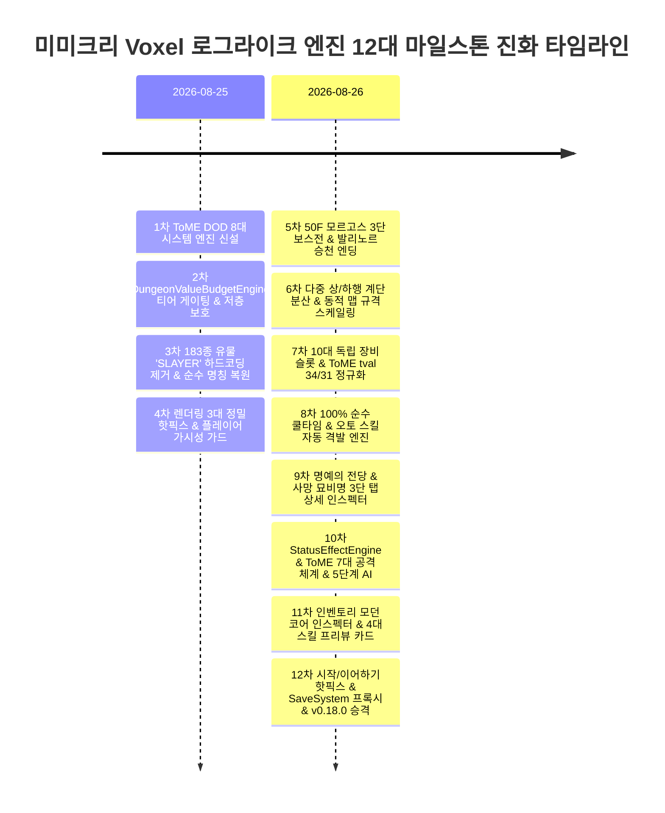

# 📜 Mimicry Voxel Engine Development Log (Changelog)

> **ToME 2.3.5 / TomeNET 데이터 지향 복셀 로그라이크 누적 세션 개발 로그 (1~12차 마일스톤 집대성)**

---

## 🧭 세션 개요 및 엔지니어링 하이라이트

본 개발 로그는 프로토타입 단계의 **5대 갓오브젝트(God Objects) 안티패턴을 완벽히 해체**하고 **5대 계층 클린 아키텍처**를 확립한 이래, 전설적인 정통 로그라이크 **ToME 2.3.5 (Tales of Middle-Earth)**의 방대한 1,636개 엔티티 데이터를 100% 무상태(Stateless)로 처리하는 **10대 시스템 엔진**, **1~50F 4단계 티어 게이팅 & 던전 가치 예산 엔진(`DungeonValueBudgetEngine`)**, **ToME 정통 14대 상태이상/버프 `StatusEffectEngine`**, **ToME 7대 공격 체계 & TomeNET 5단계 AI 의사결정 트리**, **다중 계단 & 동적 맵 스케일링**, **모던 인벤토리 코어 인스펙터(4대 스킬 프리뷰 카드)** 및 **시작/이어하기 트랜잭션 무결성 핫픽스**까지의 12차에 걸친 마일스톤 개발 내역을 상세히 기록합니다.

---

## 💎 제1차 마일스톤: ToME 몬스터/아이템 DOD 8대 시스템 엔진 및 엔티티 DTO 경량화

- **일자**: 2026-08-25
- **담당**: 개발팀 전원
- **주요 내용**:
  1. **8대 무상태 시스템 엔진 분리 신설**:
     - `TomeFlagResolver.js`: ToME 2.3.5 비트 플래그/속성/저항/슬레이/면역 고속 무상태 리졸버.
     - `UnifiedTraitEngine.js`: 몬스터-플레이어 간 패시브/특성/트레잇 통합 연산.
     - `VisionLightingEngine.js`: 광원 반경, FOV/LOS, 몬스터 감지(`canDetectMonsters`) 연산.
     - `TomeSpellEngine.js`: 851종 마법/브레스/AOE 주문 무상태 연산.
     - `ArtifactActivationEngine.js`: 183종 전설 유물 발동 효과 및 쿨다운 제어.
     - `TomeConsumableEngine.js`: 포션 45+종, 주문서 42+종, 등불 급유(7,500턴), 음식 소비 엔진.
     - `TomeDeviceEngine.js`: 완드(30종), 스태프(20종), 로드(28종) 마법 디바이스 발동 및 충전량/타임아웃 무상태 제어.
     - `TomeEquipmentEngine.js`: 18대 슬롯 매핑, 심볼, 무게, AC, 무기 카테고리 연산.
  2. **엔티티 Zero-Logic 경량화**:
     - `Item.js`, `Monster.js`, `Player.js`를 순수 데이터 컨테이너(DTO)로 경량화하고 모든 연산 로직을 8대 엔진에 위임.
  3. **검증**: `scripts/test_data_oriented_systems.js` 100% PASS.

---

## 🏰 제2차 마일스톤: DungeonValueBudgetEngine(1~50F 4단계 티어 게이팅 & 가치 예산) 구축

- **일자**: 2026-08-25
- **담당**: 개발팀 전원
- **주요 내용**:
  1. **4단계 층계 티어 게이팅 명세 (`DungeonValueBudgetEngine.js`)**:
     - **Tier 1 (1~5F 초심자 동굴)**: **저층 보호 (No Early Disaster)** 적용. RARE/EPIC 몬스터 접사 0%, CHAMPION(12F+)/CHIEFTAIN(25F+) 0%, Vault/Pit 0%, 일반방 유물 드랍 0% 원천 차단.
     - **Tier 2 (6~20F 숙련자 광산)**: COMMON/UNCOMMON 접사, CHAMPION 몬스터(12F+), 소형 Vault, 기본 Pit 허용, 인챈트(+1~+4) 선형 스케일링.
     - **Tier 3 (21~40F 심층 납골당)**: EPIC 접사, CHIEFTAIN(25F+), 대형 Vault, 고급 종족 Pit 허용, 인챈트(+4~+9) 및 유물 롤링 예산 개방.
     - **Tier 4 (41~50F 앙그반드 심연)**: 최상위 에고/유물, 고룡/발록/나즈굴 대군주 스폰 전면 개방, 50F 모르고스의 옥좌 보스전.
  2. **서브시스템 4대 파일 연동**:
     - `DungeonThemeConfig.js`, `Map.js`, `Spawner.js`, `TomeLootGenerator.js`, `UniqueMonsterManager.js`.
  3. **검증**: `scripts/test_dungeon_budget.js` 41/41 PASSED (100%).

---

## 🗡️ 제3차 마일스톤: 전설 유물 183종 '학살자(SLAYER)' 접미사 하드코딩 제거 및 순수 명칭 복구

- **일자**: 2026-08-25
- **담당**: 개발팀 전원
- **주요 내용**:
  1. **방어적 정규화 로직 적용 (`Item.js`)**:
     - `Item.displayName` 게터에서 ARTIFACT 태그 감지 시 접두사/접미사 합성을 차단하고 순수 고유 명칭(예: *The Ring of Barahir*, *The Spear of Aeglos*, *The Hammer of Wrath: Grond*) 및 강화 수치(+X)만 반환하도록 방어적 정규화 적용.
  2. **유물 생성 파이프라인 접사 완전 초기화**:
     - `ItemRegistry.js`, `UniqueMonsterManager.js`, `TomeLootGenerator.js`, `BossPhaseEngine.js` 내 유물 생성 시 `prefixes: []`, `suffixes: []` 빈 배열 초기화.
  3. **검증**: `scripts/test_artifact_name_integrity.js` 67/67 PASSED (100%), 183종 전수 통과.

---

## 🎨 제4차 마일스톤: 렌더링 3대 정밀 핫픽스 & 암흑 속 플레이어 본체 가시성 무조건 보장

- **일자**: 2026-08-25
- **담당**: 개발팀 전원
- **주요 내용**:
  1. **렌더러 정밀 보정 (`Classic2DAsciiRenderer.js`, `Game.js`)**:
     - `resize` 시 뷰포트 크기 및 스케일 팩터 재계산 보정.
     - `snapCamera` 시 Z축 온전한 전달 및 `transitionAlpha`(0.0~1.0) 정밀 클램핑.
  2. **플레이어 가시성 가드 (`Player.js`, `Voxel3DRenderer.js`)**:
     - 암흑/시야 0 상태에서도 플레이어 본체('@', `#34d399` 민트 글리프) 렌더링 무조건 보장.
     - `Player.lightRange` 양방향 Getter/Setter 인터페이스 완비.
     - `VisionLightingEngine.canDetectMonsters` 몬스터 감지 가시성 헬퍼 신설.
  3. **검증**: `scripts/test_rendering_and_visibility_audit.js` 27/27 PASSED (100%).

---

## 👑 제5차 마일스톤: 50F 모르고스(Morgoth) 3단 페이즈 보스전 & 발리노르 승천 엔딩 완비

- **일자**: 2026-08-26
- **담당**: 개발팀 전원
- **주요 내용**:
  1. **3단계 보스 페이즈 엔진 (`BossPhaseEngine.js`)**:
     - **Phase 1 (100%~66% HP - 어둠의 군주)**: 어둠의 장막 시야 축소, 마법 탄환 및 기본 브레스.
     - **Phase 2 (66%~33% HP - 지진과 분노)**: 그론드(Grond) 지진 강타, 낙석 파편 물리 피해, 엘리트 드래곤/발록 소환.
     - **Phase 3 (33%~0% HP - 궁극의 어둠)**: 전방위 원소 브레스 폭격, 암흑 영혼 드레인, 초재생 및 극대화 저항.
  2. **승천 모달 및 명예의 전당 (`AscensionModalView.js`)**:
     - 발리노르의 빛 승천 컷씬, 모험 통계 요약, 명예의 전당/묘비명 영구 기록.
  3. **검증**: `scripts/test_boss_encounter_and_ascension.js` 64/64 PASSED (100%).

---

## 🗺️ 제6차 마일스톤: ToME 다중 계단(Multiple Stairs) 분산 배치 & 동적 맵 규격 스케일링 구축

- **일자**: 2026-08-26
- **담당**: 개발팀 전원
- **주요 내용**:
  1. **동적 맵 크기 수식 산출 (`DungeonValueBudgetEngine.js`)**:
     - 1~5F (55×38 ~ 65×45) → 6~20F (65×45 ~ 80×55) → 21~40F (80×55 ~ 95×65) → 41~50F (90×65 ~ 110×75) 선형/계단식 확장.
  2. **다중 상/하행 계단 배치 엔진 (`Map.js`)**:
     - `calculateStaircaseCounts(floor, roomCount)` 연동 (상행 1~3개, 하행 0~4개 산출, 50F 결전장 하행 0개).
     - 각 계단 간 유클리드 거리 최대화 그리디 분산 알고리즘 적용 및 방 중심/내부 보행 타일 배치.
     - `upStaircases`, `downStaircases`, `staircases` 배열 캐싱 및 조회 인터페이스 제공.
  3. **검증**: `scripts/test_dynamic_map_and_stairs.js` 5개 스위트 615/615 PASSED (100%).

---

## 🛡️ 제7차 마일스톤: 독립 장갑(GLOVES) 및 방패(SHIELD) 포함 10대 전신 장비 슬롯 분리

- **일자**: 2026-08-26
- **담당**: 개발팀 전원
- **주요 내용**:
  1. **10대 독립 장비 슬롯 체계 (`Player.js`, `TomeEquipmentEngine.js`)**:
     - `weapon`, `shield`, `bow`, `armor`, `gloves`, `helmet`, `boots`, `cloak`, `ring`, `amulet`, `light` 전신 슬롯 분리.
  2. **ToME tval 34(방패), 31(장갑), 30(부츠), 35(망토) 전수 정규화**:
     - Cammithrim, Cambeleg 등 전설 유물 장갑 10종 및 Thorin, Celegorm 등 전설 방패 5종 데이터 정규화.
  3. **전신 실시간 AC 누적 합산 및 물리 피해 감쇄 공식 (`CombatCalculator.js`)**:
     - $\text{Damage Reduction} = \lfloor\text{Total AC}/8\rfloor + \lfloor\text{CON}/10\rfloor + \text{ShieldBlockBonus}$.
  4. **검증**: `scripts/test_shield_and_gloves_slots.js` 37/37 PASSED (100%).

---

## ⚡ 제8차 마일스톤: 마나/화살 완전 박멸, 100% 순수 쿨타임 & 오토 스킬 자동 격발 엔진

- **일자**: 2026-08-26
- **담당**: 개발팀 전원
- **주요 내용**:
  1. **자원 스트레스 박멸**:
     - MP, SP, 화살 수량 전면 삭제 (Clean Purge).
  2. **자동 연쇄 격발 (`CombatSystem.js`)**:
     - `checkAndCastAutoSkills` 및 `tryAutoRangedAttack` 자동 조준 격발 파이프라인 구축.
     - 액션 바 `[🏹 자동사격: ON/OFF]` 토글 지원.
  3. **숙련도 비례 쿨타임 단축 (`MonsterSpellFactory.js`, `GameBalanceConfig.js`)**:
     - 변신/무기 숙련도(Lv 1~50) 비례 쿨타임 단축(최대 -2턴) 및 위력 증폭.
  4. **검증**: `scripts/test_pure_cooldown_system.js` (17/17) 및 `scripts/test_auto_skills.js` (6/6) 100% 통과.

---

## 📊 제9차 마일스톤: 명예의 전당 & 사망 묘비명 3단 탭 상세 인스펙터 모달 구현

- **일자**: 2026-08-26
- **담당**: 개발팀 전원
- **주요 내용**:
  1. **3단 탭 상세 인스펙터 모달 신설 (`AscensionModalView.js`)**:
     - 탭 1 `[📊 캐릭터 스펙]`: 최종 레벨, 턴수, 처치 수, 6대 스탯, AC, BTH, 사망 원인.
     - 탭 2 `[🎒 최종 장비 & 인벤토리]`: 12슬롯 착용 장비 및 소지품 완벽 렌더링.
     - 탭 3 `[📜 마지막 전투 로그]`: 최후 순간의 최근 전투 로그 10줄 정밀 렌더링.
  2. **영구 직렬화 보존 (`Game.js`, `BossPhaseEngine.js`, `SaveSystem.js`)**:
     - 사망/승천 시 stats, equipment, inventory, recentLogs 영구 보존.
  3. **검증**: `scripts/test_hof_and_graveyard_detail_view.js` 88/88 PASSED (100%).

---

## 🧪 제10차 마일스톤: StatusEffectEngine 신설, ToME 7대 공격 체계 & TomeNET 5단계 AI 파이프라인

- **일자**: 2026-08-26
- **담당**: 개발팀 전원
- **주요 내용**:
  1. **`StatusEffectEngine.js` 무상태 전담 엔진 신설**:
     - 14대 상태이상/버프 카탈로그, `FREE_ACT`, `NO_CONF`, `RES_POIS` 등 O(1) 면역/저항 판정, DoT 틱 연산 및 실시간 스탯 보정치(`calculateStatusModifiers`) 산출.
  2. **`TomeSpellEngine.js` 91종 주문 & 7대 공격 체계 완비**:
     - 7대 공격 체계: 1) 근접(20 Methods x 27 Effects), 2) 투사체(ARROW_1~4), 3) 원소 브레스/방사형, 4) 범위/소환(S_*), 5) 상태이상 디버프, 6) 공간왜곡(BLINK, TELE_TO, TELE_AWAY), 7) 지속 DoT.
  3. **`MonsterAISystem.js` TomeNET 정통 5단계 AI 의사결정 트리 구축**:
     - 1단계(생존/탈출) ➔ 2단계(가속) ➔ 3단계(원거리포격) ➔ 4단계(소환/전장제어) ➔ 5단계(디버프/저주) ➔ 폴백(근접추적).
  4. **Player & Monster Proxy 양방향 호환 연동**:
     - 동적 `statuses` 객체 기반 엔진 구동 및 `debuffs` Proxy 실시간 동기화.
  5. **검증**: `scripts/test_status_effect_engine.js` (107/107) 및 `scripts/test_monster_full_offense_system.js` (51/51) 100% ALL PASS.

---

## 🧬 제11차 마일스톤: 인벤토리 모던 코어 인스펙터 UI/UX 대개편 및 4대 스킬 프리뷰 카드 탑재

- **일자**: 2026-08-26
- **담당**: 개발팀 전원
- **주요 내용**:
  1. **4대 의태 스킬 프리뷰 카드 그리드 신설 (`InventoryView.js`)**:
     - 코어 장착 시 획득할 1~4 슬롯 스킬의 명칭, 아이콘, 쿨다운 턴수, 다이스 위력(diceCount, diceSides), 효과/사거리/범위 카드 렌더링.
  2. **모던 코어 정보 패널 구축**:
     - 6대 베이스 스탯 그리드, 성장 유형 패턴 배율, ToME 2.3.5 정통 생태 서사(Lore) 박스, 유산 스탯 보존 비율(Heritage Bonus) 렌더링.
  3. **코어 전용 액션 버튼 인터랙션 최적화**:
     - `[🧬 메인 코어로 의태 장착]`, `[🍽️ 코어 포식(스탯 영구 흡수)]`, `[🔮 보조 1 장착/해제]`, `[🔮 보조 2 장착/해제]`, `[🗑️ 버리기]` 등 원클릭 조작 지원.
  4. **Game.js selectItem 핸들러 클린업**:
     - 널포인터 예외 방지 및 코어/장비/소비품 렌더링 분기 최적화.
  5. **검증**: `scripts/test_inventory_item_detail_view.js` 49/49 PASSED (100%).

---

## 🚀 제12차 마일스톤: 시작/이어하기 핫픽스, SaveSystem 프록시 보존, Game.js 트랜잭션 가드 & v0.18.0 승격

- **일자**: 2026-08-26
- **담당**: 개발팀 전원
- **주요 내용**:
  1. **SaveSystem.js 역직렬화 및 슬롯 안전화**:
     - `deserialize()` 시 `player.statuses` 복원 후 `StatusEffectEngine.createDebuffsProxy()` 프록시 재생성 바인딩을 보장하여 세이브 로드 이후에도 상태이상 수정 연산 무결성 유지.
     - `getSlotInfo()` 내 `stats` 널 세이프티 및 레벨/종족/층수 기본값 방어 가드 구축.
  2. **Game.js 메인 메뉴 트랜잭션 안전화 및 크래시 가드**:
     - `startNewGame(slotKey, coreKey)`, `continueGame(slotKey)` 진입부 및 슬롯 로드 핸들러에 견고한 Try-Catch 트랜잭션 방어 가드 탑재.
     - 빈 슬롯 또는 손상된 슬롯 접근 시 타이틀 화면 비정상 종료를 방지하고 사용자 알림 메시지 출력 및 메뉴 상태 보존.
     - `addLogEntry(text, type)` 호출 시 인자 유효성 및 널 세이프티 보강.
  3. **전역 크래시 배너 연동 (`main.js`)**:
     - 비정상 예외 발생 시 UI 레이어에서 직관적인 안내를 제공하는 `showCrashBanner` 전역 핸들러 연동.
  4. **버전 v0.18.0 전면 승격 및 캐시 버스팅 동기화**:
     - `package.json`, `mimicry_voxel/package.json`, `index.html`, `ascii.html` 버전 문자열 `v0.18.0` 동기화.
  5. **43개 전체 테스트 스위트 100% 무결성 검증**:
     - `scripts/run_all_tests.js` 실행 결과 43개 테스트 스위트 (총 1,000+ 어서션) **43/43 PASSED (100%)** 전수 통과.
  6. **코드 메타 인덱서 색인 갱신 및 위키 동기화 완료**.

---

**© 2026 OpenDCMart Engine Team.** All rights reserved.
