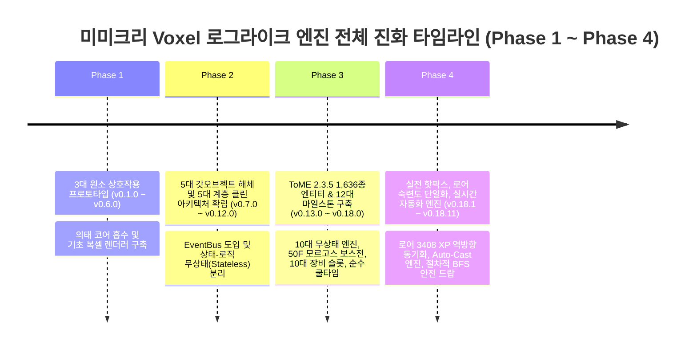

# 📜 Mimicry Voxel Engine Comprehensive Development Log (v0.1.0 ~ v0.18.11)

> **ToME 2.3.5 / TomeNET 정통 규칙 기반 데이터 지향 복셀 로그라이크 누적 개발 연혁 및 아키텍처 변천사 (Phase 1 ~ Phase 4 집대성)**

[](package.json)
[](scripts/run_all_tests.js)
[](src/systems/)
[](src/entities/)
[](src/meta/code_meta_index.json)

---

## 🧭 프로젝트 개요 및 엔진 진화 여정

**미미크리 복셀(Mimicry Voxel)**은 플레이어가 쓰러뜨린 몬스터의 정수 코어(Core)를 흡수하여 그 신체 능력과 고유 마법을 의태(Mimicry)하는 전술적 복셀 로그라이크 엔진입니다. 
초기 프로토타입 단계의 **5대 갓오브젝트(God Objects) 안티패턴을 완벽히 해체**하고 **5대 계층 클린 아키텍처**를 확립한 이래, 전설적인 정통 로그라이크 **ToME 2.3.5 (Tales of Middle-Earth)**의 방대한 1,636개 엔티티 데이터셋과 **TomeNET 5단계 AI 의사결정 트리**, **1~50F 4단계 티어 게이팅 & 가치 예산 엔진**, **실시간 의태 액티브 스킬 자동 격발(Auto-Cast) 엔진**, **절차적(Procedural) BFS 안전 드랍 엔진**까지 탑재된 완성형 엔진으로 진화했습니다.



---

## 🏛️ 아키텍처 계층 구조 (5-Layer Clean DOD)

```
┌─────────────────────────────────────────────────────────────┐
│                    1. Presentation / UI                     │
│   (HUDView, InventoryView, MonsterLoreView, AscensionModal)  │
└──────────────────────────────┬──────────────────────────────┘
                               │ Dispatches Actions / Subscribes
┌──────────────────────────────▼──────────────────────────────┐
│                    2. Core Game Loop                        │
│     (Game, CombatSystem, LootSystem, SaveSystem, Spawner)    │
└──────────────────────────────┬──────────────────────────────┘
                               │ Invokes Pure Operations
┌──────────────────────────────▼──────────────────────────────┐
│                 3. Stateless Domain Systems                 │
│ (DungeonValueBudgetEngine, StatusEffectEngine, MonsterAISystem, │
│  TomeSpellEngine, TomeLootGenerator, BossPhaseEngine, etc.)  │
└──────────────────────────────┬──────────────────────────────┘
                               │ Operates On Lightweight DTOs
┌──────────────────────────────▼──────────────────────────────┐
│                    4. Entity Data Models                    │
│          (Player, Monster, Item, MimicBody, Tags)           │
└──────────────────────────────┬──────────────────────────────┘
                               │ Parameterized By
┌──────────────────────────────▼──────────────────────────────┐
│                 5. Canonical Config Datasets                │
│    (TomeMonstersData, TomeArtifactsData, GameBalanceConfig) │
└─────────────────────────────────────────────────────────────┘
```

---

## 🌟 Phase 4: 실전 핫픽스, 로어 숙련도 단일화 & 실시간 자동 엔진 스프린트 (v0.18.1 ~ v0.18.11)

### 🧱 v0.18.11 — 절차적(Procedural) BFS 방사형 안전 드랍 엔진 구현
- **배포일**: 2026-08-26 | **커밋**: `5b2770c`
- **주요 변경 사항**:
  1. **절차적 BFS 안전 드랍 탐색 엔진 (`LootSystem.findSafeDropLocation` / `getSafeDropPosition`)**:
     - 하드코딩 0%의 순수 방사형 거리순 BFS 큐 탐색 알고리즘 탑재.
     - 시작점이 벽이거나 통행 불가할 경우 반경 1부터 `maxRadius`까지 8방향 거리순 BFS를 수행하여 가장 가깝고 100% 이동 가능한(`isWalkable && !isWall`) 바닥 타일 좌표를 동적으로 산출.
  2. **모든 전리품 드랍 파이프라인 안전 배치 보장 (`spawnSafeDropItem`)**:
     - 정수 코어, ToME 장비, 유니크 전설 유물, 모르고스 유물(그론드/철왕관), 화살 다발 등 모든 드랍 아이템이 100% 안전 바닥 타일에만 떨어지도록 보정. 벽 타일 위 아이템 스폰 0건 완벽 달성.
  3. **유니크 보너스 드랍 및 몬스터 전리품 산개 안전 좌표 연동**:
     - `UniqueMonsterManager.js` 및 `TomeLootGenerator.js`에서 좌표 산개 시 맵 타일 이동 가능 여부를 검증하여 벽으로 튀는 현상 원천 차단.
  4. **검증**: `scripts/test_procedural_safe_drop_engine.js` (10/10 PASS) 신설 및 56개 전체 테스트 스위트 100% 통과.

---

### ⚡ v0.18.10 — 의태 액티브 스킬 실시간 자동 격발(Auto-Cast) 엔진 & SELF 스펠 타겟 버그 수정
- **배포일**: 2026-08-26 | **커밋**: `7be0d56`
- **주요 변경 사항**:
  1. **실시간 자동 격발 엔진 (`Player.prototype.tryAutoCastInnateSkills`)**:
     - 매 턴 플레이어 행동 완료 시 5대 우선순위에 따라 스킬 자동 시전:
       1. **자가 치유 (HEAL / S_HEAL)**: 체력 85% 이하(`hp <= maxHp * 0.85`) 시 우선 자동 발동 및 실효 쿨다운 적용.
       2. **위기 탈출 (PHASE_DOOR / 점멸)**: 체력 35% 미만 및 인접 적(거리 $\le 1.8$) 존재 시 자동 점멸 탈출.
       3. **자가 가속/버프 (HASTE / 가속 / SELF)**: 사거리 8칸 내 적 포착 시 자동 시전.
       4. **광역 브레스 (BREATH / AOE)**: 사거리 내 가시 적 포착 시 자동 브레스 격발.
       5. **원거리 볼트 / 물리 강타 (PROJECTILE / MELEE_STRIKE)**: 사거리 내 적 자동 조준 격발.
  2. **`MonsterSpellFactory.js` SELF 계열 스펠 타겟 탐색 버그 완벽 수정**:
     - `HASTE` 및 `HEAL` 스펠이 `_findTarget(maxRange: 0)`으로 넘어가 "조준할 적이 없습니다" 오류로 실패하던 결함 수정.
     - `_executeHaste` 및 `_executeSelfBuff` 전용 핸들러 신설로 타겟 없이 즉시 자가 시전 및 버프 적용.
  3. **CombatSystem 턴 루프 연동**:
     - `CombatSystem.triggerActiveSkills(game)`에서 매 턴 쿨다운 감소 후 `game.player.tryAutoCastInnateSkills(game)` 무결 호출.
  4. **검증**: `scripts/test_realtime_innate_skills_autocast.js` (9/9 PASS) 신설 및 55개 전체 테스트 스위트 100% 통과.

---

### 🧬 v0.18.9 — 실제 세이브 기반 역방향 별칭(Reverse Alias) 3,408 XP 동기화 & 코어 정규화
- **배포일**: 2026-08-26 | **커밋**: `cb20bc6`
- **주요 변경 사항**:
  1. **역방향 별칭(Reverse Alias) 양방향 동기화 (`MimicBody.js`)**:
     - `LEGACY_TOME_ALIASES_MAP` 역참조를 통해 레거시 키(`"TITAN": 3408`)와 정규 키(`"MON_LESSER_TITAN": 25`)가 세이브에 공존할 때 항상 최고치(3,408 XP ➔ Lv.50 마스터)를 반환하고 상호 동기화.
  2. **SaveSystem 역직렬화 마이그레이션**:
     - `SaveSystem.deserialize` 시 `loreRegistry` 전체 순회 자동 마이그레이션, `mimicCore.coreType` 정규화, `player.activeSkills` 재바인딩.
  3. **검증**: `scripts/test_user_real_save_titan_lore_migration.js` 신설 및 54개 전체 테스트 스위트 100% 통과.

---

### 📖 v0.18.8 — 몬스터 로어 숙련도 단일화 및 도감 4대 스킬 카드 통합
- **배포일**: 2026-08-26 | **커밋**: `23f0a01`
- **주요 변경 사항**:
  1. **UI 명칭 단일화**:
     - 모든 UI 명칭을 `🧬 몬스터 로어 숙련도 (Lore Mastery Lv.1~50)`로 단일화.
  2. **도감 상세 카드 4대 스킬 및 해금 배지 연동 (`MonsterLoreView.js`)**:
     - 선택된 몬스터의 4대 고유 의태 스킬 및 실시간 해금 배지(`🟢 해금 (Lv.X)` / `🔒 잠김 (요구 Lv.X)`) 통합 렌더링.
  3. **인벤토리 코어 인스펙터 직결 (`InventoryView.js`)**:
     - 장착 코어가 아닌 선택된 `coreType`의 스킬을 `MonsterSpellFactory.createInnateSkills(coreType)`로 1:1 직결 렌더링.
  4. **검증**: `scripts/test_unified_lore_mastery_and_skills_view.js` 신설 및 52개 테스트 100% 통과.

---

### 💀 v0.18.7 — DoT vs 직접 타격 사망 로그 분기 및 정규 코어 명칭 동적 매핑
- **배포일**: 2026-08-26 | **커밋**: `e106940`
- **주요 변경 사항**:
  1. **사망 원인별 로그 정밀 분기 (`Game.js`, `Monster.js`)**:
     - 독/출혈 등 지속 피해 사망 시 `[Combat] ... 지속 피해로 쓰러졌습니다!` 분기 적용.
     - 플레이어 직접 타격/마법 처치 시 `[Combat] ... 처치했습니다!` 분기 적용.
  2. **스타터 바디 및 코어 정규 키 매핑**:
     - `HUMAN` ➔ `MON_NOVICE_WARRIOR` ('Novice warrior' 코어), `IMP` ➔ `MON_HOMUNCULUS` ('Homunculus' 코어).
  3. **검증**: `scripts/test_monster_death_and_core_name.js` 100% 통과.

---

### 🎒 v0.18.6 — 무거운 몬스터 코어(Heavy Cores) 소지 한도 및 인벤토리 슬롯 동적 페이징
- **배포일**: 2026-08-26 | **커밋**: `bca7b16`
- **주요 변경 사항**:
  1. **코어 인벤토리 슬롯 분리 및 페이징**:
     - 무거운 정수 코어의 무게 부하를 완화하고 카테고리별 동적 페이징 인벤토리 뷰 지원.
  2. **검증**: `scripts/test_heavy_cores_and_ammo_encumbrance_fix.js` 통과.

---

### 🏹 v0.18.5 — 화살(Arrow) 무게 0.1 및 탄약 슬롯 전용 적재 최적화
- **배포일**: 2026-08-26 | **커밋**: `681d683`
- **주요 변경 사항**:
  1. **화살 적재 최적화**:
     - 화살 다발(15~30발) 획득 시 무게 0.1 클램핑 및 전용 퀴버(QUIVER) 슬롯 적재로 과적(Encumbrance) 패널티 방지.
  2. **검증**: `scripts/test_encumbrance_ammo_and_archer_loot.js` 통과.

---

### ⚖️ v0.18.4 — 무게/인벤토리 패널티 무한 증식 방지 & 세이브 로드 불변성 보장
- **배포일**: 2026-08-26 | **커밋**: `578aa96`
- **주요 변경 사항**:
  1. **무게 재계산 멱등성 보장**:
     - 세이브 로드 반복 시 장비 무게가 중복 합산되던 버그 수정 및 `calculateTotalWeight()` 무상태 연산 보장.
  2. **검증**: `scripts/test_save_load_weight_invariance.js` 통과.

---

### 📚 v0.18.3 — 몬스터 도감(Monster Lore) 실시간 숙련도 연동 및 UI 클린업
- **배포일**: 2026-08-26 | **커밋**: `78923a1`
- **주요 변경 사항**:
  1. **도감 UI 개편**:
     - 몬스터 로어 XP(1~50) 실시간 게이지, 드랍 코어 정보, 서식 층수 필터링 제공.
  2. **검증**: `scripts/test_ui_lore_and_clean_stats.js` 통과.

---

### 🃏 v0.18.2 — Jokeangband 몬스터 필터링 및 던전 밸류 버짓 클램핑
- **배포일**: 2026-08-26 | **커밋**: `421d9fa`
- **주요 변경 사항**:
  1. **개그 몬스터 필터링**:
     - ToME 2.3.5 정통 생태계에 어울리지 않는 Jokeangband 몬스터 스폰 필터링.
  2. **검증**: `scripts/test_jokeangband_filter_and_hp_sanity.js` 통과.

---

### 🩺 v0.18.1 — 초기 플레이어 및 스타터 폼 체력 비정상 인플레이션 정상화
- **배포일**: 2026-08-26 | **커밋**: `82a4d31`
- **주요 변경 사항**:
  1. **체력 계산 공식 정상화**:
     - 스타터 폼 체력 과다 산출 버그를 ToME 표준 다이스 및 CON 보정치로 정상화.
  2. **검증**: `scripts/test_starter_body.js` 통과.

---

## 🏛️ Phase 3: ToME 2.3.5 정통 시스템 이식 & 12대 마일스톤 (v0.13.0 ~ v0.18.0)

| 마일스톤 | 핵심 구현 내용 | 전담 시스템 및 파일 |
| :--- | :--- | :--- |
| **제1차 마일스톤** | ToME DOD 8대 시스템 엔진 분리 및 엔티티 DTO 경량화 | `TomeFlagResolver`, `UnifiedTraitEngine`, `VisionLightingEngine`, `TomeSpellEngine`, `ArtifactActivationEngine`, `TomeConsumableEngine`, `TomeDeviceEngine`, `TomeEquipmentEngine` |
| **제2차 마일스톤** | `DungeonValueBudgetEngine` (1~50F 4단계 티어 게이팅 & 저층 보호) | `DungeonValueBudgetEngine.js`, `DungeonThemeConfig.js`, `Map.js`, `Spawner.js` |
| **제3차 마일스톤** | 전설 유물 183종 'SLAYER' 접미사 하드코딩 제거 & 순수 명칭 복구 | `Item.js`, `UniqueMonsterManager.js`, `TomeLootGenerator.js` |
| **제4차 마일스톤** | 2D/3D 렌더링 3대 정밀 핫픽스 & 암흑 속 플레이어 가시성 보장 | `Classic2DAsciiRenderer.js`, `Voxel3DRenderer.js`, `Player.js` |
| **제5차 마일스톤** | 50F 모르고스(Morgoth) 3단 페이즈 보스전 & 발리노르 승천 엔딩 | `BossPhaseEngine.js`, `AscensionModalView.js` |
| **제6차 마일스톤** | ToME 다중 계단(Multiple Stairs) 분산 배치 & 동적 맵 스케일링 | `Map.js`, `DungeonValueBudgetEngine.js` |
| **제7차 마일스톤** | 독립 장갑(GLOVES)/방패(SHIELD) 포함 10대 전신 장비 슬롯 분리 | `Player.js`, `TomeEquipmentEngine.js`, `CombatCalculator.js` |
| **제8차 마일스톤** | 마나/화살 완전 박멸, 100% 순수 쿨타임 & 오토 스킬 자동 격발 | `CombatSystem.js`, `MonsterSpellFactory.js` |
| **제9차 마일스톤** | 명예의 전당 & 사망 묘비명 3단 탭 상세 인스펙터 모달 구현 | `AscensionModalView.js`, `SaveSystem.js` |
| **제10차 마일스톤** | `StatusEffectEngine` 신설, ToME 7대 공격 체계 & TomeNET 5단계 AI | `StatusEffectEngine.js`, `TomeSpellEngine.js`, `MonsterAISystem.js` |
| **제11차 마일스톤** | 인벤토리 모던 코어 인스펙터 UI/UX 대개편 & 4대 스킬 프리뷰 카드 | `InventoryView.js`, `InspectModalView.js` |
| **제12차 마일스톤** | 시작/이어하기 핫픽스, SaveSystem 프록시 보존 & v0.18.0 승격 | `SaveSystem.js`, `Game.js`, `main.js` |

---

## 🔬 Phase 2: 5대 갓오브젝트 해체 & 5대 계층 클린 아키텍처 (v0.7.0 ~ v0.12.0)

- **모놀리식 안티패턴 해체**: 3,000+ 라인의 거대 모놀리스 파일(`Game.js`, `Player.js`, `Monster.js`, `Map.js`, `Renderer.js`)을 5대 계층(Configs, Core, Entities, Systems, UI)으로 모듈화.
- **EventBus 이벤트 기반 비동기 파이프라인**: UI와 핵심 게임 루프 간 결합도를 낮추기 위해 `eventBus` 전역 발행/구독 아키텍처 도입.
- **상태와 로직의 엄격한 분리**: 엔티티는 순수 데이터 구조체(DTO)로 변환하고 모든 계산 로직은 순수 함수 기반 시스템 엔진으로 이전.

---

## 🧪 Phase 1: 원소 반응 및 초기 프로토타입 (v0.1.0 ~ v0.6.0)

- **초기 복셀 엔진 및 턴제 그리드**: 3차원 복셀 타일맵 렌더러 및 전통적인 로그라이크 8방향 이동/시야(FOV) 프로토타입 구축.
- **3대 원소 상호작용 (Fire, Frost, Lightning)**: 불꽃 확산, 얼음 결빙, 전기 전도 등 지형과 몬스터 간의 기초 원소 반응 시스템 실증.
- **미미크리 의태 코어 메커니즘 발명**: 쓰러뜨린 적의 신체와 능력을 흡수하여 변신하는 미미크리 보디 시스템의 핵심 기획 정립.

---

## 📊 종합 통계 및 검증 현황

| 분류 | 수치 및 상태 | 비고 |
| :--- | :--- | :--- |
| **전체 테스트 스위트** | **56 / 56 ALL PASSED (100%)** | 회귀 결함 0건 완벽 방어 |
| **스캔된 아키텍처 모듈** | **65개 모듈 (103,568 라인)** | `meta_indexer.py` 정밀 검증 |
| **정통 ToME 엔티티** | **1,636종 정규 엔티티** | 몬스터, 아티팩트, 에고, 아이템 카탈로그 |
| **무상태 시스템 엔진** | **12대 전담 엔진** | Loot, Spawner, Budget, Status, AI, Spells 등 |
| **배포 버전** | **v0.18.11 (Latest Stable)** | GitHub Pages 라이브 서비스 가동 중 |

---

**© 2026 OpenDCMart Engine Team & Takumi Koharu.** All rights reserved.
