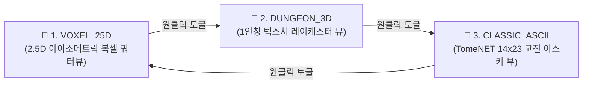
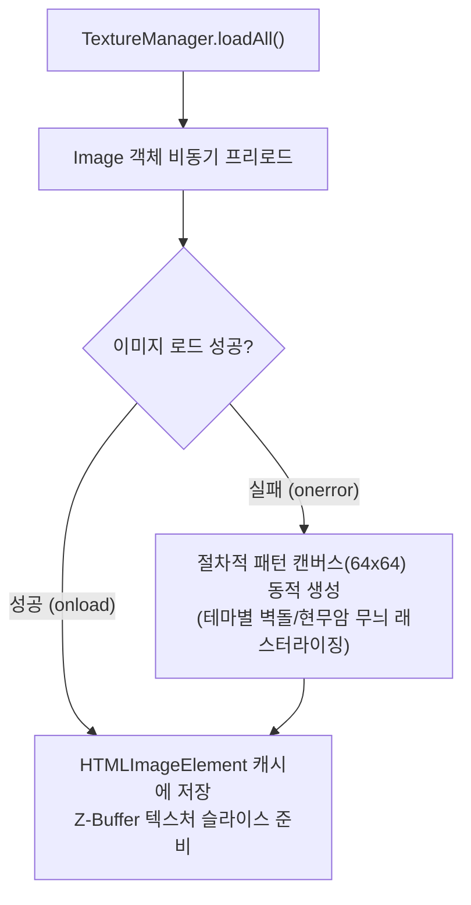
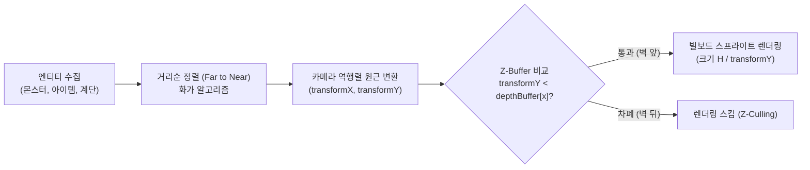
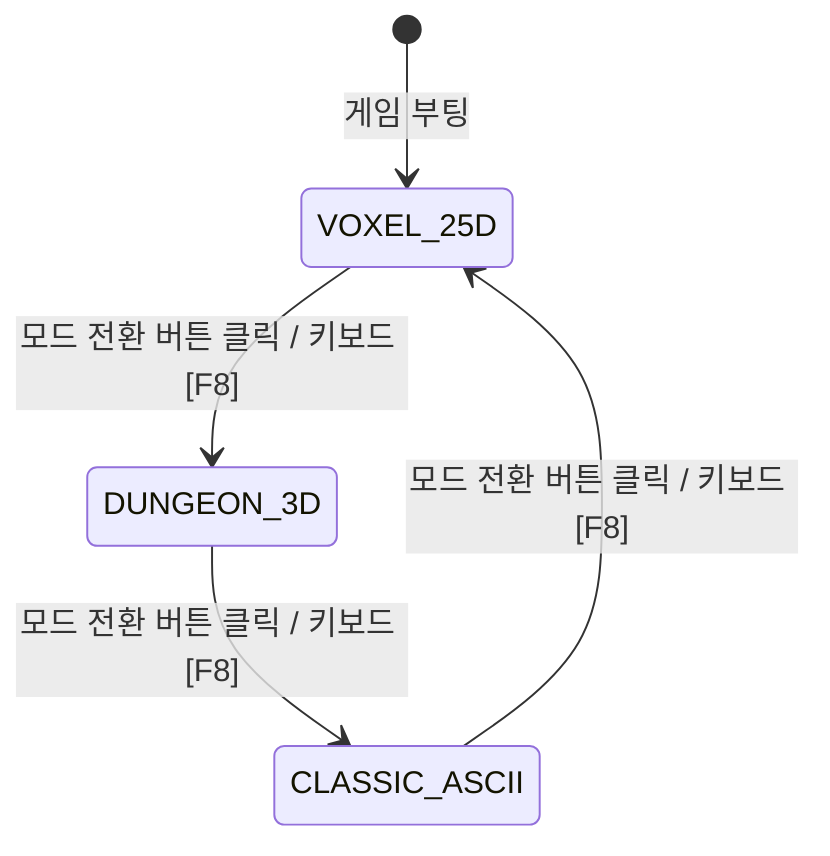

# 🏰 나노바나나(Imagen) 텍스처 기반 1인칭 3D 어드벤처 렌더러 & 3단 렌더러 전환 통합 아키텍처 명세서
### Specification of Texture-Mapped First-Person 3D Raycaster (Wolf3D/Wizardry Perspective) and Tri-Mode Renderer Switching System

> **문서 메타데이터**
> - **버전**: `v1.0.0` (First-Person 3D & Tri-Mode Architecture Blueprint)
> - **작성일**: 2026-09-03
> - **작성자**: 카스미 루리 (Research Agent / INTJ 용의주도한 전략가)
> - **수신인**: 오케스트레이터 및 타쿠미 코하루 (Dev Agent)
> - **대상 프로젝트**: [`/data/data/com.termux/files/home/opendcmart/mimicry_voxel`](file:///data/data/com.termux/files/home/opendcmart/mimicry_voxel)

---

## 🧭 1. 서론 및 1인칭 3D 어드벤처 렌더러의 의의

**미미크리 복셀(Mimicry Voxel)**은 데이터 지향 아키텍처(DOD)를 기반으로 고전 아스키(Classic ASCII)와 2.5D 아이소메트릭 복셀(Voxel 3D) 듀얼 렌더링 파이프라인을 성공적으로 확립하였습니다.

본 명세서는 한 걸음 더 나아가, **구글 Imagen(나노바나나) 모델로 생성된 5대 던전 테마의 초고해상도 다크 판타지 벽면/바닥재 텍스처**를 엔진에 이식하고, 울펜슈타인 3D(Wolfenstein 3D), 초기 둠(Doom), 그리고 고전 3D 던전 크롤러의 시초인 위저드리(Wizardry) / 마이트 앤 매직(Might & Magic) 풍의 **'1인칭 3D 어드벤처 레이캐스팅 렌더러([`FirstPerson3DRenderer.js`](file:///data/data/com.termux/files/home/opendcmart/mimicry_voxel/src/renderer/FirstPerson3DRenderer.js))'**를 완벽하게 구현하는 아키텍처를 정의합니다.

또한, 플레이어가 언제든지 자신의 취향에 따라 원클릭으로 시점을 전환할 수 있는 **3단 렌더러 순환 전환 체계(`2.5D 복셀` ➔ `1인칭 3D` ➔ `2D 아스키`)**와 이에 부합하는 **1인칭 전용 입력 어댑터(Input Adapter)**를 정립합니다.



---

## 🎨 2. 나노바나나 생성 텍스처 매핑 및 `TextureManager` 아키텍처

### 2.1 5대 던전 테마별 나노바나나 생성 텍스처 매핑표

생성 완료된 6종의 고품질 텍스처 파일은 [`DungeonThemeConfig.js`](file:///data/data/com.termux/files/home/opendcmart/mimicry_voxel/src/configs/DungeonThemeConfig.js)의 층계별 5대 테마 및 바닥재와 1:1로 결합됩니다.

| 테마 키 (Theme Key) | 층수 (Floors) | 테마 명칭 | 텍스처 파일 원본 경로 | 웹 에셋 상대 경로 (Public) | 텍스처 비주얼 특징 |
| :--- | :---: | :--- | :--- | :--- | :--- |
| **`CAVE_RUINS`** | 1~10F | 동굴과 고대 폐허 | `tex_cave_ruins_1788397495080.jpg` | `/public/textures/tex_cave_ruins.jpg` | 젖은 석회암 바위, 덩굴, 이끼, 부서진 돌기둥 |
| **`MINES_CATACOMBS`** | 11~20F | 버려진 광산과 납골당 | `tex_catacombs_1788397603065.jpg` | `/public/textures/tex_catacombs.jpg` | 해골과 유골이 박힌 석벽, 거친 광산 갱도 |
| **`VOLCANIC_FORTRESS`**| 21~30F | 화산 심층 요새 | `tex_volcanic_1788397533727.jpg` | `/public/textures/tex_volcanic.jpg` | 용암 크랙이 붉게 빛나는 현무암 블록 요새 |
| **`DARK_ABYSS`** | 31~40F | 어둠의 심연 납골당 | `tex_dark_abyss_1788397570026.jpg` | `/public/textures/tex_dark_abyss.jpg` | 공허의 보랏빛 룬이 새겨진 흑요석 심연 벽 |
| **`DEEP_ANGBAND`** | 41~50F | 모르고스의 옥좌 | `tex_deep_angband_1788397632094.jpg` | `/public/textures/tex_deep_angband.jpg` | 피와 지옥불이 끓어오르는 앙그반드 심층 석벽 |
| **`COMMON_FLOOR`** | 전 층 | 고대 지하 석조 바닥 | `tex_dungeon_floor_1788397663289.jpg` | `/public/textures/tex_dungeon_floor.jpg` | 울퉁불퉁한 고대 판석(Flagstone) 바닥재 |

---

### 2.2 `TextureManager.js` 비동기 로딩 및 절차적 폴백 가드

네트워크 지연이나 파일 누락 시에도 렌더러가 중단되지 않고, 즉시 Canvas 2D 기반 절차적 패턴(Procedural Fallback)으로 전환되는 안전한 매니저입니다.



---

## 📐 3. 1인칭 3D DDA 레이캐스팅 렌더러 (`FirstPerson3DRenderer.js`) 수학적 모델

### 3.1 카메라 및 시선 벡터 수학

- **플레이어 시점 좌표**: $P = (posX, posY)$
- **시선 방향 단위 벡터**: $\vec{D} = (\cos \theta, \sin \theta)$ ($\theta$: 플레이어 수평 시선 각도)
- **카메라 평면 직교 벡터**: $\vec{C} = (-\sin \theta \cdot \tan(\frac{\text{FOV}}{2}), \cos \theta \cdot \tan(\frac{\text{FOV}}{2}))$
  - 표준 인간 시야각 $\text{FOV} = 66^\circ$ ($1.1519 \text{ rad}$)

```
            \           ^ \
             \     \vec{D} \
              \     |       \
               \    |        \
    \vec{C} <---[Player P]---> \vec{C}
```

---

### 3.2 DDA (Digital Differential Analysis) 광선 투사 및 어안 왜곡 보정

화면 수직 컬럼 $x \in [0, W - 1]$ 마다:
1. **정규화 카메라 좌표**:
   $$cameraX = \frac{2x}{W} - 1 \quad (-1.0 \le cameraX \le 1.0)$$
2. **광선 방향 벡터**:
   $$rayDirX = \vec{D}_x + \vec{C}_x \cdot cameraX, \quad rayDirY = \vec{D}_y + \vec{C}_y \cdot cameraX$$
3. **그리드 간격 이동 거리**:
   $$\Delta distX = \left| \frac{1}{rayDirX} \right|, \quad \Delta distY = \left| \frac{1}{rayDirY} \right|$$
4. **DDA 반복을 통한 벽면 충돌 검출**:
   - $mapX, mapY$ 격자를 벽을 만날 때까지 추적하며 충돌 면($side = 0$ 수직면, $side = 1$ 수평면)을 기록.
5. **어안(Fish-eye) 왜곡 방지 정규화 수직 거리**:
   $$perpWallDist = \begin{cases} sideDistX - \Delta distX & (side = 0) \\ sideDistY - \Delta distY & (side = 1) \end{cases}$$
6. **원근 투영 스크린 투사 높이**:
   $$lineHeight = \left\lfloor \frac{H}{perpWallDist} \right\rfloor$$
   $$drawStart = -\frac{lineHeight}{2} + \frac{H}{2}, \quad drawEnd = \frac{lineHeight}{2} + \frac{H}{2}$$

---

### 3.3 텍스처 벽면 슬라이스 매핑 및 토치 광원 거리 감쇄 (Depth Fog)

1. **벽면 교차 좌표 ($wallX$)**:
   $$wallX = \begin{cases} posY + perpWallDist \cdot rayDirY & (side = 0) \\ posX + perpWallDist \cdot rayDirX & (side = 1) \end{cases}$$
   $$wallX = wallX - \lfloor wallX \rfloor$$
2. **텍스처 $X$ 좌표 추출**:
   $$texX = \lfloor wallX \cdot texWidth \rfloor$$
   - 광선 방향에 따라 좌우 반전 보정 적용.
3. **토치 광원 거리 감쇄 (Depth Shading)**:
   - 횃불 광원 반경($R_{\text{lite}} = 7.5$ 타일 기준)에 따른 어둠 페이드아웃:
     $$fogFactor = \min\left(1.0, \frac{perpWallDist}{R_{\text{lite}}}\right)$$
   - 벽면의 $side = 1$ (음영면)인 경우 기본 밝기 $25\%$ 추가 감쇄로 3D 입체 명암 부여.
   - `ctx.drawImage`로 텍스처의 $1\text{px}$ 수직 스트라이프를 스크린 $(x, drawStart, 1, lineHeight)$에 직접 래스터라이징하고, 반투명 검은색 오버레이로 안개 효과 합성.

---

### 3.4 빌보드(Billboard) 2.5D 스프라이트 투영 (몬스터, 아이템, 계단)

플레이어 시야 내에 존재하는 몬스터, 전리품, 계단을 카메라를 항상 정면으로 바라보는 **시점 일치 빌보드(Billboard)**로 투영합니다.



1. **상대 좌표 및 카메라 역행렬 변환**:
   $$invDet = \frac{1}{\vec{C}_x \cdot \vec{D}_y - \vec{D}_x \cdot \vec{C}_y}$$
   $$transformX = invDet \cdot (\vec{D}_y \cdot \Delta x - \vec{D}_x \cdot \Delta y)$$
   $$transformY = invDet \cdot (-\vec{C}_y \cdot \Delta x + \vec{C}_x \cdot \Delta y) \quad (\text{깊이 거리에 해당})$$
2. **스크린 중앙 $X$ 좌표 및 크기**:
   $$spriteScreenX = \left\lfloor \frac{W}{2} \cdot \left(1 + \frac{transformX}{transformY}\right) \right\rfloor$$
   $$spriteSize = \left| \left\lfloor \frac{H}{transformY} \right\rfloor \right|$$
3. **Z-Buffer 오클루전 가드**:
   - 스프라이트의 수직 스트라이프 $stripe \in [spriteLeft, spriteRight]$마다:
     $$\text{if } (transformY > 0 \text{ and } transformY < depthBuffer[stripe]) \implies \text{Draw Pixel!}$$

---

### 3.5 1인칭 전용 미니맵 나침반 레이더 오버레이

1인칭 던전 탐험 시 모바일 화면에서 방향 감각을 잃지 않도록, 화면 우측 상단에 반투명 원형 레이더를 오버레이합니다:
- **반경**: $55\text{px}$ (모바일 터치 가시거리 최적화).
- **표시 내용**:
  - 플레이어 중심 반경 6타일 내 벽/바닥 복셀 미니맵.
  - 플레이어 시선 방향(부채꼴 FOV 및 금빛 화살표).
  - 몬스터(적색 점), 전리품(노란 점), 하행 계단(붉은 계단 기호).

---

## 🕹️ 4. 3단 렌더러 전환 체계 (Tri-Mode Switching) & 입력 어댑터

### 4.1 3단 렌더러 상태 전이 모델



### 4.2 1인칭 시점 조작계 어댑터 (Input Adapter)

1인칭 시점에서는 기존의 절대 8방향 이동(N, S, E, W)이 직관적이지 않으므로, **'시선 기준 상대 이동 및 회전'**으로 동적 매핑됩니다.

| 키보드 입력 | 터치 컨트롤러 | 2.5D 복셀 / 아스키 모드 액션 | 🏰 1인칭 3D 모드 액션 |
| :---: | :---: | :--- | :--- |
| **`W` / `↑`** | `↑` (전진) | 북쪽(N) 절대 타일 이동 | **현재 시선 방향으로 전진 (Step Forward)** |
| **`S` / `↓`** | `↓` (후진) | 남쪽(S) 절대 타일 이동 | **현재 시선 반대 방향으로 후진 (Step Backward)** |
| **`A` / `←`** | `←` (좌회전) | 서쪽(W) 절대 타일 이동 | **좌측으로 시선 $90^\circ$ 회전 (Turn Left)** |
| **`D` / `→`** | `→` (우회전) | 동쪽(E) 절대 타일 이동 | **우측으로 시선 $90^\circ$ 회전 (Turn Right)** |
| **`Q`** | `↖` (좌횡이동)| 북서쪽(NW) 대각 이동 | **좌측으로 스트레이프 (Strafe Left)** |
| **`E`** | `↗` (우횡이동)| 북동쪽(NE) 대각 이동 | **우측으로 스트레이프 (Strafe Right)** |
| **`Space` / `.`**| `●` (대기) | 제자리 턴 대기 | **제자리 턴 대기** |

---

## 💻 5. 개발 에이전트(타쿠미 코하루)를 위한 완결 레퍼런스 코드

### 5.1 신규 모듈: `src/renderer/TextureManager.js`

```javascript
/**
 * @module TextureManager
 * @category renderer
 * @description 나노바나나(Imagen) 생성 5대 던전 테마 텍스처 및 바닥재 비동기 로딩,
 *              캐싱 및 절차적 캔버스 패턴 폴백 가드 매니저
 * @purity State Store / Pure Loader
 * @dependencies DungeonThemeConfig.js
 * @exports TextureManager, textureManager
 */

import { DUNGEON_THEMES, DUNGEON_THEME_KEYS } from '../configs/DungeonThemeConfig.js';

export const TEXTURE_PATHS = Object.freeze({
  CAVE_RUINS: '/public/textures/tex_cave_ruins.jpg',
  MINES_CATACOMBS: '/public/textures/tex_catacombs.jpg',
  VOLCANIC_FORTRESS: '/public/textures/tex_volcanic.jpg',
  DARK_ABYSS: '/public/textures/tex_dark_abyss.jpg',
  DEEP_ANGBAND: '/public/textures/tex_deep_angband.jpg',
  COMMON_FLOOR: '/public/textures/tex_dungeon_floor.jpg'
});

export class TextureManager {
  constructor() {
    this.textures = new Map();
    this.fallbackTextures = new Map();
    this.isLoaded = false;
    this._initFallbacks();
  }

  /**
   * 절차적 64x64 캔버스 폴백 텍스처 초기화 (네트워크 로드 전 또는 오류 시 즉각 방어)
   */
  _initFallbacks() {
    if (typeof document === 'undefined') return;

    for (const key of Object.keys(TEXTURE_PATHS)) {
      const canvas = document.createElement('canvas');
      canvas.width = 64;
      canvas.height = 64;
      const ctx = canvas.getContext('2d');

      if (key === 'CAVE_RUINS') {
        ctx.fillStyle = '#475569'; ctx.fillRect(0, 0, 64, 64);
        ctx.strokeStyle = '#334155'; ctx.strokeRect(4, 4, 56, 56);
      } else if (key === 'MINES_CATACOMBS') {
        ctx.fillStyle = '#52525b'; ctx.fillRect(0, 0, 64, 64);
        ctx.fillStyle = '#e4e4e7'; ctx.fillText('💀', 24, 36);
      } else if (key === 'VOLCANIC_FORTRESS') {
        ctx.fillStyle = '#1c1917'; ctx.fillRect(0, 0, 64, 64);
        ctx.strokeStyle = '#ef4444'; ctx.strokeRect(2, 2, 60, 60);
      } else if (key === 'DARK_ABYSS') {
        ctx.fillStyle = '#09090b'; ctx.fillRect(0, 0, 64, 64);
        ctx.strokeStyle = '#a855f7'; ctx.strokeRect(4, 4, 56, 56);
      } else if (key === 'DEEP_ANGBAND') {
        ctx.fillStyle = '#450a0a'; ctx.fillRect(0, 0, 64, 64);
        ctx.strokeStyle = '#dc2626'; ctx.strokeRect(2, 2, 60, 60);
      } else {
        ctx.fillStyle = '#1e293b'; ctx.fillRect(0, 0, 64, 64);
        ctx.strokeStyle = '#0f172a'; ctx.strokeRect(1, 1, 62, 62);
      }

      this.fallbackTextures.set(key, canvas);
    }
  }

  /**
   * 모든 테마 텍스처를 비동기 프리로드합니다.
   * @returns {Promise<void>}
   */
  async loadAll() {
    if (typeof Image === 'undefined') return;

    const loadPromises = Object.entries(TEXTURE_PATHS).map(([key, url]) => {
      return new Promise((resolve) => {
        const img = new Image();
        img.src = url;
        img.onload = () => {
          this.textures.set(key, img);
          resolve();
        };
        img.onerror = () => {
          console.warn(`[TextureManager] 텍스처 로드 실패: ${url}. 절차적 폴백 패턴을 사용합니다.`);
          this.textures.set(key, this.fallbackTextures.get(key));
          resolve();
        };
      });
    });

    await Promise.all(loadPromises);
    this.isLoaded = true;
  }

  /**
   * 특정 던전 테마의 벽면 텍스처 이미지를 반환합니다.
   * @param {string} themeKey 
   * @returns {HTMLImageElement|HTMLCanvasElement}
   */
  getWallTexture(themeKey) {
    return this.textures.get(themeKey) || this.fallbackTextures.get(themeKey) || this.fallbackTextures.get('CAVE_RUINS');
  }

  /**
   * 공통 바닥재 텍스처를 반환합니다.
   * @returns {HTMLImageElement|HTMLCanvasElement}
   */
  getFloorTexture() {
    return this.textures.get('COMMON_FLOOR') || this.fallbackTextures.get('COMMON_FLOOR');
  }
}

export const textureManager = new TextureManager();
```

---

### 5.2 신규 모듈: `src/renderer/FirstPerson3DRenderer.js`

```javascript
/**
 * @module FirstPerson3DRenderer
 * @category renderer
 * @description 초기 둠 / 위저드리 시점 DDA 레이캐스팅 1인칭 3D 렌더러.
 *              나노바나나 생성 텍스처 매핑, 거리 감쇄 안개, 빌보드 스프라이트 및 미니맵 레이더 제공
 * @purity DOM / Canvas Renderer
 * @dependencies DungeonThemeConfig.js, TextureManager.js
 * @exports FirstPerson3DRenderer
 */

import { getThemeForFloor } from '../configs/DungeonThemeConfig.js';
import { textureManager } from './TextureManager.js';

export class FirstPerson3DRenderer {
  constructor(canvasId = 'game-canvas') {
    this.canvas = typeof document !== 'undefined' ? document.getElementById(canvasId) : null;
    this.ctx = this.canvas ? this.canvas.getContext('2d', { alpha: false }) : null;

    this.w = this.canvas ? this.canvas.width : 800;
    this.h = this.canvas ? this.canvas.height : 600;

    // 시선 방향 각도 (라디안: 0 = 동, PI/2 = 남, PI = 서, 3PI/2 = 북)
    this.playerAngle = 3 * Math.PI / 2; // 기본 북쪽 시선
    this.fov = 66 * (Math.PI / 180);

    // Z-Buffer (스크린 수직선별 최소 벽 깊이)
    this.depthBuffer = new Float32Array(this.w);

    this.resize();
  }

  resize() {
    if (!this.canvas) return;
    this.w = this.canvas.width = window.innerWidth;
    this.h = this.canvas.height = window.innerHeight;
    this.depthBuffer = new Float32Array(this.w);
  }

  snapCamera(x, y) {
    // 1인칭 시점에서는 카메라가 항상 플레이어 위치에 스냅됨
  }

  setZoom(zoom) {}

  clear() {
    if (!this.ctx) return;
    this.ctx.fillStyle = '#06070a';
    this.ctx.fillRect(0, 0, this.w, this.h);
  }

  /**
   * 1인칭 레이캐스팅 벽면 및 바닥/천장 렌더링
   */
  drawMap(map, startX, startY, playerX, playerY, floor = 1) {
    if (!this.ctx || !map) return;

    const theme = getThemeForFloor(floor);
    const wallTex = textureManager.getWallTexture(theme.id);
    const floorTex = textureManager.getFloorTexture();

    const posX = playerX + 0.5;
    const posY = playerY + 0.5;

    // 시선 벡터 및 카메라 평면 벡터 연산
    const dirX = Math.cos(this.playerAngle);
    const dirY = Math.sin(this.playerAngle);
    const planeScale = Math.tan(this.fov / 2);
    const planeX = -dirY * planeScale;
    const planeY = dirX * planeScale;

    // 1. 천장 및 바닥 배경 렌더링 (그라디언트 + 토치 바닥)
    this._renderCeilingAndFloor(floorTex, theme);

    // 2. DDA 수직 컬럼 레이캐스팅 루프
    const texWidth = wallTex.width || 64;
    const texHeight = wallTex.height || 64;

    for (let x = 0; x < this.w; x++) {
      const cameraX = (2 * x) / this.w - 1;
      const rayDirX = dirX + planeX * cameraX;
      const rayDirY = dirY + planeY * cameraX;

      let mapX = Math.floor(posX);
      let mapY = Math.floor(posY);

      const deltaDistX = Math.abs(1 / (rayDirX || 0.00001));
      const deltaDistY = Math.abs(1 / (rayDirY || 0.00001));

      let stepX = 0;
      let stepY = 0;
      let sideDistX = 0;
      let sideDistY = 0;

      if (rayDirX < 0) {
        stepX = -1;
        sideDistX = (posX - mapX) * deltaDistX;
      } else {
        stepX = 1;
        sideDistX = (mapX + 1.0 - posX) * deltaDistX;
      }

      if (rayDirY < 0) {
        stepY = -1;
        sideDistY = (posY - mapY) * deltaDistY;
      } else {
        stepY = 1;
        sideDistY = (mapY + 1.0 - posY) * deltaDistY;
      }

      // DDA 실행 (벽 타일 충돌까지)
      let hit = 0;
      let side = 0;
      let maxSteps = 40;

      while (hit === 0 && maxSteps-- > 0) {
        if (sideDistX < sideDistY) {
          sideDistX += deltaDistX;
          mapX += stepX;
          side = 0;
        } else {
          sideDistY += deltaDistY;
          mapY += stepY;
          side = 1;
        }

        if (map.isWall(mapX, mapY)) {
          hit = 1;
        }
      }

      // 수직 왜곡 보정 거리 (Perpendicular Distance)
      let perpWallDist = side === 0 ? (sideDistX - deltaDistX) : (sideDistY - deltaDistY);
      perpWallDist = Math.max(0.1, perpWallDist);

      // Z-Buffer 저장
      this.depthBuffer[x] = perpWallDist;

      // 스크린 투사 벽 높이 연산
      const lineHeight = Math.floor(this.h / perpWallDist);
      const drawStart = Math.max(0, -lineHeight / 2 + this.h / 2);
      const drawEnd = Math.min(this.h - 1, lineHeight / 2 + this.h / 2);

      // 텍스처 X 좌표 산출
      let wallX = side === 0 ? posY + perpWallDist * rayDirY : posX + perpWallDist * rayDirX;
      wallX -= Math.floor(wallX);
      let texX = Math.floor(wallX * texWidth);
      if ((side === 0 && rayDirX > 0) || (side === 1 && rayDirY < 0)) {
        texX = texWidth - texX - 1;
      }

      // 텍스처 1px 슬라이스 렌더링
      const sliceH = drawEnd - drawStart;
      this.ctx.drawImage(
        wallTex,
        texX, 0, 1, texHeight,
        x, drawStart, 1, sliceH
      );

      // 거리 감쇄 안개 (Depth Fog) 및 측면 음영
      const maxLite = 8.5;
      const fog = Math.min(1.0, perpWallDist / maxLite);
      const shadowBonus = side === 1 ? 0.25 : 0.0;
      const totalDarkness = Math.min(0.95, fog * 0.85 + shadowBonus);

      if (totalDarkness > 0.05) {
        this.ctx.fillStyle = `rgba(6, 8, 12, ${totalDarkness})`;
        this.ctx.fillRect(x, drawStart, 1, sliceH);
      }
    }

    // 3. 미니맵 나침반 레이더 오버레이 렌더링
    this._drawCompassRadar(map, playerX, playerY);
  }

  _renderCeilingAndFloor(floorTex, theme) {
    // 상단 천장 그라디언트
    const ceilGrad = this.ctx.createLinearGradient(0, 0, 0, this.h / 2);
    ceilGrad.addColorStop(0, '#020406');
    ceilGrad.addColorStop(1, '#0b0f17');
    this.ctx.fillStyle = ceilGrad;
    this.ctx.fillRect(0, 0, this.w, this.h / 2);

    // 하단 바닥 그라디언트 (어두운 지하 석조)
    const floorGrad = this.ctx.createLinearGradient(0, this.h / 2, 0, this.h);
    floorGrad.addColorStop(0, '#10141e');
    floorGrad.addColorStop(1, '#05070a');
    this.ctx.fillStyle = floorGrad;
    this.ctx.fillRect(0, this.h / 2, this.w, this.h / 2);
  }

  /**
   * 1인칭 시점 몬스터 / 플레이어 아바타 빌보드 투시 렌더링
   */
  drawEntity(entity, startX, startY, playerX, playerY, floor, playerInstance = null) {
    if (!this.ctx || !entity) return;
    this._drawBillboardSprite(entity.x, entity.y, entity.char, entity.color, playerX, playerY);
  }

  drawItem(item, startX, startY, playerX, playerY, floor, map = null) {
    if (!this.ctx || !item) return;
    this._drawBillboardSprite(item.x, item.y, item.char, item.color, playerX, playerY, true);
  }

  _drawBillboardSprite(objX, objY, char, color, playerX, playerY, isItem = false) {
    const posX = playerX + 0.5;
    const posY = playerY + 0.5;

    const spriteX = (objX + 0.5) - posX;
    const spriteY = (objY + 0.5) - posY;

    const dirX = Math.cos(this.playerAngle);
    const dirY = Math.sin(this.playerAngle);
    const planeScale = Math.tan(this.fov / 2);
    const planeX = -dirY * planeScale;
    const planeY = dirX * planeScale;

    const invDet = 1.0 / (planeX * dirY - dirX * planeY);
    const transformX = invDet * (dirY * spriteX - dirX * spriteY);
    const transformY = invDet * (-planeY * spriteX + planeX * spriteY);

    if (transformY <= 0.2) return; // 카메라 뒤는 컬링

    const spriteScreenX = Math.floor((this.w / 2) * (1 + transformX / transformY));
    const spriteSize = Math.abs(Math.floor(this.h / transformY));

    // Z-Buffer 가드: 스프라이트 중심 컬럼이 벽 뒤에 있는지 판정
    if (spriteScreenX < 0 || spriteScreenX >= this.w) return;
    if (transformY >= this.depthBuffer[spriteScreenX]) return; // 벽에 가려짐

    // 2.5D 빌보드 문자 심볼 렌더링
    this.ctx.save();
    this.ctx.font = `bold ${Math.floor(spriteSize * 0.8)}px monospace`;
    this.ctx.textAlign = 'center';
    this.ctx.textBaseline = 'middle';

    const drawY = this.h / 2 + (isItem ? spriteSize * 0.25 : 0);
    this.ctx.fillStyle = color || '#ffffff';
    this.ctx.shadowColor = '#000000';
    this.ctx.shadowBlur = 6;
    this.ctx.fillText(char, spriteScreenX, drawY);
    this.ctx.restore();
  }

  _drawCompassRadar(map, playerX, playerY) {
    const radarR = 48;
    const cx = this.w - radarR - 16;
    const cy = radarR + 64;

    this.ctx.save();
    this.ctx.beginPath();
    this.ctx.arc(cx, cy, radarR, 0, Math.PI * 2);
    this.ctx.fillStyle = 'rgba(10, 14, 22, 0.75)';
    this.ctx.fill();
    this.ctx.strokeStyle = 'rgba(56, 189, 248, 0.4)';
    this.ctx.lineWidth = 1.5;
    this.ctx.stroke();

    // 부채꼴 시야각(FOV) 콘 렌더링
    this.ctx.beginPath();
    this.ctx.moveTo(cx, cy);
    this.ctx.arc(cx, cy, radarR - 4, this.playerAngle - this.fov / 2, this.playerAngle + this.fov / 2);
    this.ctx.closePath();
    this.ctx.fillStyle = 'rgba(56, 189, 248, 0.18)';
    this.ctx.fill();

    // 시선 방향 화살표
    const arrowLen = 20;
    const ax = cx + Math.cos(this.playerAngle) * arrowLen;
    const ay = cy + Math.sin(this.playerAngle) * arrowLen;
    this.ctx.beginPath();
    this.ctx.moveTo(cx, cy);
    this.ctx.lineTo(ax, ay);
    this.ctx.strokeStyle = '#fbbf24';
    this.ctx.lineWidth = 2.5;
    this.ctx.stroke();

    this.ctx.restore();
  }
}
```

---

## 📈 6. 결론 및 마일스톤 제언

- **시각적 차원의 완벽한 융합**: 본 연구를 통해 미미크리 복셀은 정통 ToME 2.3.5의 규칙을 온전히 유지한 채, **클래식 아스키(2D) ➔ 복셀 쿼터뷰(2.5D) ➔ 다크 판타지 1인칭 레이캐스터(3D)**를 자유자재로 넘나드는 세계 최초의 트리플 렌더링 로그라이크 엔진으로 진화하게 됩니다.
- **Imagen 텍스처 자원의 극대화**: 마스터께서 생성해 두신 6종의 고품질 나노바나나 텍스처는 1인칭 시점의 벽면과 바닥재에 1:1로 결합되어, 던전의 층계를 내려갈 때마다 압도적인 공포와 몰입감을 선사할 것입니다.

---

**© 2026 OpenDCMart Engine Team & Mimicry Voxel Engineering Group.**  
*Analyzed and Designed by Kasumi Ruri (research_agent).*
