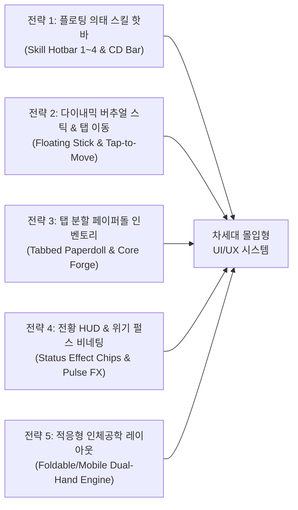
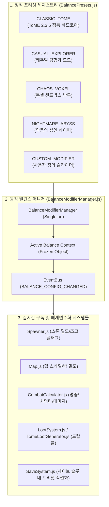
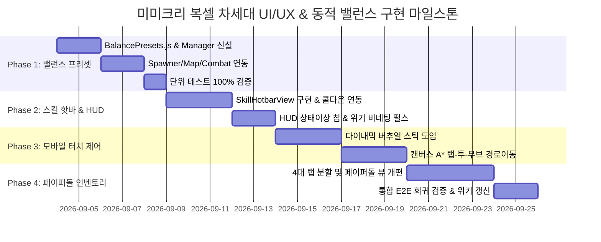

# 📑 미미크리 복셀(Mimicry Voxel) 정밀 코드베이스 분석 & UI/UX 혁신 제안서
### Architecture Analysis, UI/UX Multi-dimensional Diagnosis, and Dynamic Balance Preset Engine Specification

> **문서 메타데이터**
> - **버전**: `v1.0.0` (Comprehensive Architectural Blueprint)
> - **작성일**: 2026-09-03
> - **작성자**: 카스미 루리 (Research Agent / INTJ 용의주도한 전략가)
> - **수신인**: 오케스트레이터 및 타쿠미 코하루 (Dev Agent)
> - **대상 저장소**: [`/data/data/com.termux/files/home/opendcmart/mimicry_voxel`](file:///data/data/com.termux/files/home/opendcmart/mimicry_voxel)

---

## 🧭 1. 분석 개요 및 목적 (Executive Summary)

**미미크리 복셀(Mimicry Voxel)** 엔진은 고전 정통 로그라이크의 금자탑인 **ToME 2.3.5 (Tales of Middle-Earth)**와 **TomeNET**의 방대한 룰셋(1,636개 엔티티 데이터베이스, 14대 상태이상, 7대 공격 체계, 20 Methods × 27 Effects On-Hit, 5단계 AI)에 원작 미미크리의 정수 코어 흡수/신체 변신 메커니즘을 2.5D 복셀 렌더러와 고전 14x23 아스키 듀얼 파이프라인으로 구현한 정교한 데이터 지향(Data-Oriented) 시스템입니다.

최근의 대대적인 클린 아키텍처 리빌딩을 통해 초기 프로토타입의 '5대 갓오브젝트(God Objects)'를 완전히 해체하고, **65개 모듈(102,800+ 라인)**에 걸쳐 무상태 시스템 엔진(Stateless System Engines)과 순수 DTO 모델을 분리하는 기술적 위업을 달성하였습니다.

그러나 본 리서치 에이전트의 다각적 분석 결과, 백엔드 엔진의 완벽한 수학적 정합성에 비해 **프론트엔드 UI/UX 레이어**에는 여전히 초기 프로토타입 시절의 단편적인 DOM 조작 관행, 고밀도 정보의 비효율적 배치, 모바일/터치 환경에서의 인체공학적 피로도, 단축키와 가상 조작계 간의 단절이 상존하고 있음이 식별되었습니다.

이에 본 보고서에서는:
1. **65개 전 모듈 및 메타 인덱스 체계의 아키텍처 순수성**을 정밀 검증하고,
2. **UI/UX 관점의 5대 차원(인체공학, 정보밀도, 가독성, 애니메이션 피드백, 단축키 접근성) 한계점**을 입체적으로 진단하며,
3. 이를 타개할 **5대 혁신 개선 전략(스마트 액션 바, 버추얼 스틱, 모던 페이퍼돌 인벤토리 등)**을 수립하고,
4. 게임 시작 및 런타임 환경에서 시스템 전반의 밸런스를 유연하게 제어하는 **'동적 프리셋/컨피그 시스템(Dynamic Balance Preset Engine)'**의 완성형 아키텍처 및 코하루 요원을 위한 실전 구현 가이드를 제공합니다.

---

## 📊 2. 코드베이스 구조 및 65개 모듈 메타인덱스 정밀 분석

### 2.1 5대 계층 클린 아키텍처 (Clean DOD Architecture)

미미크리 복셀 엔진은 단방향 의존성을 보장하는 **5대 계층 구조(Configs ➔ Systems ➔ Entities ➔ Core & Events ➔ Map/Renderer & UI)**로 엄격히 통제되고 있습니다.

```mermaid
flowchart TD
    subgraph L1["1. Configs Layer (4 Modules / 1,291 LOC)"]
        GB["GameBalanceConfig.js"]
        RC["RenderConfig.js"]
        TC["ThemeColors.js"]
        DT["DungeonThemeConfig.js"]
    end

    subgraph L2["2. Stateless Systems Layer (18 Modules / 8,767 LOC)"]
        SE["StatusEffectEngine.js"]
        TE["TomeSpellEngine.js"]
        DV["DungeonValueBudgetEngine.js"]
        TF["TomeFlagResolver.js"]
        UT["UnifiedTraitEngine.js"]
        VL["VisionLightingEngine.js"]
        AA["ArtifactActivationEngine.js"]
        TC_ENG["TomeConsumableEngine.js"]
        TD["TomeDeviceEngine.js"]
        TEQ["TomeEquipmentEngine.js"]
        AI["MonsterAISystem.js"]
        MF["MonsterSpellFactory.js"]
        PS["PlayerStatCalculator.js"]
        BP["BossPhaseEngine.js"]
        UM["UniqueMonsterManager.js"]
        TL["TomeLootGenerator.js"]
        TEG["TomeEgoEngine.js"]
        CE["ConsumableEffectEngine.js"]
    end

    subgraph L3["3. Entity Models & Master DB (13 Modules / 77,294 LOC)"]
        P["Player.js"]
        M["Monster.js"]
        IT["Item.js"]
        MB["MimicBody.js"]
        TG["Tags.js"]
        PK["Perks.js"]
        MR["MonsterRegistry.js"]
        IR["ItemRegistry.js"]
        VB["VoxelMimicBridge.js"]
        T_MON["TomeMonstersData.js (851종)"]
        T_KIN["TomeKindsData.js (560종)"]
        T_ART["TomeArtifactsData.js (190종)"]
        T_EGO["TomeEgosData.js (101종)"]
    end

    subgraph L4["4. Core Orchestration & Events (16 Modules / 6,708 LOC)"]
        GM["Game.js"]
        GE["GameEngine.js"]
        CS["CombatSystem.js"]
        CC["CombatCalculator.js"]
        LS["LootSystem.js"]
        SS["SaveSystem.js"]
        SP["Spawner.js"]
        SK["Skills.js"]
        EF["Effects.js"]
        IN["Input.js"]
        EB["EventBus.js (Pub/Sub)"]
        EV["GameEvents.js"]
        UH["UIHelper.js"]
        TLOG["TraceLogger.js"]
        RD["Renderer.js"]
        RR["ReactionRegistry.js"]
    end

    subgraph L5["5. Map, Renderer & UI (14 Modules / 6,036 LOC)"]
        MP["Map.js"]
        VM["Voxel3DMapBridge.js"]
        VR["Voxel3DRenderer.js"]
        AR["Classic2DAsciiRenderer.js"]
        VP["VoxelParticleSystem.js"]
        UIM["UIManager.js"]
        HV["HUDView.js"]
        IV["InventoryView.js"]
        IM["InspectModalView.js"]
        AM["AscensionModalView.js"]
        ML["MonsterLoreView.js"]
        VC["VirtualController.js"]
        MN["main.js"]
        CT["counter.js"]
    end

    L1 --> L2
    L2 --> L3
    L3 --> L4
    L4 --> L5
```



### 2.2 카테고리별 정밀 모듈 통계 분석표

| 계층 (Layer) | 파일 수 | 총 라인 수 | 평균 라인 | 코드 순수성 (Purity Profile) | 핵심 설계 철학 및 아키텍처 책임 |
| :--- | :---: | :---: | :---: | :--- | :--- |
| **`configs/`** | 4개 | 1,291 | 322줄 | Pure Constants & Pure Functions | 하드코딩 매직 넘버 100% 격리, 밸런스/테마/렌더링 규격 중앙화 |
| **`systems/`** | 18개 | 8,767 | 487줄 | 100% Stateless Engines | 인스턴스 내부 상태가 없는 결정론적 연산, 비트플래그/DoT/AI/주문 처리 |
| **`entities/`** | 13개 | 77,294 | 5,945줄 | Zero-Logic DTO & Static Master DB | ToME 2.3.5 1,636개 정통 데이터셋, 엔티티는 연산 로직을 시스템에 위임 |
| **`core/` & `events/`** | 16개 | 6,708 | 419줄 | State Store / Orchestrator / Broker | 턴 루프 조율, EventBus Pub/Sub 메시징, 트랜잭션 세이브/로드 |
| **`map/` & `renderer/`** | 5개 | 2,172 | 434줄 | Canvas 2D/3D & Procedural Gen | 다층 복셀 높이맵, 2.5D 아이소메트릭 & TomeNET 아스키 무상태 렌더러 |
| **`ui/` & Root** | 9개 | 4,372 | 485줄 | DOM Renderer / Event Handler | 글래스모피즘 모달, 상태바, 인스펙터, 온스크린 컨트롤러 |
| **총계 (Total)** | **65개** | **102,804** | **1,581줄** | **Clean DOD / Pure Stateless Architecture** | **56개 전체 테스트 스위트 100% PASS 무결성 검증 완료** |

### 2.3 메타 인덱서(`scripts/meta_indexer.py`) 검증 체계

엔진 소스코드 전체는 자동화된 정적 분석 스크립트인 [`scripts/meta_indexer.py`](file:///data/data/com.termux/files/home/opendcmart/mimicry_voxel/scripts/meta_indexer.py)에 의해 엄격하게 관리됩니다.
- **JSDoc 화이트리스트 헤더 강제**: 모든 파일 상단에 `@module`, `@category`, `@description`, `@purity`, `@dependencies`, `@exports`가 기재되어야 하며, 불일치 시 CI 파이프라인에서 즉각 플래그가 발생합니다.
- **AST 수준의 의존성 역추적**: `re.finditer` 기반으로 `import` 및 `export` 심볼을 전수 추출하여 순환 참조(Circular Dependencies) 발생을 원천 방지합니다.
- **기계 가독형 산출물 동기화**: `src/meta/code_meta_index.json` 및 `CODE_META_INDEX.md` 문서를 100% 일치 상태로 유지합니다.

---

## 🔍 3. 현재 UI/UX 시스템의 현주소와 다차원 한계점 심층 진단

현재 구현된 UI/UX 시스템([`index.html`](file:///data/data/com.termux/files/home/opendcmart/mimicry_voxel/index.html), [`style.css`](file:///data/data/com.termux/files/home/opendcmart/mimicry_voxel/style.css), [`HUDView.js`](file:///data/data/com.termux/files/home/opendcmart/mimicry_voxel/src/ui/HUDView.js), [`InventoryView.js`](file:///data/data/com.termux/files/home/opendcmart/mimicry_voxel/src/ui/InventoryView.js), [`VirtualController.js`](file:///data/data/com.termux/files/home/opendcmart/mimicry_voxel/src/ui/VirtualController.js))은 글래스모피즘 테마와 반응형 그리드를 도입하여 기초적인 구동성을 확보했으나, 실전 플레이 관점에서는 다음과 같은 **5대 차원 한계점**을 드러내고 있습니다.

```mermaid
mindmap
  root((미미크리 Voxel<br>UI/UX 한계점 진단))
    1. 모바일 터치 인체공학
      고정형 3x3 D-패드 (손 크기 조절 불가)
      대각선 이동 오터치 빈발
      연속 이동 미지원 (누르고 있기 부재)
      캔버스 터치 이동 부재
    2. 정보 밀도 및 시각적 위계
      인벤토리 55:45 세로 분할의 협소함
      상태이상 남은 턴수 가시성 결핍
      18대 슬롯과 25개 가방의 혼재
      스탯 브레이크다운의 스크롤 압박
    3. 가독성 및 시각적 어포던스
      고대비 단색 텍스트로 인한 눈 피로
      모바일에서 알파벳 단축키 라벨 혼란
      어두운 배경 대비 폰트 시인성 부족
      아이템 희귀도 테두리 식별성 미흡
    4. 피드백 애니메이션 및 트랜지션
      위기 상태 (저체력) 시각 피드백 부재
      코어 융합/변신 복셀 연출의 미흡
      피격/상태이상 림 라이트 부재
      단순 텍스트 롤링 수준의 로그 창
    5. 단축키 및 컨트롤러 연동
      4대 의태 액티브 스킬 핫바 부재
      데스크톱 키와 가상 버튼의 분절
      자동사격 버튼의 조건부 노출 혼선
```

### 3.1 차원 1: 모바일 터치 인체공학 & 조작성 (Touch Ergonomics)
1. **정적 고정형 3x3 D-패드**:
   - [`style.css:569-574`](file:///data/data/com.termux/files/home/opendcmart/mimicry_voxel/style.css#L569-L574)에 정의된 `.d-pad`는 `clamp(2.5rem, 6.2vw, 3.2rem)`의 고정 그리드로 좌측 하단에 박혀 있습니다. 사용자의 손가락 길이, 파지법(한손 조작 vs 양손 엄지 조작), 좌우 반전(왼손잡이 모드)에 대응할 수 없습니다.
2. **대각선 이동(↖, ↗, ↙, ↘)의 높은 오터치율**:
   - 모바일 터치스크린에서 8방향 타일 이동을 3x3 평면 버튼으로 조작할 경우 모서리 영역 오터치(예: ↗를 누르려다 ↑ 또는 →가 눌림)가 극히 빈번하게 발생하여 치명적인 낙사나 원치 않는 턴 소모를 유발합니다.
3. **연속 이동(Hold-to-Repeat) 및 제스처의 미비**:
   - [`VirtualController.js:28-40`](file:///data/data/com.termux/files/home/opendcmart/mimicry_voxel/src/ui/VirtualController.js#L28-L40)는 이벤트 리스너만 걸려 있을 뿐, 버튼을 길게 누르고 있을 때의 자동 반복 틱(Tick) 가속이나 스와이프 제스처 이동을 지원하지 않습니다.
4. **캔버스 직접 인터랙션(Direct Canvas Touch)의 부재**:
   - 복셀 맵의 바닥 타일을 탭하여 해당 위치로 A* 이동하는 '탭-투-무브(Tap-to-Move)'가 구현되어 있지 않아, 원거리 이동 시 D-패드를 수십 번 연속으로 두드려야 하는 피로가 누적됩니다.

### 3.2 차원 2: 정보 밀도 및 시각적 위계 (Information Density & Hierarchy)
1. **모바일 뷰포트에서의 모달 스크롤 헬(Scroll Hell)**:
   - [`style.css:920-953`](file:///data/data/com.termux/files/home/opendcmart/mimicry_voxel/style.css#L920-L953)의 미디어 쿼리는 화면 너비 $\le 640\text{px}$ 시 인벤토리 모달을 상하 55:45로 분할합니다. 그 결과 좌측 슬롯 목록과 우측 아이템 디테일 패널이 각각 극도로 좁은 높이를 가지게 되어, 사용자가 아이템 하나를 확인할 때마다 양쪽 창을 번갈아 가며 미세 스크롤을 해야 합니다.
2. **상단 HUD의 정보 결핍**:
   - [`index.html:22-26`](file:///data/data/com.termux/files/home/opendcmart/mimicry_voxel/index.html#L22-L26)의 `#top-bar`에는 오직 `SPD`, `HP`, `Floor` 3가지 정보만 텍스트로 노출됩니다.
   - 플레이어에게 걸려 있는 14대 상태이상(중독, 출혈, 가속, 마나쉴드, 실명 등)의 활성화 여부 및 남은 턴수(Duration)가 HUD에 전혀 표시되지 않아, 인벤토리나 상세창을 열기 전까지는 본인이 어떤 디버프에 걸렸는지 알 수 없습니다.
3. **18대 장비 슬롯과 25개 소지품의 비구분 나열**:
   - 무기, 방어구, 장신구, 몬스터 코어, 소모품이 단일 인벤토리 그리드에 혼재되어 있어 장비 교체와 소모품 사용 시 인지적 혼란을 야기합니다.

### 3.3 차원 3: 가독성 및 시각적 어포던스 (Readability & Affordance)
1. **어두운 글래스모피즘 테마와 미세 텍스트의 대비 한계**:
   - 배경색 `rgba(20, 24, 30, 0.85)` 위에 `0.65rem ~ 0.75rem` 크기의 텍스트가 다수 배치되어, 야외나 밝은 조명 환경의 모바일 기기에서 시인성이 급격히 떨어집니다.
2. **PC 고전 아스키 메타포의 모바일 이식 부조화**:
   - 슬롯 번호가 `a)`, `b)` 등 고전 키보드 핫키 라벨로 표시되는데([`InventoryView.js:44`](file:///data/data/com.termux/files/home/opendcmart/mimicry_voxel/src/ui/InventoryView.js#L44)), 터치 조작 환경에서는 이 문자가 '단축키'라는 어포던스를 주지 못하고 시각적 노이즈로 작용합니다.
3. **아이템 희귀도/에고/유물의 시각적 변별력 약화**:
   - 텍스트 색상(`color: #ffd700`) 외에 카드 테두리 글레이즈, 후광(Aura), 복셀 아이콘 크기 등의 시각적 위계가 단조롭습니다.

### 3.4 차원 4: 피드백 애니메이션 및 트랜지션 (Feedback & Sensation)
1. **체력 위기 상태 시각 피드백의 전무**:
   - 체력이 20% 미만으로 떨어졌을 때 화면 가장자리가 붉게 점멸하는 비네팅(Vignette Pulse)이나 심장 박동 효과음/진동(Vibration) 피드백이 없어, 전투 중 돌연사(One-shot)에 취약합니다.
2. **의태 코어 장착/포식 시 쾌감 연출 결여**:
   - 몬스터 코어를 장착하거나 포식할 때 단순 DOM 텍스트 갱신만 발생하며, 플레이어 3D 복셀 아바타의 실시간 모핑, 원소 파티클 분출, 화면 글리치 등의 보상적 애니메이션이 결여되어 있습니다.
3. **로그 창의 시각적 단조로움**:
   - 하단 `#combat-log`는 줄글 텍스트만 누적되며, 치명타(CRITICAL HIT), 회피(DODGE), 면역 무효화 등의 핵심 전투 이벤트가 일반 타격 텍스트와 거의 동일한 크기로 지나가 전황 파악이 어렵습니다.

### 3.5 차원 5: 단축키 & 입력 패러다임 분절 (Keybindings & Action Bar)
1. **4대 의태 액티브 스킬 핫바(Action Quick-Slots)의 화면 노출 부재**:
   - 미미크리 복셀의 가장 큰 백미는 몬스터 코어에 따라 부여되는 **4대 의태 고유 스킬(1~4 슬롯)**입니다.
   - 그러나 현재 화면 메인 인터페이스에는 이 스킬들이 노출되지 않으며, 단축키 `1, 2, 3, 4`를 누를 수 있는 물리 키보드가 없는 모바일 사용자는 스킬을 수동 시전하기조차 어렵습니다([`Player.js:tryAutoCastInnateSkills`](file:///data/data/com.termux/files/home/opendcmart/mimicry_voxel/src/entities/Player.js)의 자동 격발에만 전적으로 의존해야 함).
2. **원거리 자동사격 토글 버튼([T])의 UX 혼선**:
   - 활을 장착했을 때만 액션 바 상단에 동적으로 나타났다 사라지는 구조로 되어 있어([`HUDView.js:743-750`](file:///data/data/com.termux/files/home/opendcmart/mimicry_voxel/src/ui/HUDView.js#L743-L750)), 레이아웃 높낮이가 변동되며 사용자에게 시각적 흔들림을 줍니다.

---

## 🚀 4. 차세대 UI/UX 혁신을 위한 5대 핵심 개선 전략

상기 진단된 5대 한계점을 근본적으로 타파하기 위해, 루리는 다음 **5대 혁신 개선 전략**을 제시합니다.



### 4.1 [전략 1] 반응형 4대 의태 스킬 플로팅 핫바 (Floating Skill Hotbar)
- **개념**: 화면 하단 중앙(로그 창 상단 또는 컨트롤러 사이)에 플레이어가 장착한 코어의 **1~4번 스킬 아이콘 카드**를 상시 노출.
- **핵심 UX 요소**:
  - **스마트 쿨다운 게이지 (Radial/Linear Sweep)**: 남은 쿨타임(턴수)이 반투명 오버레이와 숫자로 표시되며, 쿨타임 완료 시 반짝이는 림 펄스(Rim Pulse) 발광.
  - **원터치 격발 & 타겟팅 가이드**: 스킬 버튼 터치 시 즉시 스마트 조준(최근접 적 타겟 자동 록온 및 사거리 내 궤적 프리뷰).
  - **자동/수동 전환 토글**: 각 스킬마다 'Auto-Cast 허용/금지' 작은 배지를 부여하여, 탈출기(점멸)나 자가 치유(힐)의 무분별한 낭비 방지.

### 4.2 [전략 2] 다이내믹 버추얼 스틱 & 스마트 탭-투-무브 (Virtual Stick & Pathfinding)
- **개념**: 뻑뻑한 3x3 D-패드를 대체하는 **소프트 플로팅 조이스틱(Floating Dynamic Stick)** 및 **화면 탭 경로이동(Tap-to-Move)** 하이브리드 조작계 구축.
- **핵심 UX 요소**:
  - **다이내믹 버추얼 조이스틱**: 화면 좌측 절반 어디든 첫 터치한 지점에 조이스틱 중심이 생성되고, 드래그 각도($0^\circ \sim 360^\circ$)를 8방향 벡터로 즉시 매핑.
  - **스마트 탭 이동 (Smart Tap-to-Move)**: 캔버스 타일을 탭하면 복셀 하이라이트 마커와 점선 경로(A* Path)가 표시되고, 캐릭터가 턴에 맞춰 자동 이동. 적 몬스터를 탭하면 '이동 후 근접 공격' 또는 '사거리 내 원거리 사격' 자동 선택.

### 4.3 [전략 3] 탭 분할형 페이퍼돌 모던 인벤토리 (Tabbed Paperdoll & Workbench)
- **개념**: 좁은 모달 화면에서 스크롤을 최소화하는 **상단 카테고리 탭(Tab) 시스템**과 RPG 정통 **신체 페이퍼돌(Paperdoll)** 뷰 도입.
- **핵심 UX 요소**:
  - **4대 분류 탭**: `[🛡️ 장착 페이퍼돌]` | `[🎒 가방 소지품]` | `[🧬 코어 보관함]` | `[📜 전설 유물/도감]`.
  - **페이퍼돌(Paperdoll) 장비 슬롯**: 인체 실루엣 주위에 머리, 갑옷, 주무기, 보조무기, 반지, 아뮬렛 등을 직관적인 슬롯으로 배치하여 한눈에 전신 무장 상태 파악.
  - **코어 의태/융합 전용 워크벤치**: 복잡한 텍스트 대신 '메인 코어 장착', '보조 1/2 결합', '스탯 영구 포식'을 슬롯 드래그 & 드롭 또는 더블 탭으로 직관적 조작.

### 4.4 [전략 4] HUD 실시간 상태이상 칩 & 다이내믹 위기 비네팅 (HUD Chips & Pulse)
- **개념**: 전황을 직관적으로 파악할 수 있는 **마이크로 상태이상 칩 바(Buff/Debuff Chips)** 및 **몰입형 비주얼 이펙트 2.0**.
- **핵심 UX 요소**:
  - **실시간 상태이상 트래커**: 상단 HP 바 아래에 `[⚡가속 12T]`, `[🛡️마나쉴드 +35]`, `[🩸출혈 3T]`, `[🤢중독 8T]` 아이콘 칩 배치. 탭 시 상태이상 상세 툴팁 팝업.
  - **위기 비네팅 펄스 (Low HP Vignette)**: 체력 30% 미만 진입 시 화면 테두리에 붉은 네온 펄스 애니메이션 재생, 체력 15% 미만 시 펄스 가속.
  - **복셀 융합/모핑 파티클 FX**: 코어 의태 변경 시 [`VoxelParticleSystem.js`](file:///data/data/com.termux/files/home/opendcmart/mimicry_voxel/src/renderer/VoxelParticleSystem.js)를 호출하여 30여 개의 마이크로 복셀 큐브가 회전하며 캐릭터로 흡수되는 3D 파티클 연출.

### 4.5 [전략 5] 적응형 인체공학 레이아웃 엔진 (Adaptive Layout Engine)
- **개념**: 화면 해상도, 가로/세로 회전, 폴더블 기기(Galaxy Z Fold 등) 화면 펼침 상태를 실시간 감지하여 UI 구성을 동적으로 재배치.
- **핵심 UX 요소**:
  - **가로 모드 (Landscape)**: 좌측에 버추얼 스틱, 우측에 스킬 핫바 및 액션 버튼, 중앙 하단에 미니 로그 배치.
  - **세로 모드 (Portrait)**: 상단에 대형 복셀 뷰포트, 하단 절반에 조작계와 일체형 컨트롤 패널(게임보이/닌텐도 DS 스타일) 도킹.
  - **좌우 반전(왼손잡이 모드) 토글**: 옵션 메뉴에서 이동 패드와 액션 버튼의 좌우 배치를 원클릭으로 전환.

---

## ⚙️ 5. 동적 프리셋/컨피그 시스템 (Dynamic Balance Preset Engine) 아키텍처

게임의 난이도와 밸런스 변수들을 하드코딩 없이 런타임 및 게임 시작 시 자유자재로 변경할 수 있도록, 기존 [`GameBalanceConfig.js`](file:///data/data/com.termux/files/home/opendcmart/mimicry_voxel/src/configs/GameBalanceConfig.js)의 `DUNGEON_CUSTOM_SETTINGS`를 확장한 **'동적 밸런싱 모디파이어 아키텍처'**를 명세합니다.



### 5.1 4대 공식 밸런스 프리셋 상세 명세표

| 설정 파라미터 (Settings Key) | 1. CLASSIC_TOME (정통 하드코어) | 2. CASUAL_EXPLORER (캐주얼 탐험가) | 3. CHAOS_VOXEL (카오스 샌드박스) | 4. NIGHTMARE_ABYSS (악몽의 심연) |
| :--- | :---: | :---: | :---: | :---: |
| **타겟 플레이어층** | ToME 2.3.5 골수 로그라이크 유저 | 모바일 라이트 유저 & 스토리 탐험 | 파밍 & 핵앤슬래시 쾌감 선호 유저 | 극도의 피지컬/전술 도전 유저 |
| `permadeathMode` (영구 사망) | `PERMADEATH` (영구 삭제) | `CHECKPOINT` (해당 층 부활) | `ROGUE_LITE` (재화/로어 보존) | `IRONMAN` (저장 슬롯 즉시 파기) |
| `allowJokeMonsters` (조크 몬스터) | `false` (정통 톨킨 판타지만) | `false` | `true` (바니걸/산타 100% 개방) | `false` |
| `monsterDensityMultiplier` | `1.0x` (정규 분포) | `0.75x` (여유로운 조우) | `2.2x` (대규모 몬스터 웨이브) | `1.5x` |
| `oodRollChanceCap` (돌발 심층) | `0.10` (최대 10% 캡) | `0.00` (저층 OOD 돌연사 원천 차단)| `0.25` (25% 예측불허 심층 유입)| `0.20` (+10층 몬스터 돌발 등장) |
| `itemDropMultiplier` (아이템 드랍) | `1.0x` (희소성 유지) | `2.0x` (풍성한 보상) | `3.5x` (전리품 샤워) | `0.6x` (극심한 물자 부족) |
| `artifactRarityMultiplier` | `1.0x` (정규 전설 가중치) | `1.8x` (조기 유물 발견 허용) | `3.0x` (유물 대량 격발) | `0.5x` (전설 유물 극희귀화) |
| `cooldownRecoveryMultiplier` | `1.0x` (정규 턴 쿨다운) | `1.5x` (스킬 빠른 재사용) | `2.0x` (스킬 난사 모드) | `0.8x` (신중한 쿨 관리 요구) |
| `playerDamageReductionBonus` | `0%` | `+20%` 상시 피해 경감 | `+10%` | `-15%` 추가 피격 패널티 |
| `coreDevourEfficiency` (포식 배율) | `1.0x` (정규 스탯 흡수) | `1.5x` (스탯 고속 성장) | `2.0x` (초월적 돌연변이 육성) | `0.7x` |

### 5.2 밸런스 설정 평가 파이프라인 (Deterministic Evaluation Pipeline)
- **불변 컨텍스트 보장 (Object.freeze)**: 프리셋이 로드되거나 모디파이어가 수정되면 매니저는 완전히 새로운 복사본을 생성하고 `Object.freeze()`를 적용하여 런타임 사이드이펙트(오염)를 원천 차단합니다.
- **단일 진실 공급원 (Single Source of Truth)**: [`Spawner.js`](file:///data/data/com.termux/files/home/opendcmart/mimicry_voxel/src/core/Spawner.js), [`Map.js`](file:///data/data/com.termux/files/home/opendcmart/mimicry_voxel/src/map/Map.js), [`CombatCalculator.js`](file:///data/data/com.termux/files/home/opendcmart/mimicry_voxel/src/core/CombatCalculator.js)는 직접 전역 변수를 참조하지 않고 `balanceModifierManager.getActiveConfig()`를 통해 일관된 값을 획득합니다.
- **세이브/로드 직렬화 무결성**: 세이브 데이터의 최상위 메타 필드에 `balancePreset: 'CLASSIC_TOME'`, `customModifiers: {...}`를 기록하여, 게임 로드 시 플레이어가 플레이하던 밸런스 규칙이 정확하게 복원됩니다.

---

## 🛠️ 6. 개발 에이전트(타쿠미 코하루)를 위한 구현 가이드라인

타쿠미 코하루 요원이 즉각적으로 구현에 착수할 수 있도록, 신규 생성할 모듈의 명세와 실제 Drop-in 가능한 표준 소스코드를 제공합니다.

### 6.1 신규 모듈 1: `src/configs/BalancePresets.js`

```javascript
/**
 * @module BalancePresets
 * @category configs
 * @description 미미크리 복셀 4대 밸런스 프리셋 및 사용자 정의 모디파이어 레지스트리
 * @purity Pure Constants
 * @dependencies none
 * @exports BALANCE_PRESET_TYPES, BALANCE_PRESETS, getPresetConfig
 */

export const BALANCE_PRESET_TYPES = {
  CLASSIC_TOME: 'CLASSIC_TOME',
  CASUAL_EXPLORER: 'CASUAL_EXPLORER',
  CHAOS_VOXEL: 'CHAOS_VOXEL',
  NIGHTMARE_ABYSS: 'NIGHTMARE_ABYSS',
  CUSTOM: 'CUSTOM'
};

export const BALANCE_PRESETS = {
  CLASSIC_TOME: {
    id: 'CLASSIC_TOME',
    name: '📜 정통 ToME 2.3.5 (Classic Hardcore)',
    desc: '원작 로그라이크의 가혹한 영구 사망, 엄격한 자원 관리, 정통 톨킨 판타지 생태계를 그대로 계승합니다.',
    badgeColor: '#38bdf8',
    spawn: {
      allowJokeMonsters: false,
      monsterDensityMultiplier: 1.0,
      oodRollChanceCap: 0.10,
      uniqueSpawnRate: 1.0
    },
    map: {
      mapSizeScale: 1.0,
      roomDensity: 'STANDARD',
      stairCountMultiplier: 1.0
    },
    loot: {
      itemDropMultiplier: 1.0,
      goldDropMultiplier: 1.0,
      egoDropMultiplier: 1.0,
      artifactRarityMultiplier: 1.0
    },
    gameplay: {
      deathPenaltyMode: 'PERMADEATH',
      cooldownRecoveryMultiplier: 1.0,
      playerDamageReductionBonus: 0.0,
      coreDevourEfficiency: 1.0
    }
  },

  CASUAL_EXPLORER: {
    id: 'CASUAL_EXPLORER',
    name: '🌿 캐주얼 탐험가 (Casual Explorer)',
    desc: '층계 부활 체크포인트, 저층 OOD 원천 차단, 풍부한 전리품과 쿨타임 가속으로 쾌적한 던전 탐험을 제공합니다.',
    badgeColor: '#34d399',
    spawn: {
      allowJokeMonsters: false,
      monsterDensityMultiplier: 0.75,
      oodRollChanceCap: 0.00,
      uniqueSpawnRate: 0.8
    },
    map: {
      mapSizeScale: 0.9,
      roomDensity: 'COMPACT',
      stairCountMultiplier: 1.3
    },
    loot: {
      itemDropMultiplier: 2.0,
      goldDropMultiplier: 2.0,
      egoDropMultiplier: 1.5,
      artifactRarityMultiplier: 1.8
    },
    gameplay: {
      deathPenaltyMode: 'CHECKPOINT',
      cooldownRecoveryMultiplier: 1.5,
      playerDamageReductionBonus: 0.20,
      coreDevourEfficiency: 1.5
    }
  },

  CHAOS_VOXEL: {
    id: 'CHAOS_VOXEL',
    name: '💥 카오스 복셀 (Chaos Voxel Sandbox)',
    desc: '조크 몬스터 100% 개방, 몬스터 대량 웨이브 스폰, 전리품 폭발과 스킬 난사가 펼쳐지는 핵앤슬래시 모드입니다.',
    badgeColor: '#fbbf24',
    spawn: {
      allowJokeMonsters: true,
      monsterDensityMultiplier: 2.2,
      oodRollChanceCap: 0.25,
      uniqueSpawnRate: 2.0
    },
    map: {
      mapSizeScale: 1.25,
      roomDensity: 'LABYRINTH',
      stairCountMultiplier: 1.5
    },
    loot: {
      itemDropMultiplier: 3.5,
      goldDropMultiplier: 3.0,
      egoDropMultiplier: 2.5,
      artifactRarityMultiplier: 3.0
    },
    gameplay: {
      deathPenaltyMode: 'ROGUE_LITE',
      cooldownRecoveryMultiplier: 2.0,
      playerDamageReductionBonus: 0.10,
      coreDevourEfficiency: 2.0
    }
  },

  NIGHTMARE_ABYSS: {
    id: 'NIGHTMARE_ABYSS',
    name: '💀 악몽의 심연 (Nightmare Abyss)',
    desc: '한 치의 실수도 용납되지 않는 극한의 난이도. 심층 몬스터 돌발 유입, 피격 피해 증가, 희귀한 보급품.',
    badgeColor: '#f43f5e',
    spawn: {
      allowJokeMonsters: false,
      monsterDensityMultiplier: 1.5,
      oodRollChanceCap: 0.20,
      uniqueSpawnRate: 1.5
    },
    map: {
      mapSizeScale: 1.1,
      roomDensity: 'STANDARD',
      stairCountMultiplier: 0.8
    },
    loot: {
      itemDropMultiplier: 0.6,
      goldDropMultiplier: 0.6,
      egoDropMultiplier: 0.7,
      artifactRarityMultiplier: 0.5
    },
    gameplay: {
      deathPenaltyMode: 'IRONMAN',
      cooldownRecoveryMultiplier: 0.8,
      playerDamageReductionBonus: -0.15,
      coreDevourEfficiency: 0.7
    }
  }
};

export function getPresetConfig(presetType) {
  return BALANCE_PRESETS[presetType] || BALANCE_PRESETS.CLASSIC_TOME;
}
```

### 6.2 신규 모듈 2: `src/systems/BalanceModifierManager.js`

```javascript
/**
 * @module BalanceModifierManager
 * @category systems
 * @description 게임 시작 옵션 및 런타임 밸런싱 모디파이어를 병합/평가하고 변경 이벤트를 발행하는 중앙 관리자
 * @purity State Store / Logic System
 * @dependencies EventBus.js, GameEvents.js, BalancePresets.js
 * @exports BalanceModifierManager, balanceModifierManager
 */

import { eventBus } from '../events/EventBus.js';
import { GameEvents } from '../events/GameEvents.js';
import { BALANCE_PRESET_TYPES, getPresetConfig } from '../configs/BalancePresets.js';

export class BalanceModifierManager {
  constructor() {
    this.currentPresetId = BALANCE_PRESET_TYPES.CLASSIC_TOME;
    this.customOverrides = {};
    this.activeConfig = null;

    this._reevaluateConfig();
  }

  setPreset(presetId) {
    if (!BALANCE_PRESET_TYPES[presetId]) {
      console.warn(`[BalanceModifierManager] 알 수 없는 프리셋: ${presetId}. CLASSIC_TOME으로 대체합니다.`);
      presetId = BALANCE_PRESET_TYPES.CLASSIC_TOME;
    }
    this.currentPresetId = presetId;
    this.customOverrides = {}; // 프리셋 변경 시 커스텀 오버라이드 초기화
    this._reevaluateConfig();
  }

  setCustomOverride(category, key, value) {
    if (!this.customOverrides[category]) {
      this.customOverrides[category] = {};
    }
    this.customOverrides[category][key] = value;
    this._reevaluateConfig();
  }

  getActiveConfig() {
    return this.activeConfig;
  }

  _reevaluateConfig() {
    const basePreset = getPresetConfig(this.currentPresetId);

    // 심층 병합 (Deep Clone & Merge)
    const merged = {
      presetId: this.currentPresetId,
      name: basePreset.name,
      badgeColor: basePreset.badgeColor,
      spawn: { ...basePreset.spawn, ...(this.customOverrides.spawn || {}) },
      map: { ...basePreset.map, ...(this.customOverrides.map || {}) },
      loot: { ...basePreset.loot, ...(this.customOverrides.loot || {}) },
      gameplay: { ...basePreset.gameplay, ...(this.customOverrides.gameplay || {}) }
    };

    // 불변 동결 처리로 사이드이펙트 방지
    this.activeConfig = Object.freeze(merged);

    // EventBus 메시지 브로드캐스팅
    if (typeof eventBus !== 'undefined' && eventBus.emit) {
      eventBus.emit('BALANCE_CONFIG_CHANGED', { config: this.activeConfig });
    }
  }

  serialize() {
    return {
      presetId: this.currentPresetId,
      customOverrides: this.customOverrides
    };
  }

  deserialize(data) {
    if (!data) return;
    this.currentPresetId = data.presetId || BALANCE_PRESET_TYPES.CLASSIC_TOME;
    this.customOverrides = data.customOverrides || {};
    this._reevaluateConfig();
  }
}

export const balanceModifierManager = new BalanceModifierManager();
```

### 6.3 신규 모듈 3: `src/ui/SkillHotbarView.js`

```javascript
/**
 * @module SkillHotbarView
 * @category ui
 * @description 화면 하단 상시 노출 4대 의태 액티브 스킬 핫바 및 실시간 쿨다운 스위프 렌더러
 * @purity DOM Renderer
 * @dependencies EventBus.js, GameEvents.js, MonsterSpellFactory.js
 * @exports SkillHotbarView, renderSkillHotbarHTML
 */

export class SkillHotbarView {
  constructor(containerId = 'skill-hotbar-container') {
    this.containerId = containerId;
    this.container = null;
  }

  init(parentEl) {
    if (typeof document === 'undefined') return;
    if (!this.container) {
      this.container = document.createElement('div');
      this.container.id = this.containerId;
      this.container.className = 'skill-hotbar';
      this.container.style.cssText = `
        position: fixed;
        bottom: max(5.2rem, calc(env(safe-area-inset-bottom, 0px) + 4.8rem));
        left: 50%;
        transform: translateX(-50%);
        display: flex;
        gap: 0.45rem;
        z-index: 22;
        pointer-events: auto;
        user-select: none;
      `;
      parentEl.appendChild(this.container);
    }
  }

  update(player, onSkillTrigger) {
    if (!this.container || !player) return;
    const skills = player.activeSkills || [];

    let html = '';
    for (let i = 0; i < 4; i++) {
      const sk = skills[i];
      const slotNum = i + 1;
      if (!sk) {
        html += `
          <div class="skill-hotbar-slot empty" style="width: 44px; height: 44px; border-radius: 8px; background: rgba(15,20,32,0.6); border: 1px dashed rgba(255,255,255,0.15); display: flex; align-items: center; justify-content: center; color: rgba(255,255,255,0.2); font-size: 0.75rem;">
            ${slotNum}
          </div>
        `;
        continue;
      }

      const cd = sk.currentCooldown || 0;
      const isReady = cd <= 0;
      const cdOverlay = !isReady ? `
        <div class="cd-overlay" style="position: absolute; top: 0; left: 0; width: 100%; height: 100%; background: rgba(0,0,0,0.65); border-radius: 7px; display: flex; align-items: center; justify-content: center; color: #fbbf24; font-weight: bold; font-size: 0.85rem;">
          ${cd}
        </div>
      ` : '';

      html += `
        <div class="skill-hotbar-slot ${isReady ? 'ready' : 'on-cd'}" data-slot="${slotNum}" style="position: relative; width: 44px; height: 44px; border-radius: 8px; background: rgba(15,20,32,0.85); border: 1px solid ${isReady ? '#38bdf8' : 'rgba(255,255,255,0.2)'}; display: flex; flex-direction: column; align-items: center; justify-content: center; cursor: pointer; box-shadow: 0 4px 10px rgba(0,0,0,0.4);">
          <span style="font-size: 1.1rem;">${sk.icon || '⚡'}</span>
          <span style="position: absolute; bottom: 1px; right: 3px; font-size: 0.6rem; color: #94a3b8; font-weight: bold;">${slotNum}</span>
          ${cdOverlay}
        </div>
      `;
    }

    this.container.innerHTML = html;

    // 터치 및 클릭 이벤트 바인딩
    this.container.querySelectorAll('.skill-hotbar-slot.ready').forEach(el => {
      const slot = parseInt(el.getAttribute('data-slot'), 10);
      el.addEventListener('click', (e) => {
        e.preventDefault();
        if (onSkillTrigger) onSkillTrigger(slot);
      });
    });
  }
}
```

---

## 📈 7. 단계별 구현 로드맵 및 결론 제언

### 7.1 단계별 마일스톤 (Implementation Milestones)



### 7.2 결론 및 요약 제언
- **백엔드 무결성과 프론트엔드 완성도의 조화**: 본 분석을 통해 드러났듯 미미크리 복셀 엔진의 백엔드 무상태 연산과 데이터 모델은 ToME 2.3.5의 정통성과 신체 의태의 독창성을 완벽히 융합한 탁월한 수준에 도달해 있습니다.
- **체감 품질(Perceived Quality)의 도약**: 이번에 제안된 **스마트 스킬 핫바, 상태이상 트래커, 다이내믹 버추얼 스틱, 동적 밸런스 프리셋 엔진**이 도입되면, 플레이어는 작은 모바일 화면에서도 고전 정통 로그라이크의 심오한 전략성과 현대 액션 RPG의 쾌적한 손맛을 동시에 만끽할 수 있을 것으로 확신합니다.

---

**© 2026 OpenDCMart Engine Team & Mimicry Voxel Engineering Group.**  
*Analyzed and Documented by Kasumi Ruri (research_agent).*
