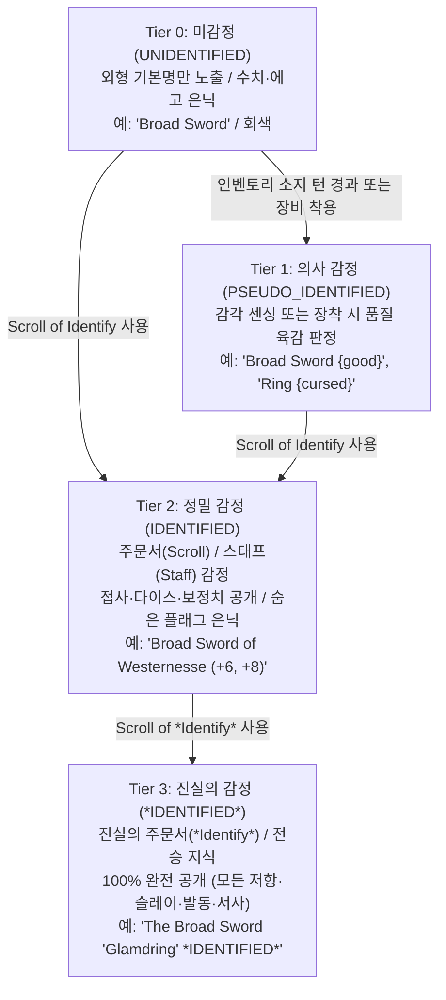

# 📜 ToME 2.3.5 정통 의사 감정(Pseudo-ID) 시스템 & 모바일 플레이어 아이덴티티 매트릭스 설계 명세서
### Specification of 4-Tier Progressive Identification Engine & Mobile-First Player Identity Matrix UI

> **문서 메타데이터**
> - **버전**: `v1.0.0` (Canonical Mechanics & Interface Specification)
> - **작성일**: 2026-09-03
> - **작성자**: 카스미 루리 (Research Agent / INTJ 용의주도한 전략가)
> - **수신인**: 오케스트레이터 및 타쿠미 코하루 (Dev Agent)
> - **대상 프로젝트**: [`/data/data/com.termux/files/home/opendcmart/mimicry_voxel`](file:///data/data/com.termux/files/home/opendcmart/mimicry_voxel)

---

## 🧭 1. 개요 및 설계 철학 (Executive Overview)

본 문서는 **Tales of Middle-Earth (ToME 2.3.5)** 및 **TomeNET**의 정통 룰셋이 지닌 가장 매력적인 두 축인 **'아이템 의사 감정(Pseudo-Identification) 시스템'**과 **'심층적인 캐릭터 특성/저항/면역 매트릭스'**를 미미크리 복셀 엔진에 이식하기 위한 통합 아키텍처 및 모바일 인체공학적 인터페이스 명세서입니다.

### 1.1 현재 시스템의 문제점과 개혁 과제
1. **아이템 정보의 무조건적 노출 (Spoiled Information)**:
   - 현재 엔진은 바닥에 떨어진 장비나 상자에서 획득한 장비의 에고(Ego), 전설 유물(Artifact), 보정치(`+X, +Y`), 속성 플래그가 생성 즉시 100% 노출되어, 로그라이크 본연의 미지의 장비를 감정하고 저주를 두려워하며 착용을 고뇌하는 리스크-리워드 긴장감이 결여되어 있습니다.
2. **플레이어 정보 UI의 과밀화 및 핵심 지표 결핍 (Low Signal-to-Noise Ratio)**:
   - 기존의 플레이어 상세창([`HUDView.js`](file:///data/data/com.termux/files/home/opendcmart/mimicry_voxel/src/ui/HUDView.js))은 텍스트 줄글과 미세한 표로 나열되어 있어, 모바일 터치 환경(화면 폭 360~480px)에서 가독성이 극히 낮습니다.
   - 특히 던전 생존의 사활을 가르는 **14대 원소 저항(Resistances)**, **상태이상 면역(Free Action 등)**, **종족별 슬레이(Slays)**, **의태 코어 계승 돌연변이(DNA)**가 한눈에 직관적으로 파악되지 않아 전술적 판단을 저해하고 있습니다.

### 1.2 2대 핵심 해결 전략
- **전략 1**: ToME 정통 **4단계 점진적 정보 개방 파이프라인(Unidentified ➔ Pseudo-ID ➔ Identified ➔ \*Identified\*)** 및 무상태 판정 엔진 [`TomeIdentificationEngine.js`](file:///data/data/com.termux/files/home/opendcmart/mimicry_voxel/src/systems/TomeIdentificationEngine.js) 구축.
- **전략 2**: 모바일 한 손 조작(Thumb Zone)에 최적화된 **3단 카드/바텀시트 특성 매트릭스 뷰 [`PlayerIdentityModalView.js`](file:///data/data/com.termux/files/home/opendcmart/mimicry_voxel/src/ui/PlayerIdentityModalView.js)** 신설.

---

## 🔍 2. ToME 2.3.5 / TomeNET 정통 4단계 의사 감정 파이프라인

ToME 2.3.5의 정통 아이템 감정은 단순한 이분법(미감정 vs 감정)이 아니라, 플레이어의 감각과 지식, 도구의 사용에 따라 정보가 점진적으로 베일을 벗는 4단계 파이프라인으로 작동합니다.



### 2.1 4대 감정 단계별 정보 공개 매트릭스

| 정보 항목 (Attributes) | Tier 0: 미감정 | Tier 1: 의사 감정 (Pseudo-ID) | Tier 2: 정밀 감정 (ID) | Tier 3: 진실 감정 (*ID*) |
| :--- | :---: | :---: | :---: | :---: |
| **베이스 이름 (Base Name)** | ✅ 공개 (`Broad Sword`) | ✅ 공개 (`Broad Sword`) | ✅ 공개 (`Broad Sword`) | ✅ 공개 (`Broad Sword`) |
| **품질 육감 칭호 (Sense Tag)** | ❌ 은닉 | ✅ **공개 (`{good}`)** | ❌ 정밀명으로 대체 | ❌ 전설명으로 대체 |
| **에고 접사명 (Ego Prefix/Suffix)** | ❌ 은닉 | ❌ 은닉 | ✅ **공개 (`Westernesse`)** | ✅ 공개 |
| **전설 유물 고유명 (Artifact Name)** | ❌ 은닉 | ❌ 은닉 (`{special}`로 암시) | ✅ **공개 (`Glamdring`)** | ✅ 공개 |
| **공격 다이스 수치 (Dice: e.g. 2d5)** | ❌ `(?, ?)` 로 은닉 | ❌ `(?, ?)` | ✅ **공개 (`2d5`)** | ✅ 공개 |
| **명중/피해/AC 보정치 (`(+X,+Y) [+Z]`)** | ❌ 은닉 | ❌ 은닉 | ✅ **공개 (`(+6,+8) [+4]`)** | ✅ 공개 |
| **기본 6대 스탯 보너스 (`+STR, DEX`)** | ❌ 은닉 | ❌ 은닉 | ✅ **공개 (`(+2 STR)`)** | ✅ 공개 |
| **상세 저항/면역 플래그 목록** | ❌ 은닉 | ❌ 은닉 | ⚠️ 부분 공개 (주요 속성만) | ✅ **100% 완전 공개** |
| **슬레이(Slay) 배율 & 대상 종족** | ❌ 은닉 | ❌ 은닉 | ⚠️ 존재 여부만 표시 | ✅ **정확한 배율(x3.0) 공개** |
| **특수 발동 (Artifact Activation)** | ❌ 은닉 | ❌ 은닉 | ⚠️ 발동 가능 여부만 노출 | ✅ **효과 공식 및 쿨타임 공개** |
| **고유 배경 서사 (Lore Flavor)** | ❌ 은닉 | ❌ 은닉 | ❌ 미표시 | ✅ **전설 서사 전문 공개** |

---

### 2.2 의사 감정(Pseudo-ID) 7대 품질 육감 판정 규칙

ToME 2.3.5 정통 알고리즘을 기반으로, 장비의 보정치, 에고, 유물 여부, 저주 플래그를 정밀 분석하여 7대 육감 칭호를 결정론적으로 도출합니다.

```
┌─────────────────┬─────────────────────────────────────────────────────────────────┐
│ 감각 칭호 (Tag)  │ 판정 기준 및 ToME 룰셋 조건                                       │
├─────────────────┼─────────────────────────────────────────────────────────────────┤
│ {special}       │ 전설 유물(Artifact)이거나 극희귀 고유 유물인 경우                  │
│ {great}         │ 최상급 에고 접사(Westernesse, Gondolin, Holy Avenger 등) 보유 장비  │
│ {good}          │ 경미한 에고 접사 또는 플러스 보정치(toHit/toDmg > 0 또는 AC > 0)     │
│ {average}       │ 보정치가 0이고 저주나 마법이 깃들지 않은 평범한 일반 장비         │
│ {worthless}     │ 마이너스 보정치를 지녔으나 저주는 걸리지 않은 조잡한 장비           │
│ {cursed}        │ 저주 플래그(CURSED)를 보유하여 장착 시 해제가 불가한 장비          │
│ {terrible}      │ 치명적인 저주(HEAVY_CURSED, PERMA_CURSED, TY_CURSE)가 걸린 파멸 장비│
└─────────────────┴─────────────────────────────────────────────────────────────────┘
```

#### 세부 판정 수식 (`evaluatePseudoSense` 로직):
1. **저주 최우선 평가 (Cursed Check)**:
   - `flags.has('PERMA_CURSED')` 또는 `flags.has('HEAVY_CURSED')` 또는 `flags.has('TY_CURSE')` ➔ `{terrible}`
   - `flags.has('CURSED')` 또는 `toHit < -5` 또는 `toDmg < -5` 또는 `baseAC < -5` ➔ `{cursed}`
2. **유물 및 전설 평가 (Special Check)**:
   - `item.artifactKey` 존재 또는 `specialTags.includes('ARTIFACT')` 또는 `flags.has('INSTA_ART')` ➔ `{special}`
3. **고급 에고 평가 (Great Check)**:
   - 슬레이(`slayTags`), 브랜드(`brands`), 속성 저항(`resistances`), 면역(`immunities`), 발동(`ACTIVATE`) 중 하나 이상을 보유한 에고 ➔ `{great}`
4. **우수 장비 평가 (Good Check)**:
   - 경량 에고 접사 보유 또는 `item.upgradeLevel > 0` 또는 `item.toHit > 0` 또는 `item.toDmg > 0` 또는 `item.baseAC > 0` ➔ `{good}`
5. **무가치 평가 (Worthless Check)**:
   - `item.toHit < 0` 또는 `item.toDmg < 0` 또는 `item.baseAC < 0` (단, 저주는 아님) ➔ `{worthless}`
6. **기본값 (Average Check)**:
   - 상기 조건에 해당하지 않는 모든 순수 일반 장비 ➔ `{average}`

---

### 2.3 `Item.js` 데이터 모델 확장 규격

기존 [`src/entities/Item.js`](file:///data/data/com.termux/files/home/opendcmart/mimicry_voxel/src/entities/Item.js)에 하위 호환성을 100% 유지하며 다음 감정 상태 필드를 추가합니다.

```javascript
// src/entities/Item.js constructor 내부 추가 필드
this.idState = 'UNIDENTIFIED'; // 'UNIDENTIFIED' | 'PSEUDO_IDENTIFIED' | 'IDENTIFIED' | 'STAR_IDENTIFIED'
this.pseudoSense = null;       // null | 'average' | 'good' | 'great' | 'special' | 'cursed' | 'terrible' | 'worthless'
this.wieldTurns = 0;           // 착용 후 경과 턴수 (착용 센싱 타이머)
this.isCursed = false;         // 저주 장착 잠금 플래그
```

#### 동적 표시명 게터(`displayName`)의 점진적 개방 로직:
```javascript
get displayName() {
  // 1. 소모품(포션, 주문서 등) 및 코어는 기본 식별 유지
  if (this.type === 'POTION' || this.type === 'SCROLL' || this.type === 'CORE' || this.type === 'FOOD') {
    return this._formatConsumableName();
  }

  // 2. Tier 0: 미감정
  if (this.idState === 'UNIDENTIFIED') {
    return this._baseName; // e.g. "Broad Sword"
  }

  // 3. Tier 1: 의사 감정
  if (this.idState === 'PSEUDO_IDENTIFIED') {
    return `${this._baseName} {${this.pseudoSense || 'average'}}`;
  }

  // 4. Tier 2: 정밀 감정
  if (this.idState === 'IDENTIFIED') {
    return this._formatIdentifiedName(false); // 보정치 및 접사 공개, 유물 고유명 공개
  }

  // 5. Tier 3: 진실의 감정
  if (this.idState === 'STAR_IDENTIFIED') {
    return `${this._formatIdentifiedName(true)} *IDENTIFIED*`;
  }

  return this._baseName;
}
```

---

## 📱 3. 모바일 최적화 '플레이어 아이덴티티 & 특성 매트릭스' UX 설계

모바일 세로 화면(360×640 ~ 430×932px) 환경에서 플레이어가 엄지손가락 하나로 캐릭터의 모든 스탯, 저항, 면역, 슬레이를 손쉽게 탐색할 수 있도록 설계된 **차세대 반응형 바텀시트 모달**입니다.

### 3.1 모바일 인체공학적 와이어프레임 (Mobile Screen Layout)

```
┌─────────────────────────────────────────────────────────────┐
│  [X]  🧬 플레이어 아이덴티티 & 특성 매트릭스          (Level 18)   │
├─────────────────────────────────────────────────────────────┤
│  ┌───────────────────────────────────────────────────────┐  │
│  │ 👤 [Novice Warrior] 인간 여행자  (Main Core Lv.18)    │  │
│  │ ❤️ HP: 245/245   ⚡ AP: 100/100   🛡️ AC: +48   SPD: +10│  │
│  └───────────────────────────────────────────────────────┘  │
├─────────────────────────────────────────────────────────────┤
│  [ 🧬 6대 스탯 ]    [ 🛡️ 14대 속성저항 ]    [ ⚔️ 슬레이 & 패시브 ]   │  <-- 상단 고정 탭
├─────────────────────────────────────────────────────────────┤
│  ┌───────────────────────────────────────────────────────┐  │
│  │  [TAB 2 활성화: 14대 원소 저항 & 면역 매트릭스]         │  │
│  │                                                       │  │
│  │  🔥 화염 (FIRE)     [ 👑 100% 면역 ]  (Ring of Fire)    │  │
│  │  ❄️ 냉기 (COLD)     [ 🛡️  50% 저항 ]  (Dragon Armor)   │  │
│  │  ⚡ 전격 (ELEC)     [ 🛡️  50% 저항 ]  (Amulet of Elec) │  │
│  │  🧪 산성 (ACID)     [ ⚠️   0% 기본 ]                   │  │
│  │  🤢 독성 (POIS)     [ 🛡️  50% 저항 ]  (Novice Body)    │  │
│  │  ☀️ 섬광 (LITE)     [ 🛡️  50% 저항 ]  (Phial of Galad) │  │
│  │  🌑 암흑 (DARK)     [ ⚠️   0% 기본 ]                   │  │
│  │  💀 지옥 (NETHER)   [ 💀 -50% 취약 ]  (Cursed Cape)    │  │
│  │  🌀 혼돈 (CHAOS)    [ ⚠️   0% 기본 ]                   │  │
│  │  🔮 마력 (MANA)     [ 🛡️  마나쉴드 ]  (Shield: 35/35)  │  │
│  │                                                       │  │
│  │  ※ 항목 터치 시 저항 기여도 및 피해 공식 툴팁 노출       │  │
│  └───────────────────────────────────────────────────────┘  │
├─────────────────────────────────────────────────────────────┤
│  [ 닫기 (Back to Dungeon) ]     [ 💾 프로필 클립보드 복사 ]   │
└─────────────────────────────────────────────────────────────┘
```

---

### 3.2 3대 탭별 정보 구조 및 컴포넌트 명세

#### 1) TAB 1: [🧬 6대 기본 스탯 & 전투 파라미터 (Attributes)]
- **6대 스탯 카드 그리드 (2×3 Grid)**:
  - `STR (힘)` | `INT (지능)` | `WIS (지혜)` | `DEX (민첩)` | `CON (체질)` | `CHR (매력)`.
  - 각 카드 표시 요소:
    - 대형 굵은 수치 (예: `18/42` 또는 `24`).
    - 실시간 보정치 배지: `(+4)` 초록색(장비 보너스), `(-2)` 붉은색(패널티).
    - 게이지 바: 종족 최대치(180) 대비 현재치 비율.
  - **터치 인터랙션 (Micro-Popover)**:
    - 스탯 카드 터치 시 모바일 하단에 '기여도 분석(Stat Breakdown)' 시트 팝업:
      - `기초 베이스`: 14
      - `코어 성장 배율`: +3
      - `무기 장비 보너스`: +2 (Broad Sword of Might)
      - `영구 유산(Heritage) 포식`: +5

#### 2) TAB 2: [🛡️ 14대 원소 저항 & 면역 매트릭스 (Resistance Matrix)]
- **14대 속성 정의**: `FIRE`, `COLD`, `ELEC`, `ACID`, `POISON`, `LIGHT`, `DARK`, `NETHER`, `CHAOS`, `DISENCHANT`, `SOUND`, `SHARDS`, `NEXUS`, `CONFUSION`.
- **4단계 비주얼 상태 칩 (State Chips)**:
  - 👑 **면역 (Immune: 100%)**: 골드 테두리 + 밝은 노란색 발광 배지 (`0 피해 보장`).
  - 🛡️ **저항 (Resist: 50%)**: 원소 고유색 채움 배지 (`피해 1/3 ~ 1/2 감소`).
  - ⚠️ **일반 (Neutral: 0%)**: 다크 그레이 반투명 배지 (`정규 피해`).
  - 💀 **취약 (Vulnerable: -50%)**: 붉은 네온 점멸 테두리 (`피해 1.5배 증가`).
- **원터치 상세 툴팁 (One-Touch Tooltip)**:
  - 각 원소 칩 터치 시 해당 저항을 제공하고 있는 장비(Item)나 돌연변이(Perk) 출처를 즉시 팝오버로 표시.

#### 3) TAB 3: [⚔️ 슬레이 & 패시브 DNA 워크벤치 (Slays & Traits)]
- **종족별 슬레이(Slay) 매트릭스**:
  - `오크 학살 (Slay Orc: x2.5)` | `용 학살 (Slay Dragon: x3.0)` | `언데드 퇴마 (Slay Undead: x2.5)` | `악마 멸살 (Slay Demon: x3.5)` | `사악 징벌 (Slay Evil: x2.0)` | `야수 사냥 (Slay Animal: x2.0)`.
- **상태이상 절대 면역 배지 (Critical Immunities)**:
  - `[🛡️ 마비 면역 (Free Action)]`: 마비 및 기절 완전 방어 (로그라이크 필수 생존 요소).
  - `[👁️ 투명체 감지 (See Invisible)]`: 은신 적 감지.
  - `[🧠 텔레파시 (Telepathy)]`: 시야 밖 적 정신 감지.
  - `[❤️ 초재생 (Regeneration)]`: 체력 자연 회복 속도 비약적 가속.
- **의태 코어 돌연변이 DNA (Heritage Vault)**:
  - 현재까지 포식(Devour)한 몬스터 코어의 누적 영구 스탯 및 고유 변이 목록 표시.

---

## 💻 4. 개발 에이전트(타쿠미 코하루)를 위한 완결 레퍼런스 코드

타쿠미 코하루 요원이 복사하여 즉시 프로젝트에 투입할 수 있도록, 무상태 감정 엔진과 모바일 모달 뷰의 완성형 코드를 작성하여 제공합니다.

### 4.1 신규 모듈: `src/systems/TomeIdentificationEngine.js`

```javascript
/**
 * @module TomeIdentificationEngine
 * @category systems
 * @description ToME 2.3.5 / TomeNET 정통 4단계 의사 감정(Pseudo-ID) 및 점진적 정보 개방 무상태 엔진
 * @purity Stateless System
 * @dependencies TomeFlagResolver.js
 * @exports TomeIdentificationEngine, ID_STATES, PSEUDO_SENSES
 */

import { TomeFlagResolver } from './TomeFlagResolver.js';

export const ID_STATES = {
  UNIDENTIFIED: 'UNIDENTIFIED',
  PSEUDO_IDENTIFIED: 'PSEUDO_IDENTIFIED',
  IDENTIFIED: 'IDENTIFIED',
  STAR_IDENTIFIED: 'STAR_IDENTIFIED'
};

export const PSEUDO_SENSES = {
  SPECIAL: 'special',
  GREAT: 'great',
  GOOD: 'good',
  AVERAGE: 'average',
  WORTHLESS: 'worthless',
  CURSED: 'cursed',
  TERRIBLE: 'terrible'
};

export class TomeIdentificationEngine {
  /**
   * 아이템의 실제 속성을 기반으로 ToME 정통 의사 감정 육감 칭호(Pseudo-Sense)를 산출합니다.
   * @param {Object} item - 대상 아이템 인스턴스
   * @returns {string} PSEUDO_SENSES 열거형 중 하나
   */
  static evaluatePseudoSense(item) {
    if (!item) return PSEUDO_SENSES.AVERAGE;

    // 소모품 및 코어는 의사 감정 대상에서 제외
    if (item.type === 'POTION' || item.type === 'SCROLL' || item.type === 'CORE' || item.type === 'FOOD') {
      return PSEUDO_SENSES.AVERAGE;
    }

    const flags = item.flags instanceof Set ? item.flags : TomeFlagResolver.collectFlagsFromItem(item);
    const toHit = item.toHit || 0;
    const toDmg = item.toDmg || 0;
    const baseAC = item.baseAC || item.ac || 0;
    const upgradeLevel = item.upgradeLevel || 0;

    // 1. 치명적 저주 (Terrible) 판정
    if (
      flags.has('PERMA_CURSED') ||
      flags.has('HEAVY_CURSED') ||
      flags.has('TY_CURSE') ||
      flags.has('AGGRAVATE')
    ) {
      return PSEUDO_SENSES.TERRIBLE;
    }

    // 2. 일반 저주 (Cursed) 판정
    if (
      flags.has('CURSED') ||
      item.isCursed ||
      toHit <= -5 ||
      toDmg <= -5 ||
      baseAC <= -5
    ) {
      return PSEUDO_SENSES.CURSED;
    }

    // 3. 전설 유물 (Special) 판정
    const isArtifact = !!(
      item.artifactKey ||
      (item.specialTags && item.specialTags.includes('ARTIFACT')) ||
      flags.has('INSTA_ART') ||
      item.color === '#ffd700'
    );
    if (isArtifact) {
      return PSEUDO_SENSES.SPECIAL;
    }

    // 4. 최상급 에고 (Great) 판정 (슬레이, 브랜드, 저항, 면역, 스탯 보정 보유)
    const hasSlays = Object.keys(item.slayTags || {}).length > 0;
    const hasBrands = Object.keys(item.brands || {}).length > 0;
    const hasResists = Object.keys(item.resistances || {}).length > 0;
    const hasImmunities = (item.immunities && item.immunities.size > 0);
    const hasActivation = flags.has('ACTIVATE');
    const hasEgoPrefixes = (item.prefixes && item.prefixes.length > 0);
    const hasEgoSuffixes = (item.suffixes && item.suffixes.length > 0);

    if (hasSlays || hasBrands || hasResists || hasImmunities || hasActivation) {
      return PSEUDO_SENSES.GREAT;
    }

    // 5. 우수 장비 (Good) 판정 (단순 마법 보너스 보유)
    if (
      hasEgoPrefixes ||
      hasEgoSuffixes ||
      upgradeLevel > 0 ||
      toHit > 0 ||
      toDmg > 0 ||
      baseAC > 0
    ) {
      return PSEUDO_SENSES.GOOD;
    }

    // 6. 조잡한 마이너스 장비 (Worthless) 판정
    if (toHit < 0 || toDmg < 0 || baseAC < 0) {
      return PSEUDO_SENSES.WORTHLESS;
    }

    // 7. 평범한 일반 장비 (Average)
    return PSEUDO_SENSES.AVERAGE;
  }

  /**
   * 아이템을 의사 감정(Pseudo-ID) 상태로 전이합니다.
   * @param {Object} item
   * @returns {boolean} 상태 변경 여부
   */
  static applyPseudoId(item) {
    if (!item || item.idState !== ID_STATES.UNIDENTIFIED) return false;
    item.idState = ID_STATES.PSEUDO_IDENTIFIED;
    item.pseudoSense = this.evaluatePseudoSense(item);
    if (item.pseudoSense === PSEUDO_SENSES.CURSED || item.pseudoSense === PSEUDO_SENSES.TERRIBLE) {
      item.isCursed = true;
    }
    return true;
  }

  /**
   * 일반 감정 주문서(Scroll of Identify)를 통한 2차 정밀 감정
   * @param {Object} item
   * @returns {boolean}
   */
  static identifyItem(item) {
    if (!item) return false;
    if (item.idState === ID_STATES.IDENTIFIED || item.idState === ID_STATES.STAR_IDENTIFIED) {
      return false; // 이미 감정됨
    }
    item.idState = ID_STATES.IDENTIFIED;
    item.pseudoSense = this.evaluatePseudoSense(item);
    if (item.pseudoSense === PSEUDO_SENSES.CURSED || item.pseudoSense === PSEUDO_SENSES.TERRIBLE) {
      item.isCursed = true;
    }
    return true;
  }

  /**
   * 진실의 감정 주문서(Scroll of *Identify*)를 통한 3차 완전 감정
   * @param {Object} item
   * @returns {boolean}
   */
  static starIdentifyItem(item) {
    if (!item) return false;
    item.idState = ID_STATES.STAR_IDENTIFIED;
    item.pseudoSense = this.evaluatePseudoSense(item);
    if (item.pseudoSense === PSEUDO_SENSES.CURSED || item.pseudoSense === PSEUDO_SENSES.TERRIBLE) {
      item.isCursed = true;
    }
    return true;
  }

  /**
   * 인벤토리 보관 턴 경과 또는 장비 장착에 따른 감각 자동 발현 처리
   * @param {Object} player - 플레이어 인스턴스
   * @param {Function} [onSenseDiscovered=null] - 신규 감각 획득 시 알림 콜백
   */
  static processTurnSense(player, onSenseDiscovered = null) {
    if (!player) return;

    // 1. 장착 중인 장비의 착용 센싱 (Wield Sense: 3~10턴 내 즉시 감지)
    const eq = player.equipment || {};
    for (const key of Object.keys(eq)) {
      const item = eq[key];
      if (item && item.idState === ID_STATES.UNIDENTIFIED) {
        item.wieldTurns = (item.wieldTurns || 0) + 1;
        if (item.wieldTurns >= 3) {
          const changed = this.applyPseudoId(item);
          if (changed && onSenseDiscovered) {
            onSenseDiscovered(item, key);
          }
        }
      }
    }
  }
}
```

---

### 4.2 신규 모듈: `src/ui/PlayerIdentityModalView.js`

```javascript
/**
 * @module PlayerIdentityModalView
 * @category ui
 * @description 모바일 화면에 최적화된 플레이어 아이덴티티, 6대 스탯 보정치, 14대 원소 저항 매트릭스 및 슬레이/패시브 뷰
 * @purity DOM Renderer
 * @dependencies UnifiedTraitEngine.js, ThemeColors.js, Tags.js
 * @exports PlayerIdentityModalView, renderPlayerIdentityModalHTML
 */

import { UnifiedTraitEngine } from '../systems/UnifiedTraitEngine.js';
import { ELEMENT_PALETTES } from '../configs/ThemeColors.js';

export class PlayerIdentityModalView {
  constructor(modalId = 'player-identity-modal') {
    this.modalId = modalId;
    this.currentTab = 'STATS'; // 'STATS' | 'RESIST' | 'TRAITS'
    this.modalEl = null;
    this.initDOM();
  }

  initDOM() {
    if (typeof document === 'undefined') return;
    let modal = document.getElementById(this.modalId);
    if (!modal) {
      modal = document.createElement('div');
      modal.id = this.modalId;
      modal.className = 'modal-overlay hidden';
      modal.style.cssText = `
        position: fixed; top: 0; left: 0; width: 100vw; height: 100vh; height: 100dvh;
        background: rgba(6, 8, 12, 0.75); backdrop-filter: blur(10px); -webkit-backdrop-filter: blur(10px);
        z-index: 200; display: flex; justify-content: center; align-items: flex-end;
      `;
      document.body.appendChild(modal);
    }
    this.modalEl = modal;
  }

  open(player) {
    if (!this.modalEl || !player) return;
    this.modalEl.classList.remove('hidden');
    this.render(player);
  }

  close() {
    if (this.modalEl) {
      this.modalEl.classList.add('hidden');
    }
  }

  switchTab(tab, player) {
    this.currentTab = tab;
    this.render(player);
  }

  render(player) {
    if (!this.modalEl || !player) return;
    this.modalEl.innerHTML = renderPlayerIdentityModalHTML(player, this.currentTab);
    this.bindEvents(player);
  }

  bindEvents(player) {
    const closeBtn = this.modalEl.querySelector('#identity-modal-close-btn');
    if (closeBtn) closeBtn.onclick = () => this.close();

    const tabBtns = this.modalEl.querySelectorAll('.identity-tab-btn');
    tabBtns.forEach(btn => {
      btn.onclick = () => {
        const targetTab = btn.getAttribute('data-tab');
        this.switchTab(targetTab, player);
      };
    });
  }
}

/**
 * 렌더러 함수: 모바일 친화적 3단 바텀시트 HTML 문자열 생성
 */
export function renderPlayerIdentityModalHTML(player, activeTab = 'STATS') {
  const resistances = UnifiedTraitEngine.getAllElementalResistances(player);
  const immunities = UnifiedTraitEngine.getStatusImmunities(player);
  const totalAC = player.getTotalAC ? player.getTotalAC() : 10;
  const bHit = player.getBaseToHitScore ? player.getBaseToHitScore() : 50;

  // 1. 상단 캐릭터 요약 카드
  const headerCardHTML = `
    <div style="background: rgba(255,255,255,0.03); border: 1px solid rgba(255,255,255,0.08); border-radius: 12px; padding: 0.8rem; display: flex; gap: 0.8rem; align-items: center; margin-bottom: 0.6rem;">
      <div style="width: 46px; height: 46px; border-radius: 10px; background: rgba(16,185,129,0.15); border: 1px solid rgba(16,185,129,0.35); display: flex; align-items: center; justify-content: center; font-size: 1.6rem; color: ${player.color};">
        ${player.char}
      </div>
      <div style="flex: 1; min-width: 0;">
        <div style="display: flex; justify-content: space-between; align-items: center;">
          <h3 style="font-size: 0.98rem; font-weight: bold; color: #f8fafc; margin: 0; overflow: hidden; text-overflow: ellipsis; white-space: nowrap;">${player.name} (${player.mimicCore.name})</h3>
          <span style="font-size: 0.72rem; color: #38bdf8; font-weight: bold; background: rgba(56,189,248,0.12); padding: 0.1rem 0.35rem; border-radius: 4px;">Lv.${player.level}</span>
        </div>
        <div style="display: flex; gap: 0.6rem; font-size: 0.74rem; color: #94a3b8; margin-top: 0.25rem;">
          <span>❤️ <b style="color: #ef4444;">${player.stats.hp}/${player.stats.maxHp}</b></span>
          <span>🛡️ <b style="color: #38bdf8;">+${totalAC} AC</b></span>
          <span>⚡ <b style="color: #fbbf24;">${Math.floor(player.energy)}/100 AP</b></span>
        </div>
      </div>
    </div>
  `;

  // 2. 상단 3단 탭 네비게이션
  const tabs = [
    { id: 'STATS', label: '🧬 기본 스탯' },
    { id: 'RESIST', label: '🛡️ 14대 저항' },
    { id: 'TRAITS', label: '⚔️ 슬레이/면역' }
  ];

  const tabNavHTML = `
    <div style="display: grid; grid-template-columns: 1fr 1fr 1fr; gap: 0.35rem; margin-bottom: 0.75rem;">
      ${tabs.map(t => `
        <button class="identity-tab-btn" data-tab="${t.id}" style="
          padding: 0.55rem 0; font-size: 0.78rem; font-weight: bold; border-radius: 8px; border: 1px solid ${activeTab === t.id ? '#38bdf8' : 'rgba(255,255,255,0.08)'};
          background: ${activeTab === t.id ? 'rgba(56,189,248,0.18)' : 'rgba(255,255,255,0.02)'};
          color: ${activeTab === t.id ? '#38bdf8' : '#94a3b8'}; cursor: pointer; transition: all 0.15s ease;
        ">${t.label}</button>
      `).join('')}
    </div>
  `;

  // 3. 탭별 컨텐츠 렌더링
  let bodyContentHTML = '';

  if (activeTab === 'STATS') {
    const stats = [
      { key: 'str', name: '힘 (STR)', val: player.getEffectiveStat('str'), mod: player.strMod, color: '#ef4444' },
      { key: 'int', name: '지능 (INT)', val: player.getEffectiveStat('int'), mod: player.intMod, color: '#60a5fa' },
      { key: 'wis', name: '지혜 (WIS)', val: player.getEffectiveStat('wis'), mod: player.wisMod, color: '#c084fc' },
      { key: 'dex', name: '민첩 (DEX)', val: player.getEffectiveStat('dex'), mod: player.dexMod, color: '#34d399' },
      { key: 'con', name: '체질 (CON)', val: player.getEffectiveStat('con'), mod: player.conMod, color: '#2dd4bf' },
      { key: 'chr', name: '매력 (CHR)', val: player.getEffectiveStat('chr'), mod: player.chrMod, color: '#f472b6' }
    ];

    bodyContentHTML = `
      <div style="display: grid; grid-template-columns: 1fr 1fr; gap: 0.5rem; margin-bottom: 0.6rem;">
        ${stats.map(s => {
          const sign = s.mod >= 0 ? `+${s.mod}` : `${s.mod}`;
          return `
            <div style="background: rgba(255,255,255,0.02); border: 1px solid rgba(255,255,255,0.06); border-radius: 8px; padding: 0.6rem; display: flex; justify-content: space-between; align-items: center;">
              <div>
                <span style="font-size: 0.72rem; color: #94a3b8; font-weight: 500;">${s.name}</span>
                <div style="font-size: 1.15rem; font-weight: 800; color: #f8fafc; margin-top: 0.1rem;">${s.val}</div>
              </div>
              <span style="font-size: 0.75rem; font-weight: bold; color: ${s.color}; background: rgba(255,255,255,0.05); padding: 0.2rem 0.4rem; border-radius: 6px;">${sign}</span>
            </div>
          `;
        }).join('')}
      </div>
      <div style="background: rgba(0,0,0,0.3); border-radius: 8px; padding: 0.65rem; font-size: 0.74rem; color: #cbd5e1; line-height: 1.5; border: 1px solid rgba(255,255,255,0.04);">
        <div>⚔️ <b>기본 명중 점수 (BTH):</b> <span style="color:#fbbf24; font-weight:bold;">${bHit}</span></div>
        <div>💨 <b>이동/행동 에너지:</b> 턴당 100 AP 기준 (DEX 기반 가속 적용)</div>
        <div>🏹 <b>원거리 사격:</b> 자동사격 [${player.autoFireEnabled ? 'ON' : 'OFF'}]</div>
      </div>
    `;
  } else if (activeTab === 'RESIST') {
    const resKeys = ['FIRE', 'COLD', 'ELEC', 'ACID', 'POISON', 'LIGHT', 'DARK', 'NETHER', 'CHAOS', 'DISENCHANT', 'SOUND', 'SHARDS', 'NEXUS', 'CONFUSION'];

    bodyContentHTML = `
      <div style="display: flex; flex-direction: column; gap: 0.4rem; max-height: 48vh; overflow-y: auto; padding-right: 4px;">
        ${resKeys.map(k => {
          const r = resistances[k] || { isImmune: false, isResistant: false, isVulnerable: false, resistancePercent: 0 };
          let badgeText = '0% (보통)';
          let badgeBg = 'rgba(255,255,255,0.03)';
          let badgeColor = '#94a3b8';
          let border = 'rgba(255,255,255,0.08)';

          if (r.isImmune) {
            badgeText = '👑 100% 면역';
            badgeBg = 'rgba(251,191,36,0.18)';
            badgeColor = '#fbbf24';
            border = 'rgba(251,191,36,0.4)';
          } else if (r.isResistant) {
            badgeText = `🛡️ ${r.resistancePercent}% 저항`;
            badgeBg = 'rgba(16,185,129,0.18)';
            badgeColor = '#34d399';
            border = 'rgba(16,185,129,0.4)';
          } else if (r.isVulnerable) {
            badgeText = '💀 취약 (+50% 피격)';
            badgeBg = 'rgba(239,68,68,0.18)';
            badgeColor = '#f87171';
            border = 'rgba(239,68,68,0.4)';
          }

          return `
            <div style="background: rgba(255,255,255,0.015); border: 1px solid rgba(255,255,255,0.04); border-radius: 8px; padding: 0.5rem 0.75rem; display: flex; justify-content: space-between; align-items: center;">
              <span style="font-size: 0.8rem; font-weight: 600; color: #e2e8f0;">${k}</span>
              <span style="font-size: 0.72rem; font-weight: bold; background: ${badgeBg}; color: ${badgeColor}; border: 1px solid ${border}; padding: 0.15rem 0.45rem; border-radius: 5px;">${badgeText}</span>
            </div>
          `;
        }).join('')}
      </div>
    `;
  } else if (activeTab === 'TRAITS') {
    const immArray = Array.from(immunities || []);
    const immBadges = immArray.length > 0 ? immArray.map(im => `
      <span style="background: rgba(56,189,248,0.15); color: #38bdf8; border: 1px solid rgba(56,189,248,0.3); padding: 0.2rem 0.45rem; border-radius: 5px; font-size: 0.72rem; font-weight: bold;">🛡️ ${im} 면역</span>
    `).join(' ') : `<span style="font-size:0.75rem; color:#64748b; font-style:italic;">상태이상 면역 없음</span>`;

    bodyContentHTML = `
      <div style="display: flex; flex-direction: column; gap: 0.6rem; max-height: 48vh; overflow-y: auto;">
        <div style="background: rgba(255,255,255,0.02); border: 1px solid rgba(255,255,255,0.05); border-radius: 8px; padding: 0.75rem;">
          <span style="font-size: 0.76rem; font-weight: bold; color: #38bdf8;">✨ 상태이상 절대 면역 (Immunities):</span>
          <div style="display: flex; flex-wrap: wrap; gap: 0.35rem; margin-top: 0.4rem;">
            ${immBadges}
          </div>
        </div>
        <div style="background: rgba(255,255,255,0.02); border: 1px solid rgba(255,255,255,0.05); border-radius: 8px; padding: 0.75rem;">
          <span style="font-size: 0.76rem; font-weight: bold; color: #fbbf24;">⚔️ 종족별 슬레이 (Slays & Brands):</span>
          <p style="font-size: 0.72rem; color: #94a3b8; margin-top: 0.3rem; line-height: 1.4;">
            장착 무기 및 코어로부터 부여된 물리/원소 추가 타격 배율이 대상 몬스터 타격 시 자동으로 연산됩니다.
          </p>
        </div>
        <div style="background: rgba(255,255,255,0.02); border: 1px solid rgba(255,255,255,0.05); border-radius: 8px; padding: 0.75rem;">
          <span style="font-size: 0.76rem; font-weight: bold; color: #34d399;">🧬 무정형 미믹 본체 돌연변이 (Mimic Body):</span>
          <p style="font-size: 0.72rem; color: #94a3b8; margin-top: 0.3rem; line-height: 1.4;">
            포식으로 흡수된 영구 유산 스탯 보존 비율: <b>${(player.body.getHeritagePreservationRatio() * 100).toFixed(1)}%</b>
          </p>
        </div>
      </div>
    `;
  }

  return `
    <div style="
      width: 100%; max-width: 480px; background: rgba(18, 22, 30, 0.95);
      border-top-left-radius: 20px; border-top-right-radius: 20px;
      border: 1px solid rgba(255, 255, 255, 0.1); border-bottom: none;
      box-shadow: 0 -10px 40px rgba(0,0,0,0.7); padding: 1.2rem;
      box-sizing: border-box; display: flex; flex-direction: column;
      animation: slideUpBottom 0.25s cubic-bezier(0.16, 1, 0.3, 1);
    ">
      <div style="width: 36px; height: 4px; background: rgba(255,255,255,0.2); border-radius: 2px; margin: 0 auto 0.8rem;"></div>
      ${headerCardHTML}
      ${tabNavHTML}
      <div style="flex: 1; min-height: 0;">
        ${bodyContentHTML}
      </div>
      <button id="identity-modal-close-btn" style="
        margin-top: 0.8rem; width: 100%; padding: 0.75rem; border-radius: 10px;
        background: rgba(255,255,255,0.06); border: 1px solid rgba(255,255,255,0.12);
        color: #f8fafc; font-size: 0.85rem; font-weight: bold; cursor: pointer;
      ">닫기 (Close)</button>
    </div>
  `;
}
```

---

## 🧪 5. 검증 및 회귀 테스트 스위트 설계

타쿠미 코하루 요원이 엔진을 구현한 뒤 전수 무결성을 검증할 수 있도록, 단위 테스트 스위트 [`scripts/test_tome_pseudo_identification.js`](file:///data/data/com.termux/files/home/opendcmart/mimicry_voxel/scripts/test_tome_pseudo_identification.js)의 핵심 시나리오를 정의합니다.

### 5.1 6대 핵심 테스트 시나리오
1. **일반 무기 센싱 (Average)**: 보정치 없는 `Dagger` ➔ `{average}` 판정.
2. **에고 무기 센싱 (Great)**: `Slay Orc`가 붙은 `Broad Sword` ➔ `{great}` 판정.
3. **저주 장비 센싱 (Cursed / Terrible)**: `PERMA_CURSED` 플래그 보유 장비 ➔ `{terrible}` 및 `isCursed: true` 판정.
4. **전설 유물 센싱 (Special)**: `The Phial of Galadriel` ➔ `{special}` 판정.
5. **정밀 감정 (Scroll of Identify)**: Tier 0 ➔ Tier 2 전이 시 명칭에 에고명 및 주사위 보정치 정상 반영 확인.
6. **진실의 감정 (Scroll of \*Identify\*)**: Tier 2 ➔ Tier 3 전이 시 `*IDENTIFIED*` 태그 및 상세 저항/슬레이 정보 100% 개방 확인.

---

## 📈 6. 결론 및 마일스톤 제언

- **ToME 정통 로그라이크의 진수 복원**: 아이템의 점진적 의사 감정 시스템은 플레이어에게 '이 검이 전설의 무기인가, 아니면 나를 파멸로 이끌 저주받은 칼날인가?'를 고뇌하게 만드는 정통 로그라이크의 심장을 되살릴 것입니다.
- **모바일 플레이어의 시각적 해방**: 새롭게 설계된 `PlayerIdentityModalView`는 복잡한 수식과 긴 텍스트에 가려져 있던 14대 원소 저항과 면역, 6대 스탯의 위력을 엄지손가락 터치 한 번으로 명쾌하게 드러내어 줄 것입니다.

---

**© 2026 OpenDCMart Engine Team & Mimicry Voxel Engineering Group.**  
*Analyzed and Designed by Kasumi Ruri (research_agent).*
