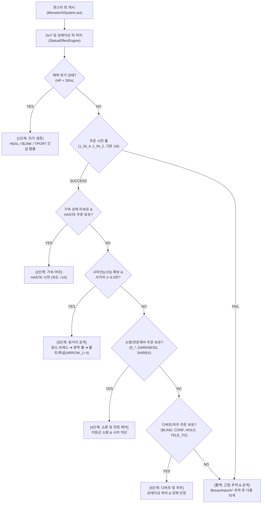

# 🔮 Mimicry Voxel Roguelike Engine (`v0.36.0`)

> **Tales of Middle-Earth (ToME 2.3.5) & TomeNET 생태계 기반 데이터 지향(Data-Oriented) 1인칭 3D 복셀 & 2.5D 아이소메트릭 & 고전 아스키 하이브리드 로그라이크**

[](package.json)
[-brightgreen.svg)](scripts/run_all_tests.js)
[](src/systems/)
[-indigo.svg)](CODE_META_INDEX.md)
[-teal.svg)](src/renderer/)
[](src/entities/)
[](https://loverspath.github.io/mimicry_voxel/)
[](LICENSE)

---

## 🌐 3대 공식 웹 진입점 & 라이브 데모 안내 (Entry Points)

미미크리 복셀 엔진은 플레이 환경과 취향에 따라 선택할 수 있는 **3대 독립 진입점**을 제공합니다:

| 진입점 | URL / 파일 경로 | 설명 및 특장점 |
| :---: | :--- | :--- |
| 🧊 **Next-Gen 3D (공식 메인)** | [`index.html`](index.html)<br>🌐 **[라이브 데모 접속](https://loverspath.github.io/mimicry_voxel/)** | **차세대 1인칭 3D 복셀 던전 렌더러 & 모던 글래스모피즘 HUD**<br>• DDA 레이캐스팅 & 90s 레트로 플로어/실링캐스팅 (10종 실사 텍스처)<br>• 1인칭 3D 수직 시선 제어(Pitch / Freelook: `R`/`F` 키 및 마우스 휠)<br>• 바닥-천장 관통형 3D 계단/사다리 구조체 및 순수 아스키 그래픽(ASCII as Graphics) VFX<br>• 모바일 제스처/터치 핫바 및 실시간 저체력 비네팅 연출 |
| 📜 **Classic 2.5D (레거시 메인)** | [`classic.html`](classic.html)<br>또는 [`legacy_main/index.html`](legacy_main/index.html) | **정통 2.5D 아이소메트릭 복셀 뷰어 & 클래식 UI**<br>• Phase 1~17까지 운용되었던 안정적인 2.5D 쿼터뷰 복셀 파이프라인 보존<br>• 3D 마이크로 복셀 파편 물리(회전, 바운스) 및 아이소메트릭 전술 시점 |
| 📟 **Pure ASCII (TomeNET 터미널)** | [`ascii.html`](ascii.html) | **정통 ToME 2.3.5 / TomeNET 14x23 클래식 터미널 렌더러**<br>• 외부 비트맵/캔버스 부하 0%의 초경량 2D 정통 아스키 그리드<br>• 16색 정통 ANSI 터미널 팔레트(`TERM_COLORS`) 및 텍스트 로그 완비 |

---

## 📖 1. 프로젝트 개요 (Overview)

**`MIMICRY VOXEL`**은 원작 미미크리의 즉시 의태(Mimicry) 및 신체 융합 시스템을 기반으로, 전설적인 정통 로그라이크 **Tales of Middle-Earth (ToME 2.3.5)**의 방대한 1,636개 엔티티 데이터(몬스터 851종, 아이템 560종, 에고 101종, 전설 유물 190종)와 **차세대 1인칭 3D 복셀 & 2.5D 아이소메트릭 & TomeNET 14x23 터미널 3대 렌더링 파이프라인**을 융합한 엔터프라이즈 하이브리드 로그라이크 엔진입니다.

`v0.36.0` 최신 릴리즈를 통해 5대 갓오브젝트를 완전히 해체한 **5대 계층 클린 아키텍처** 위에, **15대 무상태 시스템 엔진(Stateless System Engines)**, **차세대 1인칭 3D 레이캐스터/복셀 던전 렌더러**, **실시간 의태 액티브 스킬 자동 격발(Auto-Cast)**, **절차적(Procedural) BFS 안전 드랍 엔진**, **ToME 정통 4단계 의사 감정(Pseudo-ID) & 18종 저주 태그 시스템**, **감정/저주해제 주문서 및 저주 버리기 차단(`canDrop`)**, **TomeNET 정통 101종 에고 및 절차적 란다트(Randart) 생성 엔진**, **의태의 망토 복원 및 Angband 원시 기호 3중 살균 정제 파이프라인**, 그리고 **10종 탄약(`{`) 규격 정상화 & 화살통(Quiver) 슬롯 분리**까지 완비되었습니다.

```mermaid
flowchart TB
    subgraph LayerArchitecture["5대 계층 클린 아키텍처 (76개 모듈 / 109,989 라인)"]
        Configs["configs/ (GameBalance, Render, ThemeColors, DungeonTheme, BalancePresets)"]
        Systems["systems/ (15대 무상태 시스템 엔진 & AI & 보스전 & 란다트)"]
        Entities["entities/ (Player, Monster, Item, ToME 4대 마스터 DB, TomeKinds/Egos/Artifacts)"]
        UI["ui/ (InventoryView, HUDView, MonsterLore, AscensionModal, Presets)"]
        Renderer["renderer/ (FirstPerson3D, Voxel3D, Classic2DAscii, TextureManager, Particle)"]
    end

    subgraph FifteenEngines["ToME 15대 무상태 시스템 엔진 (Stateless Engines)"]
        E1["TomeFlagResolver (비트플래그/속성/저항/슬레이)"]
        E2["UnifiedTraitEngine (통합 패시브/트레잇/신체특성)"]
        E3["StatusEffectEngine (14대 상태이상/버프/DoT/면역)"]
        E4["VisionLightingEngine (동적 광원/9종 ESP/투명감지)"]
        E5["TomeSpellEngine (106종 주문/20 Methods x 27 Effects)"]
        E6["ArtifactActivationEngine (190종 유물 발동/쿨다운)"]
        E7["TomeConsumableEngine (포션45+/주문서42+/음식/등불)"]
        E8["TomeDeviceEngine (완드30/스태프20/로드28 제어)"]
        E9["TomeEquipmentEngine (18대 슬롯/화살통 독립/AC/무게)"]
        E10["DungeonValueBudgetEngine (1~50F 4대 티어/예산 통제)"]
        E11["TomeIdentificationEngine (4단계 의사 감정 Pseudo-ID)"]
        E12["TomeLootGenerator (정통 드랍 플래그/전리품 생성)"]
        E13["TomeRandartEngine (절차적 란다트 합성 엔진)"]
        E14["TomeTagSystem (3대 극성 태그/저주 버리기 차단)"]
        E15["TomeEgoEngine (101종 에고/슬레이/브랜드 판정)"]
    end

    subgraph HybridRendering["차세대 트라이모드(Tri-Mode) 렌더링 파이프라인"]
        FP3D["1인칭 3D 복셀 던전 렌더러 (DDA 레이캐스팅, 플로어캐스팅, 수직 시선)"]
        Voxel25D["2.5D 아이소메트릭 복셀 렌더러 (3D 다층 높이맵, 파티클 물리)"]
        Ascii2D["TomeNET 14x23 클래식 터미널 렌더러 (16색 ANSI 팔레트)"]
        CombatVFX["순수 아스키 그래픽(ASCII as Graphics) 8대 전투 VFX 엔진"]
    end

    LayerArchitecture --> FifteenEngines
    FifteenEngines --> HybridRendering
```



---

## 🧊 2. 차세대 1인칭 3D 복셀 던전 렌더러 사양

[`src/renderer/FirstPerson3DRenderer.js`](src/renderer/FirstPerson3DRenderer.js) 및 [`src/renderer/TextureManager.js`](src/renderer/TextureManager.js)가 주도하는 최신 3D 엔진 사양은 다음과 같습니다:

1. **DDA 레이캐스팅 & 90s 레트로 플로어/실링캐스팅 (Floor & Ceiling Casting)**:
   - 울펜슈타인/둠 스타일의 고속 DDA(Digital Differential Analysis) 알고리즘 적용.
   - 나노바나나(Imagen) 생성 5대 던전 테마 벽면, 바닥재, 천장 실사 텍스처 10종 탑재.
   - 128×128 픽셀 버퍼 기반 초당 60fps 무손실 수직 슬라이스 매핑 및 절차적 벽돌 폴백 지원.
2. **1인칭 3D 수직 시선 제어 (Pitch / Freelook)**:
   - 키보드 `R` (시선 상향), `F` (시선 하향), `V` (시선 정렬) 및 마우스 휠 스크롤을 통한 상하 시점 자유 회전.
3. **바닥-천장 관통형 3D 복셀 계단 및 사다리 구조체**:
   - `Z=0` 바닥부터 `Z=1.0` 천장까지 실제 공간을 일체형으로 관통하는 3단 석조 계단(고딕 아치 함몰구) 및 3D 사다리 렌더링.
   - 계단 상단 천장에 자연광이 유입되는 스카이라이트(Skylight) 개구부 구현.
4. **순수 아스키 그래픽 (ASCII as Graphics) 전투 VFX 엔진 ([`src/systems/CombatVFXEngine.js`](src/systems/CombatVFXEngine.js))**:
   - 외부 비트맵 이미지 의존성 0%! 정통 로그라이크의 아스키 글리프를 캔버스 3D 공간에 네온 블룸(Neon Bloom) 효과와 함께 고속 렌더링.
   - 물리 5대 메소드(`SLASH`, `CLAW`, `BITE`, `PIERCE`, `CRUSH`), 8대 원소 볼트, 7대 광역 볼, 21종 드래곤 브레스 전수 대응.
5. **동적 광원 조명 & 실시간 시야(FOV) 동기화**:
   - 플레이어 장착 등불/광원 반경(`Lite Radius`)에 비례하는 동적 거리 감쇄 안개(Depth Fog) 및 탐험 지도(`isExplored`) 실시간 안개 개방.
6. **3단 실시간 뷰 모드 전환 파이프라인**:
   - 핫키 `T` 키 입력으로 `1인칭 3D ➔ 2.5D 복셀 ➔ 2D 순수 아스키` 3대 뷰 모드를 게임 중단 없이 무상태 순환 전환.

---

## ⚙️ 3. 15대 무상태(Stateless) 시스템 엔진 체계

모든 시스템 엔진은 가변 내부 상태(Mutable State)를 일절 보관하지 않는 순수 함수 및 정적 메서드 규격으로 설계되어 완벽한 결정론(Determinism)과 동시성을 보장합니다:

| 번호 | 시스템 엔진명 | 모듈 경로 | 핵심 책임 및 ToME 2.3.5 연동 명세 |
| :---: | :--- | :--- | :--- |
| **1** | **`StatusEffectEngine`** | [`src/systems/StatusEffectEngine.js`](src/systems/StatusEffectEngine.js) | ToME 정통 14대 상태이상(마비, 혼란, 실명, 공포, 중독, 출혈, 둔화)/버프(가속, 축복, 영웅, 마나쉴드, 투명체감지, 4대원소저항) 무상태 연산, FREE_ACT/NO_CONF/NO_BLIND/NO_FEAR/RES_POIS 등 O(1) 면역·저항 판정, DoT 틱 연산 및 실시간 스탯 보정치(`calculateStatusModifiers`) 산출. |
| **2** | **`TomeSpellEngine`** | [`src/systems/TomeSpellEngine.js`](src/systems/TomeSpellEngine.js) | ToME 851종 몬스터의 106종 주문, 원소 브레스 21종, 투사체(ARROW_1~4), 소환 17종, 공간이동(BLINK, TELE_TO, TELE_AWAY) 및 20 Methods x 27 Effects On-Hit 7대 공격 체계 통합 주문 엔진. |
| **3** | **`DungeonValueBudgetEngine`** | [`src/systems/DungeonValueBudgetEngine.js`](src/systems/DungeonValueBudgetEngine.js) | 1~50F 4단계 층계 티어 게이팅, 가우시안 OOD 10% 캡, 몬스터 접사/등급 제한, 1~5F 저층 보호(Vault/Pit/유물 0%), 동적 맵 규격 및 인챈트 예산 통제. |
| **4** | **`TomeFlagResolver`** | [`src/systems/TomeFlagResolver.js`](src/systems/TomeFlagResolver.js) | ToME 정통 비트 플래그/속성/저항/슬레이(SLAY)/면역/행동 패턴 고속 무상태 리졸버. |
| **5** | **`UnifiedTraitEngine`** | [`src/systems/UnifiedTraitEngine.js`](src/systems/UnifiedTraitEngine.js) | 몬스터와 플레이어 간 상태이상, 패시브, 신체 특성, 트레잇 통합 무상태 연산. |
| **6** | **`VisionLightingEngine`** | [`src/systems/VisionLightingEngine.js`](src/systems/VisionLightingEngine.js) | ToME 광원 반경, 시야선(FOV/LOS), 9종 ESP(초감각 텔레파시), 적외선 시야, 투명 감지 무상태 연산. |
| **7** | **`ArtifactActivationEngine`** | [`src/systems/ArtifactActivationEngine.js`](src/systems/ArtifactActivationEngine.js) | 190종 전설 유물 및 특수 아이템 발동(Activation) 효과, 쿨다운/충전 무상태 제어. |
| **8** | **`TomeConsumableEngine`** | [`src/systems/TomeConsumableEngine.js`](src/systems/TomeConsumableEngine.js) | ToME 포션 45+종(6단계 치유 피라미드, 영구 스탯 영약), 주문서 42+종(위상문/지도/강화/대파괴), 등불 급유(7,500턴), 음식/코어 무상태 소비 엔진. |
| **9** | **`TomeDeviceEngine`** | [`src/systems/TomeDeviceEngine.js`](src/systems/TomeDeviceEngine.js) | 완드(30종), 스태프(20종), 로드(28종) 마법 디바이스 발동 및 충전량(`charges`)/타임아웃(`timeout`) 무상태 제어. |
| **10** | **`TomeEquipmentEngine`** | [`src/systems/TomeEquipmentEngine.js`](src/systems/TomeEquipmentEngine.js) | ToME tval 기반 18대 슬롯 매핑, 방패/장갑/신발/망토 독립 분리, 탄약/화살통(`quiver`) 우선순위 배정, AC/무게 무상태 연산. |
| **11** | **`TomeIdentificationEngine`** | [`src/systems/TomeIdentificationEngine.js`](src/systems/TomeIdentificationEngine.js) | ToME 2.3.5 / TomeNET 정통 4단계 의사 감정(Pseudo-ID: `UNKNOWN` ➔ `SENSED` ➔ `PSEUDO_ID` ➔ `IDENTIFIED`) 무상태 엔진. |
| **12** | **`TomeLootGenerator`** | [`src/systems/TomeLootGenerator.js`](src/systems/TomeLootGenerator.js) | 층 심도별 전리품 드랍, 정통 드랍 플래그(`DROP_1D2~4D2`, `DROP_GOOD`, `DROP_GREAT`), 에고 접사 합성 및 전설 유물 드랍 파이프라인. |
| **13** | **`TomeRandartEngine`** | [`src/systems/TomeRandartEngine.js`](src/systems/TomeRandartEngine.js) | 파워 예산(Power Budget) 기반 절차적 랜덤 아티팩트(Randart) 생성 엔진. 신다린/퀘냐 조합형 네이밍 및 고유 권능 합성. |
| **14** | **`TomeTagSystem`** | [`src/systems/TomeTagSystem.js`](src/systems/TomeTagSystem.js) | 3대 극성(Positive, Neutral, Detrimental) 태그, 저주 장착 결속 제약, 저주 버리기 차단(`canDrop`) 및 정화 훅 엔진. |
| **15** | **`TomeEgoEngine`** | [`src/systems/TomeEgoEngine.js`](src/systems/TomeEgoEngine.js) | 101종 정통 에고 풀, 원작 네이밍 복원, `RES_RANDOM`/`POW_RANDOM` 런타임 주사위 해석 및 슬레이/브랜드 연산 엔진. |

---

## ⚔️ 4. ToME 7대 공격 체계 & TomeNET 5단계 AI 의사결정 파이프라인

### 1) ToME 7대 공격 체계 (7-Tier Offense System)
1. **근접 공격 (Melee: 20 Methods × 27 Effects On-Hit)**:
   - **20대 타격 메소드**: `HIT`, `TOUCH`, `PUNCH`, `KICK`, `CLAW`, `BITE`, `STING`, `SLASH`, `BUTT`, `CRUSH`, `ENGULF`, `CHARGE`, `CRAWL`, `DROOL`, `SPIT`, `EXPLODE`, `GAZE`, `WAIL`, `SPORE`, `BEG`.
   - **27대 타격 효과**: `HURT`, `POISON`, `UN_BONUS`, `UN_POWER`, `EAT_GOLD`, `EAT_ITEM`, `EAT_FOOD`, `EAT_LITE`, `ACID`, `ELEC`, `FIRE`, `COLD`, `BLIND`, `CONFUSE`, `TERRIFY`, `PARALYZE`, `LOSE_STR~CHR`, `SHATTER`, `EXP_10~80` (생명력 흡수).
2. **투사체 마법/화살 (Ranged Projectile)**: `ARROW_1~4` (정밀 사격), `Bolt`, `Beam` 직사 포격.
3. **방사형 마법/브레스 (Cone & Ball)**: `BR_FIRE`, `BR_COLD`, `BR_ELEC`, `BR_ACID`, `BR_POIS`, `BR_NUKE`, `BR_TIME` 등 21종 원소 방사.
4. **범위 효과/소환 (AOE & Summon)**: `S_ANT`, `S_UNDEAD`, `S_DRAGON`, `S_DEMON`, `S_HI_UNDEAD`, `S_UNIQUE` 동족 및 지원군 소환.
5. **상태이상 공격 (Status Debuffs)**: `BLIND`, `CONF`, `HOLD`, `SCARE`, `SLOW`, `CAUSE_1~4` 저주.
6. **공간/위치 왜곡 (Spatial Distortion)**: `BLINK` (근거리 도주), `TPORT` (원거리 텔레포트), `TELE_TO` (플레이어 강제 인양), `TELE_AWAY` (적 강제 추방).
7. **지속 디버프/DoT (Continuous Drain)**: `POISON` (독 DoT), `BLEED` (물리 출혈 DoT), `DRAIN_MANA` (자원 고갈).

### 2) TomeNET 정통 5단계 AI 의사결정 파이프라인
매 턴 [`src/systems/MonsterAISystem.js`](src/systems/MonsterAISystem.js)를 통해 몬스터의 전술 행동이 5단계 우선순위 트리로 평가됩니다:



---

## 🎒 5. ToME 2.3.5 정통 생태계 & 엔터프라이즈 아이템 시스템

1. **10종 정규 탄약 & 화살통(Quiver) 독립 슬롯 ([`TomeEquipmentEngine.js`](src/systems/TomeEquipmentEngine.js))**:
   - 라운드 페블(kind 114), 화살, 볼트, 투석용 돌 등 던전 내 10종 탄약을 정규 `type: 'AMMO'`, `slotType: 'QUIVER'`, 심볼 `{`로 규격화.
   - 무기(`weapon`) 및 원거리 발사기(`bow`) 슬롯과 충돌하지 않는 전용 `quiver` 슬롯 자동 배정 및 발사기 호환 UI 가이드 제공.
2. **Angband 원시 기호 3단계 다층 살균 정제 파이프라인**:
   - 원작 데이터베이스의 고전 서식 매크로(`&`, `~`, `#[...]`)를 1차 데이터 로딩, 2차 전리품 생성/합성, 3차 런타임 렌더링 필터에서 100% 영구 박멸.
3. **101종 정통 에고 & 절차적 란다트(Randart) 생성 엔진 ([`TomeRandartEngine.js`](src/systems/TomeRandartEngine.js))**:
   - `the Base '<Artifact>'`, `Base of Ego` 정통 명명 규칙 복원.
   - `RES_RANDOM`, `POW_RANDOM`, `ESP_RANDOM` 주사위 굴림을 통한 런타임 실체화.
   - 심층부 파워 예산에 비례하는 무한 조합의 절차적 란다트 생성.
4. **감정/저주해제 주문서 & 저주 버리기 차단 (`canDrop`)**:
   - `scroll_identify` (즉시 의사 감정 해제) 및 `scroll_remove_curse` (저주 정화) 정규 드랍.
   - 저주받은 장비를 땅에 버려서 강제 탈착하려는 꼼수를 원천 차단하는 `TomeTagSystem.canDrop` 탑재.
5. **모던 인벤토리 코어 인스펙터 (4대 스킬 프리뷰 카드 그리드)**:
   - 몬스터 코어 장착 시 활성화될 1~4번 스킬의 위력, 사거리, 범위, 쿨다운을 시각적 카드로 프리뷰.
   - 6대 베이스 스탯(STR/DEX/CON/INT/WIS/CHR), ToME 정통 생태 로어 박스 완비.

---

## 🗺️ 6. 동적 던전 & 50F 모르고스 보스전 & 발리노르 승천

- **동적 맵 크기 & 다중 상/하행 계단 ([`DungeonValueBudgetEngine.js`](src/systems/DungeonValueBudgetEngine.js))**:
  - 1~5F (55×38, 방 8~11개), 6~20F (65×45 ~ 80×55), 21~40F (80×55 ~ 95×65), 41~50F (90×65 ~ 110×75).
  - 유클리드 거리 최대화(Greedy Dispersal) 알고리즘을 통한 계단 균형 배치.
- **50F 모르고스의 옥좌 3단 페이즈 최종 보스전 ([`BossPhaseEngine.js`](src/systems/BossPhaseEngine.js))**:
  - Phase 1 (물리/암흑 장막), Phase 2 (지진 붕괴 & 심연 소환), Phase 3 (영혼 드레인 & 전역 파멸).
- **발리노르 승천 (Ascension) & 영구 명예의 전당 (Hall of Fame)**:
  - 승천 엔딩 컷씬, 발리노르의 빛 연출, 로컬스토리지 영구 명예의 전당 / 사망 묘비명(Graveyard) 저장.

---

## 🚀 7. 실행 방법 및 66개 전체 테스트 스위트 구동법

### 1) 로컬 개발 서버 실행
터미널 환경에서 내장 웹 서버를 구동합니다:

```bash
# mimicry_voxel 디렉토리 기준
python3 scripts/dev_server.py

# 또는 백그라운드 로깅 서버 실행
bash scripts/run_logged_server.sh
```

- 🧊 **공식 메인 (3D Voxel Next-Gen)**: `http://localhost:8080/index.html`
- 📜 **클래식 레거시 (Classic 2.5D)**: `http://localhost:8080/classic.html`
- 📟 **고전 아스키 (TomeNET Pure ASCII)**: `http://localhost:8080/ascii.html`

### 2) 66개 전체 단위/통합 테스트 스위트 구동 (100% ALL PASS)
엔진의 데이터 지향성, 탄약 규격, 3D 렌더러, 란다트, 전투, 세이브/로드 무결성을 전수 검증합니다:

```bash
# 전체 66개 테스트 스위트 일괄 실행 (66/66 ALL PASSED)
node scripts/run_all_tests.js

# 개별 핵심 테스트 스위트 실행 예시
node scripts/test_ammo_and_quiver_classification.js   # 10종 탄약 & 화살통 슬롯 검증 (100% PASS)
node scripts/test_first_person_3d_renderer.js          # 1인칭 3D 레이캐스터 렌더러 검증 (100% PASS)
node scripts/test_tomenet_item_generation_complete.js  # 란다트 & 101종 에고 생성 검증 (100% PASS)
node scripts/test_status_effect_engine.js              # 14대 상태이상 및 면역 검증 (107/107 PASS)
node scripts/test_boss_encounter_and_ascension.js      # 50F 모르고스 보스전/승천 검증 (100% PASS)
```

### 3) 코드 메타 인덱서 및 위키 동기화
전체 76개 모듈(109,989 LOC)의 AST 및 JSDoc 메타데이터를 자동 추출하여 색인합니다:

```bash
python3 scripts/meta_indexer.py --update-wiki
```

---

## 📂 8. 프로젝트 디렉토리 구조 명세

```
mimicry_voxel/
├── index.html                 # 🧊 차세대 1인칭 3D 복셀 메인 진입점 (?v=0.36.0)
├── classic.html               # 📜 레거시 2.5D 복셀 메인 진입점 (?v=0.36.0)
├── ascii.html                 # 📟 TomeNET 14x23 Classic ASCII 메인 진입점 (?v=0.36.0)
├── legacy_main/               # 레거시 메인 백업 저장소 (index.html, main.js)
├── style.css                  # 모던 다크 글래스모피즘 HUD 스타일시트 (?v=0.36.0)
├── main.js                    # 메인 부트스트랩 및 3D/2.5D/아스키 모듈 초기화
├── package.json               # 프로젝트 매니페스트 (v0.36.0)
├── README.md                  # 본 종합 아키텍처 및 사용 가이드 문서
├── ROADMAP.md                 # Clean Architecture & Phase 1~22 개발 로드맵
├── CODE_META_INDEX.md         # 76개 전 모듈 상세 메타 인덱스 명세서
├── DEVELOPMENT_LOG.md         # Phase 1~22 누적 개발 연혁 및 아키텍처 변천사
├── assets/                    # 나노바나나 생성 5대 던전 테마 벽면/바닥/천장 실사 텍스처
├── src/
│   ├── configs/               # 5대 중앙화 설정 (밸런스, 테마, 렌더링, 층계테마, 프리셋)
│   ├── core/                  # 핵심 루프 (CombatSystem, CombatCalculator, Game, SaveSystem, Spawner 등)
│   ├── entities/              # DTO 엔티티 (Player, Monster, Item, ToME 4대 마스터 데이터셋)
│   ├── events/                # EventBus 및 GameEvents 중앙 메시지 브로커
│   ├── map/                   # 동적 맵 생성기 (Map, Voxel3DMapBridge)
│   ├── meta/                  # code_meta_index.json 자동 생성 메타데이터
│   ├── renderer/              # 트라이모드 렌더러 (FirstPerson3D, Voxel3D, Classic2DAscii, TextureManager)
│   ├── systems/               # 15대 무상태 시스템 엔진, 5단계 AI, 3단 보스전, 란다트 엔진
│   └── ui/                    # 모던 UI 뷰 (InventoryView, HUDView, AscensionModalView 등)
└── scripts/
    ├── dev_server.py          # 로컬 개발 웹 서버
    ├── meta_indexer.py        # JSDoc/AST 자동 메타 인덱서
    ├── run_all_tests.js       # 66개 전 테스트 스위트 러너
    └── test_*.js              # 66개 단위/통합 테스트 스위트
```

---

**© 2026 OpenDCMart Engine Team & Mimicry Voxel Engineering Group.** All rights reserved.
