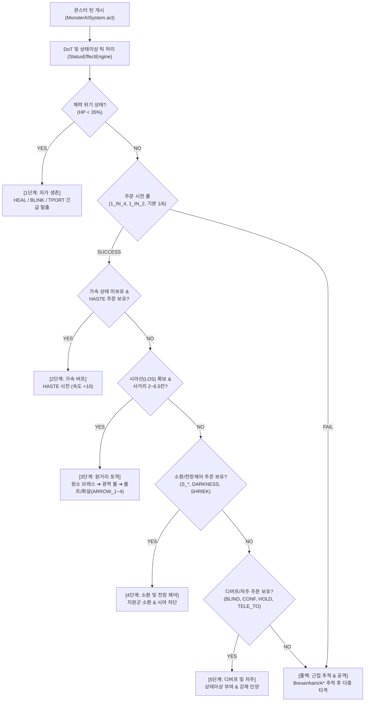

# 🔮 Mimicry Voxel Roguelike Engine (`v0.18.0`)

> **Tales of Middle-Earth (ToME 2.3.5) & TomeNET 생태계 기반 데이터 지향(Data-Oriented) 2.5D 복셀 & 고전 아스키 듀얼 렌더링 로그라이크**

[](package.json)
[-brightgreen.svg)](scripts/run_all_tests.js)
[](src/systems/)
[](src/entities/)
[](LICENSE)

---

## 📖 1. 프로젝트 개요 (Overview)

**`MIMICRY VOXEL`**은 원작 미미크리의 즉시 의태 및 신체 융합 시스템을 기반으로, 전설적인 정통 로그라이크 **Tales of Middle-Earth (ToME 2.3.5)**의 방대한 1,636개 엔티티 데이터(몬스터 851종, 아이템 501종, 에고 101종, 전설 유물 183종)와 2.5D 복셀 & TomeNET 14x23 터미널 듀얼 렌더링 엔진을 융합한 차세대 데이터 지향(Data-Oriented) 로그라이크 게임입니다.

`v0.18.0` 대규모 리빌딩을 통해 거대 상태 객체(God Objects)를 완전히 해체하고, 순수 DTO 엔티티와 **10대 무상태 시스템 엔진(Stateless System Engines)**, **4단계 층계 티어 게이팅(`DungeonValueBudgetEngine`)**, **ToME 7대 공격 체계 & 20 Methods x 27 Effects On-Hit**, **TomeNET 5단계 AI 의사결정 트리**, **다중 상/하행 계단 & 동적 맵 규격 스케일링**, **모던 인벤토리 코어 인스펙터(4대 의태 스킬 프리뷰)** 및 **50F 모르고스 3단 페이즈 보스전 & 발리노르 승천 엔딩**을 완비하였습니다.

```mermaid
flowchart TB
    subgraph LayerArchitecture["5대 계층 클린 아키텍처 (65개 모듈 / 102,800+ 라인)"]
        Configs["configs/ (GameBalance, Render, ThemeColors, DungeonTheme)"]
        Systems["systems/ (10대 무상태 시스템 엔진 & AI & 보스전)"]
        Entities["entities/ (Player, Monster, Item, ToME 4대 마스터 DB)"]
        UI["ui/ (Inventory, HUD, MonsterLore, Ascension, UIManager)"]
        Renderer["renderer/ (Voxel3DRenderer, Classic2DAsciiRenderer, Voxel3DMapBridge)"]
    end

    subgraph TenEngines["ToME 10대 무상태 시스템 엔진 (Stateless Engines)"]
        E1["TomeFlagResolver (비트플래그/속성/저항/슬레이)"]
        E2["UnifiedTraitEngine (통합 패시브/트레잇/신체특성)"]
        E3["StatusEffectEngine (14대 상태이상/버프/DoT/면역)"]
        E4["VisionLightingEngine (광원/FOV/LOS/몬스터감지)"]
        E5["TomeSpellEngine (91종 스펠/브레스/7대 공격체계)"]
        E6["ArtifactActivationEngine (183종 유물 발동/쿨다운)"]
        E7["TomeConsumableEngine (포션45+/주문서42+/음식/등불)"]
        E8["TomeDeviceEngine (완드30/스태프20/로드28 충전제어)"]
        E9["TomeEquipmentEngine (18대 슬롯 매핑/AC/무게/기호)"]
        E10["DungeonValueBudgetEngine (1~50F 4대 티어/예산 통제)"]
    end

    subgraph DungeonEcosystem["던전 생태계 & 렌더링 파이프라인"]
        OffenseAI["7대 공격 체계 & TomeNET 5단계 몬스터 AI 의사결정"]
        TierGate["1~50F 4단계 티어 게이팅 & 1~5F 저층 보호"]
        Uniques["168종 유니크 몬스터 1회성 스폰 & SaveSystem 영구 보존"]
        BossAscension["50F 모르고스 3단 페이즈 & 발리노르 승천/명예의 전당"]
        DualRender["2.5D 복셀 & TomeNET 14x23 터미널 무상태 렌더러"]
    end

    LayerArchitecture --> TenEngines
    TenEngines --> DungeonEcosystem
```



---

## ⚙️ 2. 10대 무상태(Stateless) 시스템 엔진 체계

모든 엔진은 인스턴스 내부에 가변 상태(Mutable State)를 저장하지 않고, 순수 함수(Pure Functions)와 정적 메서드(Static Methods)로 인자를 전달받아 결정론적(Deterministic)으로 연산 결과를 반환합니다.

| 번호 | 시스템 엔진명 | 모듈 경로 | 핵심 책임 및 ToME 2.3.5 연동 명세 |
| :---: | :--- | :--- | :--- |
| **1** | **`StatusEffectEngine`** | [`src/systems/StatusEffectEngine.js`](src/systems/StatusEffectEngine.js) | ToME 정통 14대 상태이상(마비, 혼란, 실명, 공포, 중독, 출혈, 둔화)/버프(가속, 축복, 영웅, 마나쉴드, 투명체감지, 4대원소저항) 무상태 연산, FREE_ACT/NO_CONF/NO_BLIND/NO_FEAR/RES_POIS 등 O(1) 면역·저항 판정, DoT 틱 연산 및 실시간 스탯 보정치(`calculateStatusModifiers`) 산출. |
| **2** | **`TomeSpellEngine`** | [`src/systems/TomeSpellEngine.js`](src/systems/TomeSpellEngine.js) | ToME 91종 주문/원소 브레스/투사체(ARROW_1~4)/소환/공간이동(BLINK, TELE_TO, TELE_AWAY) 및 20 Methods x 27 Effects On-Hit 근접 타격 7대 공격 체계 총괄 주문 엔진. |
| **3** | **`DungeonValueBudgetEngine`** | [`src/systems/DungeonValueBudgetEngine.js`](src/systems/DungeonValueBudgetEngine.js) | 1~50F 4단계 층계 티어 게이팅, 가우시안 OOD 10% 캡, 몬스터 접사/등급 제한, 1~5F 저층 보호(Vault/Pit/유물 0%), 동적 맵 규격 및 인챈트 예산 통제. |
| **4** | **`TomeFlagResolver`** | [`src/systems/TomeFlagResolver.js`](src/systems/TomeFlagResolver.js) | ToME 정통 비트 플래그/속성/저항/슬레이(SLAY)/면역/행동 패턴 고속 무상태 리졸버. |
| **5** | **`UnifiedTraitEngine`** | [`src/systems/UnifiedTraitEngine.js`](src/systems/UnifiedTraitEngine.js) | 몬스터와 플레이어 간 상태이상, 패시브, 신체 특성, 트레잇 통합 무상태 연산. |
| **6** | **`VisionLightingEngine`** | [`src/systems/VisionLightingEngine.js`](src/systems/VisionLightingEngine.js) | ToME 광원 반경, 시야선(FOV/LOS), 몬스터 감지(`canDetectMonsters`), 그림자 무상태 연산. |
| **7** | **`ArtifactActivationEngine`** | [`src/systems/ArtifactActivationEngine.js`](src/systems/ArtifactActivationEngine.js) | 183종 전설 유물 및 특수 아이템 발동(Activation) 효과, 쿨다운/충전 무상태 제어. |
| **8** | **`TomeConsumableEngine`** | [`src/systems/TomeConsumableEngine.js`](src/systems/TomeConsumableEngine.js) | ToME 포션 45+종(6단계 치유 피라미드, 영구 스탯 영약), 주문서 42+종(위상문/지도/강화/대파괴), 등불 급유(7,500턴), 음식/코어 무상태 소비 엔진. |
| **9** | **`TomeDeviceEngine`** | [`src/systems/TomeDeviceEngine.js`](src/systems/TomeDeviceEngine.js) | 완드(30종), 스태프(20종), 로드(28종) 마법 디바이스 발동 및 충전량(`charges`)/타임아웃(`timeout`) 무상태 제어. |
| **10** | **`TomeEquipmentEngine`** | [`src/systems/TomeEquipmentEngine.js`](src/systems/TomeEquipmentEngine.js) | ToME tval 기반 18대 슬롯 매핑, 아스키 심볼, 무게, 방어력(AC), 무기 카테고리 무상태 연산. |

---

## ⚔️ 3. ToME 7대 공격 체계 & TomeNET 5단계 AI 의사결정 트리

### 1) ToME 7대 공격 체계 (7-Tier Offense System)
1. **근접 공격 (Melee: 20 Methods × 27 Effects On-Hit)**:
   - **20대 타격 메소드**: `HIT`, `TOUCH`, `PUNCH`, `KICK`, `CLAW`, `BITE`, `STING`, `SLASH`, `BUTT`, `CRUSH`, `ENGULF`, `CHARGE`, `CRAWL`, `DROOL`, `SPIT`, `EXPLODE`, `GAZE`, `WAIL`, `SPORE`, `BEG`.
   - **27대 타격 효과**: `HURT`, `POISON`, `UN_BONUS`, `UN_POWER`, `EAT_GOLD`, `EAT_ITEM`, `EAT_FOOD`, `EAT_LITE`, `ACID`, `ELEC`, `FIRE`, `COLD`, `BLIND`, `CONFUSE`, `TERRIFY`, `PARALYZE`, `LOSE_STR~CHR`, `SHATTER`, `EXP_10~80` (생명력 흡수).
2. **투사체 마법/화살 (Ranged Projectile)**: `ARROW_1~4` (티어별 정밀 사격), `Bolt`, `Beam` 직사 포격.
3. **방사형 마법/브레스 (Cone & Ball)**: `BR_FIRE`, `BR_COLD`, `BR_ELEC`, `BR_ACID`, `BR_POIS`, `BR_NUKE`, `BR_TIME` 등 원소 방사.
4. **범위 효과/소환 (AOE & Summon)**: `S_ANT`, `S_UNDEAD`, `S_DRAGON`, `S_DEMON`, `S_HI_UNDEAD`, `S_UNIQUE` 동족 및 지원군 소환.
5. **상태이상 공격 (Status Debuffs)**: `BLIND`, `CONF`, `HOLD`, `SCARE`, `SLOW`, `CAUSE_1~4` 저주.
6. **공간/위치 왜곡 (Spatial Distortion)**: `BLINK` (근거리 도주), `TPORT` (원거리 텔레포트), `TELE_TO` (플레이어 강제 인양), `TELE_AWAY` (적 강제 추방).
7. **지속 디버프/DoT (Continuous Drain)**: `POISON` (독 DoT), `BLEED` (물리 출혈 DoT), `DRAIN_MANA` (자원 고갈).

### 2) TomeNET 정통 5단계 AI 의사결정 파이프라인
매 턴 [`src/systems/MonsterAISystem.js`](src/systems/MonsterAISystem.js)를 통해 몬스터의 지능적인 전술 행동이 5단계 우선순위 트리로 평가됩니다:



---

## 🗺️ 4. 동적 맵 크기 & 다중 상/하행 계단 시스템

[`src/map/Map.js`](src/map/Map.js)와 [`src/systems/DungeonValueBudgetEngine.js`](src/systems/DungeonValueBudgetEngine.js)가 협력하여 층계(Depth) 진행도에 따라 동적으로 확장되는 던전 규격과 다중 계단 분산 배치를 제공합니다:

- **1~5F (초심자 동굴 - Tier 1)**: 55×38 ~ 65×45 (방 8~11개) | 상행 1개(1F 봉인), 하행 1~2개
- **6~20F (숙련자 광산 - Tier 2)**: 65×45 ~ 80×55 (방 12~16개) | 상행 1~2개, 하행 2~3개
- **21~40F (심층 납골당 - Tier 3)**: 80×55 ~ 95×65 (방 16~22개) | 상행 2~3개, 하행 2~4개
- **41~50F (앙그반드 심연 - Tier 4)**: 90×65 ~ 110×75 (방 20~26개) | 상행 2~3개, 하행 2~4개 (50F 결전장은 하행 0개)
- **최대 거리 그리디 분산 알고리즘**: 상/하행 계단이 겹치지 않고 던전 전체에 균형 있게 배치되도록 유클리드 거리 최대화 배치 적용.

---

## 🎒 5. 모던 인벤토리 코어 인스펙터 (4대 스킬 프리뷰 카드 그리드)

[`src/ui/InventoryView.js`](src/ui/InventoryView.js)의 모던 UI/UX 대개편을 통해 몬스터 정수 코어 장착 시 얻게 되는 전력을 직관적으로 프리뷰할 수 있습니다:

- **4대 의태 스킬 프리뷰 카드 그리드**:
  - 코어 장착 시 활성화될 1~4 슬롯 스킬의 명칭, 전용 아이콘, 쿨다운 턴수, 다이스 위력(diceCount, diceSides), 효과 타입, 사거리 및 범위를 시각적인 모던 카드로 렌더링.
- **모던 코어 정보 패널**:
  - 6대 베이스 스탯(STR/DEX/CON/INT/WIS/CHR), 성장 유형 패턴 배율(Pattern Growth), ToME 2.3.5 정통 생태 서사(Lore) 박스, 메인 코어 장착 주의사항 및 유산 스탯 보존 비율(Heritage Bonus) 렌더링.
- **직관적 액션 인터랙션**:
  - `[🧬 메인 코어로 의태 장착]`, `[🍽️ 코어 포식(스탯 영구 흡수)]`, `[🔮 보조 1 장착/해제]`, `[🔮 보조 2 장착/해제]`, `[🗑️ 버리기]` 등 원클릭 조작 지원.

---

## ⚙️ 6. 종합 던전 커스텀 설정 (`DUNGEON_CUSTOM_SETTINGS`) 4대 범주 16개 설정 로드맵

| 범주 (Category) | 설정 키 (Key) | 기본값 | 범위 | 연동 엔진 및 세부 역할 |
| :--- | :--- | :---: | :---: | :--- |
| **1. Spawn & Variations**<br>(스폰 & 변종 제어) | `enableJokeMonsters` | `true` | `true/false` | 원작 조크/패러디 몬스터(바니걸, 산타 등) 스폰 허용 토글. OFF 시 정통 판타지만 등장. |
| | `monsterDensityMultiplier` | `1.0` | `0.5x~3.0x` | 방/복도당 몬스터 스폰 밀도 배율 ([`Spawner.js`](src/core/Spawner.js)). |
| | `uniqueSpawnRate` | `1.0` | `0.0x~2.0x` | 168종 유니크 몬스터 출현 확률 가중치 ([`UniqueMonsterManager.js`](src/systems/UniqueMonsterManager.js)). |
| | `monsterEliteAffixRate` | `1.0` | `0.0x~3.0x` | CHAMPION / CHIEFTAIN 엘리트 접사 발생 확률 조정. |
| **2. Map Dimensions & Gen**<br>(맵 크기 & 지형 생성) | `mapSizePreset` | `'DYNAMIC'` | `COMPACT~DYNAMIC` | 층계별 맵 크기 프리셋 또는 동적 스케일링 모드 ([`DungeonValueBudgetEngine.js`](src/systems/DungeonValueBudgetEngine.js)). |
| | `roomDensityMultiplier` | `1.0` | `0.5x~2.0x` | 층계당 방(Room) 생성 개수 및 연결 밀도 ([`Map.js`](src/map/Map.js)). |
| | `vaultPitFrequency` | `1.0` | `0.0x~3.0x` | 4대 보물 금고(Vault) 및 10대 몬스터 핏(Pit) 발생 빈도 ([`DungeonThemeConfig.js`](src/configs/DungeonThemeConfig.js)). |
| | `staircaseCountMode` | `'STANDARD'` | `MINIMAL~MAXIMAL` | 다중 상/하행 계단 분산 배치 수량 정책. |
| **3. Loot & Economy**<br>(드랍 수율 & 경제 밸런스) | `lootDropMultiplier` | `1.0` | `0.5x~5.0x` | 일반 몬스터 및 상자 아이템 드랍률 배율 ([`LootSystem.js`](src/core/LootSystem.js)). |
| | `goldDropMultiplier` | `1.0` | `0.5x~5.0x` | 던전 바닥 및 처치 골드 획득 배율. |
| | `artifactRarityWeight` | `1.0` | `0.0x~3.0x` | 183종 전설 유물 롤링 가중치 및 조기 발견 허용치 ([`TomeLootGenerator.js`](src/systems/TomeLootGenerator.js)). |
| | `egoItemQualityBias` | `0` | `-2~+3` | 고급 에고(Ego) 장비 출현 등급 및 인챈트 보정치. |
| **4. Gameplay & OOD**<br>(게임플레이 난이도 & OOD) | `oodSpawnChanceCap` | `0.10` | `0.0%~30.0%` | 가우시안 심층 몬스터 돌발 유입(Out-of-Depth) 확률 상한 (기본 10% 캡). |
| | `oodMaxFloorOffset` | `+5` | `+1~+15` | OOD 몬스터 최대 초과 층계 심도 편차. |
| | `deathPenaltyMode` | `'PERMADEATH'`| `3종 모드` | `PERMADEATH` (영구 사망), `CHECKPOINT` (층 부활), `ROGUE_LITE` (재화 보존). |
| | `cooldownSpeedMultiplier` | `1.0` | `0.5x~2.0x` | 오토 스킬 및 마법 디바이스 쿨다운 회복 속도 배율 ([`GameBalanceConfig.js`](src/configs/GameBalanceConfig.js)). |

---

## 🚀 7. 실행 방법 및 43개 테스트 스위트 구동법

### 1) 로컬 개발 서버 실행
터미널 환경에서 내장 무경량 웹 서버를 구동합니다:

```bash
# mimicry_voxel 디렉토리 기준
python3 scripts/dev_server.py

# 또는 백그라운드 로깅 서버 실행
bash scripts/run_logged_server.sh
```

- **2.5D 복셀 렌더러 진입**: `http://localhost:8080/index.html`
- **고전 2D TomeNET 14x23 아스키 렌더러 진입**: `http://localhost:8080/ascii.html`

### 2) 43개 전체 단위/통합 테스트 스위트 구동
엔진의 데이터 지향성, 비트플래그, BTH 명중률, 상태이상, 쿨타임, 보스전, 직렬화 무결성을 전수 검증합니다:

```bash
# 전체 43개 테스트 스위트 일괄 실행 (100% ALL PASS)
node scripts/run_all_tests.js

# 단일 핵심 테스트 스위트 개별 실행 예시
node scripts/test_status_effect_engine.js          # 14대 상태이상 및 면역 검증 (107/107 PASS)
node scripts/test_monster_full_offense_system.js   # 7대 공격 체계 및 AI 검증 (51/51 PASS)
node scripts/test_start_and_continue_game.js       # 세이브/로드 및 트랜잭션 검증 (70/70 PASS)
node scripts/test_dynamic_map_and_stairs.js        # 동적 맵 크기 및 계단 분산 검증 (615/615 PASS)
node scripts/test_inventory_item_detail_view.js    # 인벤토리/코어 인스펙터 UI 검증 (49/49 PASS)
```

### 3) 코드 메타 인덱서 및 위키 동기화
전체 65개 모듈의 AST 및 JSDoc 메타데이터를 자동 추출하여 색인합니다:

```bash
python3 scripts/meta_indexer.py --update-wiki
```

---

## 📂 8. 디렉토리 구조 명세

```
mimicry_voxel/
├── index.html                 # 2.5D 복셀 렌더러 메인 진입점 (?v=0.18.0)
├── ascii.html                 # TomeNET 14x23 Classic ASCII 메인 진입점 (?v=0.18.0)
├── style.css                  # 모던 다크 글래스모피즘 테마 스타일시트 (?v=0.18.0)
├── main.js                    # 메인 부트스트랩 및 모듈 초기화
├── package.json               # 프로젝트 매니페스트 (v0.18.0)
├── README.md                  # 본 종합 아키텍처 및 사용 가이드 문서
├── CODE_META_INDEX.md         # 65개 전 모듈 상세 메타 인덱스 명세서
├── DEVELOPMENT_LOG.md         # 1~12차 마일스톤 누적 개발 로그
├── src/
│   ├── configs/               # 4대 중앙화 설정 (밸런스, 테마, 렌더링, 층계테마)
│   ├── core/                  # 핵심 루프 (CombatSystem, CombatCalculator, Game, SaveSystem 등)
│   ├── entities/              # DTO 엔티티 (Player, Monster, Item, ToME 4대 마스터 데이터)
│   ├── events/                # EventBus 및 GameEvents 이벤트 파이프라인
│   ├── map/                   # 동적 맵 생성기 (Map, Voxel3DMapBridge)
│   ├── meta/                  # code_meta_index.json 자동 생성 메타데이터
│   ├── renderer/              # 듀얼 무상태 렌더러 (Voxel3DRenderer, Classic2DAsciiRenderer)
│   ├── systems/               # 10대 무상태 시스템 엔진, 5단계 AI, 3단 보스전
│   └── ui/                    # 모던 UI 뷰 (InventoryView, HUDView, AscensionModalView 등)
└── scripts/
    ├── dev_server.py          # 로컬 개발 웹 서버
    ├── meta_indexer.py        # JSDoc/AST 자동 메타 인덱서
    ├── run_all_tests.js       # 43개 테스트 스위트 러너
    └── test_*.js              # 43개 단위/통합 테스트 스위트
```

---

**© 2026 OpenDCMart Engine Team & Mimicry Voxel Engineering Group.** All rights reserved.
