# 🗺️ Mimicry Voxel Engine: Clean Architecture & 3D Next-Gen Roadmap

> **문서 메타데이터**
> - **프로젝트 버전**: `v0.36.0` (Next-Gen 3D Voxel Engine & Phase 1~22 Complete)
> - **작성 일자**: 2026-09-04
> - **작성자**: 개발 에이전트 타쿠미 코하루 (Takumi Koharu) & 리서치 에이전트 카스미 루리 (Kasumi Ruri)
> - **문서 상태**: `ACTIVE / PHASE 1~22 COMPLETE (100%) / PHASE 23 READY`
> - **저장소 위치**: [`/data/data/com.termux/files/home/opendcmart/mimicry_voxel`](file:///data/data/com.termux/files/home/opendcmart/mimicry_voxel)
> - **웹 배포 주소**: [`https://loverspath.github.io/mimicry_voxel/`](https://loverspath.github.io/mimicry_voxel/)

---

## 1. 프로젝트 총괄 현황 및 세션 완료 요약 (Executive Summary)

미미크리 복셀(Mimicry Voxel) 프로젝트는 초기 5대 갓오브젝트(God Objects)를 해체한 이래, 전설적인 **ToME 2.3.5 / TomeNET 정통 1,636개 엔티티 데이터셋**과 **차세대 1인칭 3D 복셀 던전 렌더러**, **15대 무상태 시스템 엔진**, **66개 전 테스트 스위트 100% 통과(66/66 PASSED)**를 달성하며 **Phase 1부터 Phase 22까지의 모든 마일스톤을 100% 완수**하였습니다:

1. **차세대 1인칭 3D 복셀 엔진 공식 승격 (`index.html`)**:
   - DDA 레이캐스팅, 10종 실사 텍스처 플로어/실링캐스팅, 1인칭 수직 시선 제어(Pitch / Freelook), z=0~1.0 관통형 3D 계단/사다리 구조체, 순수 아스키 그래픽(ASCII as Graphics) 8대 전투 VFX 완비.
   - 레거시 2.5D 메인을 `classic.html` 및 `legacy_main/`으로 보존 처리하고, 최신 3D 글래스모피즘 HUD를 루트 `index.html`로 승격 완료.
2. **15대 무상태(Stateless) 시스템 엔진 & 정통 룰 완비**:
   - `StatusEffectEngine`, `TomeSpellEngine`, `DungeonValueBudgetEngine`, `TomeFlagResolver`, `UnifiedTraitEngine`, `VisionLightingEngine`, `ArtifactActivationEngine`, `TomeConsumableEngine`, `TomeDeviceEngine`, `TomeEquipmentEngine`, `TomeIdentificationEngine`, `TomeLootGenerator`, `TomeRandartEngine`, `TomeTagSystem`, `TomeEgoEngine` 등 15대 무상태 엔진 확립.
3. **ToME 2.3.5 정통 생태계 & 엔터프라이즈 아이템 파이프라인**:
   - 10종 탄약류 규격 정상화(`{`) & 화살통(`quiver`) 독립 슬롯 분리.
   - Angband 원시 포맷 기호(`&`, `~`, `#[...]`) 3단계 다층 살균 정제 파이프라인 구축.
   - 101종 정통 에고 풀 및 절차적 란다트(Randart) 생성 엔진 완비.
   - 4단계 의사 감정(Pseudo-ID), 감정/저주해제 주문서 및 저주 장비 버리기 차단(`canDrop`).
   - 50F 모르고스의 옥좌 3단 페이즈 보스전 및 발리노르 승천 엔딩 / Hall of Fame.
4. **엔지니어링 무결성 지표**:
   - **총 모듈 수**: 76개 모듈
   - **총 코드 라인 수**: 109,989 LOC
   - **전체 단위/통합 테스트**: 66개 스위트 전수 통과 (66/66 PASSED, 100%)
   - **메타 인덱싱**: `scripts/meta_indexer.py`를 통한 AST/JSDoc 자동 색인 및 위키 동기화 100% 준수.

---

## 2. Phase 1 ~ Phase 22 전체 진화 연혁 (Timeline)

```mermaid
timeline
    title 미미크리 Voxel 엔진 마일스톤 진화 연혁 (Phase 1 ~ Phase 22 전수 완수)
    Phase 1 : 3대 원소 상호작용 프로토타입 (v0.1.0 ~ v0.6.0)
            : 의태 코어 흡수 및 기초 복셀 렌더러 구축
    Phase 2 : 5대 갓오브젝트 해체 및 5대 계층 클린 아키텍처 확립 (v0.7.0 ~ v0.12.0)
            : EventBus 도입 및 상태-로직 무상태(Stateless) 분리
    Phase 3 : ToME 2.3.5 1,636종 엔티티 & 12대 마일스톤 구축 (v0.13.0 ~ v0.18.0)
            : 10대 무상태 엔진, 50F 모르고스 보스전, 10대 장비 슬롯, 순수 쿨타임
    Phase 4 : 실전 핫픽스, 로어 숙련도 단일화, 실시간 자동화 엔진 (v0.18.1 ~ v0.18.11)
            : 로어 3408 XP 역방향 동기화, Auto-Cast 엔진, 절차적 BFS 안전 드랍
    Phase 5 : 동적 밸런스 프리셋 & 의사 감정 & 저주 시스템 & 차세대 UI (v0.19.0)
            : 4대 난이도 프리셋, 4단계 Pseudo-ID, 18종 저주 태그, 특성 매트릭스/핫바
    Phase 6 : 나노바나나 텍스처 1인칭 3D 렌더러 & 3단 전환 파이프라인 (v0.20.0)
            : DDA 레이캐스터, 5대 테마 텍스처, Z-버퍼 빌보딩, 복셀-3D-아스키 3단 토글
    Phase 7 : 동적 광원 조명 & 탐험 지도 동기화 & 전투 VFX 엔진 (v0.21.0)
            : 광원 비례 가시거리, isExplored 동기화, 7대 전투 VFX, 스크린 슬래시/셰이크
    Phase 8 : 순수 절차적 아스키 그래픽(ASCII as Graphics) 전투 VFX 개편 (v0.22.0)
            : 외부 비트맵 0%, 8대 공격 아스키 글리프 매트릭스, 네온 블룸 글로우
    Phase 9 : 1인칭 3D 수직 시점(Pitch) 및 전면 관통 비콘 & 계단 포탈 (v0.23.0)
            : R/F/휠 수직 시선 제어, 천장-바닥 전면 관통 빔, 펄스 거리 홀로그램
    Phase 10: 순차적 다단 히트 콤보 & 3대 렌더러 아스키 블룸 연동 (v0.24.0)
            : 80ms 시차 큐잉, 타격별 각도/글리프 변이, 2.5D/3D/아스키 전역 블룸
    Phase 11: 물리 5대 메소드 & ToME 마법 4대 범주 전수 아스키 VFX 완비 (v0.25.0)
            : 참격/할퀴기/물어뜯기/찌르기/분쇄, 볼트 8종, 볼 7종, 21종 브레스, 유틸 6종
    Phase 12: 1인칭 3D 벽면 텍스처 자동 프리로드 & DDA 슬라이스 완치 (v0.26.0)
            : 상대경로 리졸버, naturalWidth/Height 정밀 슬라이스, 절차적 벽돌 폴백
    Phase 13: 5대 테마 바닥/천장 실사 텍스처 10종 & 플로어캐스팅 완비 (v0.27.0)
            : 10종 실사 텍스처, 128x128 픽셀 버퍼, 90s 레트로 플로어/실링캐스팅
    Phase 14: 1인칭 3D 공간 일체화 & 정통 3D 석조 계단 완비 (v0.28.0)
            : 2x2 멀티타일/AO/보행밥, 3단 석조 계단(함몰구/고딕아치), 네온 철거
    Phase 15: 바닥-천장 관통형 3D 계단 구조체 & 10종 테마 텍스처 완비 (v0.29.0)
            : z=0~1.0 관통 기둥/보, 천장 스카이라이트 개구부, 5대 테마 10종 실사 계단
    Phase 16: 3D 복셀 사다리 & 전사 방패 강타 & 오토캐스트 토글 완비 (v0.30.0)
            : 3종 사다리 텍스처, SHIELD_BASH(스턴), Shift+1~8 오토캐스트 토글
    Phase 17: ToME 정통 드랍 플래그 엔진 & 유니크 절차적 전리품 연동 (v0.31.0)
            : 하드코딩 드랍 전면 제거, DROP_1D2~4D2/GREAT/GOOD/ONLY 플래그
    Phase 18: 차세대 UI/UX 공식 메인 승격 & 레거시 백업 이전 완비 (v0.32.0)
            : fork_experimental 공식 승격, legacy_main/ 및 classic.html 보존
    Phase 19: 감정/저주해제 주문서 & 저주 버리기 차단 & 슬롯 완치 (v0.33.0)
            : 주문서 2종, 조크 박멸, canDrop 모듈화, 인벤토리 고스트 슬롯 완치
    Phase 20: TomeNET 정통 아이템/에고/아티팩트 & 란다트 엔진 (v0.34.0)
            : 101종 에고 풀, 네이밍 규칙 복원, RES_RANDOM 실체화, 절차적 란다트
    Phase 21: 의태의 망토 복원 & Angband 원시 기호 3중 살균 정제 (v0.35.0)
            : Cloak of Mimicry 정규화, &, ~, # 토큰 3중 박멸, cleanItemName/displayName 방어망
    Phase 22: 탄약류 10종 규격화 & 화살통(Quiver) 분리 & UI 고도화 (v0.36.0)
            : Pebble 등 10종 탄약 AMMO/{ 규격화, quiver 슬롯 독립 장착, 발사체 호환 뱃지
```

---

## 3. 핵심 마일스톤 완수 내역 상세 (Phased Accomplishments)

### 🏛️ Phase 18: 차세대 UI/UX 포크 공식 메인 승격 및 레거시 보존 (v0.32.0)
- **공식 진입점 승격**: `fork_experimental/index.html`을 루트 `index.html`로 공식 승격.
- **글래스모피즘 HUD & 모바일 지원**: 뷰포트 반응형 캔버스, 모바일 제스처/터치 액션 바, 저체력 비네팅 연출 통합.
- **레거시 2.5D 진입점 분리 보존**: 기존 2.5D 메인 환경을 `classic.html` 및 `legacy_main/index.html`로 안전하게 백업 및 드롭인 보존.

### 🏛️ Phase 19: 감정/저주해제 주문서 연동 및 저주 버리기 차단 (v0.33.0)
- **주문서 2종 공식 드랍**: `scroll_identify` (의사 감정 즉시 해제), `scroll_remove_curse` (저주 태그 정화).
- **조크 몬스터 원천 박멸**: 원작 패러디 몬스터를 스포너 및 밸런스 필터에서 배제하여 다크 판타지 톤앤매너 확립.
- **저주 장비 버리기 차단 (`canDrop`)**: 저주받은 장비를 땅에 버려서 강제 탈착하는 행위 원천 봉쇄.
- **인벤토리 고스트 슬롯 완치**: `null` 슬롯 잔류 버그를 색인 압축(`cleanInventory`)으로 근본 해결.

### 🏛️ Phase 20: TomeNET 정통 에고/아티팩트 복원 및 절차적 란다트(Randart) 엔진 (v0.34.0)
- **절차적 란다트 생성 엔진 (`TomeRandartEngine.js`)**: 심층부 파워 예산 기반 무한 조합의 신규 아티팩트 합성 엔진 탑재.
- **TomeNET 원작 명명 규칙 복원**: `the <Base> '<Artifact>'`, `<Base> of <Ego>` 정규 네이밍 파이프라인.
- **랜덤 플래그 런타임 실체화**: `RES_RANDOM`, `POW_RANDOM`, `ESP_RANDOM` 주사위 롤링을 실제 저항/스탯 수치로 변환.
- **101종 정통 에고 풀 전면 연동**: 무기, 방어구, 장신구 전반의 에고 정의 연계.

### 🏛️ Phase 21: 의태의 망토 복원 및 Angband 원시 기호 3중 살균 정제 (v0.35.0)
- **의태의 망토(Cloak of Mimicry) 정상화**: Kind ID 618 망토의 `CLOAK` 슬롯 정상 장착 복원.
- **Angband 서식 기호 3단계 다층 살균 정제 파이프라인**:
  - Tier 1 (데이터 로딩 시점): `TomeKindsData.js` 내 정규식 기반 `& `, `~`, `#[...]` 1차 박멸.
  - Tier 2 (전리품 생성 시점): `cleanItemName()` 및 `TomeRandartEngine` 2차 정제.
  - Tier 3 (런타임 표시 시점): `Item.js`의 `displayName` getter 최종 방어망 구축.

### 🏛️ Phase 22: 탄약류 10종 규격 정상화 & 화살통(Quiver) 분리 (v0.36.0)
- **10종 탄약 규격 정상화**: 라운드 페블(kind 114) 및 화살, 볼트 등 10종 탄약 전체를 `type: 'AMMO'`, `slotType: 'QUIVER'`, 심볼 `{`로 통일.
- **화살통(Quiver) 슬롯 분리**: 주무기/발사기 슬롯과 간섭 없이 독립 착용되도록 `TomeEquipmentEngine` 최적화.
- **발사체 호환 UI 고도화**: 슬링, 활, 석궁 간의 호환성을 인벤토리 뱃지로 직관적 안내.
- **66/66 전체 테스트 100% 통과**: `test_ammo_and_quiver_classification.js` 신설 및 전 스위트 올 패스.

---

## 4. 3대 실행 트랙 (Core Execution Tracks) 최종 성과

```mermaid
graph TD
    subgraph TrackA["Track A: 메타 인덱싱 자동화 파이프라인 (완료)"]
        A1["scripts/meta_indexer.py"] --> A2["code_meta_index.json 자동 생성"]
        A2 --> A3["76개 모듈 (109,989 LOC) 위키 자동 동기화"]
    end

    subgraph TrackB["Track B: 전수 JSDoc & 화이트리스트 메타 표준화 (완료)"]
        B1["파일 상단 화이트리스트 메타 주석 규격"] --> B2["76개 전 모듈 JSDoc 완비"]
        B2 --> B3["AST 기반 인터페이스 시그니처 및 Purity 추출"]
    end

    subgraph TrackC["Track C: 차세대 3D 하이브리드 엔진 & 15대 무상태 시스템"]
        C1["Phase 1~4: 클린 아키텍처 & 5대 갓오브젝트 해체"] --> C2["Phase 5~12: ToME 1,636 엔티티 & 3D DDA 레이캐스터"]
        C2 --> C3["Phase 13~18: 실사 텍스처 플로어캐스팅 & 차세대 메인 승격"]
        C3 --> C4["Phase 19~22: 주문서/란다트/탄약 화살통 완결 (v0.36.0)"]
    end
```

---

## 5. 향후 로드맵 (Future Horizons: Phase 23+)

현재 v0.36.0 사양으로 3D 복셀 던전 및 정통 로그라이크 규칙이 완벽한 완결성을 갖추었으며, 향후 확장 마일스톤으로 다음 과제들이 연구 준비 상태에 있습니다:

- [ ] **Phase 23 (Graphics Accelerated)**: WebGL / WebGPU 셰이더 기반 고속 복셀 레이마칭(Raymarching) 렌더러 파이프라인 프로토타이핑.
- [ ] **Phase 24 (Social & Replay)**: 시드 공유 기반 고스트 런(Ghost Run) 리플레이 및 랭킹 데이터 익스포트.
- [ ] **Phase 25 (Native Mobile Packaging)**: Termux / PWA 오프라인 캐싱 및 안드로이드 네이티브 웹뷰 패키징.

---

## 6. 마일스톤 완료 체크리스트 (Milestone Checklist)

- [x] **Phase 1**: 3대 원소 상호작용 및 의태 코어 프로토타입 (`v0.6.0`)
- [x] **Phase 2**: 5대 갓오브젝트 해체 및 5대 계층 클린 아키텍처 확립 (`v0.12.0`)
- [x] **Phase 3**: ToME 2.3.5 1,636종 엔티티 데이터셋 및 10대 무상태 엔진 구축 (`v0.18.0`)
- [x] **Phase 4**: 실전 핫픽스, 로어 숙련도 단일화, 실시간 자동화 엔진 (`v0.18.11`)
- [x] **Phase 5**: 동적 밸런스 프리셋 & 의사 감정 & 18종 저주 시스템 (`v0.19.0`)
- [x] **Phase 6**: 나노바나나 텍스처 1인칭 3D 레이캐스터 & 3단 전환 파이프라인 (`v0.20.0`)
- [x] **Phase 7**: 동적 광원 조명 & 탐험 지도(isExplored) 동기화 (`v0.21.0`)
- [x] **Phase 8**: 순수 절차적 아스키 그래픽(ASCII as Graphics) 전투 VFX 개편 (`v0.22.0`)
- [x] **Phase 9**: 1인칭 3D 수직 시점(Pitch / Freelook) 및 전면 관통 비콘 (`v0.23.0`)
- [x] **Phase 10**: 순차적 다단 히트 콤보 & 전역 아스키 블룸 연동 (`v0.24.0`)
- [x] **Phase 11**: 물리 5대 메소드 & ToME 마법 4대 범주 전수 아스키 VFX 완비 (`v0.25.0`)
- [x] **Phase 12**: 1인칭 3D 벽면 텍스처 자동 프리로드 & DDA 슬라이스 완치 (`v0.26.0`)
- [x] **Phase 13**: 5대 던전 테마 바닥/천장 실사 텍스처 10종 & 플로어캐스팅 완비 (`v0.27.0`)
- [x] **Phase 14**: 1인칭 3D 공간 일체화 & 정통 3D 석조 계단 완비 (`v0.28.0`)
- [x] **Phase 15**: 바닥-천장 관통형 3D 복셀 계단 구조체 및 스카이라이트 완비 (`v0.29.0`)
- [x] **Phase 16**: 3D 복셀 사다리 & 전사 방패 강타(SHIELD_BASH) 완비 (`v0.30.0`)
- [x] **Phase 17**: ToME 정통 드랍 플래그 엔진 & 유니크 절차적 전리품 연동 (`v0.31.0`)
- [x] **Phase 18**: 차세대 UI/UX 포크 공식 메인(`index.html`) 승격 & 레거시(`classic.html`) 분리 (`v0.32.0`)
- [x] **Phase 19**: 감정/저주해제 주문서 드롭 & 저주 버리기 차단 & 고스트 슬롯 완치 (`v0.33.0`)
- [x] **Phase 20**: TomeNET 정통 에고/아티팩트 네이밍 복원 & 절차적 란다트(Randart) 엔진 (`v0.34.0`)
- [x] **Phase 21**: 의태의 망토 복원 & Angband 원시 기호 3중 살균 정제 파이프라인 (`v0.35.0`)
- [x] **Phase 22**: 라운드 페블 및 탄약류 10종 규격 정상화 & 화살통(Quiver) 분리 (`v0.36.0`)

---

**© 2026 OpenDCMart Engine Team & Mimicry Voxel Engineering Group.** All rights reserved.
