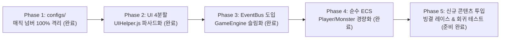

# 🗺️ Mimicry Voxel Engine: Meta Indexing & Clean Architecture Roadmap

> **문서 메타데이터**
> - **프로젝트 버전**: `v1.3.0` (Clean Architecture & Data-Oriented ECS Complete)
> - **작성 일자**: 2026-08-25
> - **작성자**: 타쿠미 코하루 (Dev Agent) & 카스미 루리 (Research Agent)
> - **문서 상태**: `ACTIVE / PHASE 1~4 COMPLETE / PHASE 5 READY`
> - **저장소 위치**: [`/data/data/com.termux/files/home/opendcmart/mimicry_voxel`](file:///data/data/com.termux/files/home/opendcmart/mimicry_voxel)

---

## 1. 세션 완료 및 핸드오버 요약 (Session Summary)

본 세션에서는 다음 핵심 마일스톤을 100% 달성하고 안전 아카이빙 및 메타 인덱싱을 완료하였습니다:

1. **Track A (메타 인덱싱 자동화)**: `scripts/meta_indexer.py` 스크립트 작성, 전체 41개 모듈(13,680줄) 인덱싱(`code_meta_index.json`), 위키 문서 자동 갱신 완료.
2. **Phase 1 (`src/configs/`)**: 3대 설정 모듈(`GameBalanceConfig.js`, `RenderConfig.js`, `ThemeColors.js`) 신설 및 매직 넘버 100% 완전 격리.
3. **Phase 2 (`src/ui/`)**: UI 4대 분할(`InventoryView.js`, `InspectModalView.js`, `HUDView.js`, `UIManager.js`) 및 `UIHelper.js` 경량 파사드 전환 완료.
4. **Phase 3 (`src/events/`)**: Pub/Sub 이벤트 브로커(`EventBus.js`, `GameEvents.js`) 및 `GameEngine.js` 도입으로 DOM과 게임 루프 완전 디커플링.
5. **Phase 4 (`src/systems/`)**: 순수 ECS 분리(`PlayerStatCalculator.js`, `MonsterAISystem.js`) 및 `Player.js`/`Monster.js` 순수 데이터 컴포넌트화 완료.
6. **표준 화이트리스트 JSDoc 메타 주석**: 41개 전 모듈에 표준 메타 헤더 적용.
7. **Node.js 구문 무결성 검증**: `node -c src/**/*.js` 전체 41개 모듈 100% 통과.

---

## 2. 3대 실행 트랙 (Core Execution Tracks)

```mermaid
graph TD
    subgraph TrackA["Track A: 메타 인덱싱 자동화 파이프라인 (완료)"]
        A1["scripts/meta_indexer.py"] --> A2["code_meta_index.json 자동 생성"]
        A2 --> A3["위키 아키텍처 다이어그램 자동 동기화"]
    end

    subgraph TrackB["Track B: 전수 JSDoc & 화이트리스트 메타 표준화 (완료)"]
        B1["파일 상단 화이트리스트 메타 주석 규격"] --> B2["모든 클래스/메소드 JSDoc 규격화"]
        B2 --> B3["AST 기반 인터페이스 시그니처 추출"]
    end

    subgraph TrackC["Track C: 5단계 클린 아키텍처 리팩토링"]
        C1["Phase 1: configs/ 중앙화 (완료)"] --> C2["Phase 2: EventBus & UI 4분할 (완료)"]
        C2 --> C3["Phase 3: GameEngine 슬림화 (완료)"]
        C3 --> C4["Phase 4: 순수 ECS 시스템화 (완료)"]
        C4 --> C5["Phase 5: 신규 콘텐츠 투입 및 회귀 검증 (준비 완료)"]
    end
```



---

## 3. Track A: 유기적 메타 인덱싱 자동화 파이프라인 명세

소스코드의 구조, 의존성 관계, 모듈 책임 및 변경 이력을 자동으로 스캔하여 기계 가독형 JSON 및 위키 문서로 동기화하는 자동화 파이프라인입니다.

### 📌 스크립트 명세 (`scripts/meta_indexer.py`)
- **실행 위치**: `mimicry_voxel/scripts/meta_indexer.py`
- **구동 모드**:
  - `python meta_indexer.py --scan`: 전체 소스코드의 AST/헤더 주석/import-export 관계망 자동 스캔.
  - `python meta_indexer.py --update-wiki`: 스캔 결과를 바탕으로 위키 아키텍처 명세서 자동 갱신.
  - `python meta_indexer.py --watch`: 파일 변경 감지 시 실시간 인덱스 업데이트 (Watchdog).

### 📋 출력 산출물 (`src/meta/code_meta_index.json`) 스키마 규격
```json
{
  "version": "1.3.0",
  "generatedAt": "2026-08-25T13:00:00Z",
  "modules": [
    {
      "filePath": "src/core/Effects.js",
      "moduleName": "Effects",
      "category": "core",
      "lines": 520,
      "responsibility": "2.5D 아이소메트릭 실시간 비주얼 이펙트 및 고속 직사 투사체 렌더링",
      "purity": "Stateless Renderer",
      "dependencies": ["Tags.js"],
      "exports": ["ProjectileEffect", "ConeBreathEffect", "SkillVisualEffectFactory"],
      "lastModified": "2026-08-25T12:50:00Z"
    }
  ]
}
```

---

## 4. Track B: 파일 상단 표준 화이트리스트 메타 주석 규격

컨텍스트 윈도우 절약(선택적 주입기 호환) 및 메타 인덱서 파싱을 위해 모든 소스코드 상단에 다음 표준 화이트리스트 메타 헤더를 의무화합니다.

```javascript
/**
 * @module [모듈 영문명 (예: GameBalanceConfig)]
 * @category [configs | ecs | systems | events | ui | renderer | core]
 * @description [모듈의 단일 책임(SRP) 및 핵심 역할 요약 (1~2줄)]
 * @purity [Pure Function | Stateless System | State Store | DOM Renderer]
 * @dependencies [의존하는 타 모듈 목록 쉼표 구분 (예: EventBus.js, ThemeColors.js)]
 * @exports [외부로 공개하는 클래스/함수/상수 목록]
 */
```

---

## 5. Track C: 5단계 클린 아키텍처 리팩토링 마일스톤 현황



### ✅ Phase 1: `src/configs/` 중앙화 및 매직 넘버 완전 격리 (완료)
* `GameBalanceConfig.js`: D&D 전투 주사위 공식, 레벨 XP 곡선, 적재 중량 및 무기 요구치.
* `RenderConfig.js`: 3D 복셀 지오메트리(`34x17x20`), 줌 스텝(`0.6x~1.7x`), 48px 피킹 반경, 물리 상수.
* `ThemeColors.js`: 7대 원소 색상, 4대 희귀도 색상, UI 글래스모피즘 테마.

### ✅ Phase 2: `src/ui/` 컴포넌트 4분할 및 `UIHelper.js` 파사드화 (완료)
* `InventoryView.js`: 25개 슬롯 그리드, 아이템 상세, 코어 계승 뷰.
* `InspectModalView.js`: 48px 여유 피킹 몬스터 관찰 및 4대 스탯 Breakdown 분석 뷰.
* `HUDView.js`: 상단 SPD/HP/Floor 바, 플레이어 상세, 스킬 트리, 마스터리 도감 뷰.
* `UIManager.js`: DOM 모달 라이프사이클 및 이벤트 라우팅 중앙 관리자.
* `UIHelper.js`: 상기 4대 뷰를 재익스포트하는 30줄 경량 파사드로 리팩토링.

### ✅ Phase 3: `src/events/` Pub/Sub 중앙 이벤트 버스 & `GameEngine.js` 도입 (완료)
* `GameEvents.js`: 15대 핵심 게임 이벤트 열거형 상수 정의.
* `EventBus.js`: 싱글톤 기반 메시지 브로커 구현.
* `GameEngine.js`: UI와 디커플링된 순수 턴 스케줄러 및 이벤트 디스패처 코어 분리.

### ✅ Phase 4: `src/systems/` ECS 경량화 및 `Player.js`/`Monster.js` 슬림화 (완료)
* `PlayerStatCalculator.js`: 동적 스탯, AC, 저항, 대미지 감쇄, 이동 속도, Max HP 산출 시스템.
* `MonsterAISystem.js`: A* 패스파인딩, 행동 결정(Act), Bat 도주 AI, 버프/치유 틱 시스템.
* `Player.js` & `Monster.js`: 순수 데이터 컴포넌트로 슬림화.

### 🔹 Phase 5: 신규 콘텐츠 투입 및 헤드리스 회귀 검증 (준비 완료)
* **목표 작업**:
  1. 신규 몬스터 '빙결의 레이스(Wraith)' 신규 코어/스킬셋 정의 및 인게임 스포너 투입.
  2. 신규 속성 저항 및 빙결 콤보 반응 테스트.
  3. Node.js 헤드리스 턴 루프 및 전투 시뮬레이션 회귀 테스트 집행.

---

## 6. 마일스톤 완료 체크리스트 (Milestone Checklist)

- [x] **Step 1**: `scripts/meta_indexer.py` 스크립트 작성 및 메타 인덱스 스캔 파이프라인 구축 (`code_meta_index.json` 생성 & 위키 자동 동기화 완료).
- [x] **Step 2**: `src/configs/` 3대 설정 파일(`GameBalanceConfig.js`, `RenderConfig.js`, `ThemeColors.js`) 신설 및 매직 넘버 격리 완료.
- [x] **Step 3**: `src/ui/` 분할(`InventoryView.js`, `InspectModalView.js`, `HUDView.js`, `UIManager.js`) 및 `UIHelper.js` 경량 파사드 전환 완료.
- [x] **Step 4**: `src/events/` Pub/Sub 브로커(`EventBus.js`, `GameEvents.js`) 및 `GameEngine.js` 슬림화 완료.
- [x] **Step 5**: `src/systems/` ECS 경량화(`PlayerStatCalculator.js`, `MonsterAISystem.js`) 구축 및 `Player.js`/`Monster.js` 위임 슬림화 완료.
- [x] **Step 6**: `node -c src/**/*.js` 전체 구문 무결성 통과 및 `python3 scripts/meta_indexer.py --scan --update-wiki` 최종 인덱싱 검증 완료.
- [ ] **Step 7 (Phase 5)**: 신규 몬스터 '빙결의 레이스(Wraith)' 투입 및 헤드리스 회귀 테스트.

---

> **참조 문서**:
> - [[미미크리 Voxel 엔진 코드베이스 감사 및 클린 아키텍처 리팩토링 로드맵]]
> - [[미미크리 3D 복셀 엔진 아키텍처 및 구현 명세서]]
> - [[미미크리 Voxel 엔진 코드 메타 인덱스]]
> - [[에이전트 Swarm 구조 및 개발 철학]]
