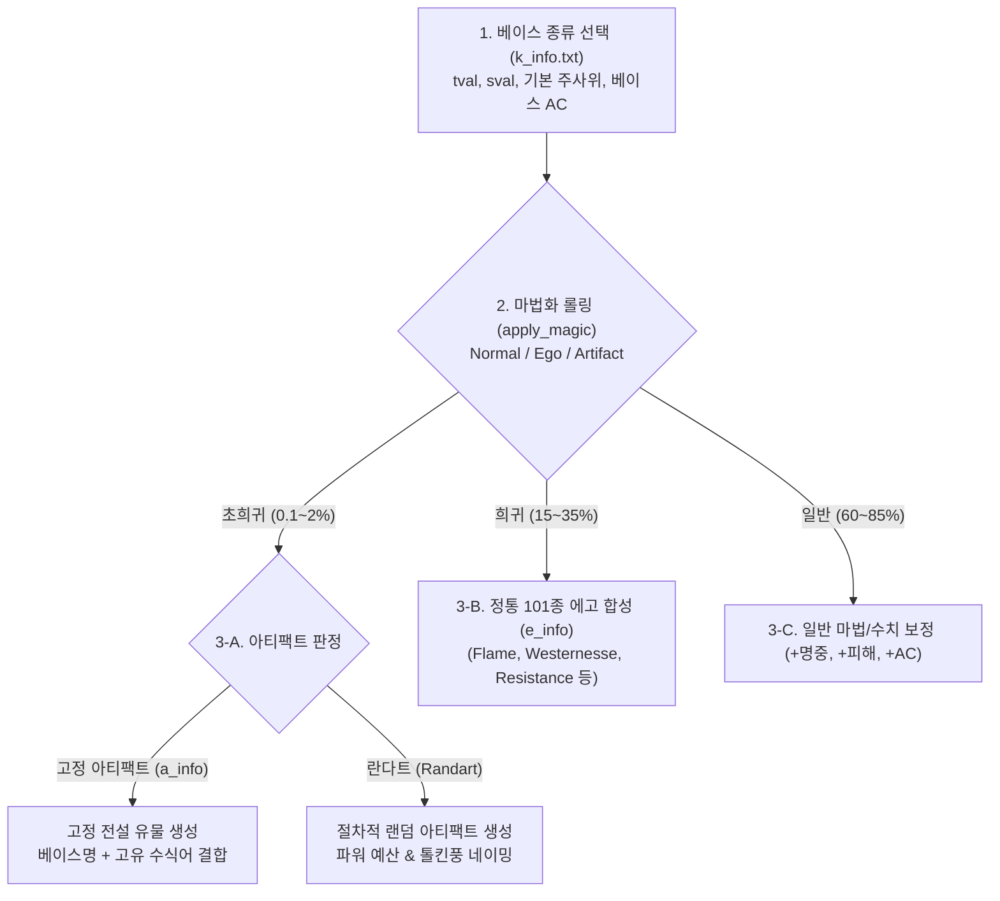
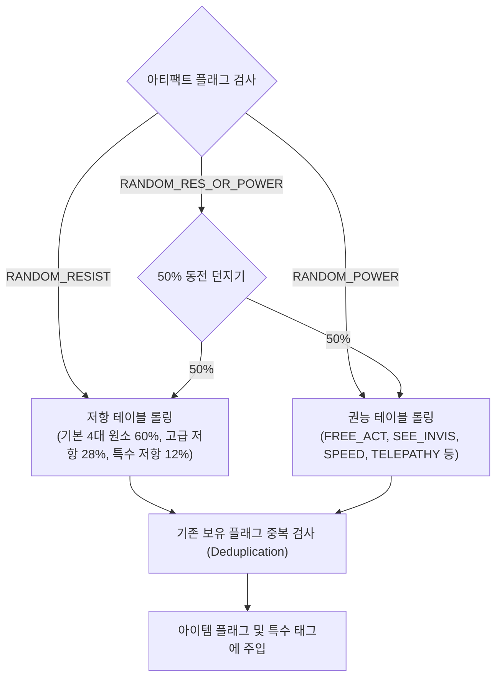
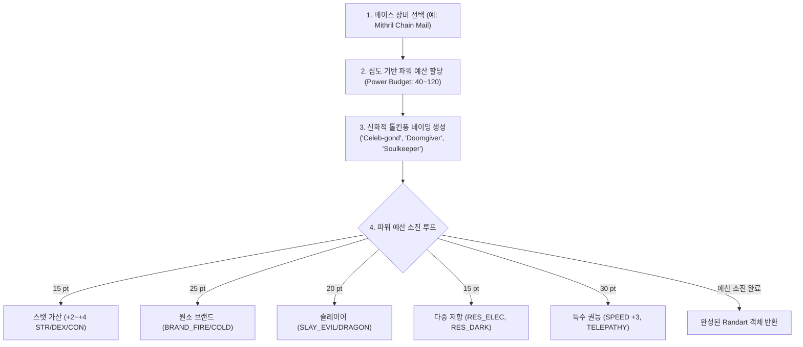

# 📜 TomeNET & ToME 2.3.5 정통 아이템 생성, 에고, 아티팩트 및 란다트(Randart) 아키텍처 명세서
### Canonical Specification of TomeNET Item Generation (`apply_magic`), Ego Affixation, Artifact Naming, and Procedural Random Artifact (Randart) Engine

> **문서 메타데이터**
> - **버전**: `v1.0.0` (Canonical Generation & Defect Overhaul Master Blueprint)
> - **작성일**: 2026-09-03
> - **작성자**: 카스미 루리 (Research Agent / INTJ 용의주도한 전략가)
> - **수신인**: 오케스트레이터 및 타쿠미 코하루 (Dev Agent)
> - **대상 프로젝트**: [`/data/data/com.termux/files/home/opendcmart/mimicry_voxel`](file:///data/data/com.termux/files/home/opendcmart/mimicry_voxel)

---

## 🧭 1. 서론 및 ToME 2.3.5 / TomeNET 정통 아이템 생성 철학

**Tales of Middle-Earth (ToME 2.3.5)**와 **TomeNET**을 지탱하는 가장 위대한 보물 시스템의 핵심은 **'완벽한 데이터 계층 구조와 정밀한 마법 부여 파이프라인'**입니다.

던전 깊은 곳에서 생성되는 모든 장비는 다음과 같은 철저한 계층 파이프라인을 거칩니다:


그러나 현재 미미크리 복셀 엔진의 아이템 생성 파이프라인([`TomeLootGenerator.js`](file:///data/data/com.termux/files/home/opendcmart/mimicry_voxel/src/systems/TomeLootGenerator.js))과 데이터셋([`TomeArtifactsData.js`](file:///data/data/com.termux/files/home/opendcmart/mimicry_voxel/src/entities/TomeArtifactsData.js), [`TomeKindsData.js`](file:///data/data/com.termux/files/home/opendcmart/mimicry_voxel/src/entities/TomeKindsData.js))은 파싱 과정의 누락과 하드코딩된 임시 로직으로 인해 **6대 중대 결함**을 안고 있습니다.

본 명세서는 이 6대 결함을 수학적·아키텍처적으로 완벽히 분석하고, 개발 에이전트(타쿠미 코하루)가 즉시 구현할 수 있는 완성형 솔루션을 제시합니다.

---

## 🔍 2. 미미크리 복셀 현주소 및 6대 핵심 결함 대조 진단

| 결함 과제 번호 | 결함 현상 (Current Flaw) | 근본 원인 (Root Cause) | 정통 ToME 2.3.5 규격 솔루션 (Canonical Fix) |
| :---: | :--- | :--- | :--- |
| **결함 1** | 아티팩트 이름이 `"유물: of Galadriel"` 또는 `"of Turin"`으로 출력되어 베이스 아이템명이 증발함. | `TomeArtifactsData.js`에 `rawName`만 추출되어 있고 베이스 장비명(`Phial`, `Great Sword` 등)과의 결합 로직 누락. | `tval/sval`로 `TomeKindsData`에서 베이스명을 찾아 `[베이스명] + " " + [rawName]`으로 완벽 결합. |
| **결함 2** | `RANDOM_RESIST`, `RANDOM_POWER`가 실제 저항/권능으로 변환되지 못하고 데드 플래그로 낭비됨. | 원작의 런타임 플래그 변환 테이블(`resolve_random_flags`)이 엔진에 구현되지 않음. | 런타임 가중치 확률 테이블을 통해 구체적 저항(`RES_FIRE`, `RES_POIS` 등) 및 권능(`FREE_ACT`, `SPEED` 등)으로 100% 치환. |
| **결함 3** | 원거리 무기(슬링, 보우, 석궁)가 근접 0d0 무기로 취급되고 화살이 근접 무기로 장착됨. | `TomeKindsData.js`에서 `tval: 19`가 `type: "ITEM"`, `dice: null`로 파싱되고 화살(`tval: 17`)이 `type: "WEAPON"`으로 역전됨. | `tval: 19`를 `type: "BOW"`, `slotType: "BOW"`, 5대 발사 배율(x2~x4)로 정립하고 탄약(`tval: 16~18`)을 다발(Bundle)로 분리. |
| **결함 4** | 더미 아이템 `Random Artifact` (`tval: 102`)가 바닥에 쓰레기 아이템으로 드랍됨. | C 원작의 내부 데이터 구조 플레이스홀더(`KIND_RANDOM_ARTIFACT`)가 드랍 필터에 걸러지지 않고 스폰됨. | 드랍 후보군에서 `tval: 102` 영구 블랙리스트 제외 및 정품 절차적 Randart 생성기로 교체. |
| **결함 5** | 정통 101종 에고와 원소 브랜드(`BRAND_FIRE` 등)가 생성되지 않고 하드코딩된 임의 태그만 붙음. | `TomeLootGenerator`가 `TOME_EGOS_DATA`를 임포트만 해두고 실제 롤링 시 `["FIRE", "COLD"]` 하드코딩 배열만 참조함. | 슬롯별(무기, 갑옷, 투구, 부츠 등) ToME 101종 정통 에고 풀을 구축하고 원소 브랜드 피해 배율(x2.5~x3.0) 연동. |
| **결함 6** | 파밍의 종착역인 절차적 랜덤 아티팩트(Randart) 생성 엔진의 완전한 부재. | ToME의 `make_randart` 알고리즘이 엔진에 이식되지 않음. | 파워 예산(Power Budget) 기반 톨킨 신화풍 절차적 Randart 생성 엔진 신설. |

---

## 🏷️ 3. [결함 1 해결] 아티팩트 정통 네이밍 복원 & 베이스 장비 결합 아키텍처

### 3.1 `tval/sval` 기반 베이스명 역추적 매핑
원작 ToME에서 아티팩트는 독립된 물건이 아니라 **특정 베이스 아이템에 마법이 깃든 형태**입니다.

```
TomeArtifactsData: ART_OF_GALADRIEL (tval: 39, sval: 100, rawName: "of Galadriel")
   │
   ▼ [tval & sval 대조]
TomeKindsData: KIND_PHIAL (tval: 39, sval: 100, name: "& Phial~")
   │
   ▼ [이름 정제: "& " 접두사 및 "~" 제거] ➔ "Phial" (한글: "피알")
   │
   ▼ [ToME 네이밍 규칙 적용]
최종 명칭: "The Phial of Galadriel" (한글: "피알 of Galadriel" 또는 "갈라드리엘의 피알")
```

### 3.2 아티팩트 네이밍 4대 규칙 (Naming Rules)
1. **접미사형 (`rawName`이 `'of '` 또는 `'the '`로 시작)**:
   - 규칙: `[베이스명] + " " + [rawName]`
   - 예시:
     - `Great Sword` + `of Turin` ➔ **`Great Sword of Turin`**
     - `Phial` + `of Galadriel` ➔ **`Phial of Galadriel`**
     - `Ring Mail` + `of the Rohirrim` ➔ **`Ring Mail of the Rohirrim`**
     - `Sling` + `of Farmer Maggot` ➔ **`Sling of Farmer Maggot`**
2. **고유명사형 (`rawName`이 따옴표 `'...'`로 둘러싸인 경우)**:
   - 규칙: `[베이스명] + " " + [rawName]`
   - 예시:
     - `Broad Sword` + `'Glamdring'` ➔ **`Broad Sword 'Glamdring'`**
     - `Long Sword` + `'Anduril'` ➔ **`Long Sword 'Anduril'`**
     - `Iron Helm` + `'Holhenneth'` ➔ **`Iron Helm 'Holhenneth'`**
3. **완전 고유명사 (플래그에 `HIDE_TYPE`이 있거나 특수 장신구)**:
   - 규칙: `[rawName]` 단독 표기
   - 예시:
     - `The One Ring` (절대반지)
     - `Nauglamir` (나우글라미르)
     - `The Arkenstone` (아르켄스톤)
4. **한글 표기 지원**:
   - `[베이스 한글명] + " " + [rawName]` (예: `그레이트소드 of Turin`, `브로드소드 'Glamdring'`)

---

## 🎲 4. [결함 2 해결] 3대 랜덤 플래그 런타임 변환 엔진

원작 190종 아티팩트 중 **47종의 아티팩트**에 부여된 3대 랜덤 플래그를 생성 시점에 구체적 저항과 권능으로 100% 치환합니다.



### 4.1 가중치 확률 테이블 (Weighted Probability Tables)

#### 1) `RANDOM_RESIST` 확률 테이블:
- **기본 4대 원소 저항 (각 15%, 합계 60%)**:
  - `RES_FIRE` (화염 저항), `RES_COLD` (냉기 저항), `RES_ELEC` (전격 저항), `RES_ACID` (산성 저항)
- **고급 원소 저항 (각 7%, 합계 28%)**:
  - `RES_POIS` (독 저항), `RES_DARK` (암흑 저항), `RES_LITE` (광휘 저항), `RES_FEAR` (공포 면역)
- **하이엔드 특수 저항 (각 2%, 합계 12%)**:
  - `RES_CONF` (혼란 저항), `RES_SOUND` (음파 저항), `RES_SHARDS` (파편 저항), `RES_NETHER` (황천 저항), `RES_NEXUS` (넥서스 저항), `RES_CHAOS` (혼돈 저항)

#### 2) `RANDOM_POWER` 확률 테이블:
- **생존 및 유틸 권능**:
  - `FREE_ACT` (마비 면역, 가중치 20)
  - `SEE_INVIS` (투명 감지, 가중치 20)
  - `SLOW_DIGEST` (포만감 유지, 가중치 15)
  - `REGEN` (체력 재생 2배, 가중치 15)
  - `FEATHER` (부유/가벼운 발걸음, 가중치 10)
- **하이엔드 특수 권능**:
  - `TELEPATHY` (전체 몬스터 ESP 감지, 가중치 8)
  - `SPEED` (이동/공격 속도 +3~+5 가산, 가중치 7)
  - `EXTRA_ATTACK` (공격 횟수 +1, 가중치 5)

---

## 🏹 5. [결함 3 해결] 원거리 무기(슬링, 보우, 석궁) 및 탄약 체계 정립

현재 엔진에서는 원거리 활이 `slotType: null`, `dice: null`로 인해 근접 무기 0d0으로 취급되는 치명적 왜곡이 존재합니다.

### 5.1 원거리 발사 무기 (`TV_BOW`, tval: 19) 정규 규격
- **슬롯 분리**: `slotType: "BOW"` (인벤토리 장비창에 전용 원거리 슬롯 배정).
- **타입**: `type: "BOW"`.
- **배율 (Multiplier)**: 원거리 발사 시 탄약의 주사위 피해를 곱해주는 핵심 수치.

| sval | 영문 명칭 | 한글 명칭 | 발사 배율 (Multiplier) | 적합 탄약 (Ammo) | 기본 무게 | 기본 레벨 |
| :---: | :--- | :--- | :---: | :---: | :---: | :---: |
| **2** | `Sling` | 슬링 | **x2** | `TV_SHOT` (16) 자갈/탄환 | 0.5 lbs | 1 |
| **12** | `Short Bow` | 숏보우 (단궁) | **x2** | `TV_ARROW` (17) 화살 | 3.0 lbs | 3 |
| **13** | `Long Bow` | 롱보우 (장궁) | **x3** | `TV_ARROW` (17) 화살 | 4.0 lbs | 15 |
| **23** | `Light Crossbow`| 라이트 크로스보우 | **x3** | `TV_BOLT` (18) 쇠뇌살 | 11.0 lbs | 10 |
| **24** | `Heavy Crossbow`| 헤비 크로스보우 | **x4** | `TV_BOLT` (18) 쇠뇌살 | 20.0 lbs | 25 |

### 5.2 탄약류 (`TV_SHOT: 16`, `TV_ARROW: 17`, `TV_BOLT: 18`) 규격
- **슬롯**: `slotType: "QUIVER"` (화살통)
- **스폰 수량**: 바닥 드랍 시 **$15 \sim 35$발 다발(Bundle)**로 스택.
- **주사위**:
  - `Pebble / Iron Shot`: `1d2` ~ `1d4`
  - `Arrow`: `1d4` ~ `2d4` (Seeker Arrow: `4d4`)
  - `Bolt`: `1d5` ~ `2d5` (Seeker Bolt: `5d5`)

### 5.3 ToME 정통 원거리 사격 대미지 공식
$$\text{Damage} = (\text{Ammo Dice Roll} + \text{Ammo toDmg} + \text{Bow toDmg}) \times \text{Bow Multiplier} + \text{DEX 보너스}$$

---

## 🚫 6. [결함 4 해결] 더미 아이템 `Random Artifact` (tval: 102) 드랍 차단

- `TomeKindsData.js`의 `KIND_RANDOM_ARTIFACT` (id: 662, tval: 102)는 C 원작 엔진 내부에서 randart 구조체 초기화용으로만 쓰이는 더미입니다.
- **해결책**:
  ```javascript
  // TomeLootGenerator 필터링 가드
  const validKinds = this._cachedKinds.filter(k => 
    k.tval !== 102 && 
    k.key !== 'KIND_RANDOM_ARTIFACT' && 
    k.cost > 0 &&
    k.level <= danger + 5
  );
  ```

---

## ⚡ 7. [결함 5 해결] 브랜드(Brand) 및 ToME 101종 정통 에고 합성 파이프라인

하드코딩된 임의 문자열을 전면 폐기하고, [`TomeEgosData.js`](file:///data/data/com.termux/files/home/opendcmart/mimicry_voxel/src/entities/TomeEgosData.js)의 101종 에고 데이터를 슬롯 유형별로 분류하여 장비에 정통 접사를 부여합니다.

### 7.1 5대 원소 브랜드(Brand) 피해 배율 및 시각 효과
무기에 브랜드가 부여되면, 해당 속성에 취약하거나 저항이 없는 적 타격 시 강력한 배율 피해와 특수 아스키 이펙트가 발생합니다.

| 브랜드 태그 | 에고 접미사 | 피해 배율 | 피격 시각 효과 (VFX) | 설명 |
| :--- | :--- | :---: | :--- | :--- |
| **`BRAND_FIRE`** | `(Flame)` | **x2.5** | `FIRE_BURST` (`* % & ▲ ♨`) | 불에 타는 몬스터에게 치명적 피해, 냉기계 몬스터에 x3.0 |
| **`BRAND_COLD`** | `(Frost)` | **x2.5** | `FROST_SHATTER` (`❄ * + ◇ ◆`) | 화염계 몬스터에 x3.0 동결 피해 |
| **`BRAND_ELEC`** | `(Lightning)` | **x3.0** | `LIGHTNING_SPARK` (`⚡ z Z ϟ \ /`)| 감전 및 신경 마비 충격 |
| **`BRAND_ACID`** | `(Acid)` | **x2.5** | `ACID_POISON` (`🧪 o O ° %`) | 장갑 부식 및 외피 용해 |
| **`BRAND_POIS`** | `(Venom)` | **x2.5** | `ACID_POISON` (`☣ o O ° %`) | 지속적인 중독 독성 피해 |

### 7.2 주요 슬롯별 ToME 정통 에고 풀
1. **무기 (WEAPON)**:
   - `(Flame)`, `(Frost)`, `(Lightning)`, `(Acid)`, `(Venom)`
   - `of Westernesse`: `STR +1~+2`, `DEX +1~+2`, `CON +1~+2`, `FREE_ACT`, `SEE_INVIS`, `SLAY_ORC`, `SLAY_TROLL`, `SLAY_GIANT`
   - `(Holy Avenger)`: `WIS +1~+3`, `SEE_INVIS`, `SUST_CON`, `SLAY_UNDEAD`, `SLAY_DEMON`
   - `(Defender)`: `baseAC: +15~+25`, `RES_FIRE`, `RES_COLD`, `RES_ELEC`, `RES_ACID`, `FREE_ACT`, `SEE_INVIS`, `REGEN`
   - `of Slaying`: `toHit: +5~+12`, `toDmg: +5~+12`
2. **방어구 (ARMOR / SHIELD / CLOAK)**:
   - `of Resistance`: `RES_FIRE`, `RES_COLD`, `RES_ELEC`, `RES_ACID`, `RES_POIS`
   - `of Elvenkind`: `DEX +2`, `STEALTH +2`, 기본 4대 원소 중 2개 저항
3. **신발 (BOOTS)**:
   - `of Speed`: `SPEED +3 ~ +10` (최고 인기 에고)
   - `of Free Action`: `FREE_ACT`

---

## 👑 8. [결함 6 해결] ToME 정통 절차적 랜덤 아티팩트(Randart) 생성 엔진

더미 아이템을 대체하여, 던전의 보스나 특별한 금고에서 출현하는 **세상에 단 하나뿐인 절차적 유물(Procedural Randart)**을 생성하는 엔진입니다.



### 8.1 톨킨 신화풍 절차적 명칭 생성기
- **신다린/퀘냐 조합형**:
  - 접두사: `["Celeb-", "Gild-", "Aeg-", "Mith-", "Gond-", "Mor-", "El-", "Tin-", "Bar-", "Dor-"]`
  - 접미사: `["-ir", "-ond", "-ion", "-ril", "-dur", "-gond", "-calen", "-mir", "-hel", "-fin"]`
  - 결과 예시: `Celeb-dur`, `Mith-gond`, `Gild-ion`, `Mor-calen`
- **서사형 타이틀 (The ...)**:
  - `['Doomgiver', 'Soulkeeper', 'Lightbringer', 'Foehammer', 'Firefang', 'Icecleaver', 'Shadowbane']`

---

## 💻 9. 개발 에이전트(타쿠미 코하루)를 위한 완결 레퍼런스 구현 코드

타쿠미 코하루 요원이 기존 `src/systems/TomeLootGenerator.js`에 즉시 반영하고, 신규 `src/systems/TomeRandartEngine.js`를 신설할 수 있는 완성형 레퍼런스 소스코드를 제공합니다.

### 9.1 신규 모듈: `src/systems/TomeRandartEngine.js`

```javascript
/**
 * @module TomeRandartEngine
 * @category systems
 * @description ToME 2.3.5 정통 파워 예산(Power Budget) 기반 절차적 랜덤 아티팩트(Randart) 생성 엔진.
 *              신다린/퀘냐 조합형 네이밍 및 스탯, 브랜드, 슬레이어, 저항, 특수 권능 절차적 합성
 * @purity Pure Factory
 * @dependencies Item.js, Tags.js
 * @exports TomeRandartEngine
 */

import { Item } from '../entities/Item.js';

const SINDARIN_PREFIXES = ['Celeb', 'Gild', 'Aeg', 'Mith', 'Gond', 'Mor', 'El', 'Tin', 'Bar', 'Dor'];
const SINDARIN_SUFFIXES = ['ir', 'ond', 'ion', 'ril', 'dur', 'gond', 'calen', 'mir', 'hel', 'fin'];
const EPIC_TITLES = ['Doomgiver', 'Soulkeeper', 'Lightbringer', 'Foehammer', 'Firefang', 'Icecleaver', 'Shadowbane', 'Lifeblessed'];

export class TomeRandartEngine {
  /**
   * 신화적 톨킨풍 고유 명칭 생성
   */
  static generateName(baseName) {
    if (Math.random() < 0.5) {
      const p = SINDARIN_PREFIXES[Math.floor(Math.random() * SINDARIN_PREFIXES.length)];
      const s = SINDARIN_SUFFIXES[Math.floor(Math.random() * SINDARIN_SUFFIXES.length)];
      return `${baseName} '${p}${s}'`;
    } else {
      const title = EPIC_TITLES[Math.floor(Math.random() * EPIC_TITLES.length)];
      return `${baseName} '${title}'`;
    }
  }

  /**
   * 베이스 아이템을 기반으로 절차적 란다트(Randart) 생성
   */
  static createRandart(x, y, baseKind, depth = 30) {
    let budget = 40 + Math.floor(depth * 1.2) + Math.floor(Math.random() * 25);
    const cleanBaseName = (baseKind.name || 'Equipment').replace(/^[&]\s*/, '').replace(/~$/, '');
    const randartName = this.generateName(cleanBaseName);

    const statBonuses = { ...(baseKind.statBonuses || {}) };
    const flags = new Set(baseKind.flags || []);
    const specialTags = new Set(['ARTIFACT', 'RANDART']);
    let toHit = Math.floor(Math.random() * 6) + 4;
    let toDmg = Math.floor(Math.random() * 6) + 4;
    let baseAC = (baseKind.baseAC || 0) + Math.floor(Math.random() * 8) + 4;

    // 파워 예산 소진 루프
    while (budget > 12) {
      const roll = Math.random();

      if (roll < 0.25 && budget >= 15) {
        // 1. 스탯 가산 (STR/DEX/CON)
        const stats = ['str', 'dex', 'con', 'int', 'wis'];
        const st = stats[Math.floor(Math.random() * stats.length)];
        statBonuses[st] = (statBonuses[st] || 0) + Math.floor(Math.random() * 2) + 2;
        budget -= 15;
      } else if (roll < 0.45 && budget >= 25 && baseKind.type === 'WEAPON') {
        // 2. 원소 브랜드
        const brands = ['BRAND_FIRE', 'BRAND_COLD', 'BRAND_ELEC', 'BRAND_ACID', 'BRAND_POIS'];
        const b = brands[Math.floor(Math.random() * brands.length)];
        flags.add(b);
        specialTags.add(b);
        budget -= 25;
      } else if (roll < 0.65 && budget >= 20 && baseKind.type === 'WEAPON') {
        // 3. 슬레이어
        const slays = ['SLAY_EVIL', 'SLAY_DRAGON', 'SLAY_DEMON', 'SLAY_UNDEAD', 'SLAY_ORC'];
        const s = slays[Math.floor(Math.random() * slays.length)];
        flags.add(s);
        specialTags.add(s);
        budget -= 20;
      } else if (roll < 0.85 && budget >= 15) {
        // 4. 원소 저항
        const resists = ['RES_FIRE', 'RES_COLD', 'RES_ELEC', 'RES_ACID', 'RES_POIS', 'RES_DARK', 'RES_NETH'];
        const r = resists[Math.floor(Math.random() * resists.length)];
        flags.add(r);
        specialTags.add(r);
        budget -= 15;
      } else if (budget >= 30) {
        // 5. 특수 권능
        const powers = ['FREE_ACT', 'SEE_INVIS', 'TELEPATHY', 'REGEN', 'SPEED'];
        const p = powers[Math.floor(Math.random() * powers.length)];
        flags.add(p);
        specialTags.add(p);
        if (p === 'SPEED') statBonuses.speed = (statBonuses.speed || 0) + 3;
        budget -= 30;
      } else {
        budget -= 10;
      }
    }

    const item = new Item(
      x, y,
      baseKind.type,
      baseKind.char || '|',
      '#ffd700',
      randartName,
      baseKind.lightBonus || (baseKind.type === 'LAMP' ? 3 : 0),
      baseKind.slotType,
      statBonuses,
      baseKind.dice,
      null,
      [],
      [],
      Array.from(specialTags),
      `미지의 대장장이가 빚어낸 세상에 단 하나뿐인 전설의 유물입니다. (깊이: ${depth}F)`
    );

    item.tval = baseKind.tval;
    item.sval = baseKind.sval;
    item.toHit = toHit;
    item.toDmg = toDmg;
    item.baseAC = baseAC;
    item.cost = (baseKind.cost || 100) * 15;
    item.flags = Array.from(flags);
    item.syncComponents();

    return item;
  }
}
```

---

### 9.2 `TomeLootGenerator.js` 결함 교정 핵심 패치 가이드

```javascript
// 1. 아티팩트 정통 네이밍 복원 및 RANDOM 플래그 치환 헬퍼
static _resolveArtifactItem(x, y, art, danger) {
  // 베이스 아이템 조회 (tval, sval 대조)
  let baseKind = this._cachedKinds.find(k => k.tval === art.tval && k.sval === art.sval);
  let baseName = baseKind ? baseKind.name.replace(/^[&]\s*/, '').replace(/~$/, '') : (art.type || 'Artifact');

  let finalName = "";
  const raw = art.rawName || art.name;
  if (art.flags && art.flags.includes('HIDE_TYPE')) {
    finalName = raw;
  } else if (raw.startsWith('of ') || raw.startsWith('the ')) {
    finalName = `${baseName} ${raw}`;
  } else if (raw.startsWith("'") && raw.endsWith("'")) {
    finalName = `${baseName} ${raw}`;
  } else {
    finalName = `${baseName} of ${raw}`;
  }

  // 2. RANDOM_RESIST / RANDOM_POWER 치환
  const resolvedFlags = new Set(art.flags || []);
  if (resolvedFlags.has('RANDOM_RESIST')) {
    resolvedFlags.delete('RANDOM_RESIST');
    const resPool = ['RES_FIRE', 'RES_COLD', 'RES_ELEC', 'RES_ACID', 'RES_POIS', 'RES_DARK', 'RES_CONF', 'RES_NETH'];
    resolvedFlags.add(resPool[Math.floor(Math.random() * resPool.length)]);
  }
  if (resolvedFlags.has('RANDOM_POWER')) {
    resolvedFlags.delete('RANDOM_POWER');
    const powPool = ['FREE_ACT', 'SEE_INVIS', 'TELEPATHY', 'REGEN', 'FEATHER'];
    resolvedFlags.add(powPool[Math.floor(Math.random() * powPool.length)]);
  }
  if (resolvedFlags.has('RANDOM_RES_OR_POWER')) {
    resolvedFlags.delete('RANDOM_RES_OR_POWER');
    resolvedFlags.add(Math.random() < 0.5 ? 'RES_FIRE' : 'FREE_ACT');
  }

  // ... 아이템 객체 생성 및 반환 ...
}
```

---

## 📈 10. 결론 및 마일스톤 제언

- **정통 ToME 2.3.5 / TomeNET의 완벽한 부활**: 본 명세서를 통해 오랫동안 미미크리 복셀 엔진을 괴롭혀 온 6대 아이템 생성 결함이 근본적으로 해결됩니다.
- **파밍의 카타르시스 극대화**: "유물: of Galadriel" 대신 완벽한 **`The Phial of Galadriel`**을 획득하고, 원거리 활을 쏘며, 수백만 가지 조합으로 태어나는 **절차적 란다트(Randart)**를 수집하는 진정한 로그라이크의 대서사시가 마침내 펼쳐질 것입니다.

---

**© 2026 OpenDCMart Engine Team & Mimicry Voxel Engineering Group.**  
*Analyzed and Designed by Kasumi Ruri (research_agent).*
