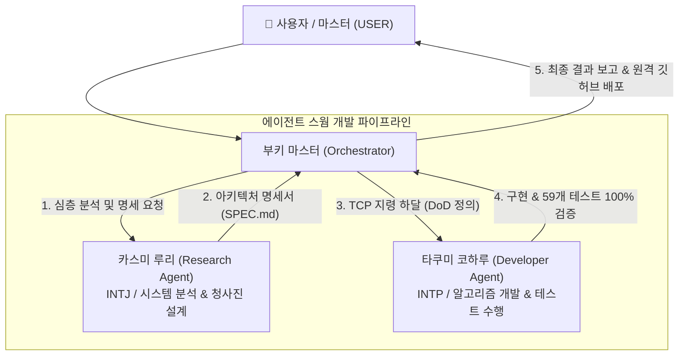
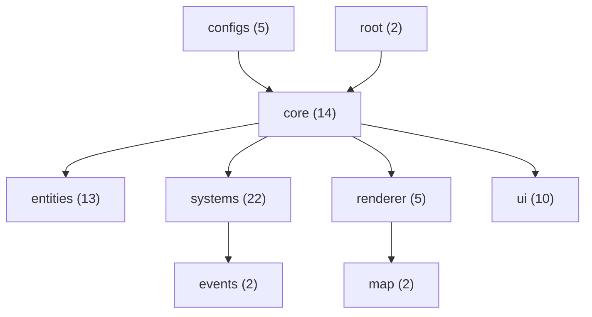

# 🏛️ Mimicry Voxel: 에이전트 스웜 워크플로우 & 모듈 메타 인덱스
### Agent Swarm Orchestration Workflow, Module Architecture & Meta Index Directory

본 문서는 **미미크리 복셀(Mimicry Voxel)** 엔진 개발 파이프라인에서 운용되는 멀티 에이전트 스웜(Swarm) 협업 프로토콜과 전체 75개 자바스크립트 모듈의 아키텍처 계층 구조 및 의존성 관계를 총괄 정리한 공식 명세서입니다.

---

## 🐝 1. 에이전트 스웜 협업 프로토콜 (Swarm Workflow)

미미크리 엔진은 **작업 명령 프로토콜(Task Command Protocol, TCP)** 기반의 전문 에이전트 분업 체계를 통해 기획, 정밀 수학 모델링, 소스코드 구현, 무결성 검증, 위키 동기화를 유기적으로 수행합니다.

### 1.1 역할 분담 및 책임 매트릭스
1. **오케스트레이터 (부키 마스터, ID: `16574af4-b54e-4db8-b7e9-6bab24cf1277`)**:
   - 마스터 요구사항 수렴, TCP 지령 생성, 하위 에이전트 디스패치 및 DoD 검증 총괄.
2. **리서치 에이전트 (카스미 루리, `research_agent`)**:
   - 정통 ToME 2.3.5 / TomeNET C 소스 분석, 수학/물리 모델링 수식 유도, 캔버스 래스터라이징 설계, 상세 명세서 작성.
3. **개발 에이전트 (타쿠미 코하루, `developer_agent`)**:
   - ES Modules 기반 객체지향/데이터 지향 자바스크립트 소스 구현, DOM 이벤트 연동, 무결성 단위 테스트 작성, 회귀 검증 스위트 100% 통과 집행.

---

## 📦 2. 75개 모듈 카테고리별 메타 인덱스 (Code Meta Index)

- **총 모듈 수**: 75개 ESM 모듈
- **총 코드 라인 수**: 106,699 라인
- **표준 메타 헤더**: `@module`, `@category`, `@description`, `@purity`, `@dependencies`, `@exports` 100% 완비

| 카테고리 (Category) | 모듈 수 | 대표 모듈 목록 | 주요 역할 |
| :--- | :---: | :--- | :--- |
| **`configs`** | 5 | `BalancePresets.js`, `DungeonThemeConfig.js`, `GameBalanceConfig.js`, `RenderConfig.js`, `ThemeColors.js` | 난이도 프리셋, 5대 테마, 밸런스 상수, 색상표 |
| **`core`** | 14 | `Game.js`, `Input.js`, `CombatSystem.js`, `CombatCalculator.js`, `SaveSystem.js`, `Skills.js` | 게임 루프, 키/터치 입력, 전투 오케스트레이션, 세이브/로드 |
| **`entities`** | 13 | `Player.js`, `Monster.js`, `Item.js`, `MimicBody.js`, `Tags.js`, `TomeArtifactsData.js` | 플레이어, 몬스터, 장비, 아티팩트, 의태 코어 데이터 |
| **`map`** | 2 | `Map.js`, `Voxel3DMapBridge.js` | 절차적 BSP 던전 생성, 지형 타일, 복셀 지형 브리지 |
| **`renderer`** | 5 | `FirstPerson3DRenderer.js`, `TextureManager.js`, `Voxel3DRenderer.js`, `Classic2DAsciiRenderer.js`, `VoxelParticleSystem.js` | 1인칭 3D 레이캐스터, 2.5D 복셀 쿼터뷰, 2D 클래식 아스키, 파티클 |
| **`systems`** | 22 | `CombatVFXEngine.js`, `BalanceModifierManager.js`, `TomeIdentificationEngine.js`, `TomeTagSystem.js`, `BossPhaseEngine.js` | 전투 시각효과, 의사 감정, 저주 태그, 보스 페이즈, 몬스터 AI |
| **`ui`** | 10 | `SkillHotbarView.js`, `PlayerIdentityModalView.js`, `GameStartPresetModalView.js`, `AscensionModalView.js`, `VirtualController.js` | 플로팅 핫바, 특성 모달, 프리셋 모달, 가상 패드 |
| **`events`** | 2 | `EventBus.js`, `GameEvents.js` | 발행-구독 이벤트 버스 및 불변 이벤트 상수 |
| **`root`** | 2 | `main.js`, `experimental_main.js` | 브라우저 진입점 오케스트레이터 |

---

## 📜 3. 5대 핵심 아키텍처 명세서 (Architecture Specifications)

1. [`MIMICRY_VOXEL_ANALYSIS_AND_UIUX_PROPOSAL.md`](file:///data/data/com.termux/files/home/opendcmart/mimicry_voxel/MIMICRY_VOXEL_ANALYSIS_AND_UIUX_PROPOSAL.md):
   - 차세대 UI/UX 제안, 4대 동적 밸런스 프리셋 엔진 및 플로팅 스킬 핫바 설계.
2. [`PSEUDO_ID_AND_IDENTITY_UI_SPEC.md`](file:///data/data/com.termux/files/home/opendcmart/mimicry_voxel/PSEUDO_ID_AND_IDENTITY_UI_SPEC.md):
   - ToME 2.3.5 정통 4단계 점진적 의사 감정(Pseudo-ID) 및 플레이어 아이덴티티 매트릭스 UI 명세.
3. [`DATA_ORIENTED_TAG_AND_CURSE_SPEC.md`](file:///data/data/com.termux/files/home/opendcmart/mimicry_voxel/DATA_ORIENTED_TAG_AND_CURSE_SPEC.md):
   - 18종 디트리멘탈 저주 태그, 불변 가드 및 저주 해제 주문서 파이프라인.
4. [`FIRST_PERSON_3D_DUNGEON_SPEC.md`](file:///data/data/com.termux/files/home/opendcmart/mimicry_voxel/FIRST_PERSON_3D_DUNGEON_SPEC.md):
   - 나노바나나 6대 텍스처, DDA 레이캐스팅 수식, 어안 왜곡 보정, 3D 빌보드 스프라이트 및 3단 렌더러 순환 전환 명세.
5. [`COMBAT_VFX_SPEC.md`](file:///data/data/com.termux/files/home/opendcmart/mimicry_voxel/COMBAT_VFX_SPEC.md):
   - 나노바나나 전투 에셋 결합, 1인칭 스크린 슬래시 아크, 월드 빌보드 폭발, 화면 셰이크 및 핏빛 비네팅 렌더링 명세.

---

**© 2026 OpenDCMart Engine Team & Mimicry Voxel Engineering Group.**
